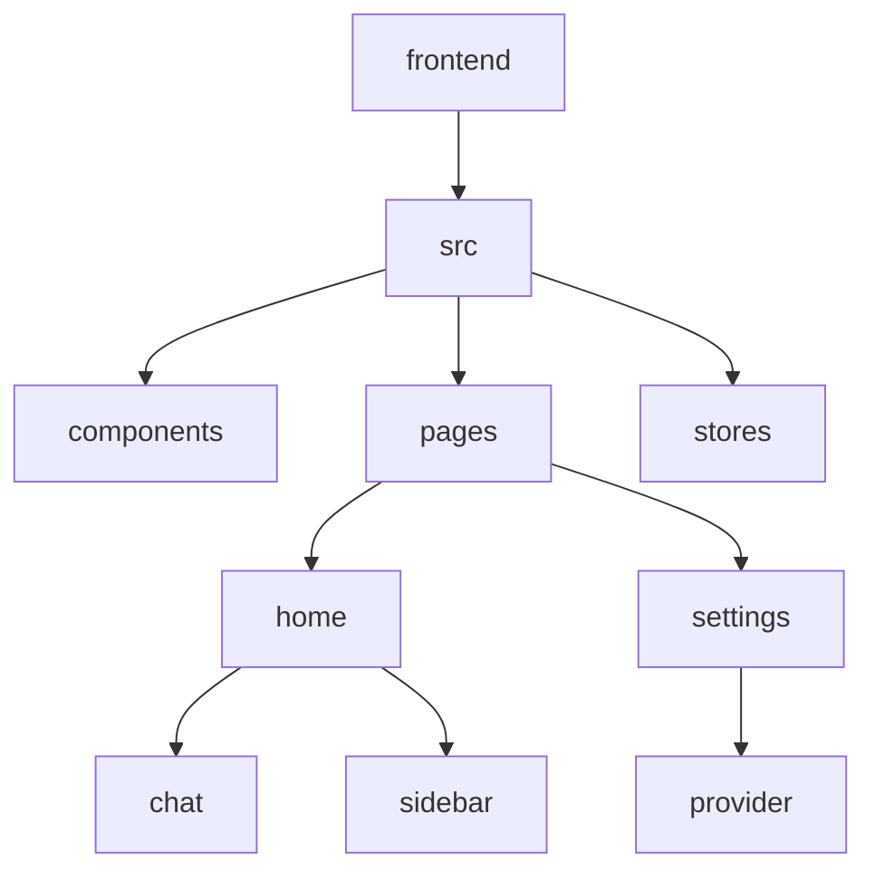
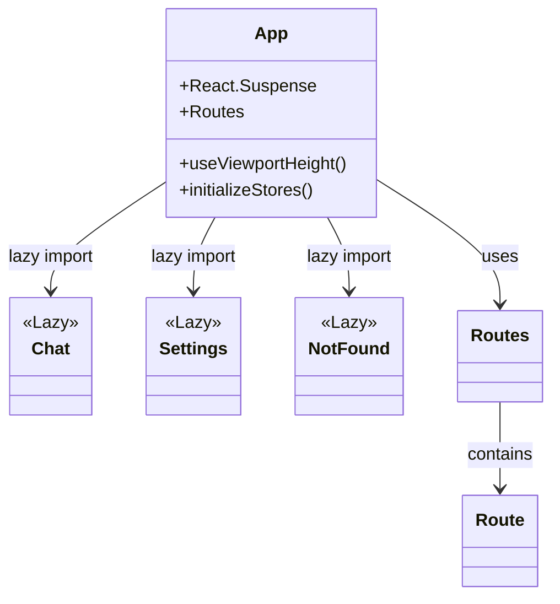
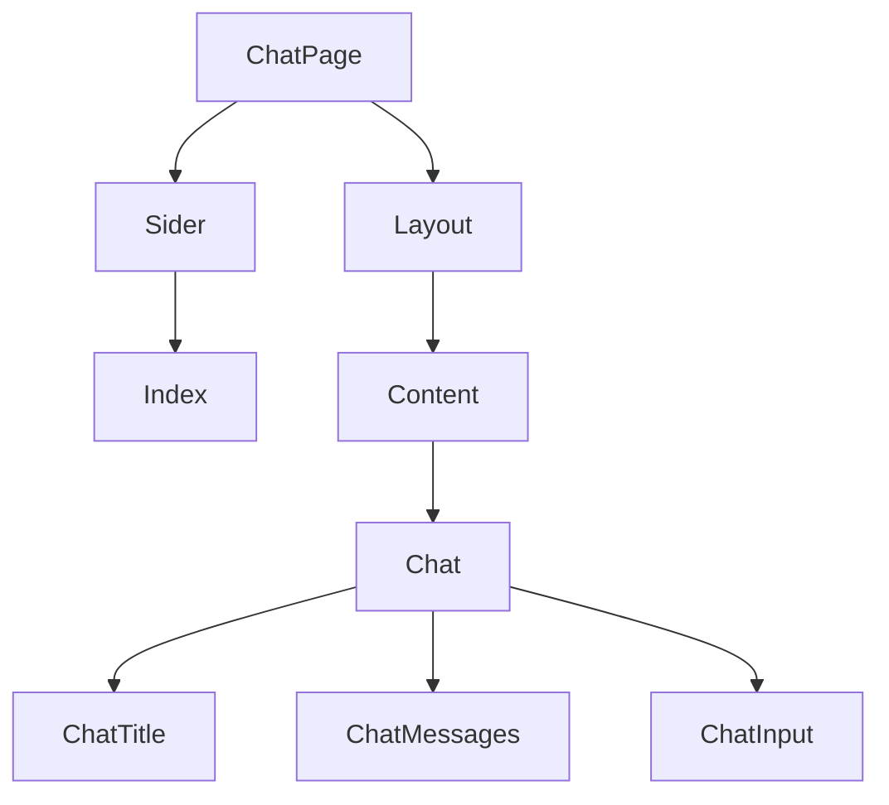
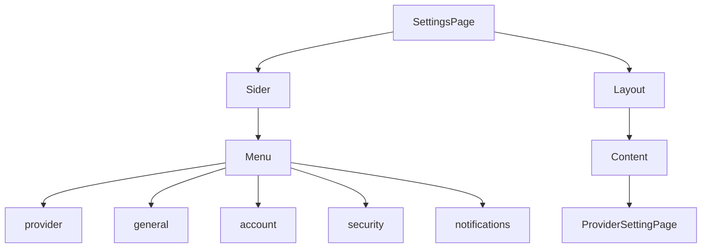
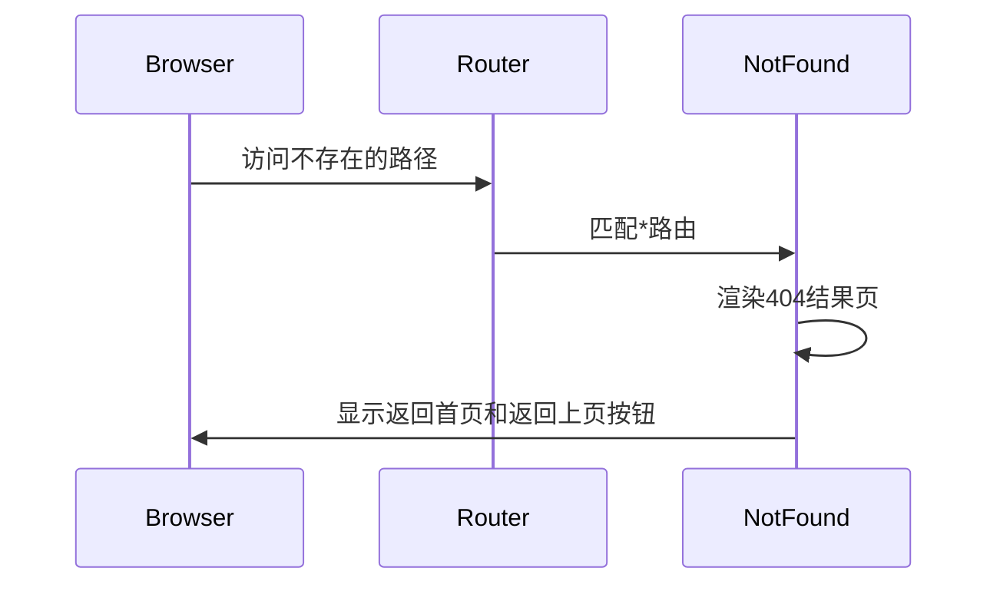
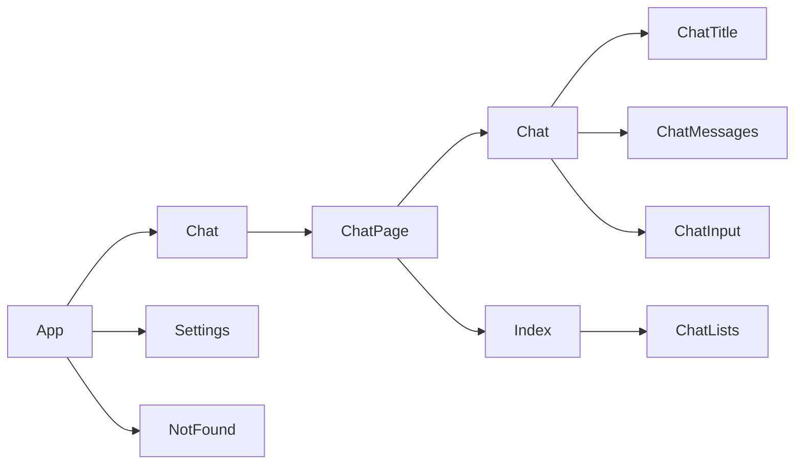

# 页面结构与路由组织

<cite>
**本文档引用的文件**
- [App.tsx](file://frontend/src/App.tsx)
- [home/index.tsx](file://frontend/src/pages/home/index.tsx)
- [settings/index.tsx](file://frontend/src/pages/settings/index.tsx)
- [NotFound.tsx](file://frontend/src/pages/NotFound.tsx)
- [chat/index.tsx](file://frontend/src/pages/home/chat/index.tsx)
- [sidebar/index.tsx](file://frontend/src/pages/home/sidebar/index.tsx)
- [provider/index.tsx](file://frontend/src/pages/settings/provider/index.tsx)
</cite>

## 目录
1. [简介](#简介)
2. [项目结构](#项目结构)
3. [核心组件](#核心组件)
4. [架构概述](#架构概述)
5. [详细组件分析](#详细组件分析)
6. [依赖分析](#依赖分析)
7. [性能考虑](#性能考虑)
8. [故障排除指南](#故障排除指南)
9. [结论](#结论)

## 简介
本文档全面解析了前端页面层级结构与路由映射机制。重点说明了基于React Router的路由配置方式、主聊天界面的模块化组织、设置页面的独立视图实现，以及未匹配路由的兜底处理逻辑。通过代码实例展示页面间导航、参数传递及条件渲染的最佳实践，并指导开发者如何新增页面并正确注册至路由系统。

## 项目结构
前端项目采用模块化组织方式，主要分为components、hooks、pages、stores等目录。pages目录下包含home（主聊天界面）、settings（设置页面）等核心功能模块，各模块内部进一步细分为具体组件。



**Diagram sources**
- [App.tsx](file://frontend/src/App.tsx)
- [home/index.tsx](file://frontend/src/pages/home/index.tsx)

**Section sources**
- [App.tsx](file://frontend/src/App.tsx)
- [home/index.tsx](file://frontend/src/pages/home/index.tsx)

## 核心组件
系统核心组件包括基于React Router的路由配置、主聊天界面的模块化组织、设置页面的独立视图实现，以及未匹配路由的兜底处理机制。

**Section sources**
- [App.tsx](file://frontend/src/App.tsx)
- [home/index.tsx](file://frontend/src/pages/home/index.tsx)
- [settings/index.tsx](file://frontend/src/pages/settings/index.tsx)
- [NotFound.tsx](file://frontend/src/pages/NotFound.tsx)

## 架构概述
系统采用React Router进行路由管理，通过懒加载优化首屏加载性能，使用Suspense提供加载状态反馈。路由配置支持多种路径映射，包括根路径、带参数路径和通配符路径。

```mermaid
graph TD
A[App] --> B[React Router]
B --> C[/]
B --> D[/home]
B --> E[/home/:chatUuid]
B --> F[/settings]
B --> G[*]
C --> H[Chat]
D --> H
E --> H
F --> I[Settings]
G --> J[NotFound]
```

**Diagram sources**
- [App.tsx](file://frontend/src/App.tsx)

## 详细组件分析

### 路由配置分析
App.tsx文件中基于React Router实现了完整的路由配置，采用懒加载策略提升性能。



**Diagram sources**
- [App.tsx](file://frontend/src/App.tsx)

### 主聊天界面分析
home目录下的主聊天界面采用模块化设计，包含侧边栏、消息列表、输入区和标题栏等组件。



**Diagram sources**
- [home/index.tsx](file://frontend/src/pages/home/index.tsx)
- [chat/index.tsx](file://frontend/src/pages/home/chat/index.tsx)
- [sidebar/index.tsx](file://frontend/src/pages/home/sidebar/index.tsx)

### 设置页面分析
settings页面采用侧边栏导航布局，支持多选项卡配置。



**Diagram sources**
- [settings/index.tsx](file://frontend/src/pages/settings/index.tsx)
- [provider/index.tsx](file://frontend/src/pages/settings/provider/index.tsx)

### 404页面分析
NotFound.tsx实现了未匹配路由的兜底处理逻辑，提供友好的用户引导。



**Diagram sources**
- [NotFound.tsx](file://frontend/src/pages/NotFound.tsx)

**Section sources**
- [App.tsx](file://frontend/src/App.tsx#L0-L86)
- [home/index.tsx](file://frontend/src/pages/home/index.tsx#L0-L414)
- [settings/index.tsx](file://frontend/src/pages/settings/index.tsx#L0-L97)
- [NotFound.tsx](file://frontend/src/pages/NotFound.tsx#L0-L43)

## 依赖分析
系统组件间存在明确的依赖关系，通过props传递数据和回调函数。



**Diagram sources**
- [App.tsx](file://frontend/src/App.tsx)
- [home/index.tsx](file://frontend/src/pages/home/index.tsx)

**Section sources**
- [App.tsx](file://frontend/src/App.tsx#L0-L86)
- [home/index.tsx](file://frontend/src/pages/home/index.tsx#L0-L414)

## 性能考虑
系统采用多种性能优化策略：
- 组件懒加载：通过React.lazy实现按需加载
- 状态管理：合理使用useState和useEffect
- 回调优化：使用useCallback避免不必要的重新渲染
- 引用管理：使用useRef优化DOM操作

## 故障排除指南
常见问题及解决方案：
- 路由不生效：检查路径配置和组件导入
- 组件重复渲染：检查useCallback和useMemo的使用
- 状态同步问题：确保useEffect依赖项正确
- 懒加载失败：检查模块路径和异步加载配置

**Section sources**
- [App.tsx](file://frontend/src/App.tsx#L0-L86)
- [home/index.tsx](file://frontend/src/pages/home/index.tsx#L0-L414)

## 结论
本系统通过合理的路由配置和模块化组件设计，实现了清晰的页面结构和高效的路由映射。采用懒加载策略优化性能，通过完善的错误处理机制提升用户体验。开发者可基于现有模式轻松扩展新页面功能。