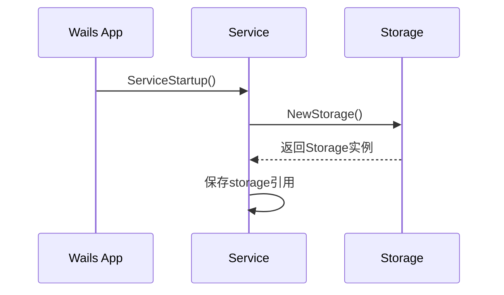
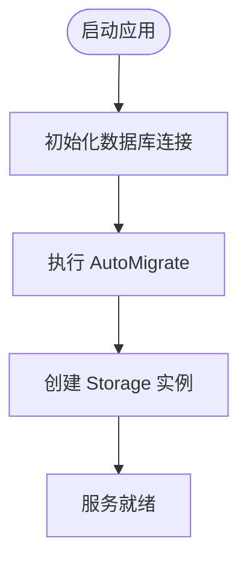
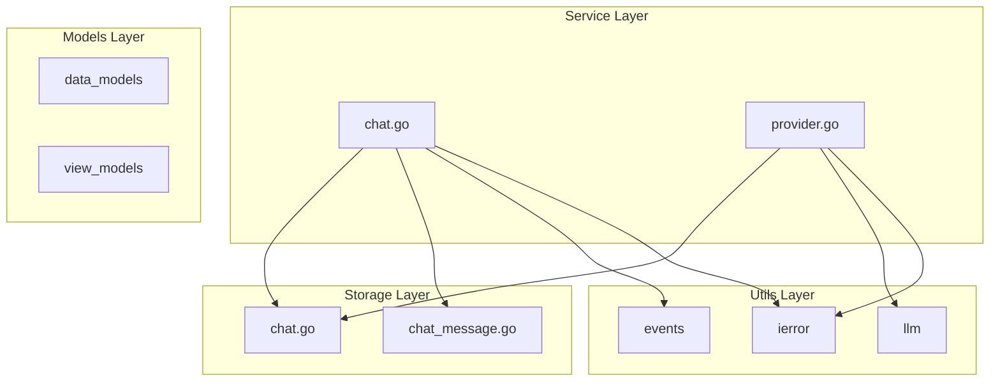

# 后端目录结构

<cite>
**本文档引用的文件**  
- [backend/models/data_models/models.go](file://backend/models/data_models/models.go)
- [backend/models/view_models/models.go](file://backend/models/view_models/models.go)
- [backend/models/wrapper_models/provider_model.go](file://backend/models/wrapper_models/provider_model.go)
- [backend/service/service.go](file://backend/service/service.go)
- [backend/service/chat.go](file://backend/service/chat.go)
- [backend/service/provider.go](file://backend/service/provider.go)
- [backend/storage/storage.go](file://backend/storage/storage.go)
- [backend/storage/chat.go](file://backend/storage/chat.go)
- [backend/storage/chat_message.go](file://backend/storage/chat_message.go)
- [backend/utils/ierror/code.go](file://backend/utils/ierror/code.go)
- [backend/utils/llm/common.go](file://backend/utils/llm/common.go)
- [backend/utils/events.go](file://backend/utils/events.go)
</cite>

## 目录

1. [引言](#引言)
2. [模型层设计](#模型层设计)
3. [服务层实现](#服务层实现)
4. [存储层封装](#存储层封装)
5. [工具包复用机制](#工具包复用机制)
6. [分层调用与依赖注入](#分层调用与依赖注入)
7. [总结](#总结)

## 引言

本项目后端采用清晰的分层架构设计，分为 `models`、`service`、`storage` 和 `utils` 四大核心模块。该结构实现了关注点分离，提升了代码可维护性与扩展性。本文将深入解析各层职责划分、交互关系及关键技术实现，帮助开发者快速理解系统组织逻辑。

## 模型层设计

模型层位于 `backend/models` 目录下，进一步细分为 `data_models`、`view_models` 和 `wrapper_models` 三个子包，分别承担不同的数据抽象职责。

### 数据实体模型（data_models）

`data_models` 包定义了与数据库表直接映射的 GORM 实体结构，如 `Chat`、`Message`、`Provider` 和 `Model`。这些结构体通过 GORM 标签声明字段类型、索引、主键等元信息，确保 ORM 映射正确性。

例如，`Model` 结构体表示大模型提供商的模型信息，包含模型 ID、归属方、启用状态等属性，并通过 `provider_id` 外键关联到 `Provider`。

**Section sources**  
- [backend/models/data_models/models.go](file://backend/models/data_models/models.go#L1-L11)

### 前后端交互模型（view_models）

`view_models` 包定义了用于前后端通信的数据传输对象（DTO），如 `ChatView`、`MessageView` 等。这类模型通常是对 `data_models` 的裁剪或重组，仅暴露前端所需字段，避免敏感信息泄露或过度传输。

值得注意的是，`view_models.Model` 结构体与 `data_models.Model` 字段高度一致，但继承了 GORM 的 `Model` 基类（含 `ID`、`CreatedAt`、`UpdatedAt`、`DeletedAt`），便于在接口中直接使用时间戳信息。

**Section sources**  
- [backend/models/view_models/models.go](file://backend/models/view_models/models.go#L1-L22)

### 业务封装模型（wrapper_models）

`wrapper_models` 包用于封装跨领域或组合型数据结构。当前仅包含 `ProviderModel`，用于在业务逻辑中传递模型调用所需的完整参数（如 `BaseUrl`、`ApiKey`、`Model` 名称和 `ModelId`），便于服务层调用 LLM 接口。

该模型不直接映射数据库或前端接口，而是作为服务间数据载体，提升代码可读性与参数管理效率。

**Section sources**  
- [backend/models/wrapper_models/provider_model.go](file://backend/models/wrapper_models/provider_model.go#L1-L8)

## 服务层实现

服务层是业务逻辑的核心，位于 `backend/service` 目录下，通过 `service.go` 提供服务注册入口，并在 `chat.go`、`provider.go` 等文件中实现具体业务方法。

### 服务初始化与依赖注入

`Service` 结构体持有 `storage.Storage` 实例和 Wails 应用实例，通过 `ServiceStartup` 方法完成初始化。该方法在应用启动时被调用，创建 `Storage` 实例并注入到服务中，实现控制反转（IoC）。

**Diagram sources**  
- [backend/service/service.go](file://backend/service/service.go#L1-L30)

### 聊天业务逻辑（chat.go）

`chat.go` 实现了聊天会话的核心功能，包括：
- `ChatList`：获取分页聊天列表
- `ChatMessages`：获取指定会话的消息历史
- `Completions`：处理用户输入并流式返回 AI 回复
- `DeleteChat`、`RenameChat`、`CollectionChat`：会话管理操作

其中 `Completions` 方法最为复杂，涉及新建会话判断、历史消息加载、LLM 流式调用、消息持久化与事件广播等步骤，体现了服务层协调多方资源的能力。

**Section sources**  
- [backend/service/chat.go](file://backend/service/chat.go#L1-L207)

### 供应商管理逻辑（provider.go）

`provider.go` 封装了对模型提供商的增删改查及模型同步逻辑：
- `GetProviders`、`AddProvider`、`UpdateProvider`、`DeleteProvider`：基础 CRUD 操作
- `GetProviderModels`：调用外部 API 获取模型列表
- `updateProviderModel`：事务性地更新某提供商下的所有模型信息

该文件展示了服务层如何通过 `storage` 层操作数据库，并结合 `utils/llm` 调用外部服务，实现完整业务闭环。

**Section sources**  
- [backend/service/provider.go](file://backend/service/provider.go#L1-L145)

## 存储层封装

存储层基于 GORM 实现，位于 `backend/storage` 目录，提供统一的数据库访问接口。

### 数据库初始化与自动迁移

`storage.go` 中的 `NewStorage` 方法负责初始化 SQLite 数据库连接，并执行 `AutoMigrate` 自动创建或更新表结构。所涉及的模型包括 `Model`、`Provider`、`Chat` 和 `Message`，确保应用启动时数据库 schema 始终与代码一致。

**Diagram sources**  
- [backend/storage/storage.go](file://backend/storage/storage.go#L1-L83)

### 会话与消息操作（chat.go, chat_message.go）

`chat.go` 提供了对 `Chat` 表的操作：
- `GetChats`：支持分页、关键词搜索和收藏筛选
- `CreateChat`、`DeleteChat`、`RenameChat`：会话生命周期管理
- `CollectionChat`：使用 `UpdateColumn` 避免自动更新 `UpdatedAt`

`chat_message.go` 则处理消息相关逻辑：
- `CreateMessage`：插入新消息
- `SaveOrUpdateDeltaMessage`：支持消息内容的增量更新（用于流式回复拼接）
- `GetMessage`：按会话 ID 查询消息历史

**Section sources**  
- [backend/storage/chat.go](file://backend/storage/chat.go#L1-L110)
- [backend/storage/chat_message.go](file://backend/storage/chat_message.go#L1-L73)

## 工具包复用机制

`utils` 目录提供了多个可复用的工具模块，提升开发效率与系统健壮性。

### 错误码体系（ierror）

`ierror` 包定义了统一的错误码枚举（`ErrorCode`），如 `ErrCodeModelNotFound`、`ErrCodeChatNotFound` 等。通过 `NewError` 包装底层错误，可在服务层统一处理并返回结构化错误信息，便于前端识别与展示。

**Section sources**  
- [backend/utils/ierror/code.go](file://backend/utils/ierror/code.go#L1-L28)

### 大模型通用逻辑（llm）

`llm` 包封装了调用大模型 API 的通用逻辑：
- `LlmProvider` 结构体封装 `BaseUrl`、`ApiKey`、`Model` 信息
- `Completions` 方法创建 `openai.ChatModel` 并返回流式响应

该设计屏蔽了底层 SDK 差异，便于未来扩展支持更多 LLM 服务商。

**Section sources**  
- [backend/utils/llm/common.go](file://backend/utils/llm/common.go#L1-L45)

### 事件处理（events）

`events.go` 提供 `GenEventsKey` 工具函数，用于生成用户事件的唯一键（如 `user:{messageUuid}`），配合 Wails 的事件系统实现服务端到前端的实时消息推送，支撑流式回复的实时渲染。

**Section sources**  
- [backend/utils/events.go](file://backend/utils/events.go#L1-L7)

## 分层调用与依赖注入

整个后端采用依赖注入方式组织各层关系：
- `service` 层依赖 `storage` 和 `utils`
- `storage` 层依赖 `data_models` 和 GORM
- `service` 方法通过 `s.storage` 调用存储层接口
- `utils` 模块被 `service` 和 `storage` 共享

这种单向依赖结构保证了模块解耦，便于单元测试与维护。

**Diagram sources**  
- [backend/service/chat.go](file://backend/service/chat.go#L1-L207)
- [backend/service/provider.go](file://backend/service/provider.go#L1-L145)
- [backend/storage/chat.go](file://backend/storage/chat.go#L1-L110)
- [backend/storage/chat_message.go](file://backend/storage/chat_message.go#L1-L73)
- [backend/utils/llm/common.go](file://backend/utils/llm/common.go#L1-L45)
- [backend/utils/events.go](file://backend/utils/events.go#L1-L7)

## 总结

本项目后端通过清晰的分层架构实现了高内聚、低耦合的设计目标：
- **models** 层明确划分数据实体、视图模型与业务封装模型
- **service** 层集中处理业务逻辑，协调存储与工具模块
- **storage** 层基于 GORM 封装数据库操作，支持自动迁移与事务
- **utils** 层提供错误码、LLM 调用、事件生成等通用能力

各层通过接口与依赖注入紧密协作，形成了稳定可扩展的后端基础架构，为功能迭代提供了坚实支撑。