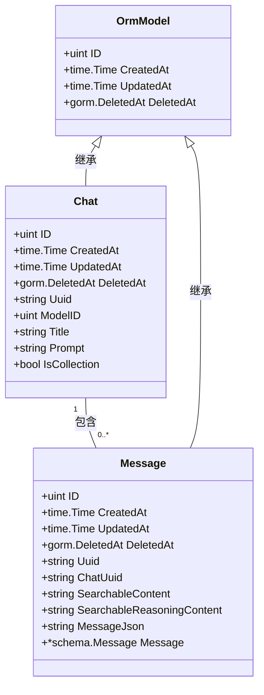
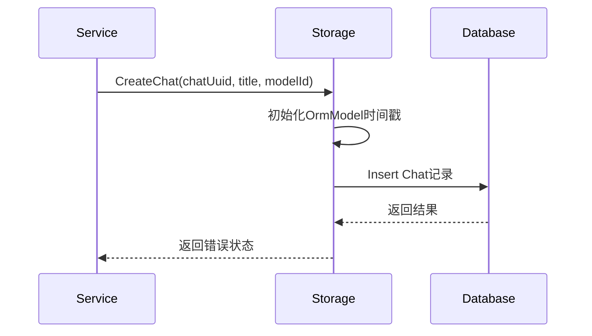

# 会话存储

<cite>
**Referenced Files in This Document**   
- [chat.go](file://backend/models/data_models/chat.go)
- [common.go](file://backend/models/data_models/common.go)
- [chat.go](file://backend/storage/chat.go)
- [chat_message.go](file://backend/storage/chat_message.go)
- [storage.go](file://backend/storage/storage.go)
- [chat.go](file://backend/service/chat.go)
- [chat.go](file://backend/models/view_models/chat.go)
</cite>

## 目录
1. [简介](#简介)
2. [核心数据结构](#核心数据结构)
3. [CRUD操作实现](#crud操作实现)
4. [时间戳管理机制](#时间戳管理机制)
5. [关联消息预加载建议](#关联消息预加载建议)

## 简介
本文档全面阐述了基于GORM的会话（Chat）实体CRUD操作实现。系统采用分层架构，包含数据模型层、存储层和服务层，实现了会话的创建、查询、更新和删除功能。重点分析了会话实体的唯一标识生成、复合查询逻辑、软删除策略以及字段更新的差异化处理机制。

## 核心数据结构

### 会话与消息数据模型


**Diagram sources**
- [chat.go](file://backend/models/data_models/chat.go#L10-L23)
- [common.go](file://backend/models/data_models/common.go#L7-L14)

**Section sources**
- [chat.go](file://backend/models/data_models/chat.go#L1-L63)
- [common.go](file://backend/models/data_models/common.go#L1-L14)

## CRUD操作实现

### 创建会话 (CreateChat)
`CreateChat`方法负责创建新的会话记录。该方法接收会话UUID、标题和模型ID作为参数，在创建时显式初始化`CreatedAt`和`UpdatedAt`时间戳为当前时间，确保时间戳的精确性。会话UUID由上层服务（如`Completions`）通过`uuid.New().String()`生成，保证了全局唯一性。



**Diagram sources**
- [chat.go](file://backend/storage/chat.go#L55-L68)
- [chat.go](file://backend/service/chat.go#L50-L65)

**Section sources**
- [chat.go](file://backend/storage/chat.go#L55-L72)
- [chat.go](file://backend/service/chat.go#L50-L65)

### 查询会话 (GetChats)
`GetChats`方法实现了分页查询、关键词搜索和收藏过滤的复合查询逻辑。查询首先构建基础查询对象，根据`isCollection`参数决定是否添加收藏状态过滤条件。对于关键词搜索，系统仅对会话标题进行模糊匹配（`LIKE`查询），未实现对消息内容的全文搜索。分页通过`Offset`和`Limit`实现，按`updated_at`降序排列，确保最新更新的会话优先展示。

**Section sources**
- [chat.go](file://backend/storage/chat.go#L1-L53)
- [chat.go](file://backend/service/chat.go#L1-L15)

### 删除会话 (DeleteChat)
系统采用GORM的软删除机制。`DeleteChat`方法通过`Where("uuid = ?", chatUuid).Delete(&data_models.Chat{})`执行删除操作。此操作并非物理删除，而是将`deleted_at`字段设置为当前时间戳，标记记录为已删除。被软删除的记录在后续的普通查询中将被自动排除，但数据仍保留在数据库中，支持数据恢复。

**Section sources**
- [chat.go](file://backend/storage/chat.go#L81-L87)

### 重命名与收藏 (RenameChat & CollectionChat)
`RenameChat`和`CollectionChat`方法展示了字段更新的两种不同策略：
- `RenameChat`使用`Update("title", title)`方法，这会触发GORM的`BeforeUpdate`钩子，自动更新`UpdatedAt`时间戳。
- `CollectionChat`使用`UpdateColumn("is_collection", isCollection)`方法，该方法绕过GORM钩子，直接更新数据库列，因此不会修改`UpdatedAt`时间戳，保持了会话的最后更新时间不变。

**Section sources**
- [chat.go](file://backend/storage/chat.go#L89-L109)

## 时间戳管理机制
`data_models.Chat`结构体通过嵌入`OrmModel`基类实现`CreatedAt`和`UpdatedAt`时间戳的自动管理。`OrmModel`定义了`CreatedAt`（创建时间）、`UpdatedAt`（更新时间）和`DeletedAt`（软删除时间）三个标准字段。GORM框架在执行`Create`、`Update`等操作时，会自动维护这些字段的值。`CreateChat`方法在创建时显式设置时间戳，而`RenameChat`等更新操作则依赖GORM自动更新`UpdatedAt`。

**Section sources**
- [common.go](file://backend/models/data_models/common.go#L7-L14)
- [chat.go](file://backend/storage/chat.go#L55-L72)

## 关联消息预加载建议
当前实现中，会话（Chat）与其消息列表（Message）的关联是通过`ChatUuid`外键建立的。然而，系统并未在查询会话时预加载其关联消息。建议在`GetChats`方法中，当需要返回完整会话数据时，使用GORM的`Preload`功能：

```go
// 建议的扩展实现
err = queryBase.Preload("Messages").Order("updated_at DESC").Offset(offset).Limit(limit).Find(&res).Error
```

此修改将一次性加载会话及其所有关联消息，避免了N+1查询问题，显著提升获取会话详情时的性能。同时，应考虑在`view_models.Chat`结构体中添加`Messages []Message`字段以承载预加载的数据。

**Section sources**
- [chat.go](file://backend/models/data_models/chat.go#L10-L23)
- [chat_message.go](file://backend/storage/chat_message.go#L40-L72)