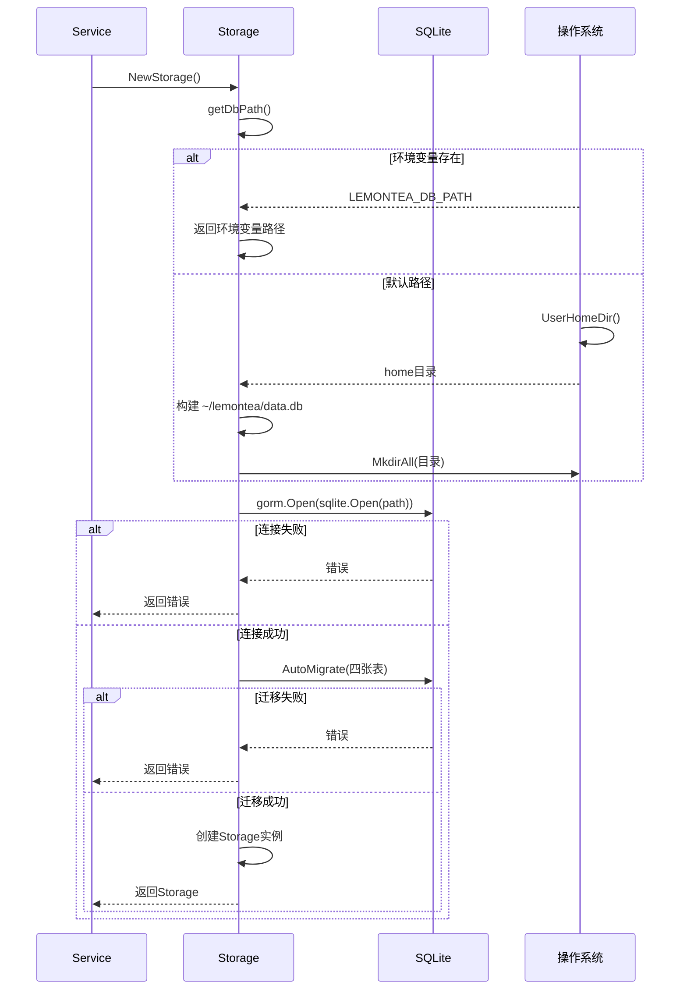

# 存储初始化

<cite>
**本文档引用文件**  
- [storage.go](file://backend/storage/storage.go)
- [chat.go](file://backend/models/data_models/chat.go)
- [provider.go](file://backend/models/data_models/provider.go)
- [models.go](file://backend/models/data_models/models.go)
- [common.go](file://backend/models/data_models/common.go)
</cite>

## 目录
1. [简介](#简介)
2. [数据库初始化流程](#数据库初始化流程)
3. [连接路径构建机制](#连接路径构建机制)
4. [自动迁移与表结构同步](#自动迁移与表结构同步)
5. [GORM配置与数据库行为](#gorm配置与数据库行为)
6. [数据库初始化时序图](#数据库初始化时序图)
7. [错误处理路径分析](#错误处理路径分析)
8. [事务封装机制](#事务封装机制)
9. [结论](#结论)

## 简介
本文档深入解析`storage.go`中`NewStorage`函数的数据库初始化流程，涵盖SQLite驱动加载、数据库路径构建、环境变量优先级处理、GORM自动迁移机制及事务封装策略。重点分析`AutoMigrate`如何同步`Chat`、`Message`、`Provider`、`Model`四张表结构，并说明`NewFnTransaction`在跨表操作中的应用模式。

## 数据库初始化流程
`NewStorage`函数是整个应用数据库访问的核心入口，负责完成以下关键步骤：
1. 调用`getDbPath()`获取数据库文件路径
2. 使用GORM连接SQLite数据库
3. 执行`AutoMigrate`同步数据模型
4. 构建并返回`Storage`实例

该流程确保每次应用启动时数据库结构与代码定义保持一致，为后续数据操作提供稳定基础。

**Section sources**
- [storage.go](file://backend/storage/storage.go#L15-L30)

## 连接路径构建机制
`getDbPath`函数负责确定数据库文件的存储位置，其路径选择遵循严格的优先级顺序：

1. **环境变量优先**：首先检查`LEMONTEA_DB_PATH`环境变量是否设置，若存在则直接使用该路径
2. **默认路径回退**：若环境变量未设置，则构建默认路径`~/lemontea/data.db`
3. **目录创建保障**：确保数据库所在目录存在，必要时自动创建

此机制既支持开发调试时的灵活配置，又保证生产环境下的路径一致性。

**Section sources**
- [storage.go](file://backend/storage/storage.go#L64-L82)

## 自动迁移与表结构同步
`AutoMigrate`功能自动同步以下四个数据模型：

- `data_models.Model{}`
- `data_models.Provider{}`
- `data_models.Chat{}`
- `data_models.Message{}`

迁移过程会：
- 创建不存在的表
- 添加缺失的字段
- 保持现有数据不变
- 根据GORM标签创建索引和约束

每个模型均继承`OrmModel`基类，包含`ID`、`CreatedAt`、`UpdatedAt`、`DeletedAt`等通用字段，实现软删除和时间追踪功能。

**Section sources**
- [storage.go](file://backend/storage/storage.go#L25-L30)
- [common.go](file://backend/models/data_models/common.go#L5-L14)

## GORM配置与数据库行为
GORM配置项对数据库行为产生重要影响：

- **外键约束**：通过`gorm:"index"`标签在`Chat.ModelID`、`Message.ChatUuid`等字段上创建外键索引，确保引用完整性
- **索引创建**：`Uuid`字段使用`unique;index`确保全局唯一性，`IsCollection`等查询频繁字段也建立索引提升性能
- **字段映射**：`Message.MessageJson`存储序列化JSON，`Message.Message`作为非持久化字段用于运行时对象映射
- **软删除**：`DeletedAt`字段配合`gorm:"index"`实现软删除功能

这些配置确保了数据一致性、查询性能和业务逻辑的正确实现。

**Section sources**
- [chat.go](file://backend/models/data_models/chat.go#L8-L14)
- [provider.go](file://backend/models/data_models/provider.go#L5-L11)
- [models.go](file://backend/models/data_models/models.go#L5-L11)

## 数据库初始化时序图


**Diagram sources**
- [storage.go](file://backend/storage/storage.go#L15-L45)
- [service.go](file://backend/service/service.go#L15-L25)

## 错误处理路径分析
数据库初始化过程包含多层错误处理：

1. **路径获取失败**：`os.UserHomeDir()`调用失败时直接返回错误
2. **目录创建失败**：`os.MkdirAll()`权限不足或磁盘满时返回错误
3. **数据库连接失败**：文件权限、SQLite版本不兼容等情况记录日志并返回
4. **自动迁移失败**：表结构冲突、字段类型不匹配等情况记录日志并返回

所有错误均通过`error`返回值向上传递，由调用方决定是否继续启动应用。

**Section sources**
- [storage.go](file://backend/storage/storage.go#L18-L35)

## 事务封装机制
`NewFnTransaction`提供函数式事务封装，其核心特性包括：

- **上下文传递**：保持`context.Context`的传递链
- **事务隔离**：每个事务使用独立的`*gorm.DB`实例
- **自动提交/回滚**：成功执行则提交，出现错误则回滚
- **嵌套安全**：虽然SQLite不支持嵌套事务，但该模式避免了意外的事务重用

使用模式：
```go
storage.NewFnTransaction(ctx, func(ctx context.Context, s *Storage) error {
    // 在此函数内使用s进行数据库操作
    // 返回nil则提交，返回error则回滚
})
```

该机制确保跨表操作的原子性，如聊天创建与首条消息插入的组合操作。

**Section sources**
- [storage.go](file://backend/storage/storage.go#L37-L55)

## 结论
`NewStorage`函数实现了稳健的数据库初始化流程，通过环境变量优先级、自动迁移、事务封装等机制，确保了数据层的可靠性与灵活性。建议在生产环境中始终通过`LEMONTEA_DB_PATH`明确指定数据库路径，并定期备份`data.db`文件以防数据丢失。