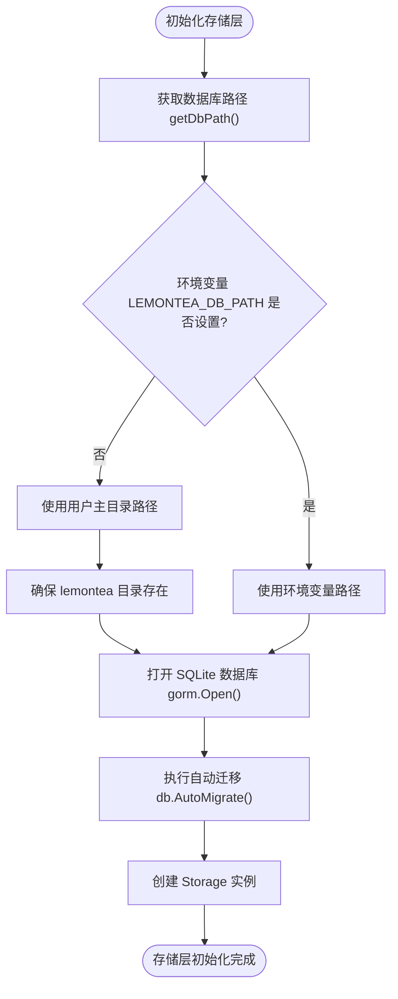
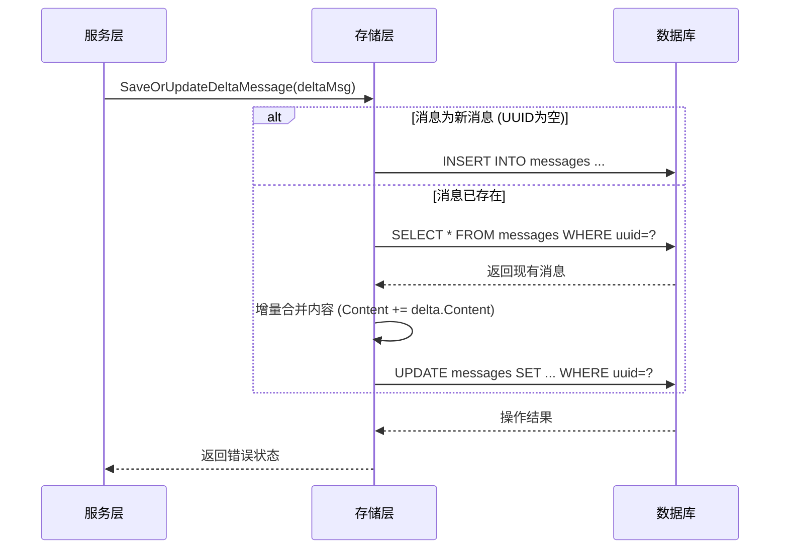
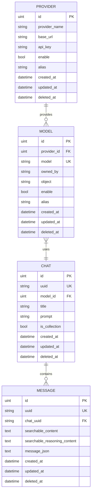
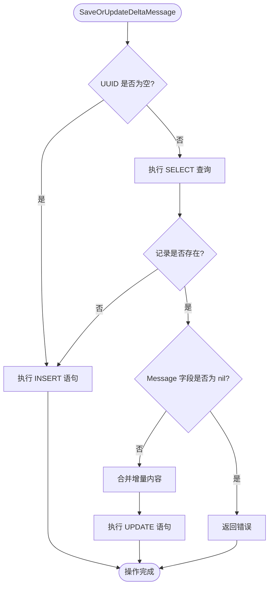
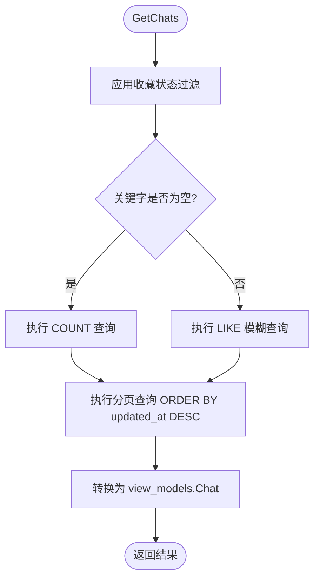
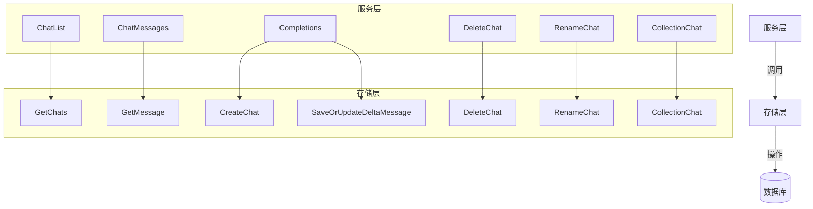

# 存储层

<cite>
**本文档中引用的文件**
- [storage.go](file://backend/storage/storage.go)
- [chat.go](file://backend/storage/chat.go)
- [chat_message.go](file://backend/storage/chat_message.go)
- [provider.go](file://backend/storage/provider.go)
- [models.go](file://backend/storage/models.go)
- [chat.go](file://backend/models/data_models/chat.go)
- [provider.go](file://backend/models/data_models/provider.go)
- [common.go](file://backend/models/data_models/common.go)
</cite>

## 目录
1. [存储层初始化与配置](#存储层初始化与配置)
2. [会话与消息的CRUD操作](#会话与消息的crud操作)
3. [提供方信息持久化](#提供方信息持久化)
4. [GORM高级特性应用](#gorm高级特性应用)
5. [数据库表结构示意图](#数据库表结构示意图)
6. [关键SQL执行流程分析](#关键sql执行流程分析)
7. [存储层与服务层调用契约](#存储层与服务层调用契约)
8. [性能优化策略](#性能优化策略)

## 存储层初始化与配置

存储层通过 `NewStorage` 函数完成数据库连接初始化，采用 GORM 框架与 SQLite 数据库进行交互。初始化过程包括数据库路径获取、连接建立和自动迁移。

`getDbPath` 函数负责确定数据库文件的存储路径。当前代码中存在调试语句 `return "test.db", nil`，该行会直接返回测试数据库路径，跳过后续逻辑。正常逻辑下，函数优先检查环境变量 `LEMONTEA_DB_PATH` 是否设置，若未设置则使用用户主目录下的 `lemontea/data.db` 作为默认路径，并确保目录存在。

数据库连接成功后，系统执行 `AutoMigrate` 自动迁移机制，对 `Model`、`Provider`、`Chat` 和 `Message` 四个数据模型进行结构同步，确保数据库表结构与 Go 结构体定义一致。



**图示来源**
- [storage.go](file://backend/storage/storage.go#L15-L82)

**本节来源**
- [storage.go](file://backend/storage/storage.go#L15-L82)

## 会话与消息的CRUD操作

存储层在 `chat.go` 和 `chat_message.go` 文件中封装了针对会话（Chat）和消息（Message）的完整 CRUD 操作，支持事务处理和增量更新等高级功能。

### 会话操作

`chat.go` 提供了会话管理的核心方法：
- `CreateChat`：创建新会话，设置 UUID、标题、模型 ID 等属性
- `GetChats`：支持分页、关键字搜索和收藏状态过滤的会话查询
- `DeleteChat`：根据 UUID 删除会话
- `RenameChat`：重命名会话标题
- `CollectionChat`：标记会话为收藏状态，使用 `UpdateColumn` 避免更新 `UpdatedAt` 时间戳

### 消息操作

`chat_message.go` 实现了消息的创建、查询和增量更新：
- `CreateMessage`：直接创建新消息记录
- `GetMessage`：根据会话 UUID 分页查询消息列表
- `SaveOrUpdateDeltaMessage`：核心增量更新方法，支持流式响应场景下的消息拼接

该方法首先检查消息 UUID，若为空则视为新消息直接创建。若存在，则查询现有记录，将传入的增量内容（Content、ReasoningContent）追加到原有内容之后，并更新 `ResponseMeta` 字段，最后保存回数据库。



**图示来源**
- [chat_message.go](file://backend/storage/chat_message.go#L15-L72)
- [chat.go](file://backend/storage/chat.go#L60-L110)

**本节来源**
- [chat.go](file://backend/storage/chat.go#L15-L110)
- [chat_message.go](file://backend/storage/chat_message.go#L15-L72)

## 提供方信息持久化

`provider.go` 文件实现了对提供方（Provider）信息的完整持久化操作，包括增删改查功能。

提供方数据模型包含以下字段：
- `ProviderName`：提供方名称
- `BaseUrl`：API 基础 URL
- `ApiKey`：认证密钥
- `Enable`：启用状态
- `Alias`：别名

存储层提供了以下操作接口：
- `GetProviders`：获取所有提供方列表
- `GetProviderByID`：根据 ID 查询单个提供方，未找到时返回 `(nil, nil)`
- `AddProvider`：添加新提供方，返回其 ID
- `UpdateProvider`：更新提供方信息
- `DeleteProvider`：根据 ID 删除提供方

这些操作均基于 GORM 的链式调用语法实现，确保了代码的简洁性和可读性。

**本节来源**
- [provider.go](file://backend/storage/provider.go#L1-L49)
- [provider.go](file://backend/models/data_models/provider.go#L1-L11)

## GORM高级特性应用

本项目深入应用了 GORM 框架的多个高级特性，特别是在消息模型的序列化处理上。

### 钩子函数（Hooks）

`Message` 结构体实现了 GORM 的生命周期钩子：
- `BeforeCreate`、`BeforeUpdate`、`BeforeSave`：在保存前触发，调用 `before` 方法
- `AfterFind`：在查询后触发，自动反序列化 JSON 字段

```go
func (m *Message) before(tx *gorm.DB) (err error) {
    messageBytes, err := json.Marshal(m.Message)
    if err != nil {
        return err
    }
    m.MessageJson = string(messageBytes)
    m.SearchableContent = m.Message.Content
    m.SearchableReasoningContent = m.Message.ReasoningContent
    return
}

func (m *Message) AfterFind(tx *gorm.DB) (err error) {
    if m.MessageJson == "" {
        return
    }
    var message schema.Message
    err = json.Unmarshal([]byte(m.MessageJson), &message)
    if err != nil {
        return err
    }
    m.Message = &message
    return
}
```

此设计实现了 `Message` 对象与 `MessageJson` 字符串字段的自动转换，业务层可直接操作结构化的 `Message` 字段，而存储层负责将其序列化为 JSON 存储。

### 关联查询

`GetProviderModel` 方法展示了跨表关联查询的实现：
1. 先通过模型名称查询 `Model` 表
2. 再根据 `ProviderId` 查询 `Provider` 表
3. 最后组合成 `ProviderModel` 包装对象返回

这种模式实现了数据模型与提供方配置的动态关联。

**本节来源**
- [chat.go](file://backend/models/data_models/chat.go#L40-L62)
- [models.go](file://backend/storage/models.go#L25-L45)

## 数据库表结构示意图



**图示来源**
- [chat.go](file://backend/models/data_models/chat.go#L5-L15)
- [provider.go](file://backend/models/data_models/provider.go#L3-L11)
- [models.go](file://backend/models/data_models/models.go#L3-L13)

## 关键SQL执行流程分析

### 消息增量更新流程



### 会话搜索流程



**本节来源**
- [chat_message.go](file://backend/storage/chat_message.go#L15-L72)
- [chat.go](file://backend/storage/chat.go#L15-L53)

## 存储层与服务层调用契约

存储层与服务层通过清晰的接口契约进行交互，遵循依赖倒置原则。

### 调用关系



### 上下文传递

所有存储层方法均接收 `context.Context` 参数，支持请求级别的超时控制和取消操作。错误处理采用 Go 原生错误传递模式，由服务层统一包装为自定义错误类型。

**本节来源**
- [chat.go](file://backend/storage/chat.go#L15-L110)
- [service/chat.go](file://backend/service/chat.go#L1-L50)

## 性能优化策略

### 批量操作优化

虽然当前代码未显式实现批量插入，但 GORM 框架本身支持批量操作。建议在需要批量创建消息时使用 `CreateInBatches` 方法以提高性能。

### 索引优化

数据模型已合理使用索引：
- `Chat` 表：`uuid`（唯一索引）、`model_id`、`is_collection`
- `Message` 表：`uuid`（唯一索引）、`chat_uuid`
- `Model` 表：`model`（唯一索引）、`provider_id`
- `Provider` 表：`enable`

### 查询优化

- `GetChats` 方法使用 `Offset/Limit` 实现分页，避免全表扫描
- 关键查询字段均建立索引，如 `chat_uuid` 用于消息查询
- 使用 `UpdateColumn` 避免不必要的 `UpdatedAt` 更新

### 事务处理

`NewFnTransaction` 方法提供了事务支持，允许在单个事务中执行多个操作：

```go
func (s *Storage) NewFnTransaction(ctx context.Context, fn func(ctx context.Context, s *Storage) error) error {
    tx := s.sqliteDB.Begin()
    txStorage := &Storage{sqliteDB: tx}
    err := fn(ctx, txStorage)
    if err != nil {
        tx.Rollback()
        return err
    }
    return tx.Commit().Error
}
```

此模式确保了数据一致性，适用于需要原子性操作的场景。

**本节来源**
- [storage.go](file://backend/storage/storage.go#L65-L82)
- [chat.go](file://backend/storage/chat.go#L15-L110)
- [models.go](file://backend/models/data_models/chat.go#L5-L15)