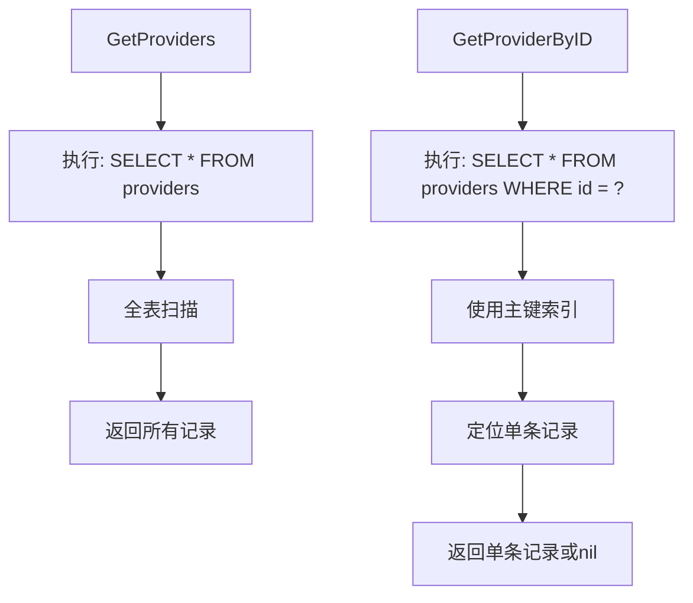
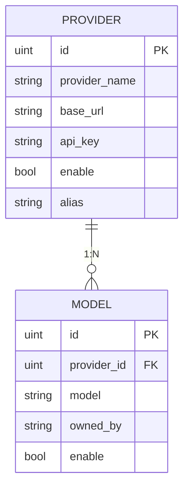

# 提供方存储

<cite>
**本文档引用的文件**  
- [provider.go](file://backend/models/data_models/provider.go)
- [provider.go](file://backend/storage/provider.go)
- [provider.go](file://backend/service/provider.go)
- [models.go](file://backend/models/data_models/models.go)
- [storage.go](file://backend/storage/storage.go)
- [models.go](file://backend/storage/models.go)
- [common.go](file://backend/models/data_models/common.go)
- [provider.go](file://backend/models/view_models/provider.go)
</cite>

## 目录
1. [简介](#简介)
2. [数据模型定义](#数据模型定义)
3. [全量拉取与精准查询性能分析](#全量拉取与精准查询性能分析)
4. [插入操作与ID生成策略](#插入操作与id生成策略)
5. [更新操作风险与改进建议](#更新操作风险与改进建议)
6. [删除操作实现与外键影响](#删除操作实现与外键影响)
7. [API密钥加密存储现状与扩展方向](#api密钥加密存储现状与扩展方向)
8. [多租户场景下的数据库设计演进路径](#多租户场景下的数据库设计演进路径)
9. [总结](#总结)

## 简介
本文档系统性说明`provider.go`中AI提供方信息的持久化方案，涵盖数据结构、CRUD操作机制、性能特征及安全扩展方向。重点分析`GetProviders`全量拉取与`GetProviderByID`精准查询的性能差异，探讨索引优化空间；阐述`AddProvider`插入时依赖数据库自增的ID生成策略；分析`UpdateProvider`全字段更新的风险并提出部分字段更新的改进建议；说明`DeleteProvider`硬删除实现及其对关联模型表的级联影响。结合`data_models.Provider`结构体，描述API密钥明文存储的现状与未来加密扩展方向，并讨论在多租户场景下提供方配置隔离的数据库设计演进路径。

## 数据模型定义

`data_models.Provider`结构体定义了AI提供方的核心属性，继承自`OrmModel`（包含ID、创建时间、更新时间、软删除标记），具体字段如下：

```go
type Provider struct {
	OrmModel
	ProviderName string  `gorm:"type:varchar(255)" json:"provider_name"`
	BaseUrl      string  `gorm:"type:varchar(255)" json:"base_url"`
	ApiKey       string  `gorm:"type:varchar(255)" json:"api_key"`
	Enable       bool    `gorm:"index;type:bool;default:1" json:"enable"`
	Alias        *string `gorm:"type:varchar(255)" json:"alias"`
}
```

其中：
- `ProviderName`：提供方名称
- `BaseUrl`：API基础URL
- `ApiKey`：认证密钥（当前明文存储）
- `Enable`：启用状态（已建立索引）
- `Alias`：别名（可为空）

该结构体通过GORM映射到SQLite数据库表，主键ID由数据库自增生成。

**Section sources**
- [provider.go](file://backend/models/data_models/provider.go#L2-L9)
- [common.go](file://backend/models/data_models/common.go#L8-L13)

## 全量拉取与精准查询性能分析

### 查询方法对比

| 方法 | SQL语句 | 性能特征 |
|------|--------|---------|
| `GetProviders` | `SELECT * FROM providers` | 全表扫描，无WHERE条件 |
| `GetProviderByID` | `SELECT * FROM providers WHERE id = ? LIMIT 1` | 基于主键索引查找，高效 |

`GetProviders`执行全表扫描，时间复杂度为O(n)，在提供方数量较多时性能下降明显。而`GetProviderByID`利用主键索引进行查找，时间复杂度接近O(1)，性能稳定高效。

### 索引优化建议

当前仅对`enable`字段建立了索引。建议在以下场景增加索引以提升查询性能：
- 若按`provider_name`或`alias`进行搜索，应为这两个字段添加索引
- 若存在按创建时间排序的需求，可为`created_at`字段添加索引

目前未对`base_url`和`api_key`建立索引，因其主要用于外部调用而非查询条件，建立索引可能影响写入性能且收益有限。



**Diagram sources**
- [provider.go](file://backend/storage/provider.go#L10-L18)
- [provider.go](file://backend/storage/provider.go#L20-L32)

**Section sources**
- [provider.go](file://backend/storage/provider.go#L10-L32)

## 插入操作与ID生成策略

`AddProvider`方法依赖数据库自增主键生成ID：

```go
func (s *Storage) AddProvider(ctx context.Context, provider data_models.Provider) (uint, error) {
	return provider.ID, s.sqliteDB.Create(&provider).Error
}
```

### ID生成机制
- 使用GORM的`primaryKey;autoIncrement`标签，由SQLite自动分配递增ID
- 调用`Create`后，GORM会将生成的ID回填至传入对象的`ID`字段
- 方法返回值直接使用`provider.ID`，即数据库生成的ID

### 事务一致性
在添加提供方后，服务层会自动触发`updateProviderModel`，通过事务确保模型信息同步：
1. 调用LLM接口获取该提供方可用模型列表
2. 在事务中先删除旧模型，再插入新模型
3. 保证模型数据与提供方状态一致

此设计避免了模型信息滞后问题，提升了系统一致性。

**Section sources**
- [provider.go](file://backend/storage/provider.go#L34-L38)
- [provider.go](file://backend/service/provider.go#L25-L45)

## 更新操作风险与改进建议

### 当前实现分析

`UpdateProvider`使用GORM的`Updates`方法进行全字段更新：

```go
func (s *Storage) UpdateProvider(ctx context.Context, provider data_models.Provider) error {
	return s.sqliteDB.Updates(&provider).Error
}
```

#### 存在风险
1. **过度更新**：即使只修改一个字段，也会更新所有非零值字段
2. **并发冲突**：多个字段同时更新可能引发不必要的行锁
3. **数据覆盖**：前端未传值的字段若为零值，可能导致意外覆盖

### 改进建议：部分字段更新

推荐改用`Select().Omit()`或`Updates(map[string]interface{})`实现选择性更新：

```go
// 示例：仅更新允许变更的字段
db.Model(&provider).Select("provider_name", "base_url", "enable", "alias").Updates(newData)
```

或使用映射更新：

```go
updates := make(map[string]interface{})
if provider.ProviderName != "" {
	updates["provider_name"] = provider.ProviderName
}
if provider.BaseUrl != "" {
	updates["base_url"] = provider.BaseUrl
}
// ... 其他字段判断
db.Model(&provider).Updates(updates)
```

这样可精确控制更新范围，减少I/O开销，提升并发性能与数据安全性。

**Section sources**
- [provider.go](file://backend/storage/provider.go#L40-L43)
- [provider.go](file://backend/service/provider.go#L47-L65)

## 删除操作实现与外键影响

### 当前实现

`DeleteProvider`为硬删除操作：

```go
func (s *Storage) DeleteProvider(ctx context.Context, id uint) error {
	return s.sqliteDB.Where("id = ?", id).Delete(&data_models.Provider{}).Error
}
```

直接从`providers`表中物理删除指定ID的记录。

### 外键级联影响

`data_models.Model`表中存在`ProviderId`字段作为外键关联：

```go
type Model struct {
	OrmModel
	ProviderId uint    `gorm:"index" json:"provider_id"`
	// ...
}
```

但当前数据库迁移未定义外键约束（`AutoMigrate`未启用外键），因此：
- 删除提供方时，其关联的模型记录**不会自动删除**
- 需依赖业务逻辑清理：`updateProviderModel`中调用`DeleteAllProviderModel`显式删除

### 建议改进

为保证数据完整性，建议：
1. 在GORM模型中显式定义外键关系
2. 启用SQLite外键支持（`PRAGMA foreign_keys = ON`）
3. 设置`ON DELETE CASCADE`，实现自动级联删除

当前通过服务层事务手动维护一致性，虽可行但增加了业务复杂度。



**Diagram sources**
- [provider.go](file://backend/models/data_models/provider.go#L2-L9)
- [models.go](file://backend/models/data_models/models.go#L2-L11)

**Section sources**
- [provider.go](file://backend/storage/provider.go#L45-L49)
- [models.go](file://backend/models/data_models/models.go#L2-L11)
- [models.go](file://backend/storage/models.go#L48-L52)

## API密钥加密存储现状与扩展方向

### 当前现状

API密钥以明文形式存储在数据库中：

```go
ApiKey string `gorm:"type:varchar(255)" json:"api_key"`
```

- 传输过程依赖HTTPS加密
- 存储层面无加密保护
- 存在数据泄露风险（如数据库文件被盗）

### 安全扩展方向

建议引入加密存储机制：

#### 方案一：应用层加解密
- 使用AES等对称加密算法
- 密钥由环境变量或密钥管理服务（KMS）提供
- 在`AddProvider`和`GetProvider`时自动加解密

#### 方案二：数据库透明加密（TDE）
- 利用SQLite加密扩展（如SQLCipher）
- 数据库层面自动加解密
- 对应用透明，安全性高

#### 方案三：凭证分离
- 数据库存储密钥哈希（用于验证）
- 实际密钥由外部密钥管理服务托管
- 运行时按需获取，减少暴露面

推荐优先实施应用层加密，平衡安全性与实现成本。

**Section sources**
- [provider.go](file://backend/models/data_models/provider.go#L5-L5)

## 多租户场景下的数据库设计演进路径

### 当前设计局限

当前`Provider`表为全局共享，不支持多租户隔离：
- 所有用户可见相同提供方配置
- 无法实现租户级自定义（如不同API密钥）

### 演进路径

#### 阶段一：增加租户标识字段

```go
type Provider struct {
	// ...
	TenantID uint `gorm:"index" json:"tenant_id"`
}
```

- 所有查询添加`tenant_id = ?`条件
- 快速实现逻辑隔离
- 成本低，易于迁移

#### 阶段二：独立Schema或数据库

- 每个租户使用独立数据库或Schema
- 物理隔离，安全性最高
- 适用于SaaS场景，但运维复杂度高

#### 阶段三：混合模式

- 公共提供方（如OpenAI）全局共享
- 私有提供方按租户隔离
- 通过`scope`字段区分`global`与`private`

```mermaid
classDiagram
class Provider {
+uint ID
+string ProviderName
+string BaseUrl
+string ApiKey
+bool Enable
+*string Alias
+uint TenantID
+string Scope
}
note right of Provider
Scope : global | private
TenantID : 仅private有效
end note
```

**Diagram sources**
- [provider.go](file://backend/models/data_models/provider.go#L2-L9)

**Section sources**
- [provider.go](file://backend/models/data_models/provider.go#L2-L9)

## 总结

本文系统分析了AI提供方信息的持久化方案。`GetProviders`全量拉取存在性能瓶颈，建议按需建立索引优化；`GetProviderByID`基于主键查询高效稳定。`AddProvider`依赖数据库自增ID，结合事务保证模型同步。`UpdateProvider`采用全字段更新存在风险，建议改为选择性更新。`DeleteProvider`为硬删除，依赖业务逻辑维护外键一致性，建议引入数据库级联删除。API密钥当前明文存储，存在安全隐患，应逐步引入加密机制。当前设计不支持多租户，可通过增加`tenant_id`字段实现逻辑隔离，并向物理隔离或混合模式演进，满足不同场景需求。