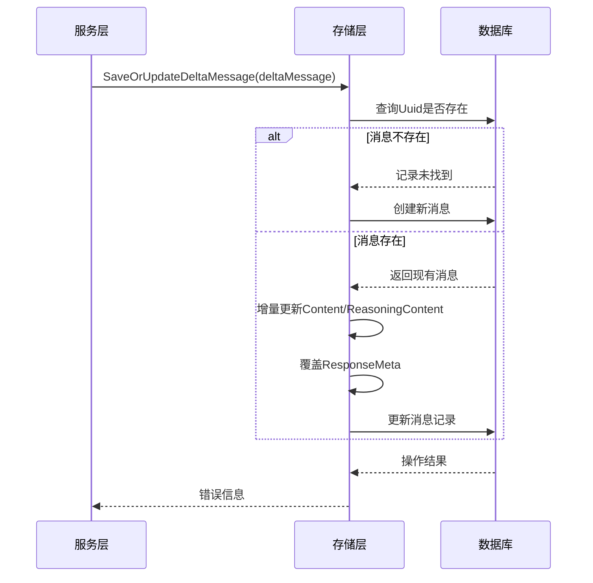
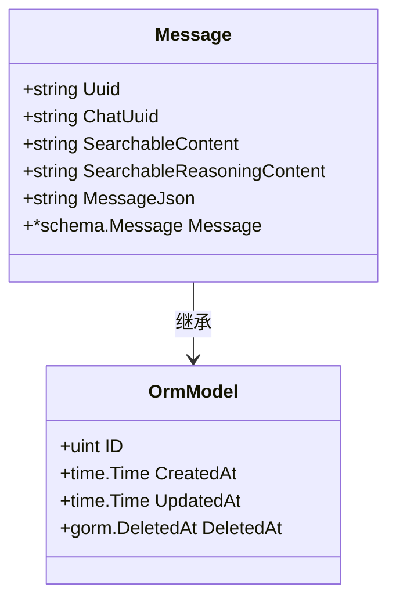
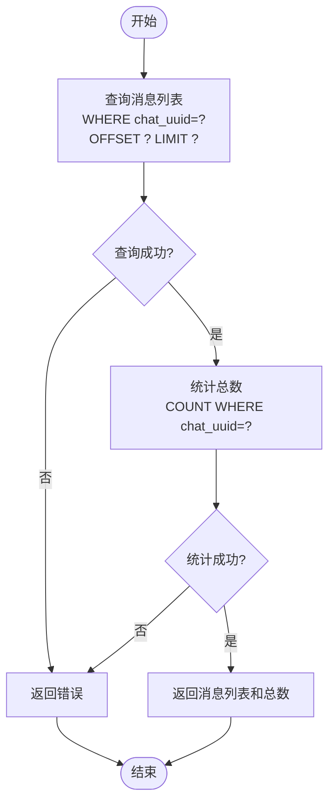

# 消息存储

<cite>
**本文档中引用的文件**   
- [chat_message.go](file://backend/storage/chat_message.go)
- [chat.go](file://backend/models/data_models/chat.go)
- [common.go](file://backend/models/data_models/common.go)
- [chat.go](file://backend/service/chat.go)
- [storage.go](file://backend/storage/storage.go)
</cite>

## 目录
1. [消息存储机制概述](#消息存储机制概述)
2. [核心方法分析](#核心方法分析)
3. [数据模型与GORM持久化机制](#数据模型与gorm持久化机制)
4. [消息结构合并策略](#消息结构合并策略)
5. [分页加载与查询性能](#分页加载与查询性能)
6. [批量插入优化建议](#批量插入优化建议)

## 消息存储机制概述

本系统采用SQLite作为本地消息持久化存储引擎，通过GORM实现ORM映射，支持消息的创建、增量更新与分页查询。消息存储逻辑主要集中在`backend/storage/chat_message.go`中，围绕`Message`结构体实现对聊天上下文的完整管理。

系统设计充分考虑了流式响应场景下的增量更新需求，通过`Uuid`字段判断消息是否存在，实现新消息创建或现有消息内容拼接。同时，结合GORM的生命周期钩子函数，自动处理复杂嵌套结构的序列化与反序列化。

**Section sources**
- [chat_message.go](file://backend/storage/chat_message.go#L1-L72)
- [chat.go](file://backend/models/data_models/chat.go#L18-L62)

## 核心方法分析

### SaveOrUpdateDeltaMessage：流式响应增量更新

该方法是处理流式AI响应的核心机制。当`deltaMessage.Uuid`为空时，视为新消息直接创建；否则查询现有记录并进行增量更新：

- **内容拼接**：`Content`与`ReasoningContent`字段采用字符串追加方式，实现流式输出的逐步构建
- **元数据覆盖**：`ResponseMeta`字段直接替换，确保最终状态（如`FinishReason`）正确覆盖
- **空值保护**：检查`existingMessage.Message`非空，防止空指针异常

此设计完美适配SSE（Server-Sent Events）流式传输场景，确保前端能实时接收并展示逐步生成的AI回复。

### CreateMessage：简单插入流程

该方法实现消息的直接插入，接收`chatUuid`和完整的`Message`对象，通过GORM的`Create`方法持久化到数据库。这是非流式场景或用户输入消息的标准存储路径。

### GetMessage：分页加载消息链

该方法按`chat_uuid`分页加载消息列表，返回消息数组、总数和错误信息。采用`Offset`和`Limit`实现分页，避免一次性加载过多数据导致内存溢出，平衡了查询性能与内存占用。

**Diagram sources**
- [chat_message.go](file://backend/storage/chat_message.go#L16-L58)

**Section sources**
- [chat_message.go](file://backend/storage/chat_message.go#L16-L72)

## 数据模型与GORM持久化机制

### Message结构体设计

`Message`结构体定义在`backend/models/data_models/chat.go`中，关键字段包括：

- `Uuid`：消息唯一标识，用于增量更新判断
- `ChatUuid`：关联的聊天会话ID，用于消息链查询
- `MessageJson`：存储`schema.Message`的JSON序列化字符串
- `Message`：`schema.Message`指针，标记为`gorm:"-"`表示不直接映射到数据库

### GORM生命周期钩子

通过实现`BeforeCreate`、`BeforeUpdate`、`BeforeSave`和`AfterFind`方法，自动处理对象与JSON字符串的转换：

- **保存前**：调用`before`方法，将`Message`对象序列化为JSON字符串存入`MessageJson`字段，同时提取`Content`和`ReasoningContent`用于全文检索
- **查询后**：调用`AfterFind`方法，将`MessageJson`反序列化为`Message`对象，供业务层直接使用

这种设计既保证了复杂结构的完整存储，又提供了高效的文本检索能力。

**Diagram sources**
- [chat.go](file://backend/models/data_models/chat.go#L18-L62)

**Section sources**
- [chat.go](file://backend/models/data_models/chat.go#L18-L62)
- [common.go](file://backend/models/data_models/common.go#L5-L13)

## 消息结构合并策略

在`SaveOrUpdateDeltaMessage`方法中，对`schema.Message`内嵌结构的处理遵循以下策略：

- **Content字段**：字符串类型，采用`+=`操作符进行内容追加，实现流式文本的逐步构建
- **ReasoningContent字段**：同样为字符串类型，采用追加策略，支持思维链（Reasoning）的逐步展示
- **ResponseMeta字段**：指针类型，采用直接赋值覆盖策略，确保最终的元数据（如完成原因、使用统计）正确无误

这种混合策略既满足了流式输出的增量特性，又保证了元数据的准确性。例如，当AI流式生成回复时，每收到一个token就更新`Content`，而只有在流结束时才设置`FinishReason`。

**Section sources**
- [chat_message.go](file://backend/storage/chat_message.go#L40-L58)

## 分页加载与查询性能

`GetMessage`方法通过以下方式优化查询性能与内存占用：

- **条件索引**：`ChatUuid`字段建立数据库索引，加速按会话ID的查询
- **分页机制**：使用`Offset`和`Limit`限制单次查询结果集大小，防止内存溢出
- **两阶段查询**：先查询消息列表，再单独统计总数，避免`COUNT(*)`与`SELECT`合并查询的性能损耗
- **惰性加载**：仅当需要时才反序列化`MessageJson`，减少不必要的计算开销

对于长对话场景，建议前端采用懒加载策略，初始只加载最新N条消息，用户滚动时再分页加载历史消息，实现性能与体验的平衡。

**Diagram sources**
- [chat_message.go](file://backend/storage/chat_message.go#L59-L72)

**Section sources**
- [chat_message.go](file://backend/storage/chat_message.go#L59-L72)
- [chat.go](file://backend/service/chat.go#L48-L55)

## 批量插入优化建议

当前`CreateMessage`方法为单条插入，在高并发写入场景下可能成为性能瓶颈。建议实现批量插入接口以提升效率：

1. **新增BatchCreateMessages方法**：接收消息切片，使用GORM的`CreateInBatches`或事务批量插入
2. **事务包装**：在单个事务中执行批量插入，减少事务开销
3. **预处理优化**：批量计算`SearchableContent`等衍生字段，避免逐条处理
4. **连接池配置**：适当增加SQLite连接池大小，支持并发写入

此外，可考虑引入写队列机制，将消息插入操作异步化，进一步提升响应速度，特别适用于需要记录大量中间步骤的复杂AI交互场景。

**Section sources**
- [chat_message.go](file://backend/storage/chat_message.go#L10-L14)
- [storage.go](file://backend/storage/storage.go#L50-L55)