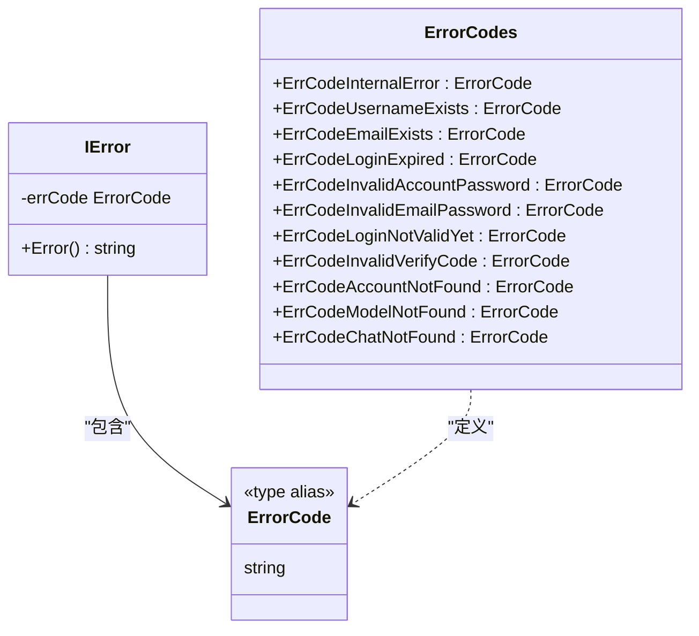
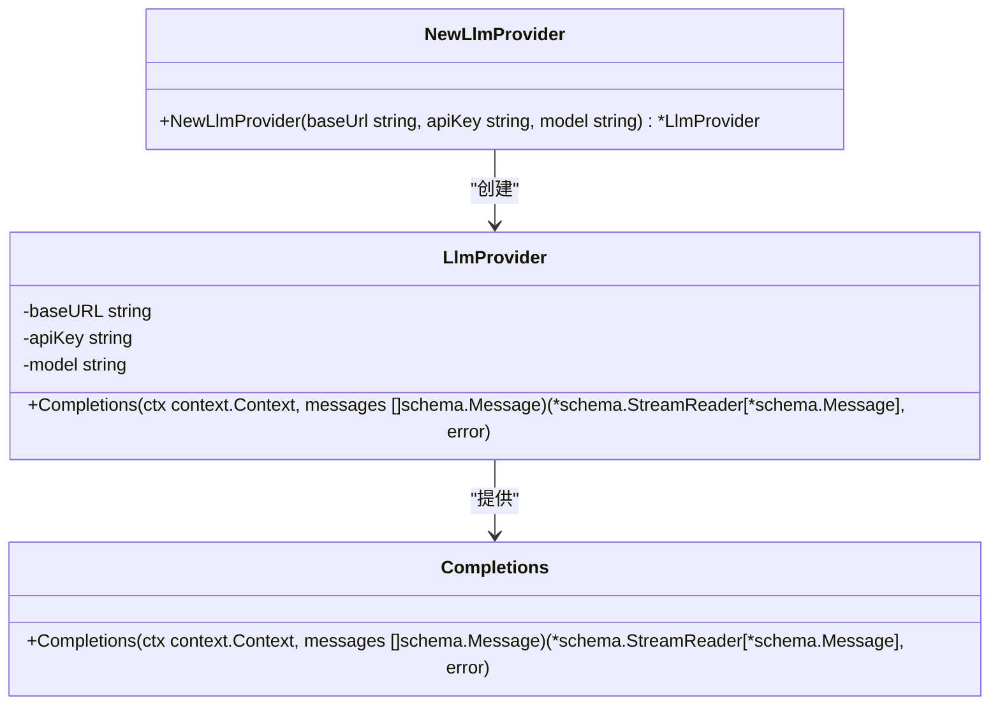
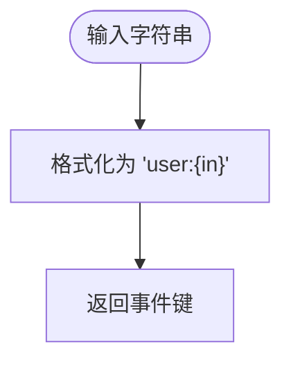

# 工具函数库

<cite>
**本文档引用文件**  
- [code.go](file://backend/utils/ierror/code.go)
- [common.go](file://backend/utils/ierror/common.go)
- [llm/common.go](file://backend/utils/llm/common.go)
- [llm/models.go](file://backend/utils/llm/models.go)
- [events.go](file://backend/utils/events.go)
- [service/chat.go](file://backend/service/chat.go)
</cite>

## 目录
1. [引言](#引言)
2. [错误处理工具包 (ierror)](#错误处理工具包-ierror)
3. [大模型交互抽象 (llm)](#大模型交互抽象-llm)
4. [事件处理辅助函数 (events)](#事件处理辅助函数-events)
5. [工具类的复用性与可维护性](#工具类的复用性与可维护性)
6. [实际业务调用示例](#实际业务调用示例)
7. [性能考量](#性能考量)
8. [总结](#总结)

## 引言

本项目 `backend/utils` 目录下的工具组件为整个后端系统提供了基础的、可复用的功能模块。这些工具类的设计旨在提升代码的复用性、可维护性和健壮性，通过将通用逻辑抽象化，避免了在业务代码中重复实现相同的功能。本文档将系统梳理 `ierror` 包中的错误码体系与封装机制、`llm` 包中的大模型交互逻辑，以及 `events.go` 中的事件键生成函数，详细解释其设计原理、使用方式和性能影响。

## 错误处理工具包 (ierror)

`ierror` 包是项目统一的错误处理中心，它通过定义标准化的错误码和封装机制，实现了错误信息的规范化和集中化管理。

### 错误码体系设计 (code.go)

该包的核心是 `ErrorCode` 类型，它是一个字符串类型的别名，用于定义系统中所有可能的错误码常量。



**Section sources**
- [code.go](file://backend/utils/ierror/code.go#L3-L28)

#### 错误码对照表

| 错误码常量 | 中文含义 | 业务场景 |
| :--- | :--- | :--- |
| `ErrCodeInternalError` | 系统内部错误 | 任何未预期的、底层的错误（如数据库连接失败） |
| `ErrCodeUsernameExists` | 用户名已被使用 | 用户注册时，用户名已存在 |
| `ErrCodeEmailExists` | 邮箱已使用 | 用户注册时，邮箱已存在 |
| `ErrCodeLoginExpired` | 登陆过期 | JWT Token 过期 |
| `ErrCodeInvalidAccountPassword` | 账号或密码错误 | 用户名/密码登录失败 |
| `ErrCodeInvalidEmailPassword` | 邮箱或密码错误 | 邮箱/密码登录失败 |
| `ErrCodeLoginNotValidYet` | 登陆未生效 | 用户注册后未完成邮箱验证 |
| `ErrCodeInvalidVerifyCode` | 验证码错误 | 验证码校验失败 |
| `ErrCodeAccountNotFound` | 账号不存在 | 根据用户名或邮箱查找用户失败 |
| `ErrCodeModelNotFound` | 模型不存在 | 请求的LLM模型在系统中未配置 |
| `ErrCodeChatNotFound` | 对话不存在 | 根据UUID查找聊天记录失败 |

### 错误封装机制 (common.go)

`common.go` 文件定义了 `IError` 结构体和相关的构造函数，实现了错误的创建和日志记录。

- **`IError` 结构体**: 包含一个 `errCode` 字段，用于存储具体的错误码。
- **`Error()` 方法**: 实现了 Go 的 `error` 接口，返回错误码的字符串表示。
- **`New(errCode ErrorCode) error` 函数**: 创建一个指定错误码的 `IError` 实例。
- **`NewError(err error) error` 函数**: 这是一个关键的封装函数。它接收一个原始的 `error`，将其记录到日志中（使用 `pkg/logger`），然后返回一个统一的 `ErrCodeInternalError` 错误。这确保了底层的详细错误信息被记录，而暴露给上层的错误是安全且一致的。

**Section sources**
- [common.go](file://backend/utils/ierror/common.go#L3-L20)

## 大模型交互抽象 (llm)

`llm` 包负责与大语言模型（LLM）服务进行交互，它将复杂的HTTP调用和数据解析逻辑封装起来，为业务层提供简洁的API。

### LLM提供者抽象 (common.go)

`LlmProvider` 结构体封装了与特定LLM服务交互所需的所有配置信息。



- **`LlmProvider` 结构体**: 包含 `baseURL`（API地址）、`apiKey`（认证密钥）和 `model`（模型名称）三个私有字段。
- **`NewLlmProvider` 函数**: 构造函数，用于创建并初始化 `LlmProvider` 实例。
- **`Completions` 方法**: 核心方法，接收一个消息列表，调用底层的 `openai` 组件（通过 `eino-ext` 库）与LLM服务通信，并返回一个流式读取器（`StreamReader`），用于逐条接收模型的响应。

**Section sources**
- [common.go](file://backend/utils/llm/common.go#L3-L45)

### 模型信息获取 (models.go)

`models.go` 文件提供了从LLM服务端获取可用模型列表的功能。

- **`GetModels(baseURL, apiKey string)` 函数**: 向 `baseURL/models` 发起一个GET请求，获取模型列表。
- **错误处理**: 该函数对网络请求、HTTP状态码和JSON解析过程中的所有错误都进行了封装，返回一个统一的 `error`。
- **数据结构**: 定义了 `ModelData` 和 `ModelsResponse` 两个结构体，用于反序列化API返回的JSON数据。

**Section sources**
- [models.go](file://backend/utils/llm/models.go#L3-L58)

## 事件处理辅助函数 (events)

`events.go` 提供了一个非常简洁但重要的辅助函数，用于生成事件系统中使用的唯一键。

### 事件键生成 (events.go)

- **`GenEventsKey(in string) string` 函数**: 接收一个输入字符串（通常为用户ID或消息ID），并将其格式化为 `"user:{in}"` 的形式。
- **用途**: 在 `service/chat.go` 的 `Completions` 方法中，此函数被用来为每个聊天流生成一个唯一的事件键（`eventsKey`），前端可以通过监听这个键来接收实时的聊天消息。



**Section sources**
- [events.go](file://backend/utils/events.go#L3-L7)

## 工具类的复用性与可维护性

这些工具类的设计显著提升了代码的复用性和可维护性：

1.  **错误处理一致性**: `ierror` 包强制所有业务错误都使用预定义的错误码，避免了错误信息的随意性，便于前端统一处理和用户理解。
2.  **逻辑解耦**: `llm` 包将大模型交互的细节与业务逻辑（如聊天、模型管理）完全分离。如果需要更换LLM服务提供商，只需修改 `llm` 包内的实现，而无需改动 `service` 层的代码。
3.  **代码复用**: `GenEventsKey` 这样的小函数可以在任何需要生成用户相关事件键的地方被复用，避免了重复的字符串拼接代码。
4.  **易于扩展**: 添加新的错误码或支持新的LLM API，都只需要在对应的工具包内进行，不会影响到其他模块。

## 实际业务调用示例

以下是在 `service/chat.go` 中如何使用这些工具类的典型示例：

### 错误码的使用

当业务逻辑中需要返回一个特定的错误时，直接使用 `ierror.New` 函数：

```go
// 在 service/chat.go 中
providerModel, err := s.storage.GetProviderModel(context.Background(), model)
if providerModel == nil {
    return nil, ierror.New(ierror.ErrCodeModelNotFound) // 直接返回预定义的错误码
}
```

### 错误封装的使用

当调用底层存储或网络服务发生错误时，使用 `ierror.NewError` 将原始错误包装并记录：

```go
// 在 service/chat.go 中
chats, total, err := s.storage.GetChats(context.Background(), offset, limit, keyword, isCollection)
if err != nil {
    return nil, ierror.NewError(err) // 记录原始错误，返回内部错误码
}
```

### LLM工具的使用

创建一个 `LlmProvider` 实例并调用其 `Completions` 方法：

```go
// 在 service/chat.go 中
provider := llm.NewLlmProvider(providerModel.BaseUrl, providerModel.ApiKey, providerModel.Model)
stream, err := provider.Completions(context.Background(), messages)
if err != nil {
    return nil, ierror.NewError(err)
}
```

### 事件键的使用

为每个聊天流生成唯一的事件键：

```go
// 在 service/chat.go 中
eventsKey := utils.GenEventsKey(messageUuid)
// 然后使用 eventsKey 进行事件的发布 (Emit)
```

**Section sources**
- [chat.go](file://backend/service/chat.go#L3-L207)

## 性能考量

1.  **错误处理**: `ierror.NewError` 会触发日志写入，这是一个I/O操作。在高并发场景下，应确保日志系统有足够的吞吐能力，或考虑异步日志。
2.  **LLM调用**: `llm` 包中的 `Completions` 和 `GetModels` 方法都是网络请求，其性能受网络延迟和LLM服务响应速度的影响。`Completions` 使用流式传输，可以及时返回部分结果，提升用户体验。
3.  **事件系统**: `GenEventsKey` 函数性能极高，仅为简单的字符串拼接，对系统性能无影响。

## 总结

`backend/utils` 目录下的工具组件是项目稳定运行的基石。`ierror` 包建立了清晰的错误管理体系，`llm` 包提供了灵活的大模型交互能力，而 `events.go` 则为实时通信提供了便利。这些工具类通过良好的抽象和封装，极大地提高了代码的可读性、可维护性和可扩展性。开发者在使用时，应遵循其设计原则，正确地使用错误码、封装底层错误，并利用其提供的API与外部服务进行交互。