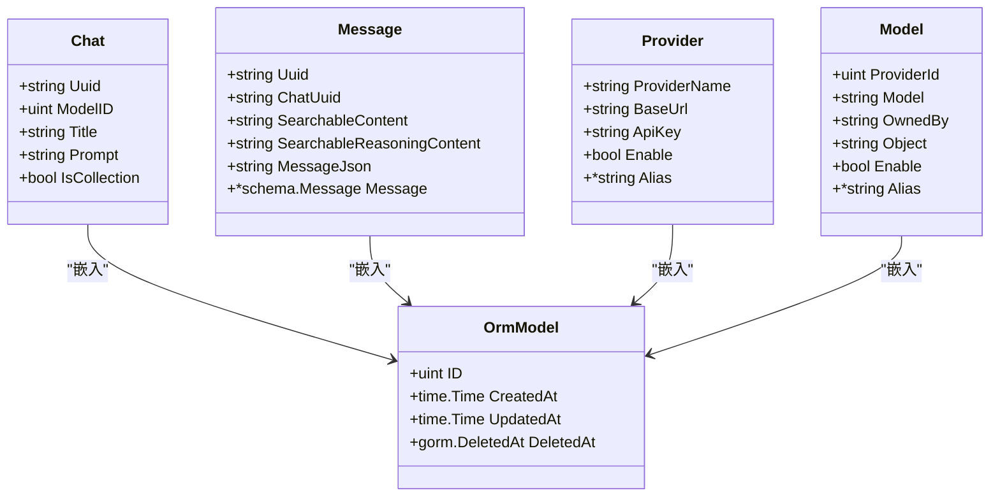
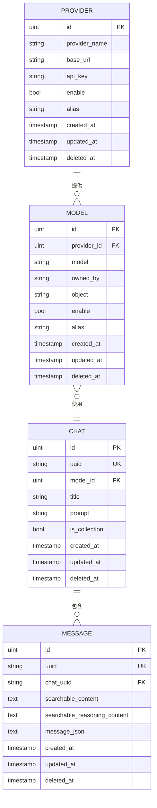
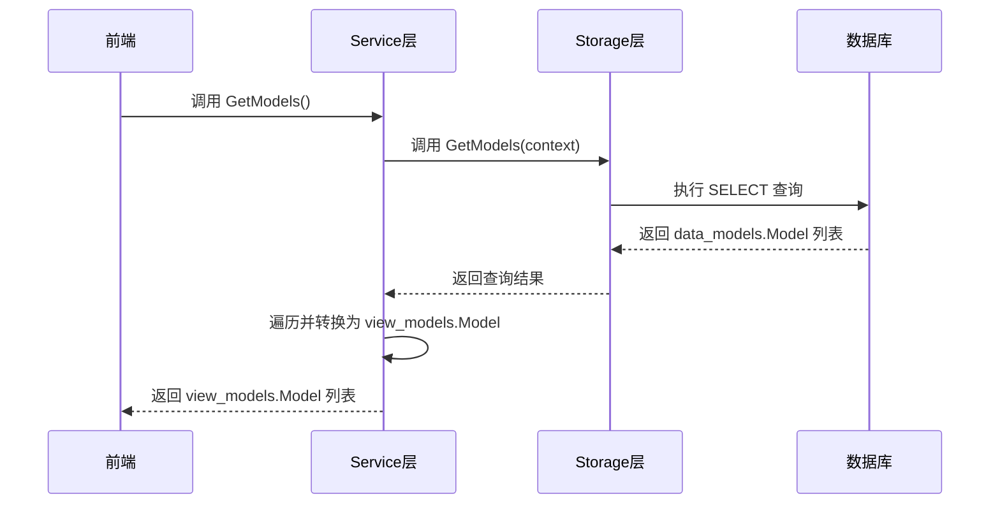

# 数据模型层

<cite>
**本文档引用的文件**
- [common.go](file://backend/models/data_models/common.go)
- [models.go](file://backend/models/data_models/models.go)
- [chat.go](file://backend/models/data_models/chat.go)
- [provider.go](file://backend/models/data_models/provider.go)
- [view_models/models.go](file://backend/models/view_models/models.go)
- [view_models/chat.go](file://backend/models/view_models/chat.go)
- [storage/chat.go](file://backend/storage/chat.go)
- [service/models.go](file://backend/service/models.go)
</cite>

## 目录
1. [引言](#引言)
2. [项目结构概述](#项目结构概述)
3. [核心数据模型设计](#核心数据模型设计)
4. [通用字段复用机制](#通用字段复用机制)
5. [GORM标签与表结构映射](#gorm标签与表结构映射)
6. [实体关系图](#实体关系图)
7. [字段说明表](#字段说明表)
8. [数据模型初始化与自动迁移](#数据模型初始化与自动迁移)
9. [CRUD操作实现](#crud操作实现)
10. [数据模型与视图模型的转换](#数据模型与视图模型的转换)
11. [典型查询用例](#典型查询用例)
12. [最佳实践建议](#最佳实践建议)

## 引言
本文档深入解析 `backend/models/data_models` 目录下的数据库实体模型设计，重点阐述 `Chat`、`Message`、`Provider` 和 `Model` 等核心结构体的设计原理。文档详细说明了各字段的定义、GORM标签的映射规则及其在SQLite中的表结构对应关系，解释了通用字段的复用机制以及全局模型初始化逻辑。同时，结合代码示例说明数据模型如何通过GORM实现自动迁移与CRUD操作，并阐明其与 `view_models` 之间的数据转换关系，旨在帮助开发者全面理解数据持久化层的设计原理与最佳实践。

## 项目结构概述
项目的数据模型层位于 `backend/models` 目录下，主要分为三个子模块：
- `data_models`：定义与数据库直接映射的实体模型，包含核心业务数据结构。
- `view_models`：定义用于API接口传输的数据模型，通常是对 `data_models` 的封装或转换。
- `wrapper_models`：包含一些包装或适配模型。

数据模型通过 `storage` 层与数据库交互，`service` 层则负责业务逻辑处理和 `data_models` 与 `view_models` 之间的数据转换。

**Section sources**
- [common.go](file://backend/models/data_models/common.go#L0-L13)
- [models.go](file://backend/models/data_models/models.go#L0-L11)
- [chat.go](file://backend/models/data_models/chat.go#L0-L62)
- [provider.go](file://backend/models/data_models/provider.go#L0-L10)

## 核心数据模型设计
`data_models` 包中定义了四个核心结构体：`OrmModel`、`Chat`、`Message`、`Provider` 和 `Model`。这些结构体通过GORM ORM框架与SQLite数据库进行映射。

- `OrmModel` 是所有实体模型的基类，提供了通用的数据库字段。
- `Chat` 表示一次对话会话，包含会话的元信息。
- `Message` 表示对话中的单条消息，其内容以JSON格式存储。
- `Provider` 表示LLM服务提供商，如OpenAI、Anthropic等。
- `Model` 表示具体的LLM模型，与 `Provider` 存在关联关系。

**Section sources**
- [common.go](file://backend/models/data_models/common.go#L0-L13)
- [models.go](file://backend/models/data_models/models.go#L0-L11)
- [chat.go](file://backend/models/data_models/chat.go#L0-L62)
- [provider.go](file://backend/models/data_models/provider.go#L0-L10)

## 通用字段复用机制
`OrmModel` 结构体实现了通用字段的复用，所有其他模型都通过嵌入（Embedding）的方式继承它。这种设计遵循了Go语言的组合优于继承原则，避免了代码重复。

```go
type OrmModel struct {
	ID        uint           `gorm:"primaryKey;autoIncrement" json:"id"`
	CreatedAt time.Time      `json:"created_at"`
	UpdatedAt time.Time      `json:"updated_at"`
	DeletedAt gorm.DeletedAt `gorm:"index" json:"deleted_at"`
}
```

- `ID`：主键，自动递增。
- `CreatedAt`：记录创建时间，由GORM自动填充。
- `UpdatedAt`：记录更新时间，由GORM自动填充。
- `DeletedAt`：用于软删除，当该字段非零时，表示记录已被逻辑删除。

通过嵌入 `OrmModel`，`Chat`、`Message` 等结构体自动获得了这些通用字段，无需在每个结构体中重复定义。



**Diagram sources**
- [common.go](file://backend/models/data_models/common.go#L0-L13)
- [chat.go](file://backend/models/data_models/chat.go#L0-L62)
- [provider.go](file://backend/models/data_models/provider.go#L0-L10)
- [models.go](file://backend/models/data_models/models.go#L0-L11)

**Section sources**
- [common.go](file://backend/models/data_models/common.go#L0-L13)

## GORM标签与表结构映射
GORM通过结构体标签（struct tags）将Go结构体字段映射到数据库表的列。以下是核心模型的GORM标签解析：

### Chat 模型
| 字段名 | GORM标签 | 数据库类型 | 说明 |
| :--- | :--- | :--- | :--- |
| `Uuid` | `grom:"unique;index"` | VARCHAR | 对话的唯一标识符，建立唯一索引 |
| `ModelID` | `gorm:"index"` | INTEGER | 模型ID，建立普通索引 |
| `Title` | `gorm:"type:varchar(255)"` | VARCHAR(255) | 对话标题，限制长度 |
| `Prompt` | `gorm:"type:text"` | TEXT | 系统提示词，可存储长文本 |
| `IsCollection` | `gorm:"index;default:false"` | BOOLEAN | 是否收藏，建立索引，默认为false |

### Message 模型
| 字段名 | GORM标签 | 数据库类型 | 说明 |
| :--- | :--- | :--- | :--- |
| `Uuid` | `grom:"unique;index"` | VARCHAR | 消息的唯一标识符，建立唯一索引 |
| `ChatUuid` | `gorm:"index"` | VARCHAR | 所属对话的UUID，建立索引 |
| `SearchableContent` | `gorm:"type:text"` | TEXT | 可搜索的内容文本 |
| `SearchableReasoningContent` | `gorm:"type:text"` | TEXT | 可搜索的推理内容文本 |
| `MessageJson` | `gorm:"type:text"` | TEXT | 消息内容的JSON序列化字符串 |
| `Message` | `gorm:"-"` | - | Go结构体字段，不映射到数据库 |

### Provider 模型
| 字段名 | GORM标签 | 数据库类型 | 说明 |
| :--- | :--- | :--- | :--- |
| `ProviderName` | `gorm:"type:varchar(255)"` | VARCHAR(255) | 服务提供商名称 |
| `BaseUrl` | `gorm:"type:varchar(255)"` | VARCHAR(255) | API基础URL |
| `ApiKey` | `gorm:"type:varchar(255)"` | VARCHAR(255) | API密钥 |
| `Enable` | `gorm:"index;type:bool;default:1"` | BOOLEAN | 是否启用，建立索引，默认为true |
| `Alias` | `gorm:"type:varchar(255)"` | VARCHAR(255) | 别名 |

### Model 模型
| 字段名 | GORM标签 | 数据库类型 | 说明 |
| :--- | :--- | :--- | :--- |
| `ProviderId` | `gorm:"index"` | INTEGER | 所属提供商ID，建立索引 |
| `Model` | `gorm:"index"` | VARCHAR | 模型名称，建立索引 |
| `OwnedBy` | `gorm:"type:varchar(255)"` | VARCHAR(255) | 模型所有者 |
| `Object` | `gorm:"type:varchar(255)"` | VARCHAR(255) | 对象类型 |
| `Enable` | `gorm:"index;type:bool;default:1"` | BOOLEAN | 是否启用，建立索引，默认为true |
| `Alias` | `gorm:"index;type:varchar(255)"` | VARCHAR(255) | 别名，建立索引 |

**Section sources**
- [chat.go](file://backend/models/data_models/chat.go#L0-L62)
- [provider.go](file://backend/models/data_models/provider.go#L0-L10)
- [models.go](file://backend/models/data_models/models.go#L0-L11)

## 实体关系图
以下Mermaid图展示了核心数据模型之间的关系。



**Diagram sources**
- [chat.go](file://backend/models/data_models/chat.go#L0-L62)
- [provider.go](file://backend/models/data_models/provider.go#L0-L10)
- [models.go](file://backend/models/data_models/models.go#L0-L11)

## 字段说明表
| 模型 | 字段 | 类型 | 可空 | 默认值 | 约束 | 说明 |
| :--- | :--- | :--- | :--- | :--- | :--- | :--- |
| `OrmModel` | `ID` | uint | 否 | 自增 | 主键 | 记录唯一标识 |
| `OrmModel` | `CreatedAt` | time.Time | 否 | GORM自动填充 | - | 创建时间 |
| `OrmModel` | `UpdatedAt` | time.Time | 否 | GORM自动填充 | - | 更新时间 |
| `OrmModel` | `DeletedAt` | gorm.DeletedAt | 是 | NULL | 索引 | 软删除时间 |
| `Chat` | `Uuid` | string | 否 | - | 唯一索引 | 对话UUID |
| `Chat` | `ModelID` | uint | 否 | - | 索引 | 模型ID |
| `Chat` | `Title` | string | 否 | - | VARCHAR(255) | 对话标题 |
| `Chat` | `Prompt` | string | 否 | 空字符串 | TEXT | 系统提示词 |
| `Chat` | `IsCollection` | bool | 否 | false | 索引 | 是否收藏 |
| `Message` | `Uuid` | string | 否 | - | 唯一索引 | 消息UUID |
| `Message` | `ChatUuid` | string | 否 | - | 索引 | 所属对话UUID |
| `Message` | `SearchableContent` | string | 否 | - | TEXT | 可搜索内容 |
| `Message` | `SearchableReasoningContent` | string | 否 | - | TEXT | 可搜索推理内容 |
| `Message` | `MessageJson` | string | 否 | - | TEXT | 消息JSON |
| `Message` | `Message` | *schema.Message | 是 | nil | - | 内存中的消息对象 |
| `Provider` | `ProviderName` | string | 否 | - | VARCHAR(255) | 服务提供商名称 |
| `Provider` | `BaseUrl` | string | 否 | - | VARCHAR(255) | API基础URL |
| `Provider` | `ApiKey` | string | 否 | - | VARCHAR(255) | API密钥 |
| `Provider` | `Enable` | bool | 否 | true | 索引 | 是否启用 |
| `Provider` | `Alias` | *string | 是 | NULL | VARCHAR(255) | 别名 |
| `Model` | `ProviderId` | uint | 否 | - | 索引 | 提供商ID |
| `Model` | `Model` | string | 否 | - | 索引 | 模型名称 |
| `Model` | `OwnedBy` | string | 否 | - | VARCHAR(255) | 所有者 |
| `Model` | `Object` | string | 否 | - | VARCHAR(255) | 对象类型 |
| `Model` | `Enable` | bool | 否 | true | 索引 | 是否启用 |
| `Model` | `Alias` | *string | 是 | NULL | 索引, VARCHAR(255) | 别名 |

**Section sources**
- [common.go](file://backend/models/data_models/common.go#L0-L13)
- [chat.go](file://backend/models/data_models/chat.go#L0-L62)
- [provider.go](file://backend/models/data_models/provider.go#L0-L10)
- [models.go](file://backend/models/data_models/models.go#L0-L11)

## 数据模型初始化与自动迁移
数据模型的初始化和自动迁移逻辑通常在应用启动时执行。虽然 `models.go` 文件中未直接包含初始化代码，但根据GORM的常规用法，系统会调用 `AutoMigrate` 方法来创建或更新数据库表结构。

```go
// 伪代码示例：全局模型初始化
db.AutoMigrate(&data_models.Chat{}, &data_models.Message{}, &data_models.Provider{}, &data_models.Model{})
```

此过程会根据结构体定义自动创建对应的表，并确保表结构与最新的模型定义保持一致。如果字段有变更（如添加新字段），`AutoMigrate` 会安全地更新表结构，而不会删除现有数据。

**Section sources**
- [models.go](file://backend/models/data_models/models.go#L0-L11)

## CRUD操作实现
CRUD操作通过 `storage` 层实现。以创建对话为例，`Storage` 结构体的 `CreateChat` 方法展示了如何使用GORM进行数据持久化。

```go
func (s *Storage) CreateChat(ctx context.Context, chatUuid, title string, modelId uint) error {
	now := time.Now()
	chat := &data_models.Chat{
		OrmModel: data_models.OrmModel{
			CreatedAt: now,
			UpdatedAt: now,
		},
		Uuid:    chatUuid,
		ModelID: modelId,
		Title:   title,
		Prompt:  "",
	}

	err := s.sqliteDB.Create(chat).Error
	if err != nil {
		return err
	}

	return nil
}
```

该方法创建一个 `Chat` 实例，设置其字段值，并通过 `s.sqliteDB.Create(chat)` 将其插入数据库。GORM会自动生成相应的INSERT SQL语句。

**Section sources**
- [storage/chat.go](file://backend/storage/chat.go#L55-L70)

## 数据模型与视图模型的转换
`data_models` 与 `view_models` 之间的转换由 `service` 层完成。`view_models` 中的结构体通常与 `data_models` 同名，但可能包含额外的字段或不同的结构，以适应前端需求。

例如，`view_models.Model` 结构体的定义与 `data_models.Model` 几乎完全相同，这表明它们之间存在直接的映射关系。`Service` 层的 `GetModels` 方法负责将 `data_models.Model` 列表转换为 `view_models.Model` 列表。

```go
func (s *Service) GetModels() ([]view_models.Model, error) {
    models, err := s.storage.GetModels(context.Background())
    if err != nil {
        return nil, ierror.NewError(err)
    }
    res := make([]view_models.Model, len(models))
    for i, model := range models {
        res[i] = view_models.Model{
            ID:         model.ID,
            CreatedAt:  model.CreatedAt,
            UpdatedAt:  model.UpdatedAt,
            DeletedAt:  model.DeletedAt,
            ProviderId: model.ProviderId,
            Model:      model.Model,
            OwnedBy:    model.OwnedBy,
            Object:     model.Object,
            Enable:     model.Enable,
            Alias:      model.Alias,
        }
    }
    return res, nil
}
```

这种转换确保了业务数据与传输数据的分离，提高了系统的灵活性和安全性。



**Diagram sources**
- [service/models.go](file://backend/service/models.go#L0-L32)
- [view_models/models.go](file://backend/models/view_models/models.go#L0-L21)

**Section sources**
- [service/models.go](file://backend/service/models.go#L0-L32)
- [view_models/models.go](file://backend/models/view_models/models.go#L0-L21)

## 典型查询用例
1. **获取所有启用的模型**：通过 `ProviderId` 和 `Enable` 字段进行筛选。
2. **根据对话UUID查找消息**：利用 `Message` 表的 `ChatUuid` 索引进行高效查询。
3. **收藏/取消收藏对话**：更新 `Chat` 表的 `IsCollection` 字段，使用 `UpdateColumn` 避免更新 `UpdatedAt`。
4. **软删除提供商**：删除 `Provider` 记录时，GORM会自动设置 `DeletedAt` 字段，而非物理删除。

## 最佳实践建议
1. **复用通用字段**：始终通过嵌入 `OrmModel` 来继承通用字段，保持代码一致性。
2. **合理使用索引**：为频繁查询的字段（如 `Uuid`、`ChatUuid`、`Enable`）建立索引，但避免过度索引影响写入性能。
3. **利用GORM钩子**：如 `Message` 模型中的 `BeforeCreate` 和 `AfterFind` 钩子，用于自动序列化和反序列化复杂对象。
4. **分离数据模型**：明确区分 `data_models`（持久化）和 `view_models`（传输），避免将内部数据结构直接暴露给前端。
5. **使用软删除**：通过 `DeletedAt` 字段实现软删除，保护用户数据。