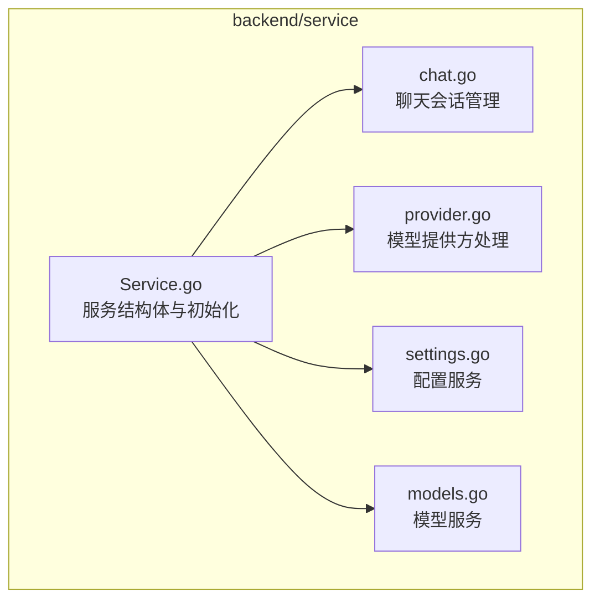
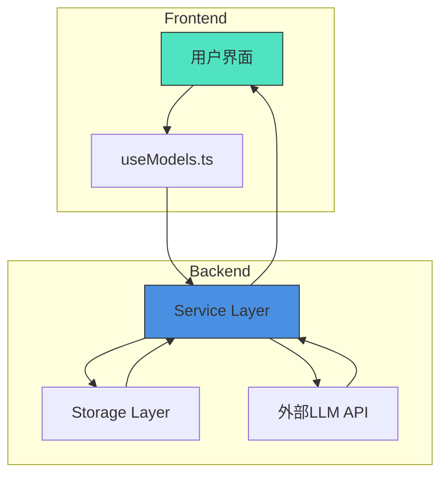
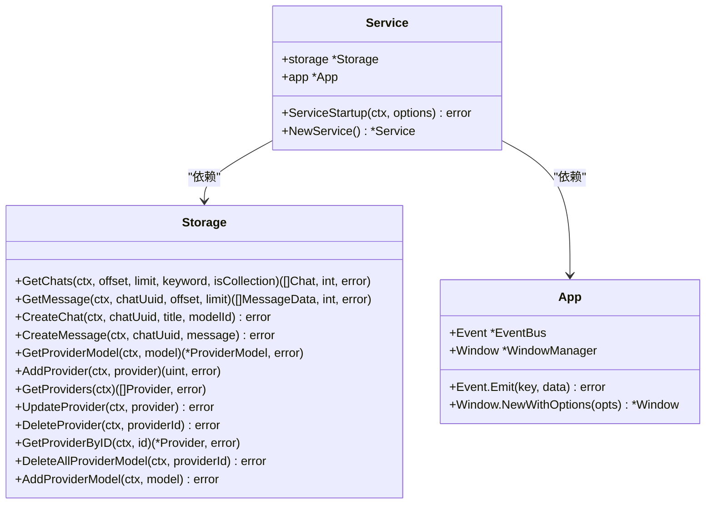
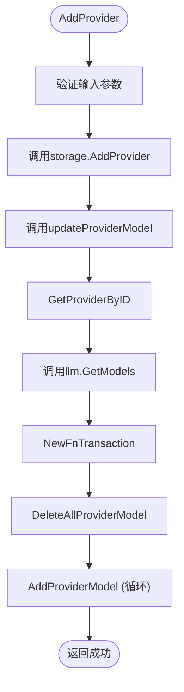
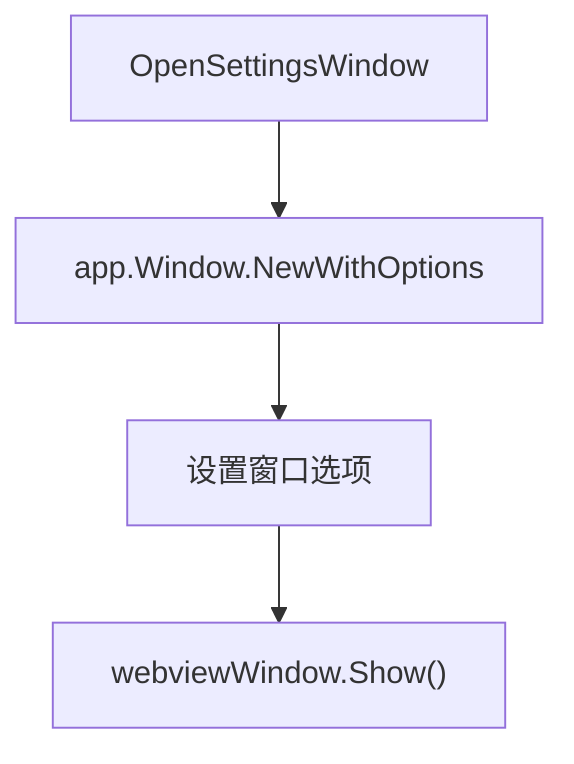
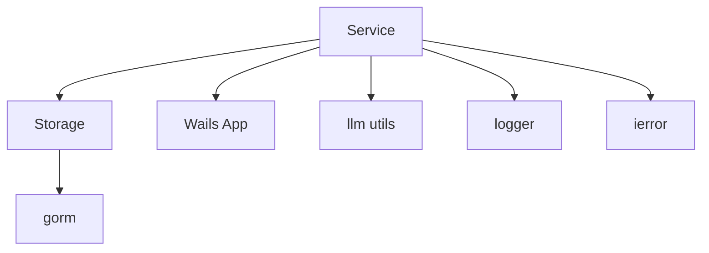

# 服务层

<cite>
**本文档引用的文件**  
- [service.go](file://backend/service/service.go)
- [chat.go](file://backend/service/chat.go)
- [provider.go](file://backend/service/provider.go)
- [settings.go](file://backend/service/settings.go)
- [main.go](file://main.go)
- [useModels.ts](file://frontend/src/hooks/useModels.ts)
</cite>

## 目录
1. [简介](#简介)
2. [项目结构](#项目结构)
3. [核心组件](#核心组件)
4. [架构概览](#架构概览)
5. [详细组件分析](#详细组件分析)
6. [依赖分析](#依赖分析)
7. [性能考虑](#性能考虑)
8. [故障排查指南](#故障排查指南)
9. [结论](#结论)

## 简介
本文档全面解析 `backend/service` 目录下的业务逻辑实现，重点阐述服务层的依赖注入机制、初始化流程、核心功能模块（聊天会话、模型提供方、配置服务）的实现逻辑，并结合 Wails 框架的服务生命周期管理机制进行分析。同时提供前端调用示例与常见问题排查指引。

## 项目结构
`backend/service` 是整个应用的核心业务逻辑层，负责协调数据存储、外部 API 调用和前端交互。该目录包含多个 Go 文件，分别实现不同的服务功能。



**Diagram sources**
- [service.go](file://backend/service/service.go#L1-L30)
- [chat.go](file://backend/service/chat.go#L1-L208)
- [provider.go](file://backend/service/provider.go#L1-L146)
- [settings.go](file://backend/service/settings.go#L1-L24)

**Section sources**
- [service.go](file://backend/service/service.go#L1-L30)
- [chat.go](file://backend/service/chat.go#L1-L208)
- [provider.go](file://backend/service/provider.go#L1-L146)
- [settings.go](file://backend/service/settings.go#L1-L24)

## 核心组件
`Service` 结构体是所有业务逻辑的统一入口，通过依赖注入的方式持有 `storage.Storage` 实例和 `application.App` 应用上下文，实现了高内聚低耦合的设计。

**Section sources**
- [service.go](file://backend/service/service.go#L5-L10)

## 架构概览
系统采用分层架构，前端通过 Wails 绑定调用后端服务方法，服务层处理业务逻辑并调用存储层进行数据持久化。



**Diagram sources**
- [main.go](file://main.go#L1-L60)
- [useModels.ts](file://frontend/src/hooks/useModels.ts#L1-L151)

## 详细组件分析

### 服务结构体与依赖注入
`Service` 结构体通过字段 `storage *storage.Storage` 和 `app *application.App` 实现依赖注入。`NewService()` 工厂函数创建服务实例，而 `ServiceStartup()` 方法在服务启动时由 Wails 框架调用，完成存储实例的初始化和应用上下文的获取。



**Diagram sources**
- [service.go](file://backend/service/service.go#L5-L30)

**Section sources**
- [service.go](file://backend/service/service.go#L5-L30)

### 聊天会话管理
`chat.go` 文件实现了聊天会话的核心功能，包括会话列表、消息获取、流式对话、会话删除与重命名等。

#### 聊天会话服务调用时序图
```mermaid
sequenceDiagram
participant Frontend as 前端
participant Service as Service.Completions()
participant Storage as Storage
participant LLM as 外部LLM API
participant Event as 事件总线
Frontend->>Service : Completions(chatUuid, model, message)
Service->>Storage : GetProviderModel(model)
alt 模型不存在
Service-->>Frontend : 返回错误
return
end
alt 新建会话
Service->>Storage : CreateChat(chatUuid, title, modelId)
end
Service->>Storage : GetMessage(chatUuid, 0, 10)
Service->>Storage : CreateMessage(chatUuid, userMessage)
Service->>LLM : provider.Completions(history + message)
LLM-->>Service : 流式返回消息
Service->>Service : 启动goroutine处理流
loop 处理每条消息
Service->>Storage : SaveOrUpdateDeltaMessage()
Service->>Event : Emit(eventsKey, message)
end
Service-->>Frontend : 返回ChatUuid和MessageUuid
```

**Diagram sources**
- [chat.go](file://backend/service/chat.go#L50-L200)

**Section sources**
- [chat.go](file://backend/service/chat.go#L1-L208)

### 模型提供方处理
`provider.go` 文件负责管理模型提供方（如 OpenAI、Anthropic 等）的增删改查以及模型列表的同步。



**Diagram sources**
- [provider.go](file://backend/service/provider.go#L30-L145)

**Section sources**
- [provider.go](file://backend/service/provider.go#L1-L146)

### 配置服务
`settings.go` 文件实现了配置窗口的打开功能，通过 `app.Window.NewWithOptions` 创建新的 Webview 窗口。



**Diagram sources**
- [settings.go](file://backend/service/settings.go#L3-L23)

**Section sources**
- [settings.go](file://backend/service/settings.go#L1-L24)

## 依赖分析
服务层依赖于存储层和 Wails 框架的应用上下文，同时通过 `llm` 工具包与外部 LLM API 交互。



**Diagram sources**
- [go.mod](file://go.mod#L1-L20)
- [service.go](file://backend/service/service.go#L1-L10)

**Section sources**
- [service.go](file://backend/service/service.go#L1-L10)

## 性能考虑
- **流式响应**：`Completions` 方法采用流式处理，通过 goroutine 和 channel 实现非阻塞通信，避免长时间等待。
- **事件驱动**：使用 `app.Event.Emit` 将流式消息实时推送到前端，提升用户体验。
- **事务处理**：在更新模型列表时使用数据库事务，确保数据一致性。
- **错误处理**：统一使用 `ierror` 包进行错误包装和处理，便于前端识别和展示。

## 故障排查指南

### 常见问题
| 问题现象 | 可能原因 | 解决方案 |
|--------|--------|--------|
| 无法获取模型列表 | 提供方 API Key 无效或网络不通 | 检查提供方配置，测试 API 连通性 |
| 聊天消息不显示 | 事件 key 生成错误或事件未正确监听 | 检查 `GenEventsKey` 和前端事件监听逻辑 |
| 新建会话失败 | 存储层创建会话异常 | 检查数据库连接和表结构 |
| 流式响应中断 | LLM API 流连接断开 | 检查网络稳定性，增加重试机制 |

### 接口签名列表
| 方法名 | 参数 | 返回值 | 说明 |
|------|------|------|------|
| `ChatList` | offset, limit, keyword, isCollection | *view_models.ChatList, error | 获取聊天列表 |
| `ChatMessages` | chatUuid, offset, limit | *view_models.MessageList, error | 获取聊天消息 |
| `Completions` | chatUuid, model, message | *view_models.Completions, error | 流式对话 |
| `GetProviders` | 无 | []view_models.Provider, error | 获取所有提供方 |
| `AddProvider` | provider | error | 添加提供方 |
| `GetProviderModels` | provider | []view_models.Model, error | 获取提供方模型 |

**Section sources**
- [chat.go](file://backend/service/chat.go#L1-L208)
- [provider.go](file://backend/service/provider.go#L1-L146)

## 结论
`backend/service` 层设计清晰，职责分明，通过 Wails 框架实现了前后端的高效通信。服务初始化、依赖注入、流式响应和事件驱动等机制共同构建了一个稳定可靠的业务逻辑层。前端通过 `useModels.ts` 等自定义 Hook 调用后端服务，形成了完整的应用闭环。