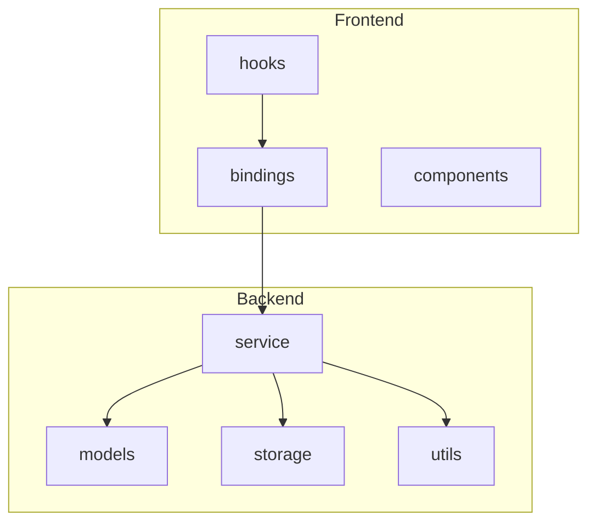
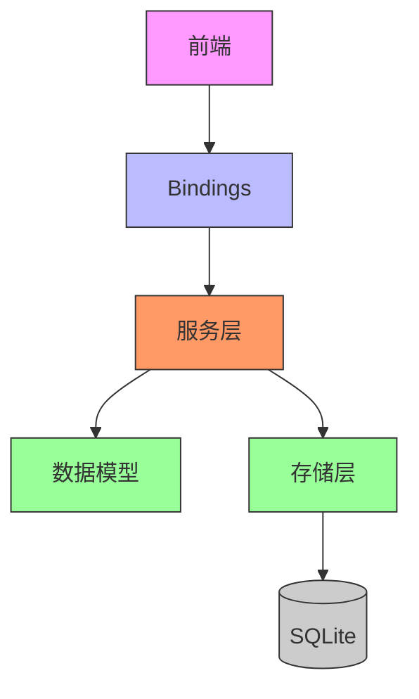
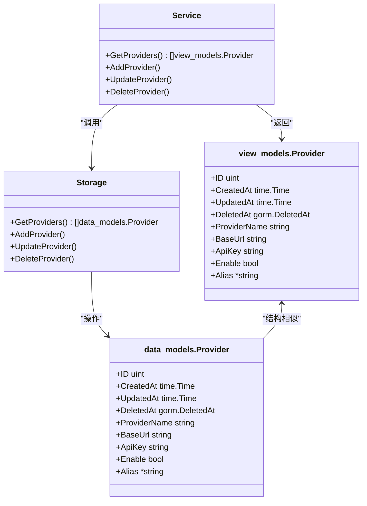
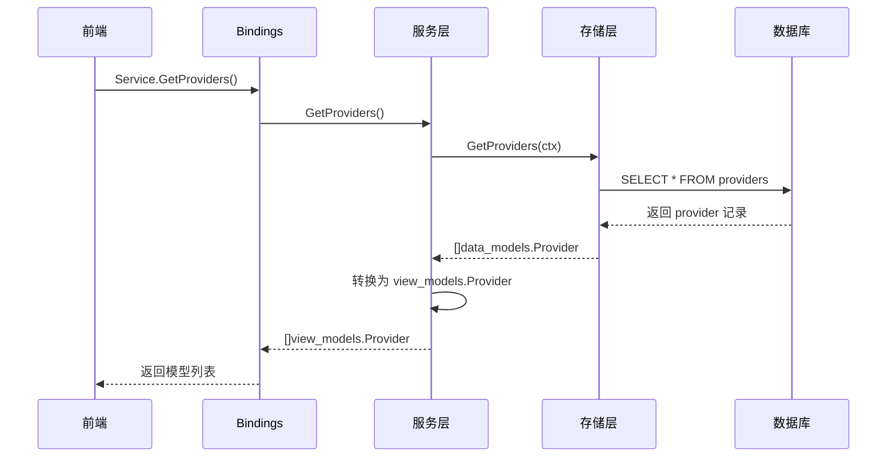
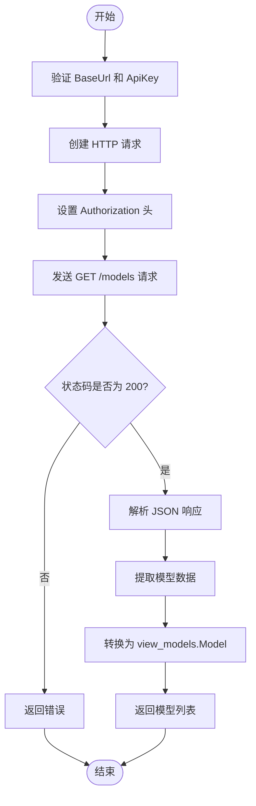
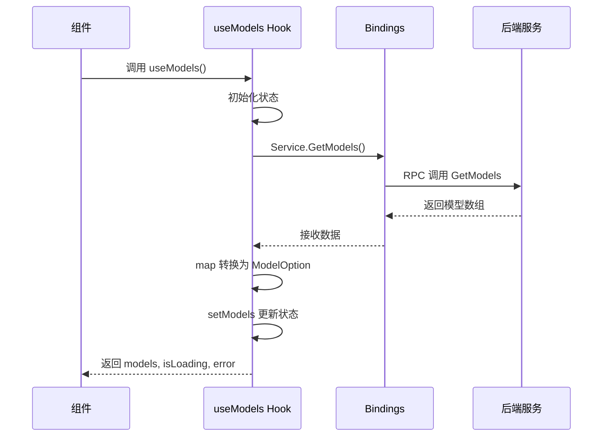
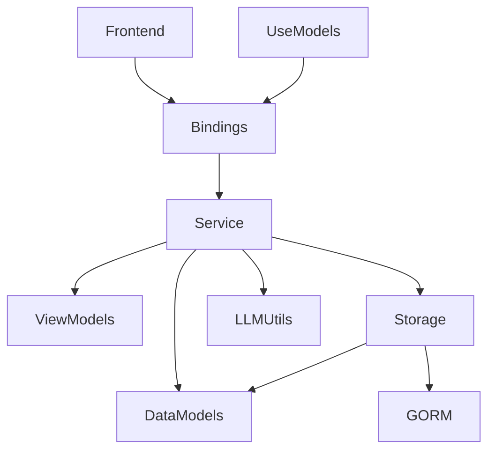

# 模型提供方服务

<cite>
**本文档引用的文件**
- [provider.go](file://backend/service/provider.go)
- [provider.go](file://backend/models/data_models/provider.go)
- [provider.go](file://backend/models/view_models/provider.go)
- [provider.go](file://backend/storage/provider.go)
- [models.go](file://backend/models/data_models/models.go)
- [models.go](file://backend/models/view_models/models.go)
- [models.go](file://backend/utils/llm/models.go)
- [models.go](file://backend/storage/models.go)
- [useModels.ts](file://frontend/src/hooks/useModels.ts)
- [index.ts](file://frontend/bindings/gitlab.linhf.cn/project/lemontea/lemon_tea_desktop/backend/service/index.ts)
</cite>

## 目录
1. [简介](#简介)
2. [项目结构](#项目结构)
3. [核心组件](#核心组件)
4. [架构概览](#架构概览)
5. [详细组件分析](#详细组件分析)
6. [依赖分析](#依赖分析)
7. [性能考虑](#性能考虑)
8. [故障排除指南](#故障排除指南)
9. [结论](#结论)

## 简介
本文档全面阐述了模型提供方管理功能的实现细节，重点描述了 `GetProviders` 方法如何从数据库加载可用 AI 服务商配置，以及 `GetModelsByProvider` 如何根据提供方类型动态获取模型列表。文档还解释了 `view_models` 与 `data_models` 之间的转换逻辑，服务层如何封装底层数据结构以适配前端需求，结合 bindings 生成机制说明前端 `useModels.ts` 如何安全调用这些 API。此外，文档涵盖提供方注册流程、认证信息处理、模型元数据结构定义，并提供扩展新提供方（如添加自定义 LLM 接口）的开发指引。

## 项目结构
项目采用分层架构设计，分为前端和后端两大模块。后端包含模型定义、服务逻辑、数据存储和工具函数；前端则通过 bindings 与后端交互，使用 React Hooks 管理状态。

**图示来源**
- [provider.go](file://backend/service/provider.go#L1-L145)
- [models.go](file://backend/models/data_models/models.go#L1-L11)
- [useModels.ts](file://frontend/src/hooks/useModels.ts#L1-L150)

**本节来源**
- [provider.go](file://backend/service/provider.go#L1-L145)
- [models.go](file://backend/models/data_models/models.go#L1-L11)

## 核心组件
核心组件包括提供方和服务模型的数据结构定义、服务层逻辑处理、存储层数据库操作以及前端 Hook 封装。`GetProviders` 和 `GetProviderModels` 是关键服务方法，负责从数据库加载提供方配置并动态获取模型列表。

**本节来源**
- [provider.go](file://backend/service/provider.go#L1-L145)
- [models.go](file://backend/models/view_models/models.go#L1-L22)

## 架构概览
系统采用典型的三层架构：表现层（前端）、业务逻辑层（服务层）和数据访问层（存储层）。前端通过自动生成的 bindings 调用后端服务，服务层协调数据模型转换和业务逻辑，存储层负责与 SQLite 数据库交互。

**图示来源**
- [provider.go](file://backend/service/provider.go#L1-L145)
- [models.go](file://backend/models/data_models/provider.go#L1-L10)
- [useModels.ts](file://frontend/src/hooks/useModels.ts#L1-L150)

## 详细组件分析

### 提供方服务分析
`GetProviders` 方法通过调用存储层的 `GetProviders` 函数从数据库中获取所有提供方记录，并将其从 `data_models.Provider` 转换为 `view_models.Provider` 返回给前端。该过程涉及 ORM 模型查询和数据结构映射。

#### 类图

**图示来源**
- [provider.go](file://backend/models/data_models/provider.go#L1-L10)
- [provider.go](file://backend/models/view_models/provider.go#L1-L21)
- [provider.go](file://backend/service/provider.go#L1-L145)
- [provider.go](file://backend/storage/provider.go#L1-L49)

#### 获取提供方序列图

**图示来源**
- [provider.go](file://backend/service/provider.go#L1-L145)
- [provider.go](file://backend/storage/provider.go#L1-L49)

### 模型获取分析
`GetProviderModels` 方法利用 `utils/llm.GetModels` 向指定提供方的基础 URL 发起 HTTP 请求，获取其支持的模型列表。此过程包含认证头设置、响应解析和错误处理。

#### 模型获取流程图

**图示来源**
- [models.go](file://backend/utils/llm/models.go#L1-L58)
- [provider.go](file://backend/service/provider.go#L1-L145)

### 前端集成分析
前端通过 `useModels.ts` Hook 调用后端 `Service.GetModels()` API，自动获取模型列表并转换为前端可用格式。当后端无数据或出错时，使用默认模拟数据作为后备。

#### 前端调用序列图

**图示来源**
- [useModels.ts](file://frontend/src/hooks/useModels.ts#L1-L150)
- [index.ts](file://frontend/bindings/gitlab.linhf.cn/project/lemontea/lemon_tea_desktop/backend/service/index.ts#L1-L7)

**本节来源**
- [provider.go](file://backend/service/provider.go#L1-L145)
- [models.go](file://backend/utils/llm/models.go#L1-L58)
- [useModels.ts](file://frontend/src/hooks/useModels.ts#L1-L150)

## 依赖分析
系统各组件之间存在明确的依赖关系。服务层依赖于数据模型、存储层和工具函数；前端通过 bindings 依赖后端服务接口。GORM 作为 ORM 框架贯穿数据层。

**图示来源**
- [provider.go](file://backend/service/provider.go#L1-L145)
- [models.go](file://backend/models/data_models/models.go#L1-L11)
- [useModels.ts](file://frontend/src/hooks/useModels.ts#L1-L150)

**本节来源**
- [provider.go](file://backend/service/provider.go#L1-L145)
- [models.go](file://backend/models/data_models/models.go#L1-L11)

## 性能考虑
- `GetProviders` 使用单次数据库查询加载所有提供方，避免 N+1 查询问题。
- 模型列表缓存机制可通过 `updateProviderModel` 在添加/更新提供方时预加载，减少实时 API 调用延迟。
- 前端使用默认模拟数据作为后备，确保 UI 不因后端异常而阻塞渲染。

## 故障排除指南
- **无法获取模型列表**：检查提供方的 BaseUrl 和 ApiKey 是否正确，确认网络可达性。
- **数据库查询失败**：验证 SQLite 连接状态，检查表结构是否匹配 GORM 模型。
- **前端无响应**：确认 bindings 是否正确生成，检查 Wails 运行时是否正常启动。
- **认证失败**：确保 `Authorization: Bearer <token>` 头部正确设置，API Key 有效。

**本节来源**
- [provider.go](file://backend/service/provider.go#L1-L145)
- [models.go](file://backend/utils/llm/models.go#L1-L58)

## 结论
本系统实现了完整的模型提供方管理功能，通过清晰的分层架构和类型安全的数据转换，确保前后端高效协作。扩展新 LLM 提供方只需配置 BaseUrl 和 ApiKey，无需修改核心代码，具备良好的可维护性和扩展性。