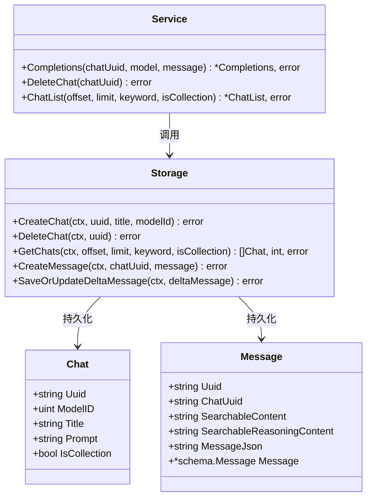
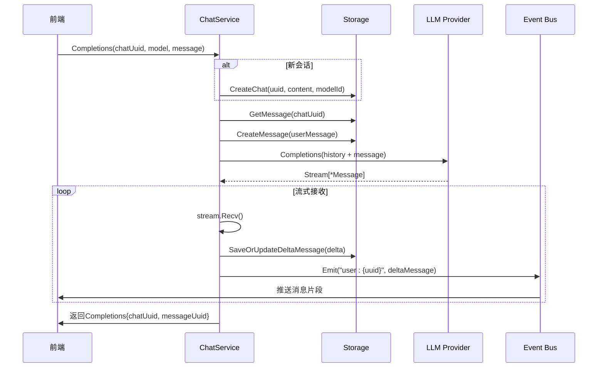
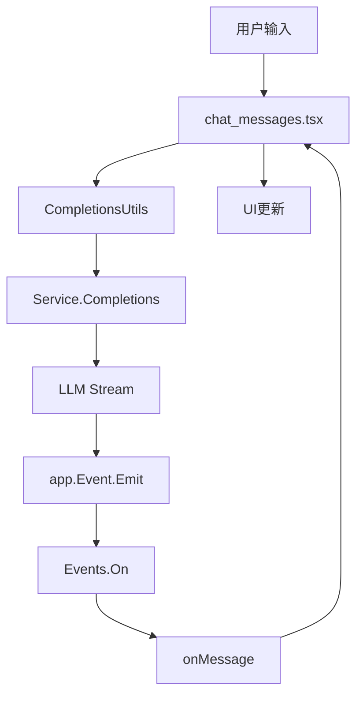
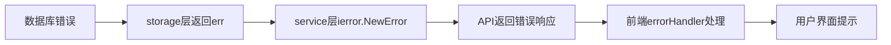

# 聊天服务

<cite>
**本文档引用文件**  
- [chat.go](file://backend/models/data_models/chat.go)
- [chat.go](file://backend/service/chat.go)
- [chat.go](file://backend/storage/chat.go)
- [chat_message.go](file://backend/storage/chat_message.go)
- [chat_messages.tsx](file://frontend/src/pages/home/chat/chat_messages.tsx)
- [completions.ts](file://frontend/src/utils/completions.ts)
- [common.go](file://backend/utils/llm/common.go)
- [events.go](file://backend/utils/events.go)
</cite>

## 目录
1. [简介](#简介)
2. [会话管理核心功能](#会话管理核心功能)
3. [数据库操作与GORM调用链路](#数据库操作与gorm调用链路)
4. [消息流式响应机制](#消息流式响应机制)
5. [前后端交互时序分析](#前后端交互时序分析)
6. [异常处理策略](#异常处理策略)
7. [常见问题排查方案](#常见问题排查方案)
8. [结论](#结论)

## 简介
本系统实现了完整的聊天会话管理功能，涵盖会话的创建、删除、重命名、收藏及消息流式响应等核心能力。系统采用分层架构设计，包含前端组件、业务服务层（service）、数据存储层（storage）以及模型层（data_models）。通过GORM进行SQLite数据库操作，结合事件机制实现后端到前端的实时消息推送。

**Section sources**
- [chat.go](file://backend/service/chat.go#L1-L208)
- [chat_messages.tsx](file://frontend/src/pages/home/chat/chat_messages.tsx#L1-L513)

## 会话管理核心功能

### 创建会话（CreateChat）
当用户发起新对话且未提供会话ID时，系统自动生成UUID并调用`storage.CreateChat`方法持久化会话记录。该方法接收会话标题、模型ID等参数，在数据库中插入新的聊天记录。

### 删除会话（DeleteChat）
通过`service.DeleteChat`方法调用`storage.DeleteChat`，根据传入的`chatUuid`执行软删除或硬删除操作。当前实现为硬删除，直接从数据库移除对应记录。

### 获取会话列表（GetChats）
支持分页查询、关键词搜索和收藏状态过滤。`storage.GetChats`构建动态查询条件，优先按收藏状态筛选，再根据关键词匹配标题字段，最终按更新时间倒序返回结果。

### 重命名与收藏
`RenameChat`用于修改会话标题，`CollectionChat`切换会话的收藏状态。后者使用`UpdateColumn`避免自动更新时间戳。

**Section sources**
- [chat.go](file://backend/service/chat.go#L100-L150)
- [chat.go](file://backend/storage/chat.go#L50-L110)

## 数据库操作与GORM调用链路

### GORM调用链分析
会话管理功能涉及以下GORM调用链路：
- **创建会话**：`service.CreateChat` → `storage.CreateChat` → `sqliteDB.Create()`
- **删除会话**：`service.DeleteChat` → `storage.DeleteChat` → `sqliteDB.Delete()`
- **查询会话**：`service.ChatList` → `storage.GetChats` → `sqliteDB.Model().Where().Find()`
- **消息存储**：`service.Completions` → `storage.CreateMessage` / `SaveOrUpdateDeltaMessage` → `sqliteDB.Create()` / `Updates()`

### 错误传播模式
所有数据库操作错误均通过`error`返回值逐层向上传递。业务层使用`ierror.NewError(err)`包装原始错误，确保错误信息结构化并携带上下文。前端最终接收标准化错误响应。

### 数据模型映射
`data_models.Message`结构体通过`AfterFind`钩子在查询后自动反序列化`MessageJson`字段为`schema.Message`对象；`BeforeSave`系列钩子则在保存前将`Message`对象序列化为JSON字符串。

**Diagram sources**
- [chat.go](file://backend/models/data_models/chat.go#L10-L30)
- [chat.go](file://backend/storage/chat.go#L1-L110)
- [chat.go](file://backend/service/chat.go#L1-L208)

**Section sources**
- [chat.go](file://backend/models/data_models/chat.go#L1-L63)
- [chat.go](file://backend/storage/chat.go#L1-L110)
- [chat_message.go](file://backend/storage/chat_message.go#L1-L73)

## 消息流式响应机制

### 实现原理
`Completions`方法实现流式AI响应：
1. 若`chatUuid`为空，则创建新会话
2. 加载历史消息构建上下文
3. 创建用户消息并持久化
4. 调用LLM提供商接口获取流式响应
5. 启动goroutine监听流数据，通过事件总线推送至前端

### 事件推送流程
- 后端生成唯一`messageUuid`，构造事件键`user:{messageUuid}`
- 使用`app.Event.Emit(eventsKey, data)`广播消息片段
- 前端通过`Events.On(GenEventsKey(uuid))`订阅对应事件
- 收到完成信号后自动卸载监听器

### 流控与容错
- 使用`msgChan`、`errChan`、`doneChan`三个channel协调流处理
- 主goroutine负责接收流数据并分发
- 辅助goroutine监听channel变化，执行增量更新与事件推送
- 异常情况下填充错误信息并终止流

**Diagram sources**
- [chat.go](file://backend/service/chat.go#L50-L100)
- [common.go](file://backend/utils/llm/common.go#L20-L45)
- [events.go](file://backend/utils/events.go#L5-L7)

**Section sources**
- [chat.go](file://backend/service/chat.go#L50-L100)
- [common.go](file://backend/utils/llm/common.go#L1-L45)
- [events.go](file://backend/utils/events.go#L1-L7)

## 前后端交互时序分析

### 完整调用链路
1. 用户输入消息，前端调用`CompletionsUtils`
2. 调用Wails绑定的`Service.Completions`方法
3. 后端创建会话/加载上下文，调用LLM流接口
4. 后端通过`app.Event.Emit`推送增量消息
5. 前端`completions.ts`监听事件，触发`onMessage`回调
6. `chat_messages.tsx`接收消息并更新UI

### 组件协作关系
`chat_messages.tsx`作为消息展示容器，接收`messages`数组并渲染。通过`useEffect`监听消息变化，结合`autoScrollBottom`实现智能滚动。`CompletionsUtils`封装事件订阅逻辑，提供统一的流处理接口。

**Diagram sources**
- [chat_messages.tsx](file://frontend/src/pages/home/chat/chat_messages.tsx#L1-L513)
- [completions.ts](file://frontend/src/utils/completions.ts#L1-L101)

**Section sources**
- [chat_messages.tsx](file://frontend/src/pages/home/chat/chat_messages.tsx#L1-L513)
- [completions.ts](file://frontend/src/utils/completions.ts#L1-L101)

## 异常处理策略

### 分层错误处理
- **存储层**：返回原始GORM错误（如`record not found`）
- **服务层**：使用`ierror.NewError(err)`包装，统一错误格式
- **前端层**：`errorHandler.ts`解析错误码，展示用户友好提示

### 关键异常场景
- **会话不存在**：`GetChats`返回空列表，前端显示“无会话”
- **LLM调用失败**：`Completions`返回错误，前端弹出通知
- **数据库连接异常**：所有存储操作失败，系统进入只读模式
- **事件监听失效**：前端设置超时重试机制，避免消息丢失

### 错误传播路径

**Section sources**
- [chat.go](file://backend/service/chat.go#L10-L208)
- [common.go](file://backend/utils/ierror/common.go#L1-L10)

## 常见问题排查方案

### 消息丢失
**可能原因**：
- 事件监听器未正确绑定
- `messageUuid`生成冲突
- 网络中断导致流中断

**排查步骤**：
1. 检查前端控制台是否报错`Events.On failed`
2. 验证后端`GenEventsKey`生成的键是否唯一
3. 查看LLM接口调用日志，确认流是否正常关闭
4. 检查`SaveOrUpdateDeltaMessage`是否成功写入数据库

### 会话加载失败
**可能原因**：
- 数据库查询条件错误
- `chatUuid`参数为空或格式不正确
- GORM预加载未生效

**排查步骤**：
1. 验证`GetChats`的`keyword`参数处理逻辑
2. 检查`is_collection`字段查询条件
3. 确认`sqliteDB.Model()`是否正确关联表
4. 查看SQL日志，确认生成的查询语句

### 流式响应卡顿
**优化建议**：
- 减少`SaveOrUpdateDeltaMessage`调用频率（批量更新）
- 前端增加防抖渲染，避免频繁重绘
- 后端限制单次推送字符数，平滑流量

**Section sources**
- [chat.go](file://backend/storage/chat.go#L1-L110)
- [chat_message.go](file://backend/storage/chat_message.go#L1-L73)
- [chat_messages.tsx](file://frontend/src/pages/home/chat/chat_messages.tsx#L1-L513)

## 结论
本系统通过清晰的分层架构实现了稳定的聊天会话管理功能。核心亮点在于流式响应机制与事件驱动的前后端通信模式。建议后续增强错误重试机制，优化数据库索引策略，并增加会话状态持久化能力以提升用户体验。