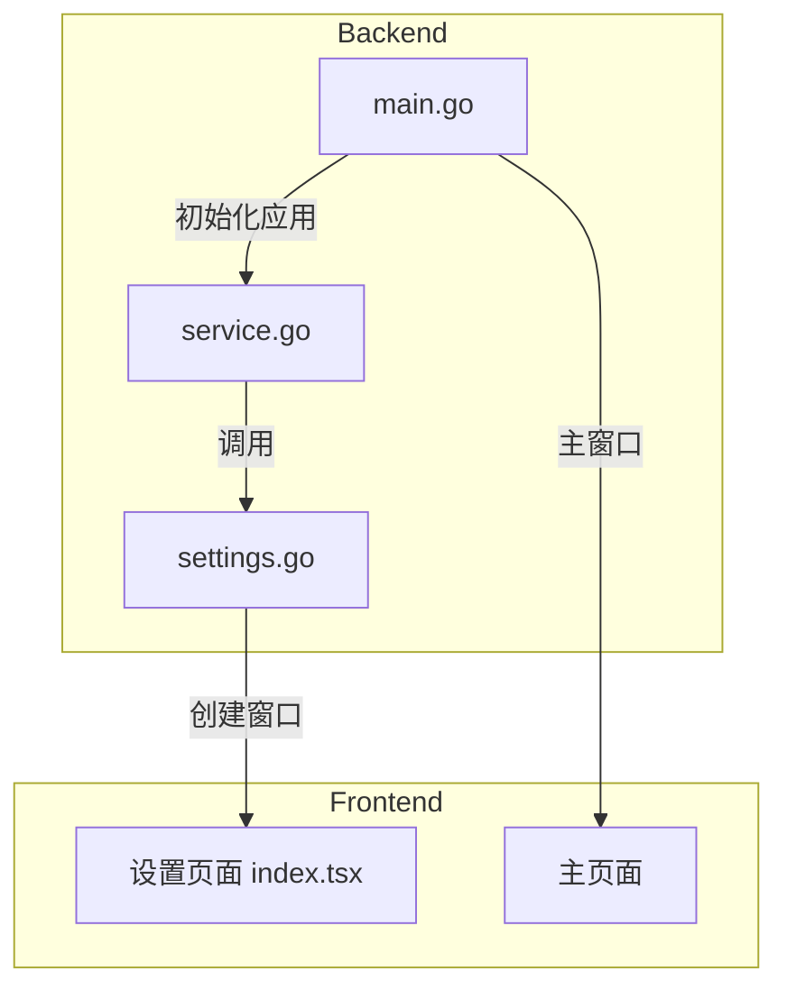
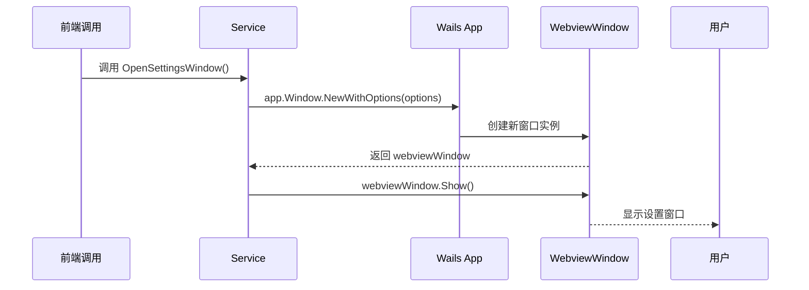
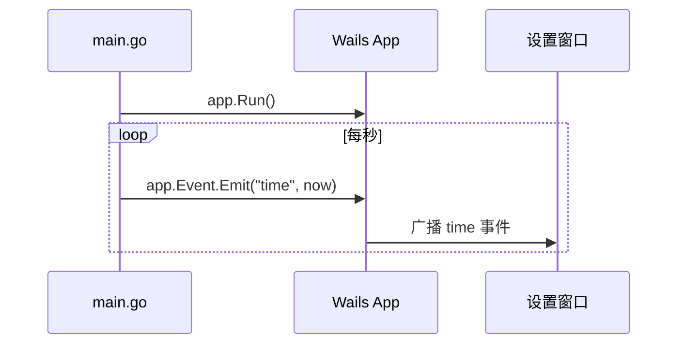
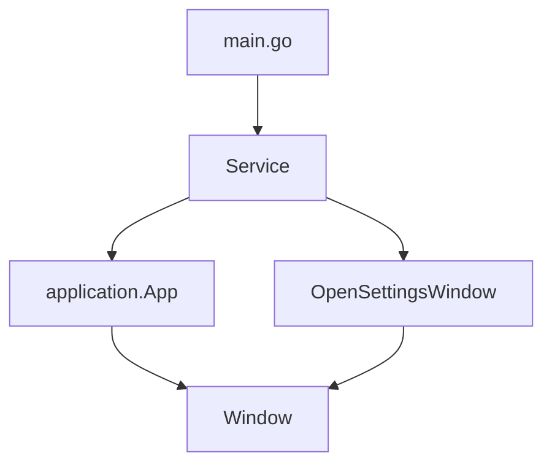

# 设置服务

<cite>
**本文档引用的文件**
- [settings.go](file://backend/service/settings.go#L1-L23)
- [service.go](file://backend/service/service.go#L1-L30)
- [main.go](file://main.go#L1-L59)
- [index.tsx](file://frontend/src/pages/settings/index.tsx#L1-L98)
</cite>

## 目录
1. [简介](#简介)
2. [项目结构](#项目结构)
3. [核心组件](#核心组件)
4. [架构概览](#架构概览)
5. [详细组件分析](#详细组件分析)
6. [依赖分析](#依赖分析)
7. [性能考虑](#性能考虑)
8. [故障排除指南](#故障排除指南)
9. [结论](#结论)

## 简介
本文档详细解析基于 Wails 框架的桌面应用中设置窗口的实现机制。重点分析 `OpenSettingsWindow` 方法如何通过 Wails API 创建独立的设置窗口，涵盖 URL 路由绑定、窗口配置、跨窗口通信、安全策略及与主应用的协同关系。同时说明未来配置持久化的扩展方向。

## 项目结构
本项目采用前后端分离架构，后端使用 Go 语言结合 Wails 框架实现原生桌面功能，前端使用 React + TypeScript 构建用户界面。主要目录包括：
- `backend/`: 后端服务逻辑，包含模型、服务、存储等模块
- `frontend/`: 前端 UI 实现，使用 Vite + React + Ant Design
- `main.go`: 应用入口，初始化 Wails 应用并注册服务

**Section sources**
- [main.go](file://main.go#L1-L59)

## 核心组件
`OpenSettingsWindow` 是设置功能的核心方法，定义于 `settings.go` 中，属于 `Service` 结构体的方法。该方法通过 Wails API 动态创建一个独立的设置窗口，实现与主窗口隔离的配置管理界面。

**Section sources**
- [settings.go](file://backend/service/settings.go#L1-L23)
- [service.go](file://backend/service/service.go#L1-L30)

## 架构概览
系统采用模块化设计，通过 Wails 框架桥接 Go 后端与前端 JavaScript。主窗口在启动时创建，设置窗口按需动态生成，两者共享同一应用实例但拥有独立生命周期。

**Diagram sources**
- [main.go](file://main.go#L1-L59)
- [settings.go](file://backend/service/settings.go#L1-L23)
- [index.tsx](file://frontend/src/pages/settings/index.tsx#L1-L98)

## 详细组件分析

### OpenSettingsWindow 方法分析
该方法通过 `s.app.Window.NewWithOptions` 创建一个新的 Webview 窗口，配置如下关键参数：

- **名称与标题**: 窗口名称和显示标题均为 "Settings"
- **URL 路由**: 绑定至 `/settings`，对应前端路由
- **尺寸配置**: 宽度 800px，高度 700px，最小尺寸限制为 350x550
- **视觉样式**: 深色背景（RGB: 27,38,54），Mac 平台启用透明背景和默认标题栏
- **行为特性**: 窗口始终置顶（AlwaysOnTop）

创建后立即调用 `Show()` 显示窗口。

#### 窗口创建流程时序图

**Diagram sources**
- [settings.go](file://backend/service/settings.go#L1-L23)

### 与主应用初始化的协同关系
`OpenSettingsWindow` 依赖于在 `ServiceStartup` 阶段注入的 `app` 实例。`main.go` 中通过 `application.NewService(service.NewService())` 注册服务，Wails 框架在启动时自动调用 `ServiceStartup`，其中通过 `application.Get()` 获取全局应用实例并赋值给 `s.app`，为后续窗口创建提供基础。

#### 事件监听与生命周期管理
主应用在 `main.go` 中通过 goroutine 定期触发 `"time"` 事件，展示跨窗口事件广播能力。设置窗口可监听此类全局事件实现动态更新，体现 Wails 的跨窗口通信机制。

**Diagram sources**
- [main.go](file://main.go#L49)
- [settings.go](file://backend/service/settings.go#L1-L23)

### 安全策略与设计考量
- **防止重复打开**: 当前实现未内置防重逻辑，可通过在 `Service` 中维护窗口引用并检查是否存在来扩展
- **前后端资源隔离**: 设置窗口与主窗口共享同一前端资源包，通过不同 URL 路由加载不同页面，实现逻辑隔离
- **跨平台一致性**: 配置中包含 `Mac` 特定选项，确保在 macOS 上获得原生视觉体验

**Section sources**
- [settings.go](file://backend/service/settings.go#L1-L23)
- [main.go](file://main.go#L1-L59)

### 前端调用示例与异常处理
前端可通过绑定的服务方法调用 `OpenSettingsWindow`。建议的异常处理模式包括：
- 检查窗口创建返回值，处理可能的初始化错误
- 使用 `defer` 或生命周期钩子管理窗口资源
- 监听窗口关闭事件进行清理

当前代码未显式处理创建失败情况，建议增强错误捕获机制。

**Section sources**
- [index.tsx](file://frontend/src/pages/settings/index.tsx#L1-L98)

### 未来配置持久化扩展方向
- **本地存储集成**: 利用 `backend/storage` 模块实现设置数据的持久化
- **配置文件管理**: 支持 JSON/YAML 配置文件读写
- **同步机制**: 实现多设备间设置同步
- **热更新**: 修改设置后无需重启即可生效

## 依赖分析
系统核心依赖关系清晰，`Service` 作为中枢连接应用实例与具体功能。设置功能依赖 Wails 应用实例，通过服务注册机制与主流程集成。

**Diagram sources**
- [service.go](file://backend/service/service.go#L1-L30)
- [settings.go](file://backend/service/settings.go#L1-L23)

## 性能考虑
- **按需创建**: 设置窗口仅在需要时创建，减少内存占用
- **资源复用**: 共享前端资源包，避免重复加载
- **轻量通信**: 使用事件系统进行跨窗口通信，开销低

## 故障排除指南
- **窗口无法显示**: 检查 URL 路由 `/settings` 是否在前端正确配置
- **样式异常**: 确认前端构建产物已正确嵌入
- **方法调用失败**: 确保 `ServiceStartup` 已正确执行并注入 `app` 实例

**Section sources**
- [settings.go](file://backend/service/settings.go#L1-L23)
- [main.go](file://main.go#L1-L59)

## 结论
`OpenSettingsWindow` 方法展示了 Wails 框架强大的多窗口管理能力，通过简洁的 API 实现了功能完整的设置窗口。其设计体现了模块化、可扩展的特点，为后续功能增强（如配置持久化、安全增强）提供了良好基础。建议补充窗口状态管理和错误处理机制以提升健壮性。