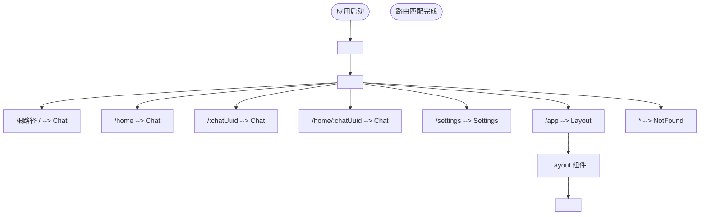
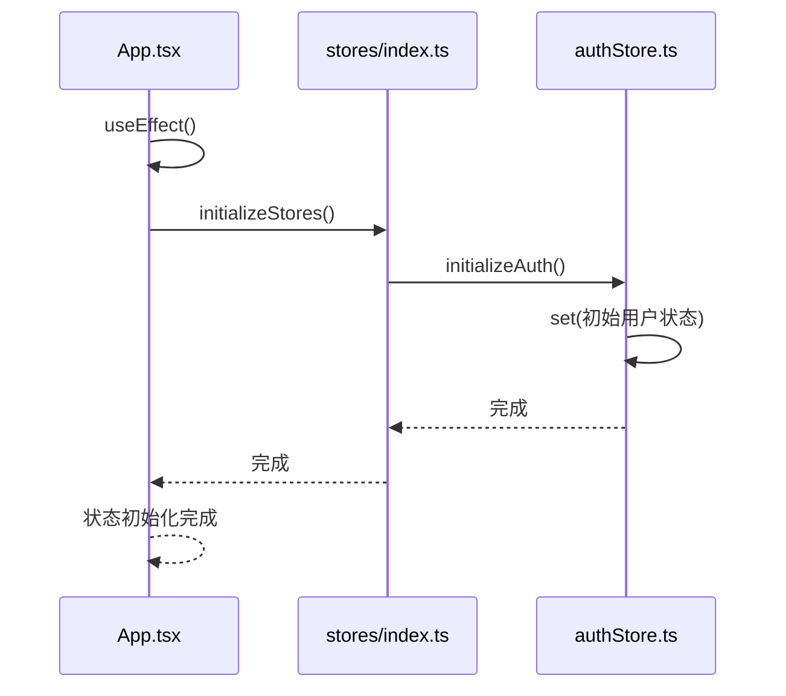
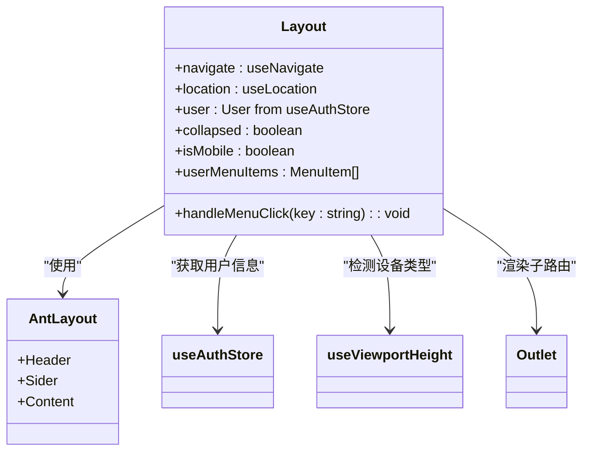

# 前端入口解析

<cite>
**本文档引用的文件**  
- [App.tsx](file://frontend/src/App.tsx)
- [service.ts](file://frontend/bindings/gitlab.linhf.cn/project/lemontea/lemon_tea_desktop/backend/service/service.ts)
- [index.ts](file://frontend/src/stores/index.ts)
- [authStore.ts](file://frontend/src/stores/authStore.ts)
- [Layout/index.tsx](file://frontend/src/components/Layout/index.tsx)
- [useViewportHeight.ts](file://frontend/src/hooks/useViewportHeight.ts)
</cite>

## 目录
1. [简介](#简介)
2. [项目结构](#项目结构)
3. [核心组件](#核心组件)
4. [架构概览](#架构概览)
5. [详细组件分析](#详细组件分析)
6. [依赖分析](#依赖分析)
7. [性能考虑](#性能考虑)
8. [故障排除指南](#故障排除指南)
9. [结论](#结论)

## 简介
本文档深入解析 `App.tsx` 作为前端应用入口的核心职责，涵盖 React 应用的路由系统设计、懒加载机制、全局状态初始化、布局结构以及前后端通信机制。重点分析如何通过 `React.Suspense` 与 `lazy()` 实现组件的懒加载，提升初始渲染性能，并阐述 Wails 框架如何自动生成类型安全的 TypeScript 绑定，实现前后端无缝通信。

## 项目结构
项目采用典型的前后端分离架构，前端位于 `frontend` 目录，后端位于 `backend` 目录。前端使用 Vite + React + TypeScript 技术栈，通过 `@wailsio/runtime` 与 Go 后端进行通信。`bindings` 目录存放由 Wails 自动生成的前后端接口绑定代码，`src` 目录包含核心业务逻辑，包括组件、页面、状态管理（Zustand）和工具函数。

**Section sources**
- [App.tsx](file://frontend/src/App.tsx#L1-L86)
- [vite.config.ts](file://frontend/vite.config.ts#L1-L16)

## 核心组件

`App.tsx` 是整个前端应用的根组件，承担着路由配置、状态初始化、全局加载状态管理等核心职责。它通过 `React.Suspense` 包裹整个路由系统，为所有懒加载组件提供统一的加载反馈（Spin 组件），并通过 `useEffect` 在组件挂载时调用 `initializeStores()` 完成 Zustand 状态的初始化。

**Section sources**
- [App.tsx](file://frontend/src/App.tsx#L1-L86)

## 架构概览

```mermaid
graph TB
App[App.tsx] --> Suspense[React.Suspense]
Suspense --> Routes[react-router-dom Routes]
Routes --> HomeRoute[/ | /home]
Routes --> ChatUuidRoute[/:chatUuid | /home/:chatUuid]
Routes --> SettingsRoute[/settings]
Routes --> AppRoute[/app]
Routes --> NotFoundRoute[*]
App --> Layout[Layout 组件]
App --> initializeStores[initializeStores()]
initializeStores --> authStore[authStore]
App --> useViewportHeight[useViewportHeight Hook]
App --> Chat[懒加载: Chat]
App --> Settings[懒加载: Settings]
App --> NotFound[懒加载: NotFound]
```

**Diagram sources**
- [App.tsx](file://frontend/src/App.tsx#L1-L86)
- [Layout/index.tsx](file://frontend/src/components/Layout/index.tsx#L1-L119)

## 详细组件分析

### App 组件分析

`App` 组件是应用的入口点，其核心功能包括：

#### 路由系统设计


**Diagram sources**
- [App.tsx](file://frontend/src/App.tsx#L1-L86)

#### 懒加载与全局加载状态
`App` 组件利用 `React.lazy()` 动态导入 `Chat`、`Settings` 和 `NotFound` 组件，结合 `React.Suspense` 提供统一的加载占位符。全局 `fallback` 使用 `Spin` 组件，居中显示“页面加载中...”提示，提升用户体验。

**Section sources**
- [App.tsx](file://frontend/src/App.tsx#L1-L86)

#### Zustand 状态初始化


**Diagram sources**
- [App.tsx](file://frontend/src/App.tsx#L1-L86)
- [index.ts](file://frontend/src/stores/index.ts#L1-L16)
- [authStore.ts](file://frontend/src/stores/authStore.ts#L1-L60)

`App` 组件在 `useEffect` 中调用 `initializeStores()` 函数，该函数位于 `stores/index.ts`。`initializeStores()` 的作用是初始化应用所需的所有全局状态。当前项目中，它仅调用 `initializeAuth()` 来设置认证状态。`initializeAuth()` 函数在 `authStore.ts` 中定义，它会将 Zustand store 的初始状态设置为一个预设的“demo”用户，实现本地免登录体验。

**Section sources**
- [App.tsx](file://frontend/src/App.tsx#L1-L86)
- [index.ts](file://frontend/src/stores/index.ts#L1-L16)
- [authStore.ts](file://frontend/src/stores/authStore.ts#L1-L60)

### Layout 组件分析

`Layout` 组件为 `/app` 路径下的子路由（如 `/app/profile`, `/app/settings`）提供统一的布局框架，包含侧边栏、顶部导航栏和内容区域。



**Diagram sources**
- [Layout/index.tsx](file://frontend/src/components/Layout/index.tsx#L1-L119)

该组件使用 Ant Design 的 `Layout` 组件构建基础结构，左侧为可折叠的 `Sider`，右侧为包含 `Header` 和 `Content` 的主区域。`Header` 中包含一个用户信息下拉菜单，`Sider` 中包含导航菜单项。`useViewportHeight` Hook 用于检测当前是否为移动设备，以应用不同的样式。

**Section sources**
- [Layout/index.tsx](file://frontend/src/components/Layout/index.tsx#L1-L119)
- [useViewportHeight.ts](file://frontend/src/hooks/useViewportHeight.ts#L1-L36)

## 依赖分析

```mermaid
graph LR
App --> React
App --> react-router-dom
App --> antd
App --> Layout
App --> stores
App --> hooks
App --> pages
stores --> zustand
bindings --> "@wailsio/runtime"
bindings --> backend
backend --> Go
```

**Diagram sources**
- [App.tsx](file://frontend/src/App.tsx#L1-L86)
- [service.ts](file://frontend/bindings/gitlab.linhf.cn/project/lemontea/lemon_tea_desktop/backend/service/service.ts#L1-L125)
- [go.mod](file://backend/go.mod)

## 性能考虑
通过 `React.lazy()` 和 `React.Suspense` 实现路由组件的代码分割和懒加载，有效减少了应用的初始包体积，加快了首屏渲染速度。全局加载状态提供了良好的用户体验反馈。

## 故障排除指南
若应用启动后白屏或加载状态不消失，应检查：
1. `App.tsx` 中 `React.lazy()` 导入的路径是否正确。
2. `initializeStores()` 函数内部是否存在阻塞或错误。
3. 网络环境是否导致模块加载超时。

**Section sources**
- [App.tsx](file://frontend/src/App.tsx#L1-L86)
- [index.ts](file://frontend/src/stores/index.ts#L1-L16)

## 结论
`App.tsx` 作为前端入口，成功整合了路由、状态管理、UI 布局和前后端通信等核心功能。其设计清晰，利用现代 React 特性优化了性能和用户体验。Wails 自动生成的 `bindings` 机制，为前后端提供了类型安全的通信桥梁，是项目架构的关键一环。