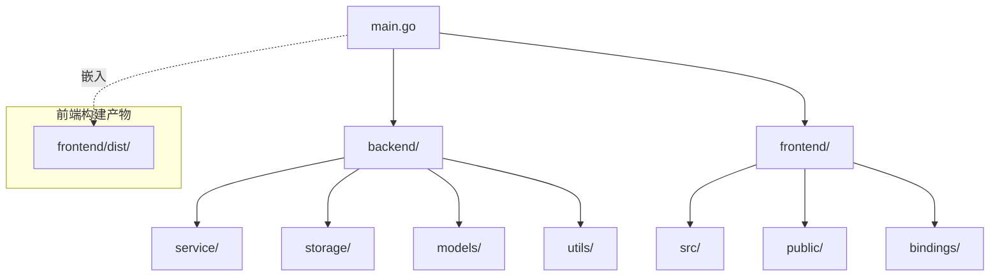
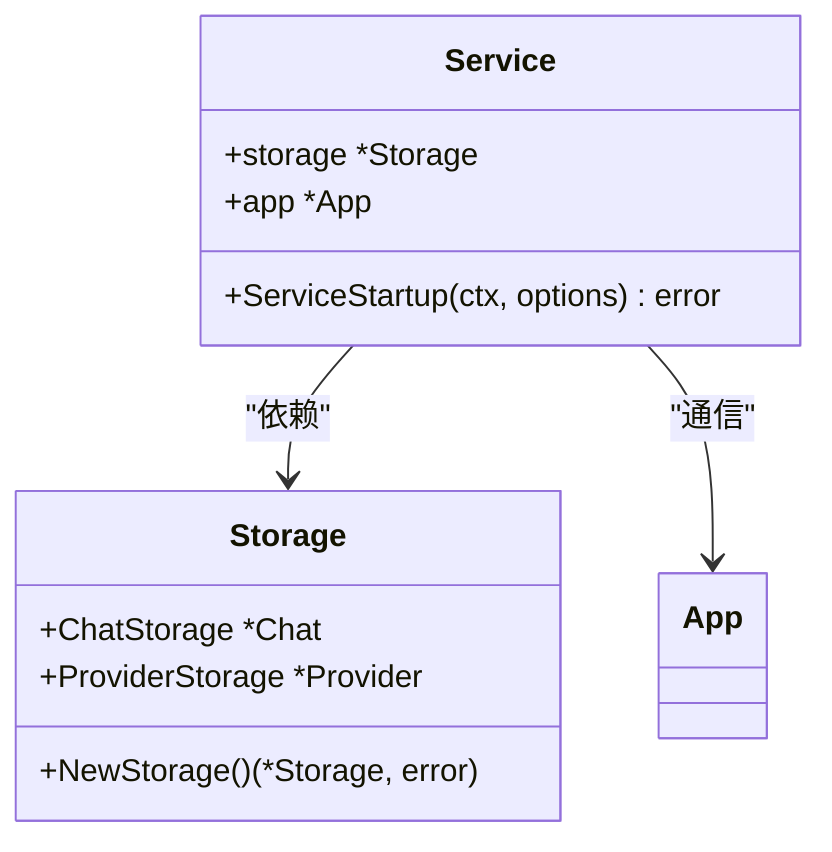
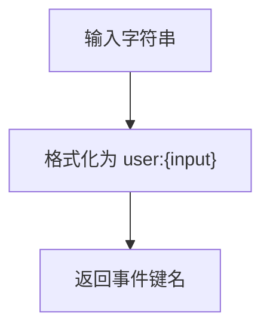
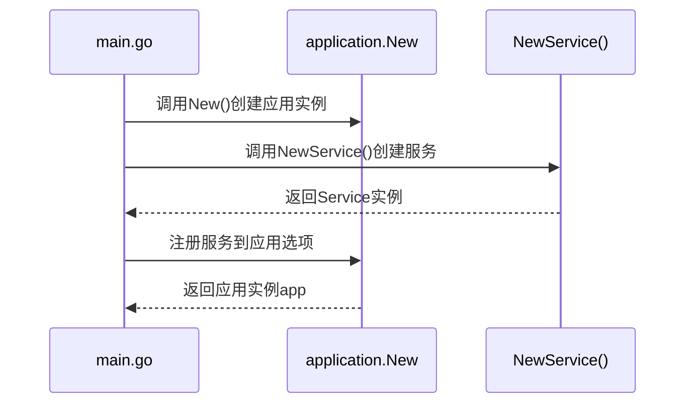
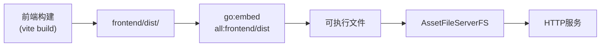
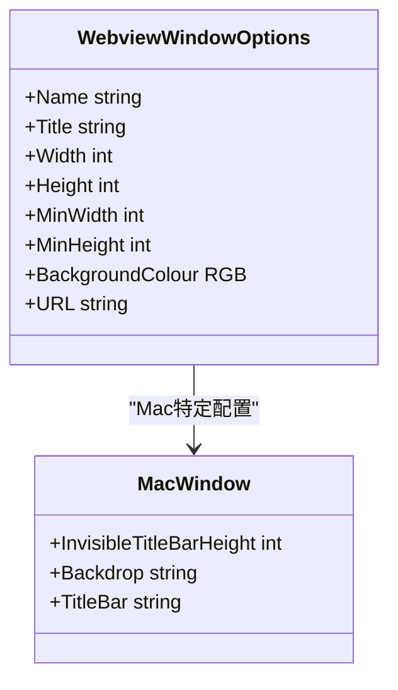
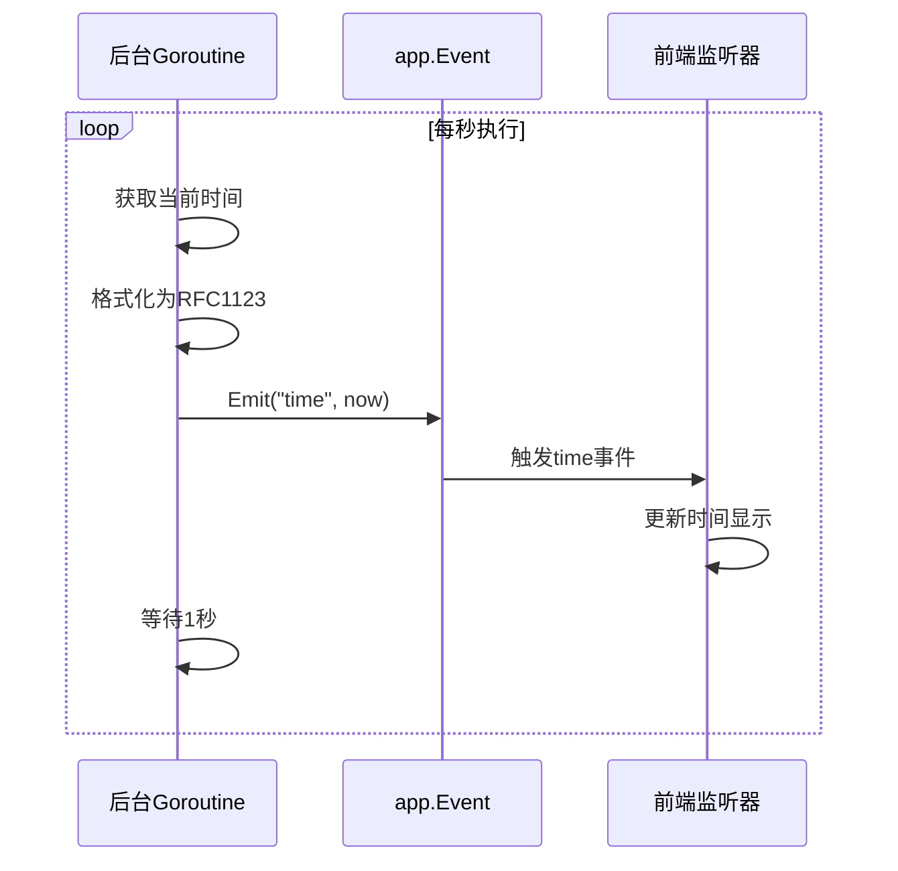
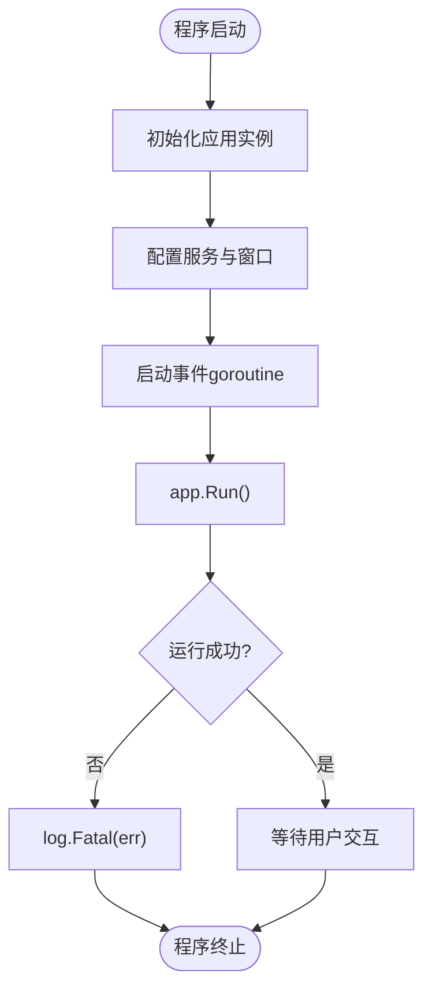

# 后端入口解析

<cite>
**本文档引用的文件**  
- [main.go](file://main.go)
- [backend/service/service.go](file://backend/service/service.go)
- [backend/utils/events.go](file://backend/utils/events.go)
- [frontend/src/utils/events.ts](file://frontend/src/utils/events.ts)
- [backend/models/view_models/models.go](file://backend/models/view_models/models.go)
</cite>

## 目录
1. [项目结构](#项目结构)
2. [核心组件分析](#核心组件分析)
3. [应用初始化流程](#应用初始化流程)
4. [前端资源嵌入机制](#前端资源嵌入机制)
5. [主窗口配置解析](#主窗口配置解析)
6. [事件通信机制](#事件通信机制)
7. [应用生命周期管理](#应用生命周期管理)

## 项目结构

本项目采用前后端分离的架构设计，后端使用Go语言开发，前端使用TypeScript构建。项目根目录包含核心入口文件`main.go`和前端资源目录`frontend`，后端逻辑封装在`backend`目录中，按功能划分为`models`、`service`、`storage`等模块。

**Diagram sources**
- [main.go](file://main.go#L1-L60)
- [backend/service/service.go](file://backend/service/service.go#L1-L31)

## 核心组件分析

### 应用服务组件

`backend/service/service.go`定义了核心服务结构体`Service`，该结构体通过`NewService()`工厂函数创建实例，并在`ServiceStartup`方法中完成依赖注入和初始化。服务组件持有对`storage.Storage`的引用，实现数据持久化能力，同时通过`application.Get()`获取应用实例，建立与前端的通信桥梁。

**Diagram sources**
- [backend/service/service.go](file://backend/service/service.go#L1-L31)
- [backend/storage/storage.go](file://backend/storage/storage.go#L1-L20)

**Section sources**
- [backend/service/service.go](file://backend/service/service.go#L1-L31)

### 事件工具组件

`backend/utils/events.go`提供了事件键名生成工具`GenEventsKey`，该函数将输入字符串转换为"用户事件"命名空间下的唯一标识符。此工具在前后端事件通信中保持命名一致性，确保事件订阅与发布的正确匹配。

**Diagram sources**
- [backend/utils/events.go](file://backend/utils/events.go#L1-L8)
- [frontend/src/utils/events.ts](file://frontend/src/utils/events.ts#L1-L3)

**Section sources**
- [backend/utils/events.go](file://backend/utils/events.go#L1-L8)

## 应用初始化流程

应用通过`application.New()`创建Wails应用实例，该函数接收`application.Options`结构体作为配置参数。核心配置包括应用元信息（名称、描述）、服务注册和资源管理。`NewService()`函数返回的服务实例被包装为`application.Service`类型并注册到应用中，使其方法可通过RPC被前端调用。

**Diagram sources**
- [main.go](file://main.go#L15-L25)
- [backend/service/service.go](file://backend/service/service.go#L10-L14)

**Section sources**
- [main.go](file://main.go#L15-L30)
- [backend/service/service.go](file://backend/service/service.go#L10-L14)

## 前端资源嵌入机制

通过Go语言的`//go:embed all:frontend/dist`指令，将前端构建产物完整嵌入二进制文件。`embed.FS`类型的`assets`变量作为虚拟文件系统，由`application.AssetFileServerFS(assets)`转换为HTTP文件服务处理器。这种机制实现了单文件分发，无需额外部署前端资源。

**Diagram sources**
- [main.go](file://main.go#L10-L13)
- [vite.config.ts](file://frontend/vite.config.ts#L1-L20)

## 主窗口配置解析

应用通过`app.Window.NewWithOptions()`创建主窗口，配置参数包含窗口标识、标题、尺寸、背景色和初始URL。窗口命名为"Home"，尺寸设置为1300x860像素，最小尺寸限制为350x550像素。背景色使用`application.NewRGB(27, 38, 54)`配置为深蓝色调，初始加载URL为"/home"。

**Diagram sources**
- [main.go](file://main.go#L27-L43)

**Section sources**
- [main.go](file://main.go#L27-L43)

## 事件通信机制

后台goroutine通过无限循环每秒触发`time`事件，实现前后端实时通信。`time.Now().Format(time.RFC1123)`将当前时间格式化为标准字符串，通过`app.Event.Emit("time", now)`发布事件。前端通过事件监听器订阅`time`事件，实现时间显示更新。

**Diagram sources**
- [main.go](file://main.go#L47-L53)
- [frontend/src/utils/events.ts](file://frontend/src/utils/events.ts#L1-L3)

**Section sources**
- [main.go](file://main.go#L47-L53)

## 应用生命周期管理

应用生命周期从`main()`函数开始，经历初始化、配置、事件循环启动三个阶段。`app.Run()`方法启动事件循环，阻塞主线程直至应用终止。错误处理通过`if err != nil`判断`Run()`返回值，使用`log.Fatal(err)`记录致命错误并终止程序，确保异常情况下的优雅退出。

**Diagram sources**
- [main.go](file://main.go#L45-L58)

**Section sources**
- [main.go](file://main.go#L45-L58)