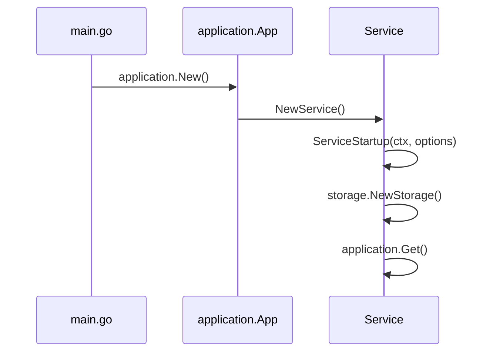
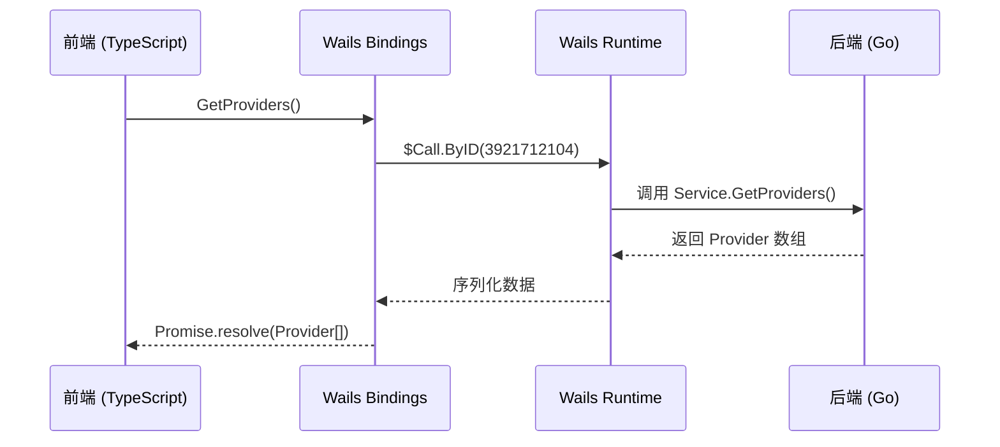

# 应用入口解析

<cite>
**本文档引用的文件**  
- [main.go](file://main.go)
- [App.tsx](file://frontend/src/App.tsx)
- [service.ts](file://frontend/bindings/gitlab.linhf.cn/project/lemontea/lemon_tea_desktop/backend/service/service.ts)
- [service.go](file://backend/service/service.go)
- [settings.go](file://backend/service/settings.go)
</cite>

## 目录
1. [项目入口机制概述](#项目入口机制概述)
2. [main.go 入口文件解析](#maingo-入口文件解析)
3. [App.tsx 前端入口解析](#apptsx-前端入口解析)
4. [前后端连接链路分析](#前后端连接链路分析)
5. [总结](#总结)

## 项目入口机制概述
本项目采用 Wails3 框架构建跨平台桌面应用，通过 Go 后端与 React 前端的深度集成实现高效交互。系统存在两大核心入口：Go 侧的 `main.go` 负责初始化应用实例、注册服务、配置资源与窗口；前端侧的 `App.tsx` 则负责路由管理、组件加载与状态初始化。两者通过自动生成的 TypeScript bindings 实现类型安全的 RPC 调用，构成完整的全栈架构。

## main.go 入口文件解析

### 应用初始化与服务注册
`main.go` 是整个应用的启动入口。通过 `application.New()` 创建 Wails 应用实例，传入配置选项完成初始化。其中，`Services` 字段注册了由 `backend/service.NewService()` 创建的服务实例，该服务将在运行时通过 `ServiceStartup` 方法注入 `application.App` 实例与存储层，实现对应用上下文和数据持久化的访问。



**Diagram sources**  
- [main.go](file://main.go#L15-L25)
- [service.go](file://backend/service/service.go#L15-L30)

### 嵌入式前端资源与主窗口配置
通过 `//go:embed all:frontend/dist` 指令将前端构建产物打包进二进制文件，形成 `assets` 变量。在 `application.Options.Assets.Handler` 中使用 `application.AssetFileServerFS(assets)` 将其注册为静态资源服务，实现前后端一体化部署。

主窗口通过 `app.Window.NewWithOptions()` 创建，配置了跨平台属性：
- **名称与标题**：设置为 "Home"
- **尺寸**：默认宽 1300px，高 860px，最小尺寸限制
- **背景色**：RGB(27, 38, 54)
- **URL**：初始加载 `/home` 路由
- **Mac 特有属性**：透明背景、默认标题栏、50px 隐藏标题栏高度

**Section sources**  
- [main.go](file://main.go#L30-L50)

### 定时事件发射机制
在独立 goroutine 中，通过无限循环每秒调用 `app.Event.Emit("time", now)` 向前端广播当前时间。该事件可用于前端时钟同步或心跳检测，体现了 Wails 的事件驱动通信能力。

```go
go func() {
    for {
        now := time.Now().Format(time.RFC1123)
        app.Event.Emit("time", now)
        time.Sleep(time.Second)
    }
}()
```

**Section sources**  
- [main.go](file://main.go#L52-L57)

## App.tsx 前端入口解析

### React 路由系统配置
`App.tsx` 使用 `react-router-dom` 定义路由规则，通过 `Routes` 和 `Route` 组件映射路径与页面组件：
- `/`, `/home`, `/:chatUuid`, `/home/:chatUuid` → `Chat` 页面
- `/settings` → `Settings` 页面
- `/simple-test`, `/env-test` → 测试页面
- `*` → `NotFound` 页面

```mermaid
flowchart TD
A[/] --> C[Chat]
B[/home] --> C
C1[/home/:chatUuid] --> C
C2[/:chatUuid] --> C
D[/settings] --> S[Settings]
E[/simple-test] --> T1[SimpleTest]
F[/env-test] --> T2[EnvTest]
G[*] --> N[NotFound]
```

**Diagram sources**  
- [App.tsx](file://frontend/src/App.tsx#L48-L85)

### 懒加载与性能优化
通过 `React.lazy()` 实现路由组件的懒加载：
```ts
const Chat = React.lazy(() => import('@/pages/home'));
const Settings = React.lazy(() => import('@/pages/settings'));
```
结合 `React.Suspense` 提供加载状态反馈（Spin 组件），有效减少初始包体积，提升首屏加载性能。

**Section sources**  
- [App.tsx](file://frontend/src/App.tsx#L10-L12)

### 布局与状态初始化
`Layout` 组件作为 `/app` 路由的容器，提供统一布局框架。`useEffect` 钩子在组件挂载后调用 `initializeStores()`，完成全局状态管理（如 authStore）的初始化，确保后续组件能访问到已配置的状态上下文。

```ts
useEffect(() => {
  initializeStores();
}, []);
```

**Section sources**  
- [App.tsx](file://frontend/src/App.tsx#L20-L23)

## 前后端连接链路分析

### TypeScript 类型安全调用
`frontend/bindings/gitlab.linhf.cn/project/lemontea/lemon_tea_desktop/backend/service/service.ts` 是由 Wails 自动生成的绑定文件，为 Go 服务方法提供类型安全的 TypeScript 接口。例如：

```ts
export function GetProviders(): $CancellablePromise<view_models$0.Provider[]> {
    return $Call.ByID(3921712104).then(($result: any) => {
        return $$createType9($result);
    });
}
```

该机制通过 `$Call.ByID` 映射到 Go 端注册的服务方法，返回 `CancellablePromise` 支持异步调用与取消，`$$createType9` 确保返回数据符合 `Provider[]` 类型定义。

### 完整调用链路
1. 前端调用 `service.GetProviders()`
2. bindings 调用 `$Call.ByID(3921712104)`
3. Wails 运行时通过方法 ID 路由到 Go 端 `Service.GetProviders()`
4. Go 方法执行并返回数据
5. 数据序列化后通过 IPC 传回前端
6. 前端反序列化并解析为 `Provider[]` 类型对象



**Diagram sources**  
- [service.ts](file://frontend/bindings/gitlab.linhf.cn/project/lemontea/lemon_tea_desktop/backend/service/service.ts#L70-L74)
- [service.go](file://backend/service/service.go)

## 总结
`main.go` 作为后端入口，完成了应用初始化、服务注册、资源嵌入、窗口创建与事件广播等核心职责，构建了应用的运行时基础。`App.tsx` 作为前端入口，通过 React 路由系统管理页面导航，利用懒加载优化性能，并通过 `useEffect` 初始化全局状态。两者通过 Wails 自动生成的 TypeScript bindings 实现类型安全的双向通信，形成了高效、可靠、可维护的前后端连接链路，共同支撑起整个桌面应用的运行。