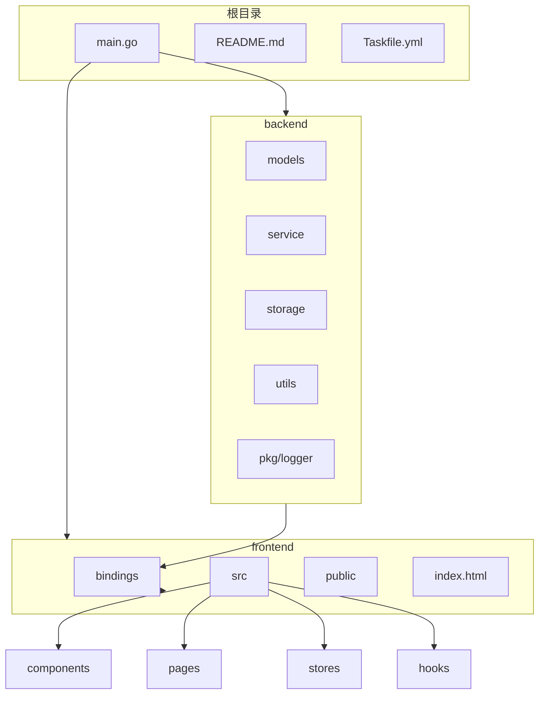
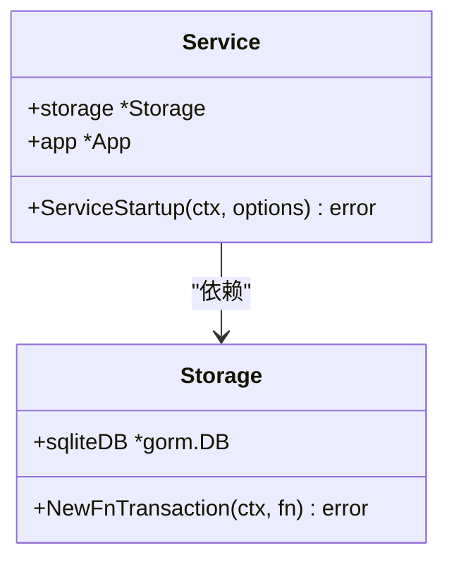
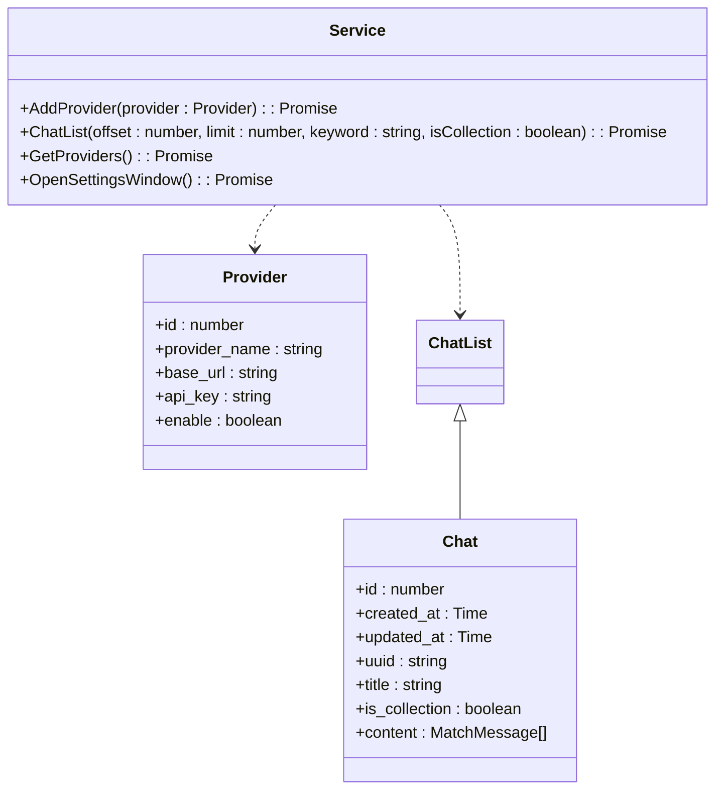
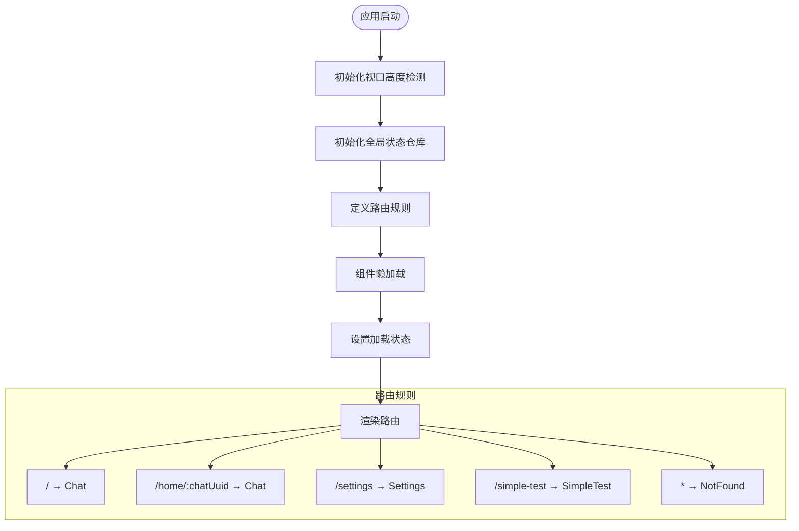

# 目录结构详解

<cite>
**本文档引用的文件**
- [main.go](file://main.go)
- [backend/service/service.go](file://backend/service/service.go)
- [backend/storage/storage.go](file://backend/storage/storage.go)
- [frontend/src/App.tsx](file://frontend/src/App.tsx)
- [frontend/bindings/gitlab.linhf.cn/project/lemontea/lemon_tea_desktop/backend/service/service.ts](file://frontend/bindings/gitlab.linhf.cn/project/lemontea/lemon_tea_desktop/backend/service/service.ts)
- [frontend/bindings/gitlab.linhf.cn/project/lemontea/lemon_tea_desktop/backend/models/view_models/models.ts](file://frontend/bindings/gitlab.linhf.cn/project/lemontea/lemon_tea_desktop/backend/models/view_models/models.ts)
</cite>

## 目录结构

本项目采用前后端分离的架构设计，通过 Wails 框架实现 Go 后端与 React 前端的深度集成。整体目录结构清晰划分了不同职责的模块，便于团队协作与维护。

**Diagram sources**
- [main.go](file://main.go#L1-L60)
- [project_structure](file://project_structure)

## 后端模块设计

### models（数据模型分层）

`backend/models` 目录采用分层设计，明确区分不同层级的数据模型：

- **data_models**: 与数据库直接映射的实体模型，用于 GORM 操作
- **view_models**: 面向前端视图的数据模型，包含经过处理、适配前端需求的数据结构
- **wrapper_models**: 特定场景下的包装模型，用于特殊业务逻辑的数据封装

这种分层设计实现了数据访问层与表现层的解耦，提高了代码的可维护性和安全性。

**Section sources**
- [backend/models/data_models/models.go](file://backend/models/data_models/models.go)
- [backend/models/view_models/models.go](file://backend/models/view_models/models.go)

### service（业务逻辑）

`backend/service` 目录封装了核心业务逻辑，每个文件对应一个业务领域：

- **chat.go**: 聊天相关业务逻辑
- **provider.go**: 供应商管理业务逻辑
- **settings.go**: 设置相关业务逻辑
- **service.go**: 服务主结构体及初始化逻辑

`Service` 结构体通过依赖注入方式持有 `storage.Storage` 实例，实现了业务逻辑与数据访问的分离。

**Diagram sources**
- [backend/service/service.go](file://backend/service/service.go#L1-L30)
- [backend/storage/storage.go](file://backend/storage/storage.go#L1-L83)

**Section sources**
- [backend/service/service.go](file://backend/service/service.go#L1-L30)
- [backend/service/settings.go](file://backend/service/settings.go#L1-L22)

### storage（数据库操作）

`backend/storage` 目录负责所有数据库操作，基于 GORM 实现 ORM 功能：

- **chat.go, chat_message.go, provider.go**: 各实体的数据库操作方法
- **storage.go**: 数据库连接管理与事务处理
- **models.go**: 数据库表结构定义

`NewStorage()` 函数负责初始化数据库连接，并自动进行表结构迁移，确保数据库 schema 与代码模型保持一致。

**Section sources**
- [backend/storage/storage.go](file://backend/storage/storage.go#L1-L83)

### utils（工具函数）

`backend/utils` 目录提供通用工具函数：

- **ierror**: 自定义错误码与错误处理
- **llm**: 大语言模型相关工具函数
- **events.go**: 事件发布与订阅机制

这些工具函数被上层模块复用，避免了代码重复，提高了开发效率。

## 前端模块组织

### components（可复用UI）

`frontend/src/components` 目录存放可复用的UI组件：

- **Layout**: 应用主布局组件，包含侧边栏和头部导航
- **MessageAction**: 消息操作相关组件
- **ReasoningContent**: 推理内容展示组件
- **AnimatedAlert**: 动画提醒组件

这些组件遵循单一职责原则，通过 props 接收数据，具有良好的复用性。

**Section sources**
- [frontend/src/components/Layout/index.tsx](file://frontend/src/components/Layout/index.tsx#L1-L98)

### pages（路由页面）

`frontend/src/pages` 目录存放路由级别的页面组件：

- **home**: 主页聊天界面，包含聊天输入、消息列表等子组件
- **settings**: 设置页面
- **NotFound**: 404页面
- **SimpleTest, EnvTest**: 测试页面

每个页面组件通常由多个 `components` 组合而成，构成完整的用户界面。

### stores（状态管理）

`frontend/src/stores` 目录使用 Zustand 实现全局状态管理：

- **authStore.ts**: 认证状态管理
- **index.ts**: 状态仓库统一导出入口

状态管理模块负责维护应用的全局状态，如用户登录信息、主题配置等，实现跨组件的状态共享。

**Section sources**
- [frontend/src/stores/index.ts](file://frontend/src/stores/index.ts)
- [frontend/src/App.tsx](file://frontend/src/App.tsx#L1-L86)

### bindings（Wails自动生成的类型绑定）

`frontend/bindings` 目录由 Wails 框架自动生成，实现 Go 结构体到 TypeScript 类型的安全映射：

- **gitlab.linhf.cn/project/lemontea/lemon_tea_desktop/backend/models/view_models**: 前端视图模型的 TypeScript 定义
- **gitlab.linhf.cn/project/lemontea/lemon_tea_desktop/backend/service**: 服务接口的 TypeScript 定义
- **gorm.io/gorm, time**: 外部依赖的类型定义

这些绑定文件确保了前后端通信的类型安全，开发者可以直接在 TypeScript 中调用 Go 服务方法。

**Diagram sources**
- [frontend/bindings/gitlab.linhf.cn/project/lemontea/lemon_tea_desktop/backend/models/view_models/models.ts](file://frontend/bindings/gitlab.linhf.cn/project/lemontea/lemon_tea_desktop/backend/models/view_models/models.ts#L1-L335)
- [frontend/bindings/gitlab.linhf.cn/project/lemontea/lemon_tea_desktop/backend/service/service.ts](file://frontend/bindings/gitlab.linhf.cn/project/lemontea/lemon_tea_desktop/backend/service/service.ts#L1-L125)

## 应用入口初始化

### main.go - Wails实例初始化

`main.go` 作为应用入口，负责初始化 Wails 实例并注册服务：

1. 通过 `//go:embed all:frontend/dist` 嵌入前端构建产物
2. 创建 Wails 应用实例，配置应用名称、描述等基本信息
3. 注册 `service.NewService()` 作为应用服务
4. 配置静态资源处理器，指向嵌入的前端资源
5. 创建主窗口，设置窗口属性与初始 URL
6. 启动定时器，定期向前端发送时间事件
7. 运行应用事件循环

服务注册通过 `application.NewService(service.NewService())` 实现，Wails 框架会自动将 Go 服务方法暴露给前端调用。

**Section sources**
- [main.go](file://main.go#L1-L59)

### App.tsx - React路由体系构建

`frontend/src/App.tsx` 构建了应用的 React 路由体系：

1. 使用 `react-router-dom` 的 `Routes` 和 `Route` 组件定义路由规则
2. 采用懒加载（React.lazy）优化首屏加载性能
3. 通过 `React.Suspense` 提供加载状态反馈
4. 定义主要路由：
   - `/`, `/home`: 主聊天页面
   - `/home/:chatUuid`: 带聊天ID的聊天页面
   - `/settings`: 设置页面
   - `/simple-test`, `/env-test`: 测试页面
   - `*`: 404页面

应用启动时初始化视口高度检测和全局状态仓库，确保应用状态的正确初始化。

**Diagram sources**
- [frontend/src/App.tsx](file://frontend/src/App.tsx#L1-L86)

**Section sources**
- [frontend/src/App.tsx](file://frontend/src/App.tsx#L1-L86)
- [frontend/src/main.tsx](file://frontend/src/main.tsx#L1-L25)

## 类型安全通信机制

Wails 框架通过 `bindings/` 目录实现了前后端类型安全的通信机制：

1. **自动生成**: 在构建过程中，Wails 自动分析 Go 代码中的结构体和服务方法
2. **类型映射**: 将 Go 结构体映射为等价的 TypeScript 接口和类
3. **方法代理**: 生成服务方法的 TypeScript 代理函数，封装底层通信细节
4. **类型校验**: 在编译时确保前后端数据结构的一致性

例如，Go 中的 `Provider` 结构体被映射为 TypeScript 的 `Provider` 类，其字段类型和结构完全对应，任何类型不匹配都会在编译阶段被发现。

**Section sources**
- [frontend/bindings/gitlab.linhf.cn/project/lemontea/lemon_tea_desktop/backend/models/view_models/models.ts](file://frontend/bindings/gitlab.linhf.cn/project/lemontea/lemon_tea_desktop/backend/models/view_models/models.ts#L1-L335)
- [frontend/bindings/gitlab.linhf.cn/project/lemontea/lemon_tea_desktop/backend/service/service.ts](file://frontend/bindings/gitlab.linhf.cn/project/lemontea/lemon_tea_desktop/backend/service/service.ts#L1-L125)