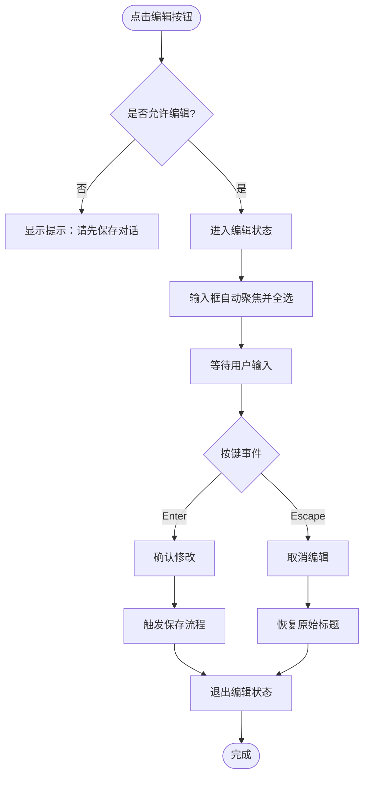
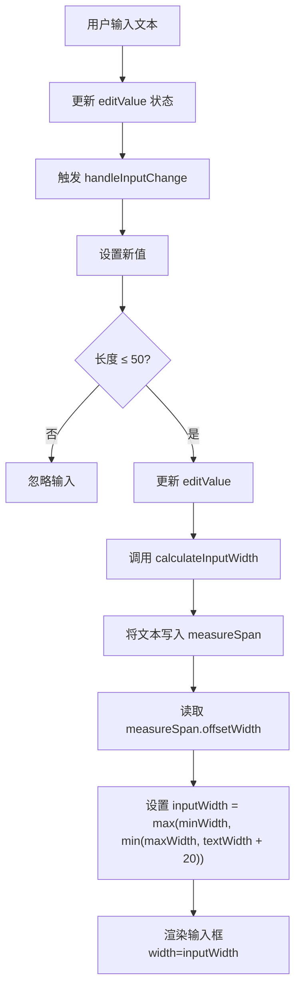
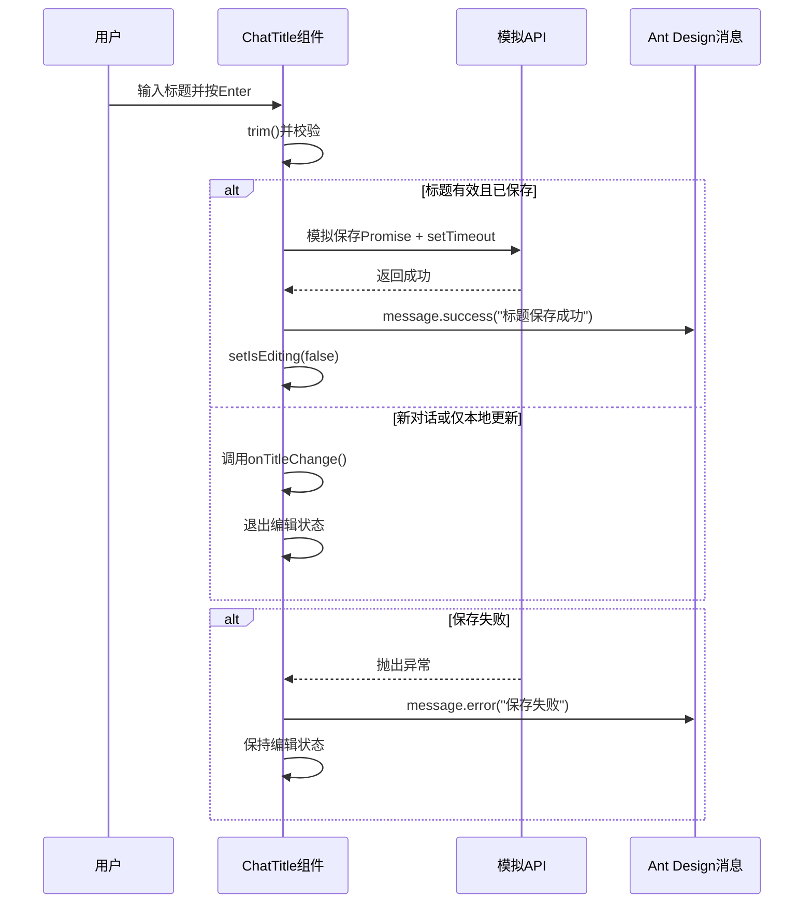
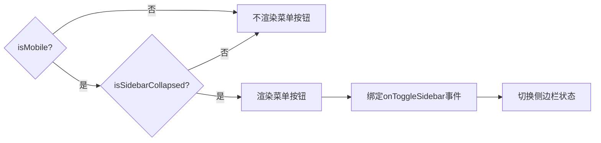

# 标题栏组件

<cite>
**本文档中引用的文件**  
- [chat_title.tsx](file://frontend/src/pages/home/chat/chat_title.tsx)
- [chat_title.module.scss](file://frontend/src/pages/home/chat/chat_title.module.scss)
- [notification.ts](file://frontend/src/utils/notification.ts)
</cite>

## 目录
1. [简介](#简介)
2. [核心功能实现](#核心功能实现)
3. [编辑模式切换逻辑](#编辑模式切换逻辑)
4. [输入框宽度动态计算机制](#输入框宽度动态计算机制)
5. [标题保存流程](#标题保存流程)
6. [编辑权限控制](#编辑权限控制)
7. [移动端菜单按钮渲染逻辑](#移动端菜单按钮渲染逻辑)
8. [Ant Design消息提示使用](#ant-design消息提示使用)

## 简介
标题栏组件（`chat_title.tsx`）是聊天界面的核心UI元素，负责展示和编辑当前对话的标题。该组件实现了可交互的标题编辑功能，支持桌面端与移动端适配，并通过精确的文本测量机制实现输入框自适应宽度。组件结合Ant Design的消息提示系统提供用户反馈，确保操作的可视化与友好性。

## 核心功能实现

**Section sources**  
- [chat_title.tsx](file://frontend/src/pages/home/chat/chat_title.tsx#L4-L236)

## 编辑模式切换逻辑
标题栏组件通过状态管理实现编辑模式的切换。点击编辑按钮后，组件进入可输入状态，显示输入框及确认/取消操作按钮。用户可通过以下方式完成操作：
- 按下 **Enter** 键确认修改
- 按下 **Escape** 键取消编辑并恢复原值

在编辑状态下，输入框自动聚焦并全选文本，提升用户体验。该逻辑由 `isEditing` 状态控制，结合 `useEffect` 钩子在状态变化时自动聚焦输入框。



**Diagram sources**  
- [chat_title.tsx](file://frontend/src/pages/home/chat/chat_title.tsx#L49-L60)
- [chat_title.tsx](file://frontend/src/pages/home/chat/chat_title.tsx#L93-L110)
- [chat_title.tsx](file://frontend/src/pages/home/chat/chat_title.tsx#L111-L116)

## 输入框宽度动态计算机制
为实现输入框随文本内容自适应宽度，组件采用隐藏的 `measureSpan` 元素进行文本宽度测量。其工作流程如下：

1. 创建一个隐藏的 `<span>` 元素（`measureRef`），其样式与输入框一致
2. 将待测量文本设置为其内容
3. 读取其 `offsetWidth` 属性获取渲染后的实际像素宽度
4. 根据测量结果动态设置输入框的 `width` 样式

该机制确保输入框宽度始终与内容匹配，避免过宽或换行问题，同时限制最大宽度为50字符（约800px），最小宽度为120px。



**Diagram sources**  
- [chat_title.tsx](file://frontend/src/pages/home/chat/chat_title.tsx#L37-L46)
- [chat_title.tsx](file://frontend/src/pages/home/chat/chat_title.tsx#L82-L88)
- [chat_title.module.scss](file://frontend/src/pages/home/chat/chat_title.module.scss#L158-L174)

## 标题保存流程
标题保存流程包含以下关键步骤：

1. **输入校验**：检查标题是否为空或与原值相同
2. **长度限制**：通过 `maxLength={50}` 和状态控制确保不超过50字符
3. **API调用模拟**：若存在 `chatUuid`，模拟异步保存过程（200ms延迟）
4. **状态更新**：调用 `onTitleChange` 回调更新父组件状态
5. **用户反馈**：使用Ant Design的 `message` 组件显示成功或失败提示

若保存失败，组件保持编辑状态以便用户重试；若为新对话（无 `chatUuid`），则仅更新本地状态。



**Diagram sources**  
- [chat_title.tsx](file://frontend/src/pages/home/chat/chat_title.tsx#L63-L91)
- [notification.ts](file://frontend/src/utils/notification.ts#L0-L49)

## 编辑权限控制
组件通过 `canEditTitle` 计算属性实现编辑权限控制：

```typescript
const canEditTitle = Boolean(chatUuid && chatUuid.trim() !== '');
```

仅当 `chatUuid` 存在且非空字符串时，才允许编辑标题。否则：
- 编辑按钮置灰并禁用点击
- 悬停时显示提示“请先保存对话后编辑标题”
- 点击时通过 `message.info()` 提示用户“请先保存对话后再编辑标题”

此机制防止用户对未保存的临时对话进行标题修改，确保数据一致性。

**Section sources**  
- [chat_title.tsx](file://frontend/src/pages/home/chat/chat_title.tsx#L47-L48)
- [chat_title.tsx](file://frontend/src/pages/home/chat/chat_title.tsx#L49-L52)

## 移动端菜单按钮渲染逻辑
移动端菜单按钮的渲染受两个条件控制：
- `isMobile`: 是否为移动设备
- `isSidebarCollapsed`: 侧边栏是否收起

当且仅当两者均为 `true` 时，按钮才被渲染。点击该按钮会触发 `onToggleSidebar` 回调，实现侧边栏的展开/收起切换。按钮使用SVG图标表示菜单，提升可识别性。

该设计优化移动端空间利用率：仅在侧边栏收起时显示菜单按钮，避免界面冗余。



**Diagram sources**  
- [chat_title.tsx](file://frontend/src/pages/home/chat/chat_title.tsx#L118-L138)

## Ant Design消息提示使用
组件使用Ant Design的 `message` 组件提供操作反馈：

- `message.success('标题保存成功')`：绿色提示，表示成功
- `message.error('保存标题失败，请重试')`：红色提示，表示失败
- `message.info('请先保存对话后再编辑标题')`：蓝色提示，表示信息

这些提示自动消失，无需用户手动关闭，符合现代UI交互规范。所有消息调用均封装在组件内部，确保调用一致性。

**Section sources**  
- [chat_title.tsx](file://frontend/src/pages/home/chat/chat_title.tsx#L51)
- [chat_title.tsx](file://frontend/src/pages/home/chat/chat_title.tsx#L75)
- [chat_title.tsx](file://frontend/src/pages/home/chat/chat_title.tsx#L80)
- [notification.ts](file://frontend/src/utils/notification.ts#L0-L49)