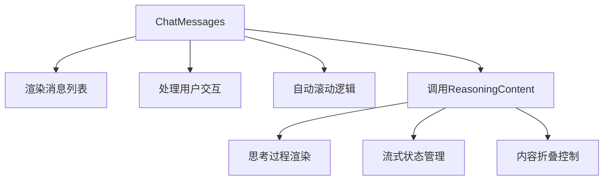
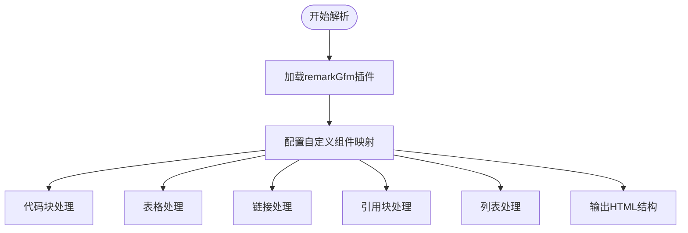
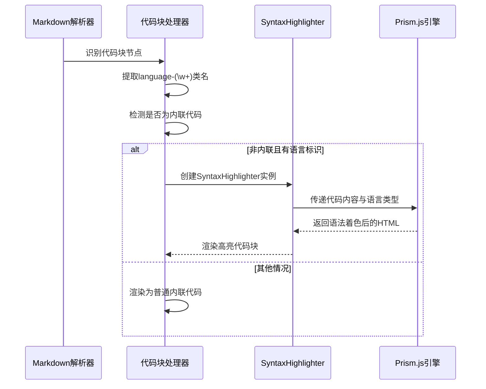
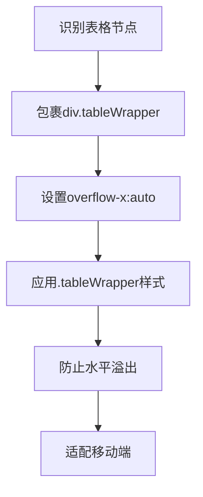
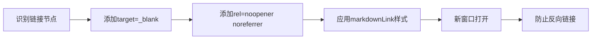
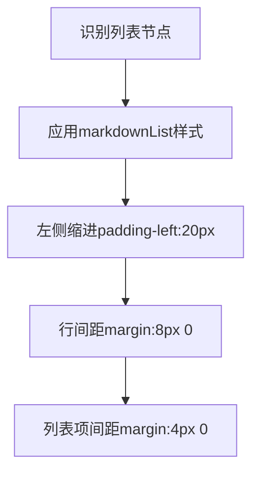
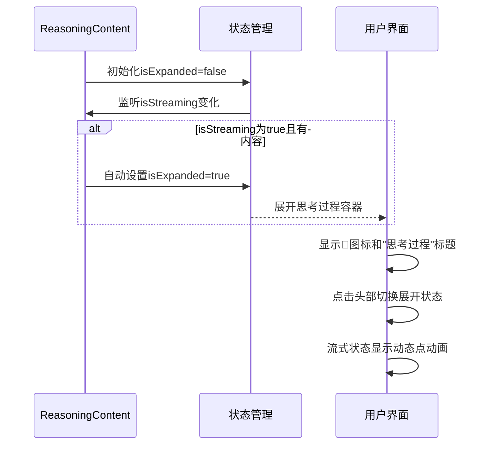
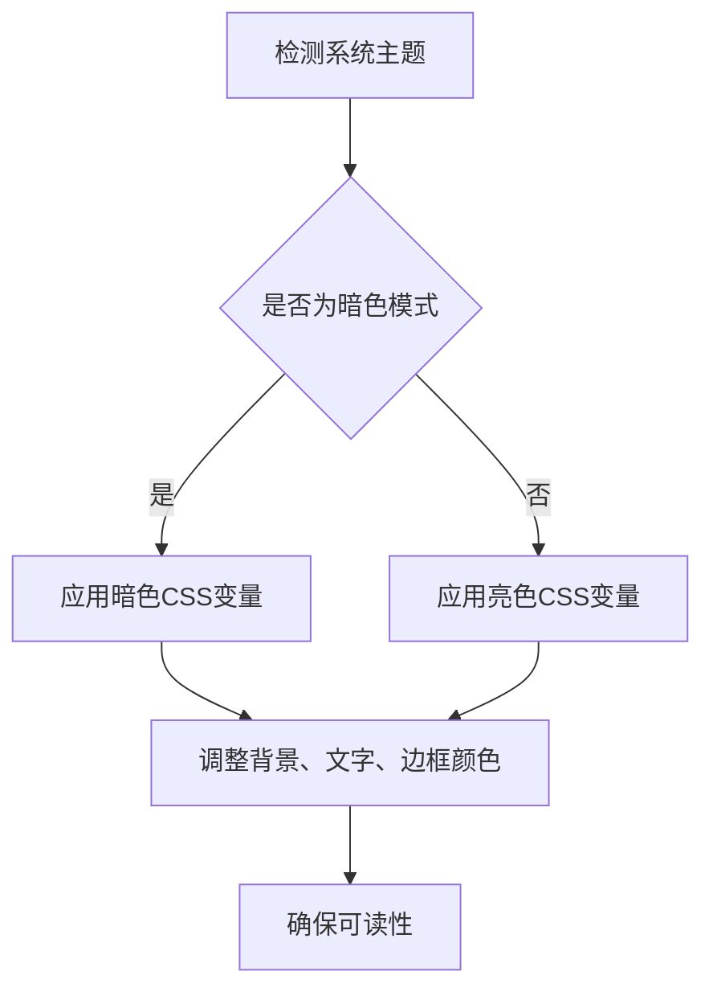
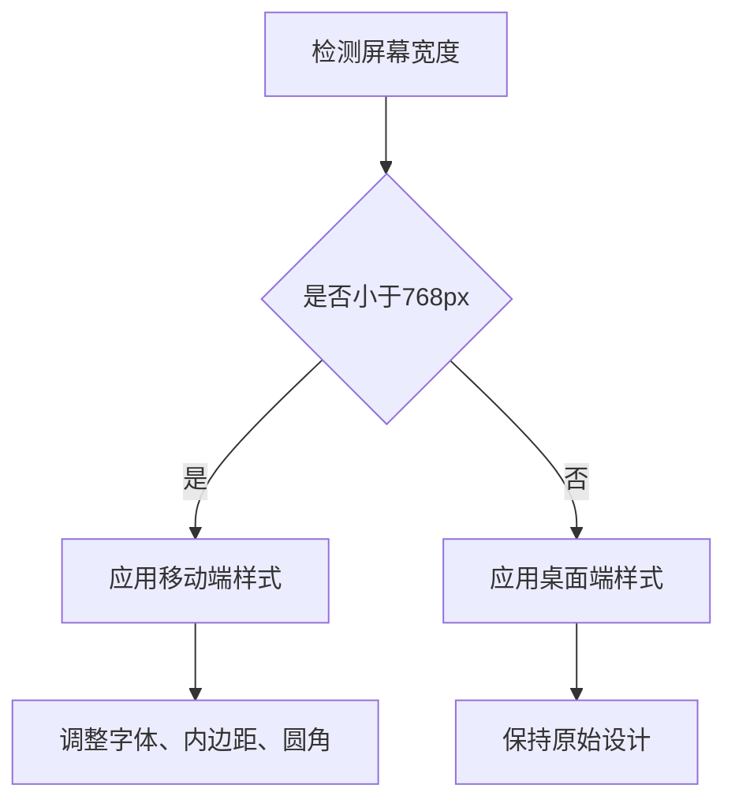

# 消息内容渲染机制

<cite>
**本文档引用文件**  
- [ReasoningContent/index.tsx](file://frontend/src/components/ReasoningContent/index.tsx)
- [chat_messages.tsx](file://frontend/src/pages/home/chat/chat_messages.tsx)
- [index.module.scss](file://frontend/src/components/ReasoningContent/index.module.scss)
- [chat_messages.module.scss](file://frontend/src/pages/home/chat/chat_messages.module.scss)
</cite>

## 目录
1. [简介](#简介)
2. [核心组件结构](#核心组件结构)
3. [ReactMarkdown解析流程](#reactmarkdown解析流程)
4. [代码块高亮实现机制](#代码块高亮实现机制)
5. [表格渲染优化策略](#表格渲染优化策略)
6. [链接处理逻辑](#链接处理逻辑)
7. [引用块与列表样式定制](#引用块与列表样式定制)
8. [思考过程独立渲染机制](#思考过程独立渲染机制)
9. [样式主题与响应式适配](#样式主题与响应式适配)

## 简介
本系统采用React技术栈实现AI消息内容的完整渲染流程，支持Markdown格式解析、语法高亮、表格优化、安全链接处理及渐进式内容展示。通过ReactMarkdown组件结合remark-gfm插件实现标准Markdown语法支持，并集成react-syntax-highlighter与Prism.js实现代码块高亮。系统特别设计了思考过程（reasoning_content）的独立渲染机制，支持流式传输状态下的动态更新与自动展开。

## 核心组件结构
消息渲染系统由两个核心组件构成：`ChatMessages`负责整体消息列表的渲染与滚动控制，`ReasoningContent`专门处理AI思考过程的折叠展示与动态更新。

**组件关系图**


**组件来源**
- [chat_messages.tsx](file://frontend/src/pages/home/chat/chat_messages.tsx#L0-L512)
- [ReasoningContent/index.tsx](file://frontend/src/components/ReasoningContent/index.tsx#L0-L130)

## ReactMarkdown解析流程
系统使用ReactMarkdown组件解析AI返回的Markdown格式内容，通过remarkGfm插件支持GitHub Flavored Markdown扩展语法。

### 解析配置


**解析流程来源**
- [chat_messages.tsx](file://frontend/src/pages/home/chat/chat_messages.tsx#L445-L498)
- [ReasoningContent/index.tsx](file://frontend/src/components/ReasoningContent/index.tsx#L70-L125)

## 代码块高亮实现机制
系统通过react-syntax-highlighter集成Prism.js实现代码块语法高亮，支持语言检测与自定义样式。

### 高亮实现流程


### 自定义样式配置
- **主题**: tomorrow主题
- **圆角边框**: borderRadius 6px(思考过程)/8px(主消息)
- **内边距**: margin 8px 0
- **字体大小**: 13px(思考过程)/14px(主消息)
- **背景色**: 使用CSS变量--code-background

**代码高亮来源**
- [chat_messages.tsx](file://frontend/src/pages/home/chat/chat_messages.tsx#L390-L414)
- [ReasoningContent/index.tsx](file://frontend/src/components/ReasoningContent/index.tsx#L66-L88)

## 表格渲染优化策略
系统采用.tableWrapper容器防止表格水平溢出，确保移动端良好显示。

### 表格渲染流程


### 容器特性
- **水平滚动**: overflow-x: auto
- **圆角边框**: border-radius: 6px/8px
- **边框**: 1px solid var(--table-border)
- **响应式**: 在移动端自动调整字体和内边距

**表格优化来源**
- [chat_messages.tsx](file://frontend/src/pages/home/chat/chat_messages.tsx#L412-L414)
- [ReasoningContent/index.tsx](file://frontend/src/components/ReasoningContent/index.tsx#L88-L92)
- [chat_messages.module.scss](file://frontend/src/pages/home/chat/chat_messages.module.scss#L380-L400)
- [index.module.scss](file://frontend/src/components/ReasoningContent/index.module.scss#L380-L390)

## 链接处理逻辑
系统对所有外部链接实施安全策略，在新窗口打开并防止安全风险。

### 链接处理规则


### 安全特性
- **新窗口打开**: target="_blank"
- **安全防护**: rel="noopener noreferrer"
- **样式统一**: 应用markdownLink CSS类
- **悬停效果**: 添加下划线装饰

**链接处理来源**
- [chat_messages.tsx](file://frontend/src/pages/home/chat/chat_messages.tsx#L415-L424)
- [ReasoningContent/index.tsx](file://frontend/src/components/ReasoningContent/index.tsx#L93-L100)
- [chat_messages.module.scss](file://frontend/src/pages/home/chat/chat_messages.module.scss#L360-L370)
- [index.module.scss](file://frontend/src/components/ReasoningContent/index.module.scss#L360-L370)

## 引用块与列表样式定制
系统对引用块和有序/无序列表进行样式定制，提升视觉效果。

### 引用块样式
```mermaid
flowchart TD
A[识别引用块] --> B[应用markdownBlockquote样式]
B --> C[左侧4px彩色边框]
C --> D[背景色var(--blockquote-background)]
D --> E[圆角border-radius:0 4px 4px 0]
E --> F[内边距8px 16px]
```

### 列表样式


**样式定制来源**
- [chat_messages.tsx](file://frontend/src/pages/home/chat/chat_messages.tsx#L425-L439)
- [ReasoningContent/index.tsx](file://frontend/src/components/ReasoningContent/index.tsx#L101-L129)
- [chat_messages.module.scss](file://frontend/src/pages/home/chat/chat_messages.module.scss#L340-L360)
- [index.module.scss](file://frontend/src/components/ReasoningContent/index.module.scss#L340-L360)

## 思考过程独立渲染机制
系统通过ReasoningContent组件实现思考过程的独立渲染，支持渐进式展示和流式传输动态更新。

### 渐进式展示流程


### 动态更新特性
- **自动展开**: 当isStreaming为true时自动展开
- **折叠控制**: 点击头部可切换展开/折叠状态
- **流式指示**: 显示动态点动画表示正在生成
- **内容为空**: 不渲染组件

**思考过程来源**
- [ReasoningContent/index.tsx](file://frontend/src/components/ReasoningContent/index.tsx#L0-L130)
- [chat_messages.tsx](file://frontend/src/pages/home/chat/chat_messages.tsx#L445-L448)

## 样式主题与响应式适配
系统支持暗色主题和移动端响应式适配，确保在不同环境下良好显示。

### 主题适配


### 响应式策略


**样式适配来源**
- [index.module.scss](file://frontend/src/components/ReasoningContent/index.module.scss#L400-L458)
- [chat_messages.module.scss](file://frontend/src/pages/home/chat/chat_messages.module.scss#L600-L652)