# 消息列表组件

<cite>
**本文档中引用的文件**  
- [chat_messages.tsx](file://frontend/src/pages/home/chat/chat_messages.tsx)
- [SCROLL_OPTIMIZATION.md](file://frontend/doc/SCROLL_OPTIMIZATION.md)
- [index.tsx](file://frontend/src/pages/home/chat/index.tsx)
- [ReasoningContent/index.tsx](file://frontend/src/components/ReasoningContent/index.tsx)
- [chat_messages.module.scss](file://frontend/src/pages/home/chat/chat_messages.module.scss)
</cite>

## 目录
1. [简介](#简介)
2. [核心功能概览](#核心功能概览)
3. [滚动控制机制](#滚动控制机制)
4. [Markdown内容渲染](#markdown内容渲染)
5. [滚动行为优化策略](#滚动行为优化策略)
6. [自动滚动与用户干预的冲突解决](#自动滚动与用户干预的冲突解决)
7. [流式消息更新的滚动性能优化](#流式消息更新的滚动性能优化)
8. [结论](#结论)

## 简介
消息列表组件（`chat_messages.tsx`）是聊天界面的核心部分，负责渲染消息流、处理用户交互和管理滚动行为。该组件通过 `React.forwardRef` 暴露滚动控制方法，实现与父组件的指令通信，并采用精细化的滚动优化策略确保在流式消息更新时的高性能表现。

**Section sources**
- [chat_messages.tsx](file://frontend/src/pages/home/chat/chat_messages.tsx#L1-L513)

## 核心功能概览
消息列表组件实现了以下核心功能：
- 通过 `React.forwardRef` 暴露滚动控制方法
- 支持Markdown内容渲染，包括代码块高亮、表格样式优化和链接新窗口打开
- 实现高性能滚动监听和用户手动滚动检测
- 提供智能的自动滚动与用户干预冲突解决机制

**Section sources**
- [chat_messages.tsx](file://frontend/src/pages/home/chat/chat_messages.tsx#L1-L513)

## 滚动控制机制

### 滚动方法暴露
组件使用 `React.forwardRef` 和 `useImperativeHandle` 暴露以下滚动控制方法：

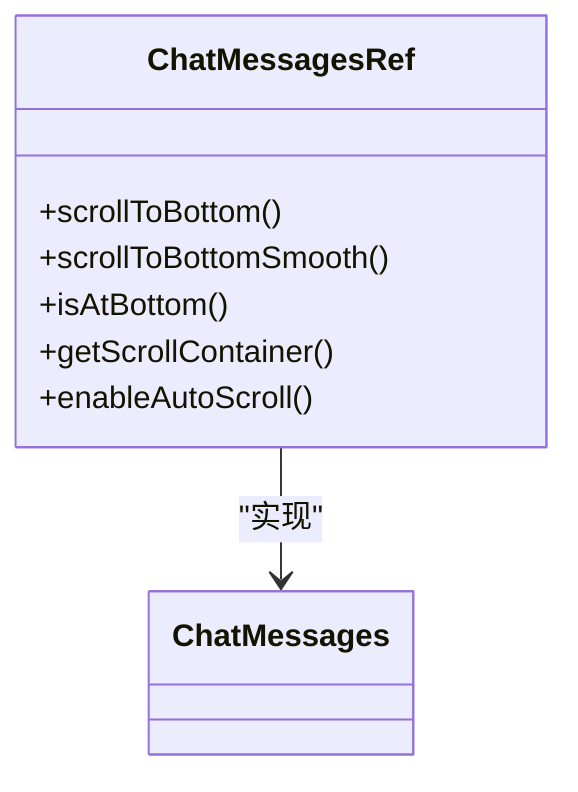

**Diagram sources**
- [chat_messages.tsx](file://frontend/src/pages/home/chat/chat_messages.tsx#L34-L38)
- [chat_messages.tsx](file://frontend/src/pages/home/chat/chat_messages.tsx#L209-L215)

### 滚动方法实现
组件实现了多种滚动方法以满足不同场景需求：

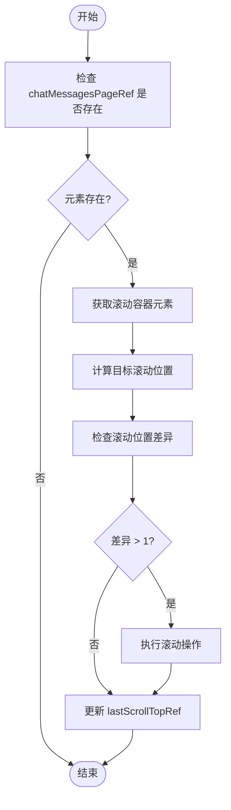

**Diagram sources**
- [chat_messages.tsx](file://frontend/src/pages/home/chat/chat_messages.tsx#L72-L102)

**Section sources**
- [chat_messages.tsx](file://frontend/src/pages/home/chat/chat_messages.tsx#L64-L102)

## Markdown内容渲染

### 渲染架构
组件采用 `react-markdown` 结合 `remark-gfm` 插件实现完整的Markdown渲染支持：

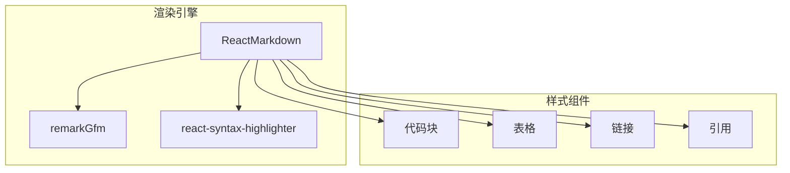

**Diagram sources**
- [chat_messages.tsx](file://frontend/src/pages/home/chat/chat_messages.tsx#L1-L4)
- [chat_messages.tsx](file://frontend/src/pages/home/chat/chat_messages.tsx#L385-L446)

### 代码块高亮
使用 `react-syntax-highlighter` 实现代码块语法高亮：

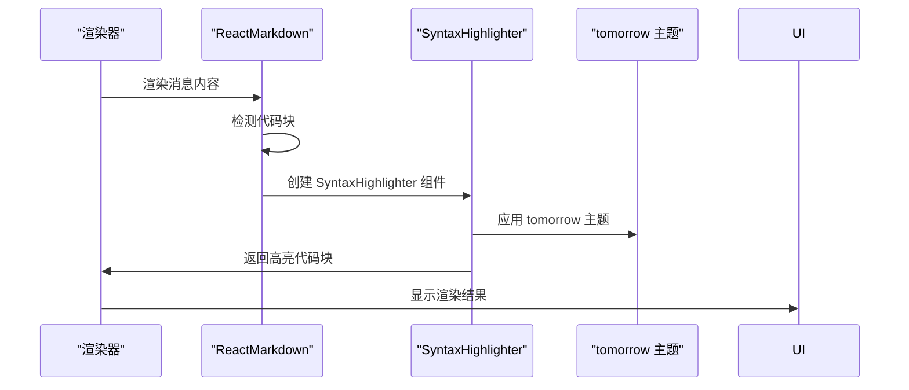

**Diagram sources**
- [chat_messages.tsx](file://frontend/src/pages/home/chat/chat_messages.tsx#L394-L406)
- [chat_messages.module.scss](file://frontend/src/pages/home/chat/chat_messages.module.scss#L100-L130)

### 表格与链接优化
组件对表格和链接进行了专门的样式优化：

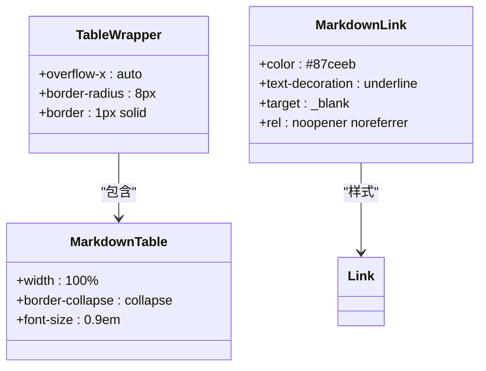

**Diagram sources**
- [chat_messages.tsx](file://frontend/src/pages/home/chat/chat_messages.tsx#L410-L425)
- [chat_messages.module.scss](file://frontend/src/pages/home/chat/chat_messages.module.scss#L180-L240)

**Section sources**
- [chat_messages.tsx](file://frontend/src/pages/home/chat/chat_messages.tsx#L385-L446)

## 滚动行为优化策略

### 高性能滚动监听
基于 `useCallback` 和 `useRef` 实现高性能滚动监听：

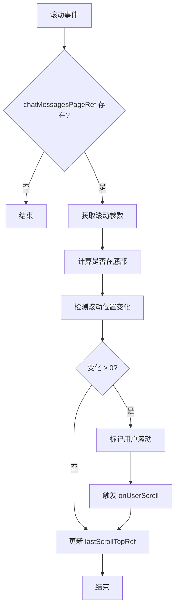

**Diagram sources**
- [chat_messages.tsx](file://frontend/src/pages/home/chat/chat_messages.tsx#L122-L187)

### 用户手动滚动检测
实现多事件监听的用户手动滚动检测：

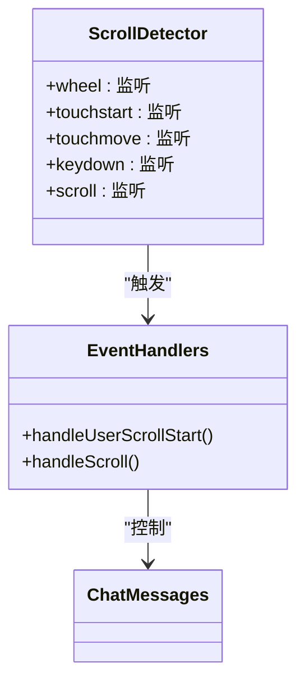

**Diagram sources**
- [chat_messages.tsx](file://frontend/src/pages/home/chat/chat_messages.tsx#L188-L207)
- [chat_messages.tsx](file://frontend/src/pages/home/chat/chat_messages.tsx#L228-L247)

### 零容忍滚动变化检测
实现零容忍滚动变化检测机制：

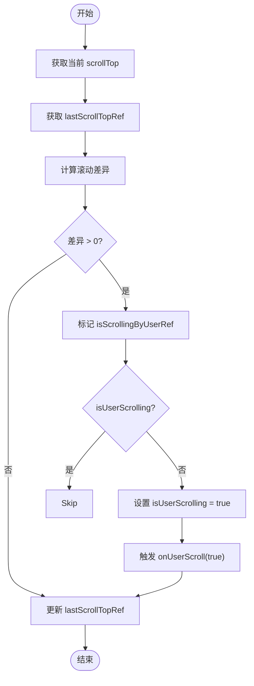

**Diagram sources**
- [chat_messages.tsx](file://frontend/src/pages/home/chat/chat_messages.tsx#L150-L156)

**Section sources**
- [chat_messages.tsx](file://frontend/src/pages/home/chat/chat_messages.tsx#L122-L187)

## 自动滚动与用户干预的冲突解决

### 冲突解决机制
结合 `SCROLL_OPTIMIZATION.md` 文档，实现智能的冲突解决机制：

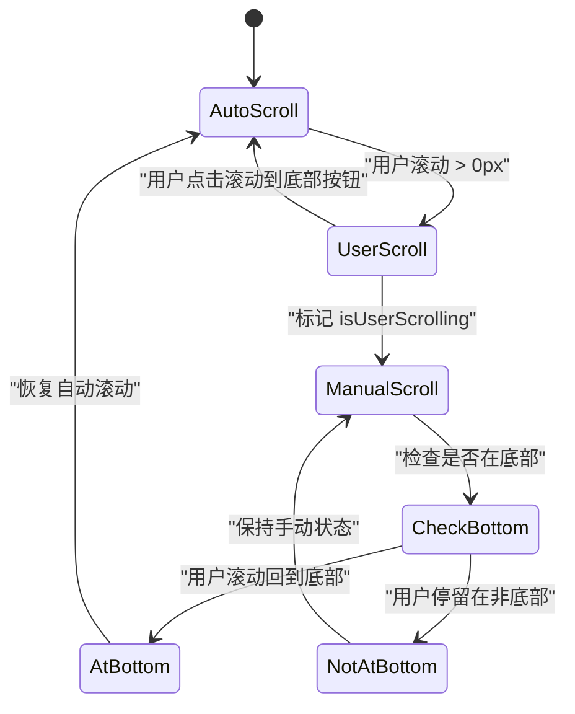

**Diagram sources**
- [SCROLL_OPTIMIZATION.md](file://frontend/doc/SCROLL_OPTIMIZATION.md#L1-L280)
- [chat_messages.tsx](file://frontend/src/pages/home/chat/chat_messages.tsx#L122-L187)

### 状态管理
实现精细化的状态管理：

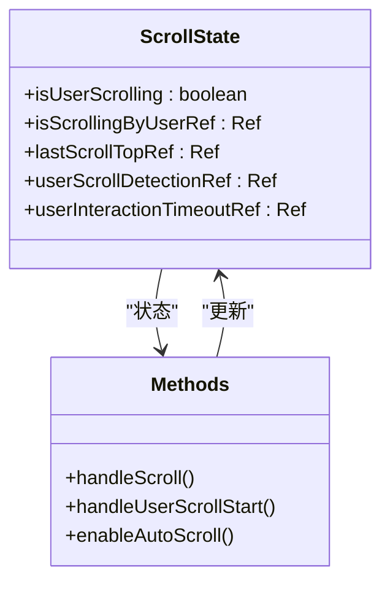

**Diagram sources**
- [chat_messages.tsx](file://frontend/src/pages/home/chat/chat_messages.tsx#L54-L61)
- [chat_messages.tsx](file://frontend/src/pages/home/chat/chat_messages.tsx#L122-L187)

### 智能恢复策略
实现手动回到底部自动恢复自动滚动的智能策略：

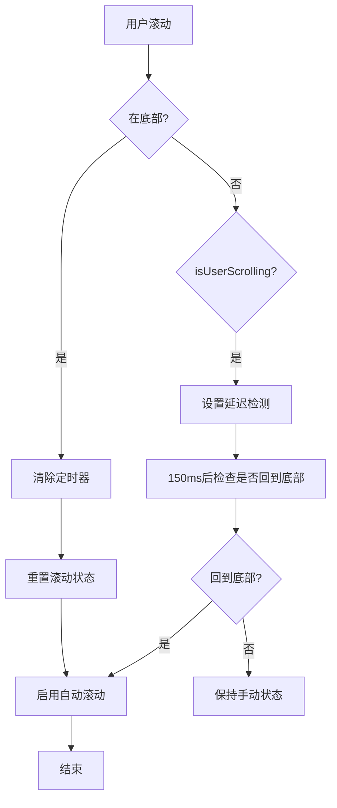

**Diagram sources**
- [chat_messages.tsx](file://frontend/src/pages/home/chat/chat_messages.tsx#L162-L174)

**Section sources**
- [chat_messages.tsx](file://frontend/src/pages/home/chat/chat_messages.tsx#L122-L187)
- [SCROLL_OPTIMIZATION.md](file://frontend/doc/SCROLL_OPTIMIZATION.md#L1-L280)

## 流式消息更新的滚动性能优化

### 优化的自动滚动逻辑
实现减少不必要触发的优化自动滚动逻辑：

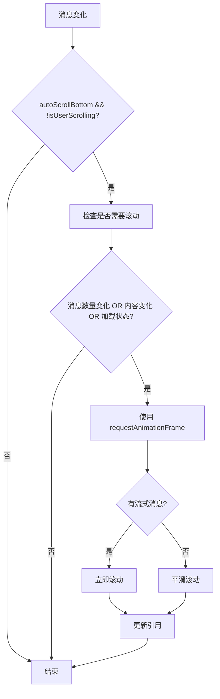

**Diagram sources**
- [chat_messages.tsx](file://frontend/src/pages/home/chat/chat_messages.tsx#L275-L290)

### 性能优化实践
提供流式消息更新时的滚动性能优化实践：

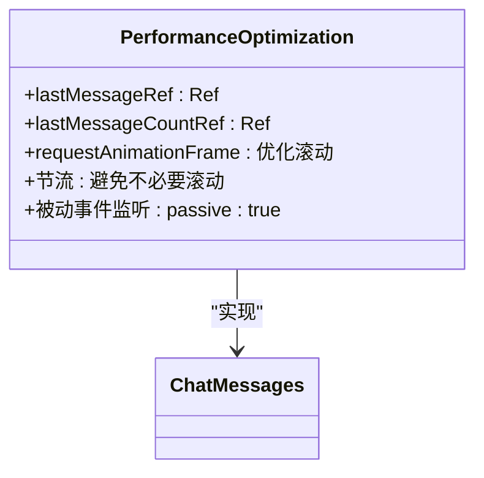

**Diagram sources**
- [chat_messages.tsx](file://frontend/src/pages/home/chat/chat_messages.tsx#L248-L249)
- [chat_messages.tsx](file://frontend/src/pages/home/chat/chat_messages.tsx#L275-L290)

**Section sources**
- [chat_messages.tsx](file://frontend/src/pages/home/chat/chat_messages.tsx#L248-L290)

## 结论
消息列表组件通过 `React.forwardRef` 暴露滚动控制方法，实现了与父组件的高效指令通信。组件采用 `useCallback` 和 `useRef` 实现高性能滚动监听，通过多事件监听和零容忍滚动变化检测确保用户操作的即时响应。结合 `SCROLL_OPTIMIZATION.md` 文档，实现了智能的自动滚动与用户干预冲突解决机制，包括 `isUserScrolling` 状态管理、滚动结束延迟检测和手动回到底部自动恢复自动滚动的策略。在流式消息更新场景下，通过 `requestAnimationFrame` 和精细化的触发条件判断，确保了滚动性能的最优化。