# 滚动控制API与指令通信

<cite>
**本文档引用文件**   
- [chat_messages.tsx](file://frontend/src/pages/home/chat/chat_messages.tsx)
- [chat_input.tsx](file://frontend/src/pages/home/chat/chat_input.tsx)
- [index.tsx](file://frontend/src/pages/home/chat/index.tsx)
- [SCROLL_OPTIMIZATION.md](file://frontend/doc/SCROLL_OPTIMIZATION.md)
- [chat_messages.module.scss](file://frontend/src/pages/home/chat/chat_messages.module.scss)
</cite>

## 目录
1. [简介](#简介)
2. [核心组件](#核心组件)
3. [滚动控制接口分析](#滚动控制接口分析)
4. [父子组件通信机制](#父子组件通信机制)
5. [滚动状态管理](#滚动状态管理)
6. [性能优化策略](#性能优化策略)
7. [用户体验优化](#用户体验优化)
8. [结论](#结论)

## 简介
本文档深入解析聊天应用中的滚动控制机制，重点分析通过React.forwardRef暴露的滚动控制方法接口ChatMessagesRef。文档详细阐述了滚动控制API在父子组件通信中的作用，包括瞬时滚动、平滑滚动、底部检测等核心功能的实现原理。同时，文档还探讨了如何通过useImperativeHandle安全地暴露底层实例方法，以及如何优化用户体验和性能。

## 核心组件

[深入分析聊天消息组件的核心功能和实现细节]

**组件来源**
- [chat_messages.tsx](file://frontend/src/pages/home/chat/chat_messages.tsx#L33-L39)
- [chat_input.tsx](file://frontend/src/pages/home/chat/chat_input.tsx#L1-L372)

## 滚动控制接口分析

### ChatMessagesRef接口定义
ChatMessagesRef接口定义了五个核心方法，用于控制聊天消息容器的滚动行为：

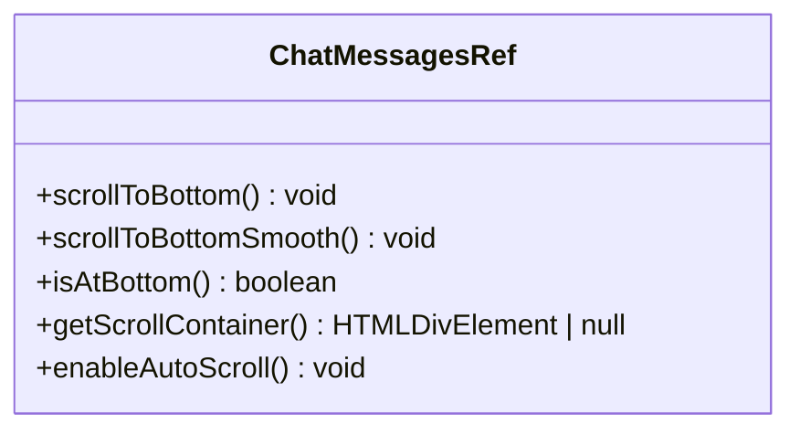

**接口来源**
- [chat_messages.tsx](file://frontend/src/pages/home/chat/chat_messages.tsx#L33-L39)

### scrollToBottom方法实现
scrollToBottom方法基于原生scrollTop属性实现瞬时滚动，配合节流优化避免频繁操作：

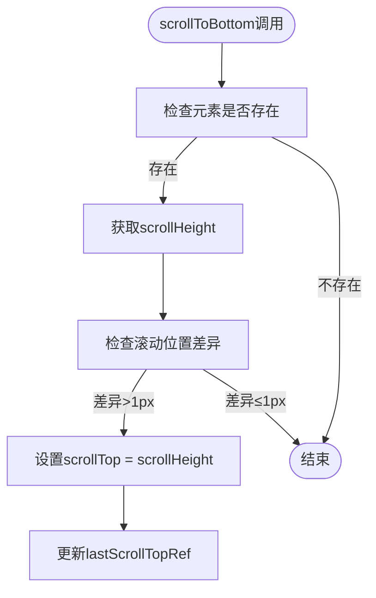

**实现来源**
- [chat_messages.tsx](file://frontend/src/pages/home/chat/chat_messages.tsx#L71-L85)

### scrollToBottomSmooth方法实现
scrollToBottomSmooth方法使用scrollTo({ behavior: 'smooth' })提供平滑滚动体验：

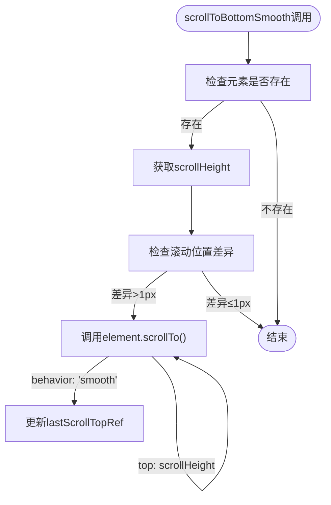

**实现来源**
- [chat_messages.tsx](file://frontend/src/pages/home/chat/chat_messages.tsx#L87-L101)

### isAtBottom方法实现
isAtBottom方法通过scrollTop、scrollHeight和clientHeight计算当前是否位于容器底部：

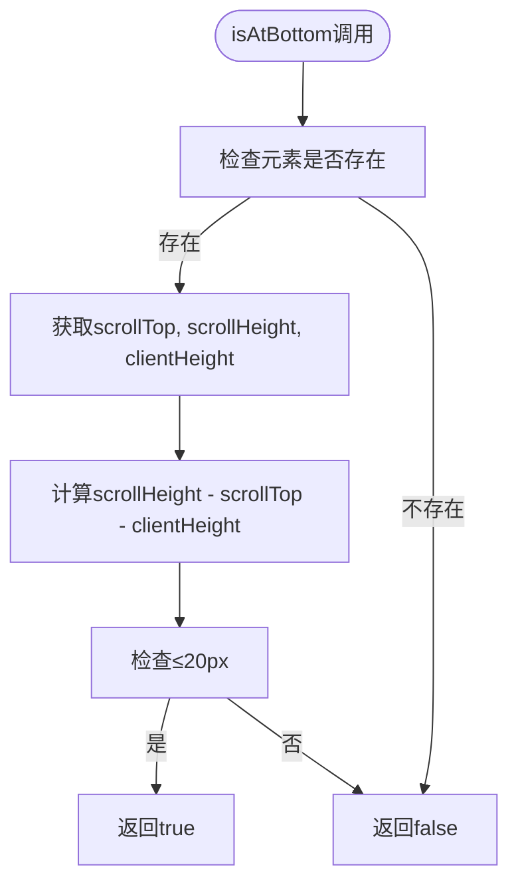

**实现来源**
- [chat_messages.tsx](file://frontend/src/pages/home/chat/chat_messages.tsx#L61-L69)

### getScrollContainer方法实现
getScrollContainer方法暴露底层DOM引用供外部操作：

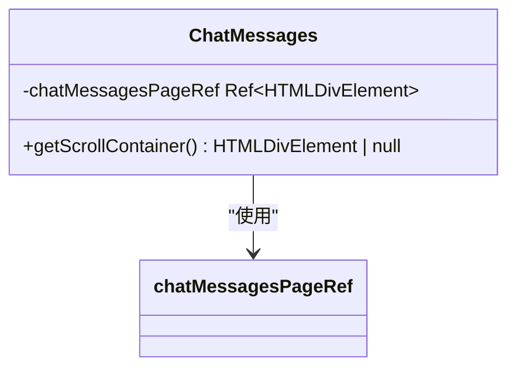

**实现来源**
- [chat_messages.tsx](file://frontend/src/pages/home/chat/chat_messages.tsx#L113-L117)

### enableAutoScroll方法实现
enableAutoScroll方法重置用户滚动状态并恢复自动滚动行为：

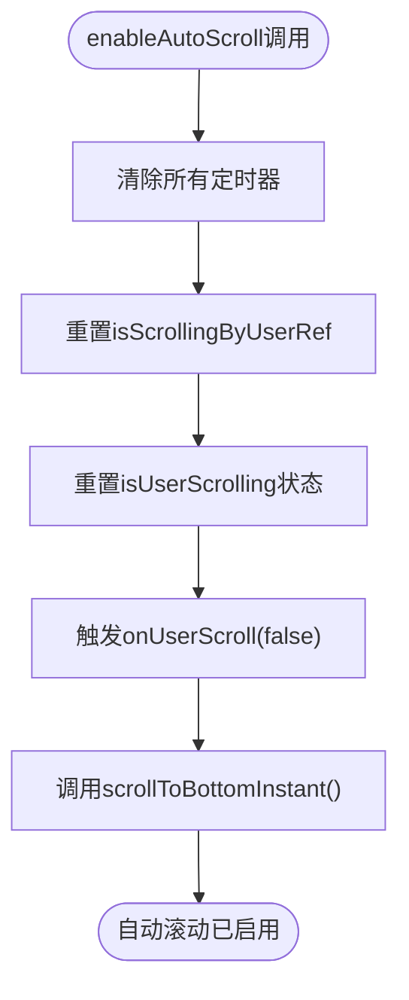

**实现来源**
- [chat_messages.tsx](file://frontend/src/pages/home/chat/chat_messages.tsx#L103-L111)

## 父子组件通信机制

### useImperativeHandle的使用
通过useImperativeHandle安全地暴露底层实例方法而不破坏封装性：

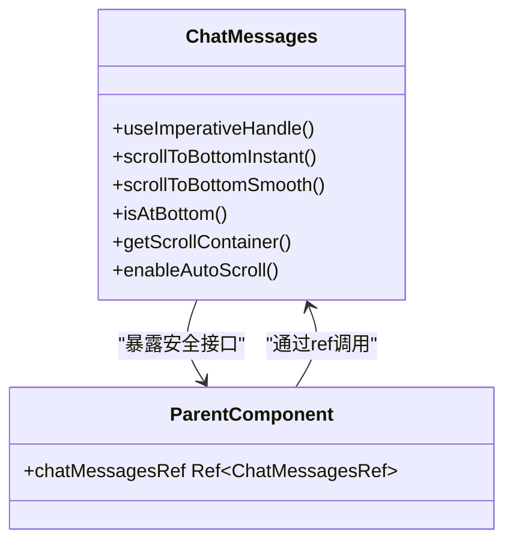

**实现来源**
- [chat_messages.tsx](file://frontend/src/pages/home/chat/chat_messages.tsx#L208-L216)

### 父子组件交互流程
展示父组件如何通过ref调用子组件方法的完整流程：

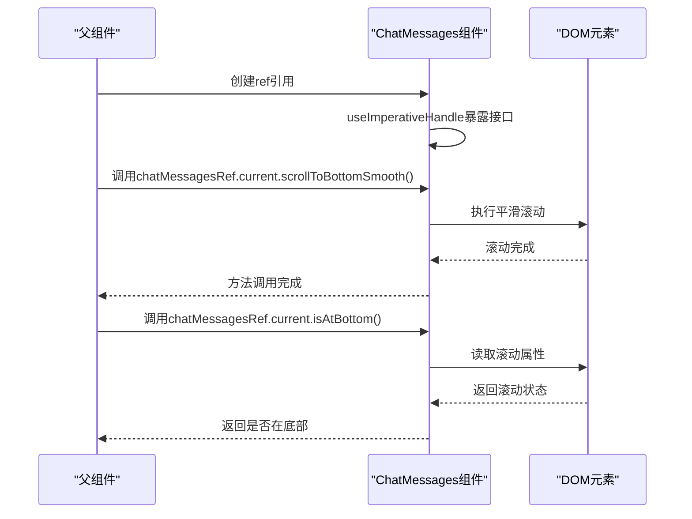

**交互来源**
- [index.tsx](file://frontend/src/pages/home/chat/index.tsx#L117-L143)
- [chat_messages.tsx](file://frontend/src/pages/home/chat/chat_messages.tsx#L208-L216)

## 滚动状态管理

### 状态变量设计
分析滚动控制中使用的各种状态变量和引用：

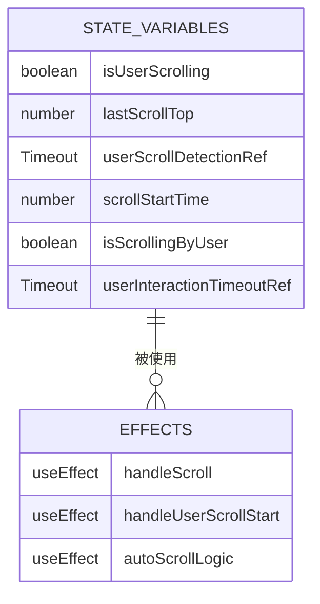

**状态来源**
- [chat_messages.tsx](file://frontend/src/pages/home/chat/chat_messages.tsx#L45-L52)

### 用户滚动检测机制
详细分析用户滚动检测的完整流程：

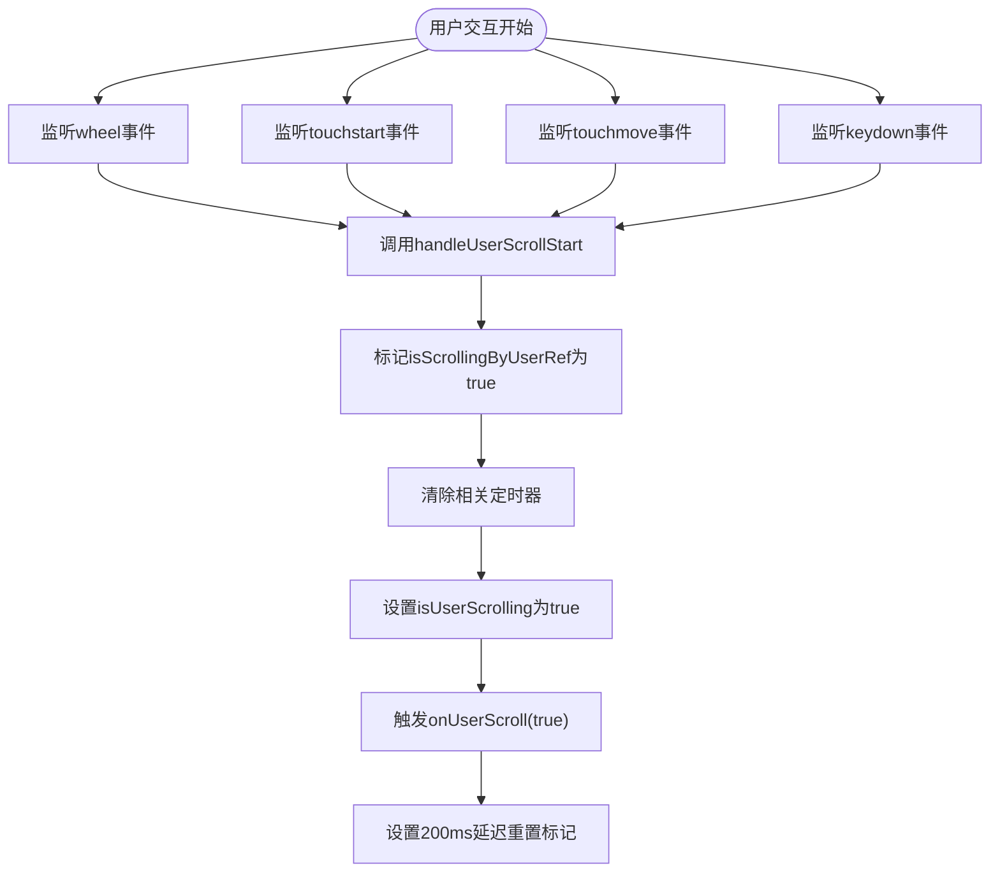

**检测来源**
- [chat_messages.tsx](file://frontend/src/pages/home/chat/chat_messages.tsx#L187-L205)
- [chat_messages.tsx](file://frontend/src/pages/home/chat/chat_messages.tsx#L218-L245)

## 性能优化策略

### 滚动节流优化
分析滚动操作中的节流优化策略：

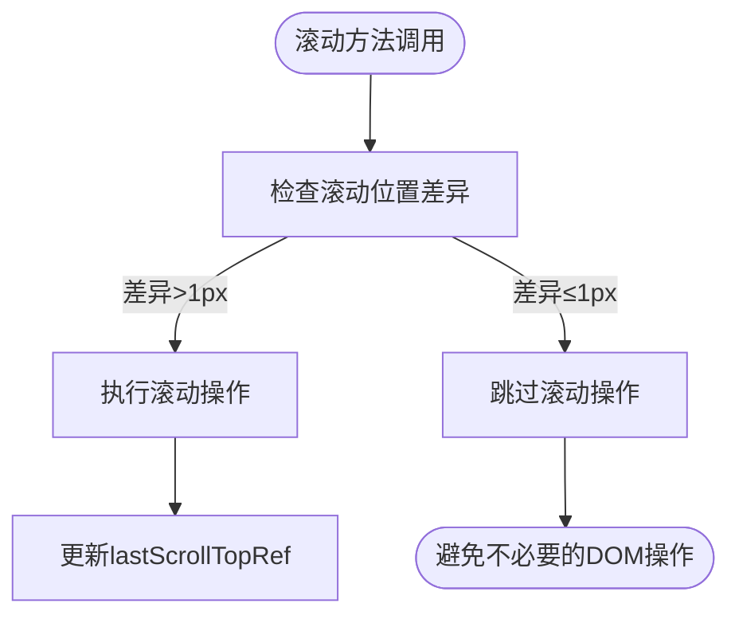

**优化来源**
- [chat_messages.tsx](file://frontend/src/pages/home/chat/chat_messages.tsx#L76-L80)
- [chat_messages.tsx](file://frontend/src/pages/home/chat/chat_messages.tsx#L92-L96)

### requestAnimationFrame优化
分析使用requestAnimationFrame优化滚动性能的策略：

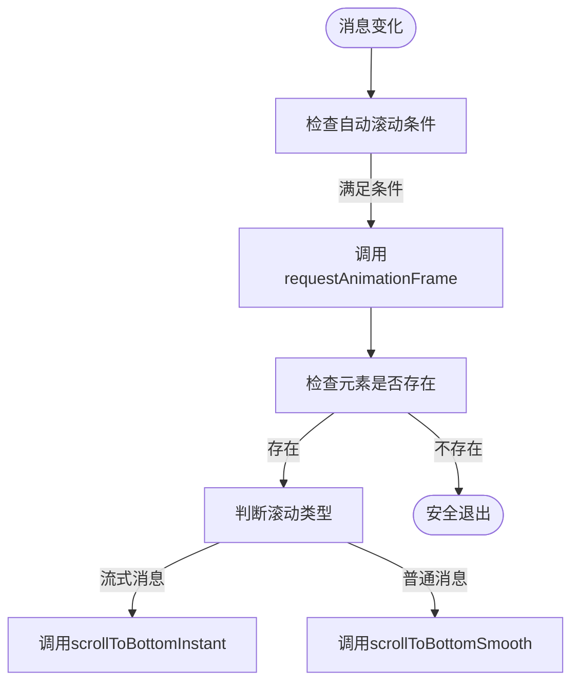

**性能来源**
- [chat_messages.tsx](file://frontend/src/pages/home/chat/chat_messages.tsx#L273-L290)

## 用户体验优化

### 智能滚动策略
分析智能滚动策略的实现逻辑：

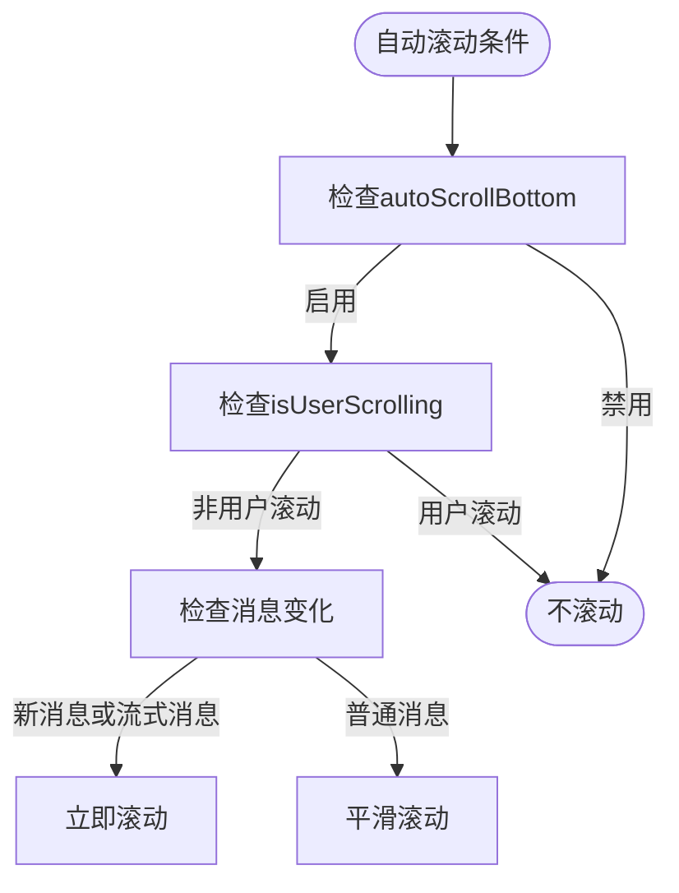

**策略来源**
- [chat_messages.tsx](file://frontend/src/pages/home/chat/chat_messages.tsx#L247-L275)

### 滚动到底部按钮逻辑
分析滚动到底部按钮的显示逻辑：

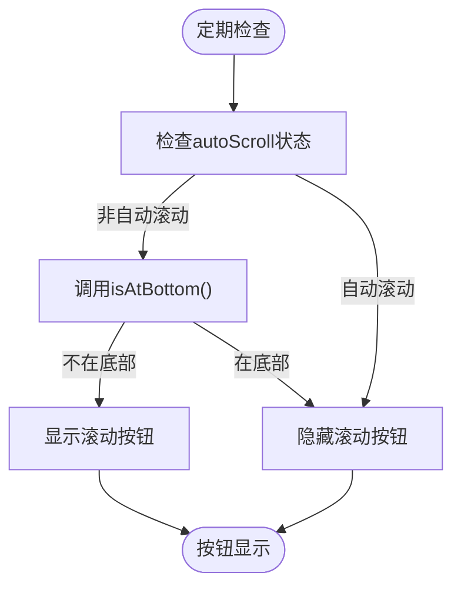

**按钮来源**
- [index.tsx](file://frontend/src/pages/home/chat/index.tsx#L145-L168)

## 结论
本文档全面分析了聊天应用中的滚动控制机制，深入解析了ChatMessagesRef接口的各个方法实现原理。通过React.forwardRef和useImperativeHandle的组合使用，实现了安全的父子组件通信。文档详细阐述了瞬时滚动和平滑滚动的实现差异，以及如何通过节流优化提升性能。同时，文档还探讨了用户滚动检测、自动滚动恢复等用户体验优化策略。这些设计共同构成了一个高效、流畅的聊天消息滚动控制系统，为用户提供优质的交互体验。