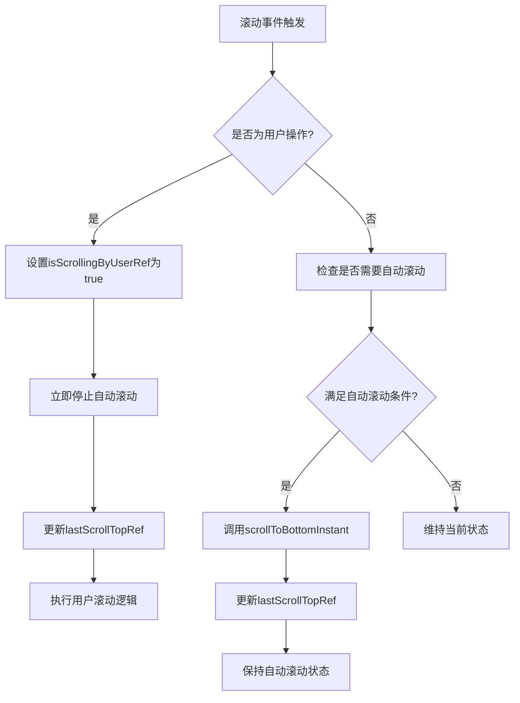
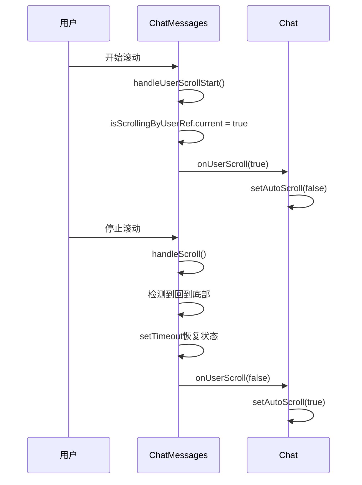

# 引用状态管理

<cite>
**本文档中引用的文件**  
- [chat_messages.tsx](file://frontend/src/pages/home/chat/chat_messages.tsx)
- [index.tsx](file://frontend/src/pages/home/chat/index.tsx)
- [SCROLL_OPTIMIZATION.md](file://frontend/doc/SCROLL_OPTIMIZATION.md)
</cite>

## 目录
1. [引言](#引言)
2. [核心引用对象分析](#核心引用对象分析)
3. [滚动状态管理机制](#滚动状态管理机制)
4. [滚动优化实现细节](#滚动优化实现细节)
5. [内存泄漏防护策略](#内存泄漏防护策略)
6. [总结](#总结)

## 引言
在聊天界面的滚动行为优化中，`useRef` 起到了至关重要的作用。由于函数组件的闭包特性，使用 `useState` 管理高频滚动事件中的状态会导致滞后问题，无法保证实时性。本文档深入解析 `lastScrollTopRef`、`isScrollingByUserRef`、`scrollTimeoutRef` 等引用对象如何协同工作，解决滚动状态同步问题，并确保跨回调间的状态一致性。

## 核心引用对象分析

### lastScrollTopRef
该引用用于记录上一次的滚动位置，通过比较当前滚动位置与记录值的差异，精确判断用户是否进行了主动滚动操作。在 `handleScroll` 回调中，任何大于0的滚动差值都会被识别为用户行为，从而立即响应。

**Section sources**
- [chat_messages.tsx](file://frontend/src/pages/home/chat/chat_messages.tsx#L71-L119)

### isScrollingByUserRef
此布尔型引用标记用户是否正在主动滚动。与 `useState` 不同，`useRef` 提供了同步可变的存储，避免了因异步更新机制导致的状态滞后。在 `handleUserScrollStart` 中，该引用被立即设置为 `true`，确保在AI生成消息过程中，用户轻微滚动即可立即停止自动滚动。

**Section sources**
- [chat_messages.tsx](file://frontend/src/pages/home/chat/chat_messages.tsx#L187-L216)

### scrollTimeoutRef
该引用存储 `setTimeout` 返回的定时器ID，用于延迟恢复滚动状态或执行防抖逻辑。通过在 `useEffect` 的清理函数中清除定时器，有效防止了内存泄漏。

**Section sources**
- [chat_messages.tsx](file://frontend/src/pages/home/chat/chat_messages.tsx#L71-L119)

## 滚动状态管理机制

### 为何不能仅依赖useState
`useState` 的异步更新机制在高频滚动事件中无法保证实时性。当多个滚动事件快速触发时，状态更新可能被合并或延迟，导致组件无法及时响应用户的滚动意图。而 `useRef` 提供了同步访问和修改的能力，确保每次滚动事件都能立即读取和更新最新状态。

### useRef的同步可变性优势
在 `scrollToBottomInstant` 函数中，`lastScrollTopRef.current` 被直接赋值为新的滚动位置，这种同步操作确保了状态的即时一致性。同样，在 `handleScroll` 和 `handleUserScrollStart` 中，对 `isScrollingByUserRef` 的读写操作都是即时生效的，避免了闭包陷阱。

**Diagram sources**
- [chat_messages.tsx](file://frontend/src/pages/home/chat/chat_messages.tsx#L71-L119)
- [chat_messages.tsx](file://frontend/src/pages/home/chat/chat_messages.tsx#L121-L151)

## 滚动优化实现细节

### 高敏感度滚动检测
系统实现了"零容忍检测"机制，任何大于0px的滚动变化都会被识别为用户操作。通过同时监听 `scroll`、`wheel`、`touchstart`、`touchmove` 和 `keydown` 事件，确保了鼠标、触摸和键盘所有输入方式的全面覆盖。

### 智能滚动策略选择
根据消息状态智能选择滚动方式：
- 流式生成消息时使用 `scrollToBottomInstant`（无动画）
- 普通消息使用 `scrollToBottomSmooth`（平滑滚动）
- 用户主动滚动回到底部时自动恢复自动滚动

**Diagram sources**
- [chat_messages.tsx](file://frontend/src/pages/home/chat/chat_messages.tsx#L187-L216)
- [index.tsx](file://frontend/src/pages/home/chat/index.tsx#L85-L115)

## 内存泄漏防护策略

### useEffect清理函数
通过在 `useEffect` 中返回清理函数，确保组件卸载时清除所有定时器和事件监听器：

**Diagram sources**
- [chat_messages.tsx](file://frontend/src/pages/home/chat/chat_messages.tsx#L218-L245)

### 定时器管理
所有通过 `setTimeout` 创建的定时器都存储在 `useRef` 中，并在以下时机清除：
- 组件卸载时
- 新的滚动事件触发时
- 用户操作结束时

**Section sources**
- [chat_messages.tsx](file://frontend/src/pages/home/chat/chat_messages.tsx#L218-L245)

## 总结
`useRef` 在滚动优化中解决了函数组件闭包导致的状态滞后问题，提供了同步可变的引用存储。`lastScrollTopRef`、`isScrollingByUserRef`、`scrollTimeoutRef` 等引用对象协同工作，实现了高敏感度的滚动检测和智能的滚动策略。通过在 `useEffect` 中返回清理函数，有效防止了内存泄漏，确保了应用的稳定性和性能。