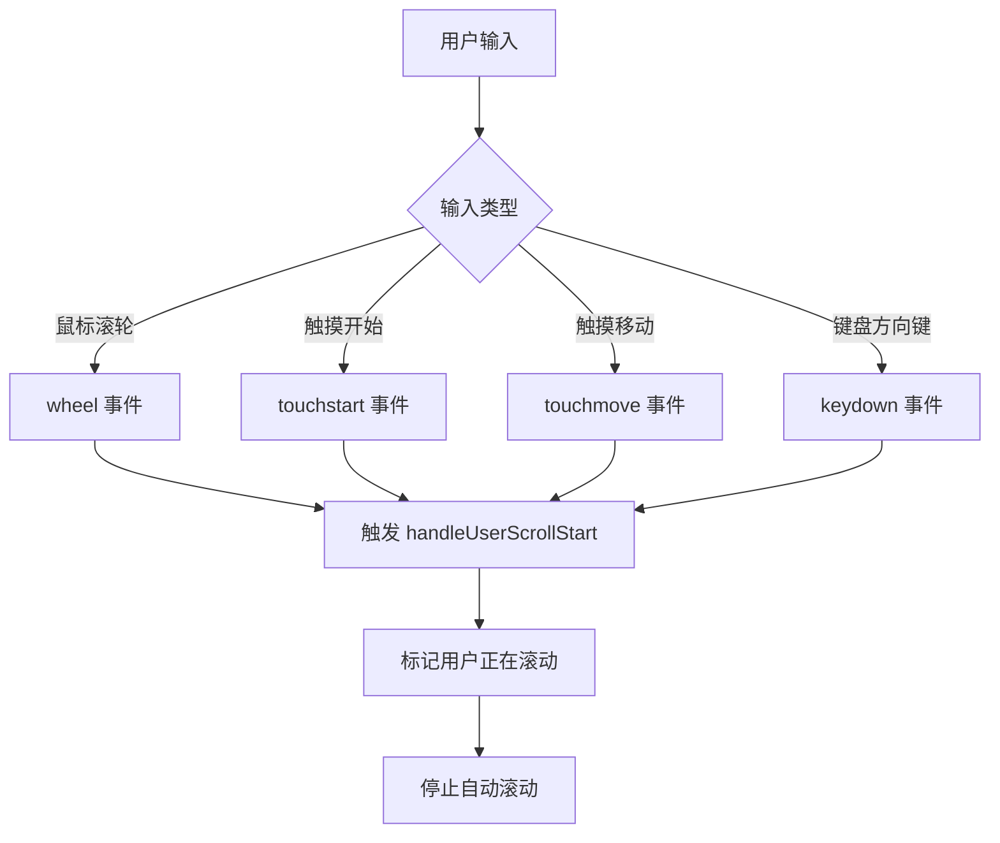
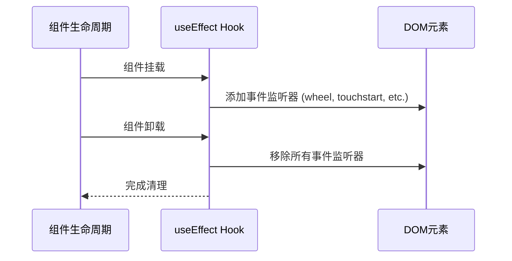

# 事件监听机制

<cite>
**本文档中引用的文件**
- [chat_messages.tsx](file://frontend/src/pages/home/chat/chat_messages.tsx)
- [SCROLL_OPTIMIZATION.md](file://frontend/doc/SCROLL_OPTIMIZATION.md)
</cite>

## 目录
1. [引言](#引言)
2. [事件监听实现方式](#事件监听实现方式)
3. [passive: true 选项的性能优化原理](#passivetrue-选项的性能优化原理)
4. [useEffect 中的生命周期管理](#useeffect-中的生命周期管理)
5. [不同输入方式的覆盖策略与用户体验](#不同输入方式的覆盖策略与用户体验)
6. [总结](#总结)

## 引言
在现代Web应用中，滚动行为的流畅性直接影响用户体验，尤其是在聊天界面等需要实时响应的场景中。本项目通过精细化的事件监听机制，实现了对用户滚动行为的即时检测与响应。核心目标是在AI消息生成过程中，允许用户随时中断自动滚动并手动浏览历史内容，同时确保在用户返回底部时能智能恢复自动滚动。

为实现这一目标，系统对 `wheel`、`touchstart`、`touchmove` 和 `keydown` 四类关键事件进行了监听，并采用 `passive: true` 优化性能，结合 `useEffect` 进行生命周期管理，确保无内存泄漏。本文将详细解析该机制的实现原理与技术细节。

**Section sources**
- [chat_messages.tsx](file://frontend/src/pages/home/chat/chat_messages.tsx#L218-L245)
- [SCROLL_OPTIMIZATION.md](file://frontend/doc/SCROLL_OPTIMIZATION.md#L119-L157)

## 事件监听实现方式
系统在聊天消息容器上注册了多种事件监听器，以全面捕捉用户的滚动意图。这些事件包括：

- **`scroll` 事件**：监听容器的实际滚动行为，用于判断是否处于底部、检测滚动位置变化。
- **`wheel` 事件**：捕获鼠标滚轮操作，作为桌面端主要的滚动输入方式。
- **`touchstart` 和 `touchmove` 事件**：覆盖移动端触摸滑动操作，确保在触屏设备上的即时响应。
- **`keydown` 事件**：监听键盘方向键（如上下箭头、PageUp/Down等），支持键盘导航场景。

所有事件均绑定至 `chatMessagesPageRef.current` 容器元素，并通过 `addEventListener` 方法注册。其中，`handleUserScrollStart` 函数作为统一的事件处理器，被多个输入事件共享，确保一旦检测到用户输入，立即触发状态变更。

**Diagram sources**
- [chat_messages.tsx](file://frontend/src/pages/home/chat/chat_messages.tsx#L218-L245)

**Section sources**
- [chat_messages.tsx](file://frontend/src/pages/home/chat/chat_messages.tsx#L218-L245)
- [SCROLL_OPTIMIZATION.md](file://frontend/doc/SCROLL_OPTIMIZATION.md#L119-L157)

## passive: true 选项的性能优化原理
在注册 `wheel`、`touchstart`、`touchmove` 和 `keydown` 事件时，系统显式设置了 `{ passive: true }` 选项。该选项的核心作用是**告知浏览器该事件监听器不会调用 `preventDefault()`**，从而允许浏览器提前执行默认行为（如滚动），无需等待JavaScript执行完成。

### 性能提升机制
1. **消除滚动延迟**：在触摸设备上，浏览器通常会等待事件监听器执行完毕，以判断是否需要阻止默认滚动行为。若未设置 `passive: true`，即使监听器不调用 `preventDefault()`，浏览器仍会延迟滚动，导致明显的卡顿感。
2. **提升响应速度**：启用 `passive` 模式后，浏览器可立即开始滚动，显著提升触摸滑动的响应速度，实现“零延迟”体验。
3. **避免主线程阻塞**：`passive` 事件不会阻塞主线程，确保UI渲染流畅，尤其在复杂页面中优势明显。

### 适用场景
尽管 `passive` 模式禁止调用 `preventDefault()`，但在本场景中，系统仅需“检测”用户滚动意图，而无需“阻止”滚动行为，因此完全适用。这使得系统既能即时响应用户操作，又不影响原生滚动性能。

**Section sources**
- [chat_messages.tsx](file://frontend/src/pages/home/chat/chat_messages.tsx#L218-L245)
- [SCROLL_OPTIMIZATION.md](file://frontend/doc/SCROLL_OPTIMIZATION.md#L119-L157)

## useEffect 中的生命周期管理
事件监听器的绑定与解绑通过 `useEffect` Hook 进行管理，确保组件挂载时注册监听器，卸载时及时移除，避免内存泄漏。

### 绑定逻辑
在 `useEffect` 的回调函数中，首先获取 `chatMessagesPageRef.current` 引用的DOM元素，然后调用 `addEventListener` 注册各类事件监听器。依赖数组 `[handleScroll, handleUserScrollStart]` 确保监听器在回调函数变化时重新绑定。

### 解绑逻辑
`useEffect` 的返回函数作为清理函数，在组件卸载或依赖更新时自动执行。该函数调用 `removeEventListener` 移除所有已注册的事件监听器，包括：
- `scroll`
- `wheel`
- `touchstart`
- `touchmove`
- `keydown`

此机制确保即使组件频繁挂载/卸载，也不会累积无效的事件监听器，有效防止内存泄漏。

**Diagram sources**
- [chat_messages.tsx](file://frontend/src/pages/home/chat/chat_messages.tsx#L218-L245)

**Section sources**
- [chat_messages.tsx](file://frontend/src/pages/home/chat/chat_messages.tsx#L218-L245)

## 不同输入方式的覆盖策略与用户体验
系统通过监听多种输入事件，实现了对全平台、多设备的滚动行为覆盖，确保一致的用户体验。

### 覆盖策略
| 输入方式 | 事件类型 | 覆盖场景 |
|--------|--------|--------|
| 鼠标滚轮 | `wheel` | 桌面端精确滚动 |
| 触摸滑动 | `touchstart` / `touchmove` | 移动端自然手势操作 |
| 键盘导航 | `keydown` | 无障碍访问、键盘用户 |

`keydown` 事件特别监听了 `ArrowUp`、`ArrowDown`、`PageUp`、`PageDown`、`Home`、`End` 等键位，这些是用户进行页面导航的常用按键。一旦检测到这些按键，立即调用 `handleUserScrollStart`，标记用户正在滚动。

### 用户体验意义
1. **即时响应**：任何输入方式的微小滚动（>0px）都会立即停止自动滚动，实现“零容忍检测”。
2. **全设备兼容**：无论用户使用鼠标、手指还是键盘，都能获得一致的交互体验。
3. **智能恢复**：当用户手动滚动回底部时，系统自动恢复自动滚动模式，无需额外操作。
4. **无障碍支持**：键盘用户的操作被纳入检测范围，提升应用的可访问性。

该策略在 `SCROLL_OPTIMIZATION.md` 文档中被明确为“极致敏感滚动检测优化”，其效果是用户在AI生成过程中只需轻微滚动即可中断自动滚动，极大提升了交互的灵敏度与自然性。

**Section sources**
- [chat_messages.tsx](file://frontend/src/pages/home/chat/chat_messages.tsx#L218-L245)
- [SCROLL_OPTIMIZATION.md](file://frontend/doc/SCROLL_OPTIMIZATION.md#L119-L157)

## 总结
本系统的滚动检测机制通过精细化的事件监听与性能优化，实现了高灵敏度、低延迟的用户体验。核心要点包括：
- 使用 `wheel`、`touchstart`、`touchmove` 和 `keydown` 事件全面覆盖各种输入方式。
- 采用 `passive: true` 选项提升触摸设备的滚动响应速度，避免主线程阻塞。
- 利用 `useEffect` 的清理函数确保事件监听器在组件卸载时被正确移除，防止内存泄漏。
- 实现“零容忍”滚动检测，任何微小滚动均能立即中断自动滚动，并在回到底部时智能恢复。

该设计不仅提升了应用的性能与响应性，还确保了跨设备、跨输入方式的一致性体验，是现代Web应用中滚动交互的最佳实践。