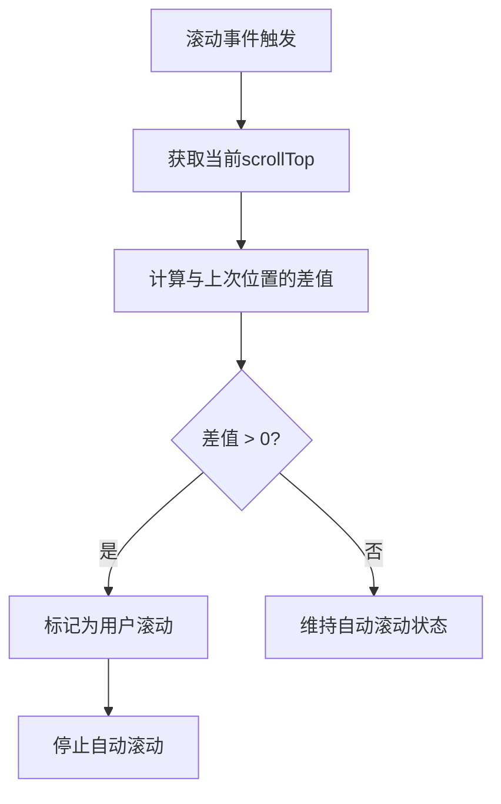
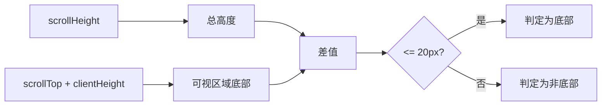
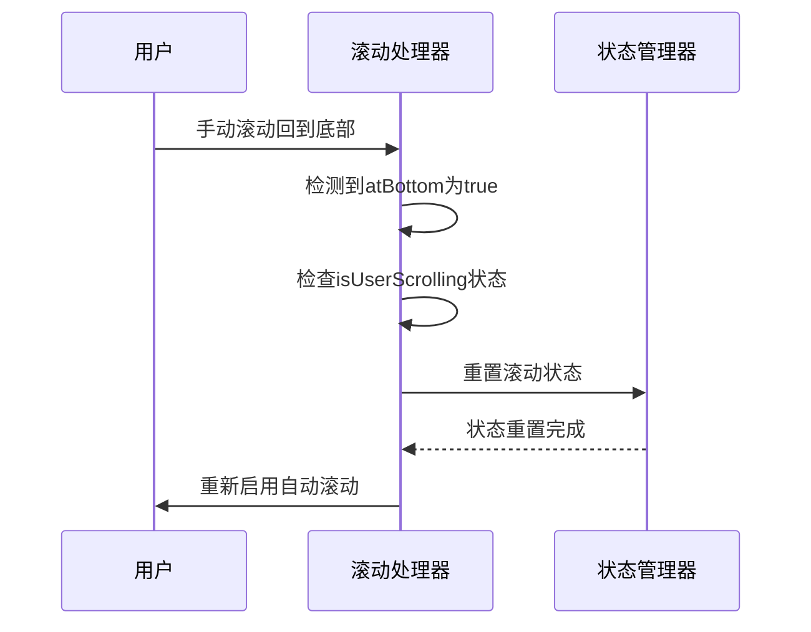

# 滚动方向与位置追踪

<cite>
**Referenced Files in This Document**   
- [chat_messages.tsx](file://frontend/src/pages/home/chat/chat_messages.tsx)
- [index.tsx](file://frontend/src/pages/home/chat/index.tsx)
- [SCROLL_OPTIMIZATION.md](file://frontend/doc/SCROLL_OPTIMIZATION.md)
</cite>

## 目录
1. [lastScrollTopRef的作用机制](#lastscrolltopref的作用机制)
2. [滚动方向判断与用户行为识别](#滚动方向判断与用户行为识别)
3. [isAtBottom函数的误差设计](#isatbottom函数的误差设计)
4. [自动滚动恢复逻辑](#自动滚动恢复逻辑)
5. [跨平台一致性考量](#跨平台一致性考量)

## lastScrollTopRef的作用机制

`lastScrollTopRef` 是一个使用 `useRef` 创建的引用对象，用于在组件生命周期内持久化存储上一次的滚动位置值。该引用在滚动行为检测中扮演着核心角色，通过与当前滚动位置 `currentScrollTop` 的比较，实现对用户滚动行为的精确追踪。

在 `chat_messages.tsx` 文件中，`lastScrollTopRef` 被初始化为 `0`，并在每次滚动事件发生时更新为当前的 `scrollTop` 值。这种设计确保了在任何一次滚动事件中，都能获取到前一次的精确位置，为滚动方向和距离的计算提供了基础数据。

**Section sources**
- [chat_messages.tsx](file://frontend/src/pages/home/chat/chat_messages.tsx#L57)

## 滚动方向判断与用户行为识别

滚动方向的判断是通过比较 `currentScrollTop` 与 `lastScrollTopRef.current` 的值来实现的。当 `currentScrollTop` 大于 `lastScrollTopRef.current` 时，表示用户正在向下滚动；反之，则表示用户正在向上滚动。

系统采用“零容忍检测”策略，即任何大于 `0` 的滚动位置变化都会被识别为用户主动滚动行为。这一机制通过计算 `scrollDiff = Math.abs(currentScrollTop - lastScrollTopRef.current)` 并检查其是否大于 `0` 来实现。这种高敏感度的设计确保了即使是最微小的滚动操作（如1-2px）也能被立即捕获，从而及时停止自动滚动功能。

**Diagram sources**
- [chat_messages.tsx](file://frontend/src/pages/home/chat/chat_messages.tsx#L134)

**Section sources**
- [chat_messages.tsx](file://frontend/src/pages/home/chat/chat_messages.tsx#L121-L151)

## isAtBottom函数的误差设计

`isAtBottom` 函数用于判断聊天容器是否处于底部位置，其核心逻辑是通过计算 `scrollHeight - scrollTop - clientHeight` 的值来确定。该函数设计了一个 `20px` 的误差范围，即当上述计算结果小于或等于 `20` 时，即认为容器处于底部。

**Diagram sources**
- [chat_messages.tsx](file://frontend/src/pages/home/chat/chat_messages.tsx#L64)

**Section sources**
- [chat_messages.tsx](file://frontend/src/pages/home/chat/chat_messages.tsx#L64)
- [SCROLL_OPTIMIZATION.md](file://frontend/doc/SCROLL_OPTIMIZATION.md#L159-L198)

这一 `20px` 的误差范围设计是为了解决不同设备和浏览器环境下的精度问题。由于不同设备的像素比（DPR）、字体渲染、布局计算差异，可能导致精确的 `0px` 判断在某些情况下失效。通过引入 `20px` 的容差，系统能够在保证用户体验的同时，确保在各种设备和环境下都能稳定地识别底部状态，避免了因微小的渲染差异导致的功能异常。

## 自动滚动恢复逻辑

当用户手动滚动回到底部时，系统会触发自动滚动恢复逻辑。这一机制的关键在于 `lastScrollTopRef` 的作用。当 `handleScroll` 事件检测到用户滚动到底部（`atBottom` 为 `true`）且当前处于用户滚动状态（`isUserScrolling` 为 `true`）时，系统会执行恢复逻辑。

具体流程如下：首先清除所有相关的定时器，然后将 `isScrollingByUserRef.current` 和 `isUserScrolling` 重置为 `false`，并调用 `onUserScroll?.(false)` 通知上层组件滚动状态已恢复。最后，更新 `lastScrollTopRef.current` 为当前滚动位置并返回，避免后续逻辑干扰。

**Diagram sources**
- [chat_messages.tsx](file://frontend/src/pages/home/chat/chat_messages.tsx#L149-L185)

**Section sources**
- [chat_messages.tsx](file://frontend/src/pages/home/chat/chat_messages.tsx#L149-L185)
- [index.tsx](file://frontend/src/pages/home/chat/index.tsx#L117-L143)

## 跨平台一致性考量

为了确保在不同设备和浏览器环境下的一致性体验，系统在多个层面进行了优化。首先，`20px` 的误差范围设计本身就是针对跨平台差异的解决方案，它平衡了不同设备的像素比和布局渲染差异。

其次，系统通过监听多种用户输入事件（`wheel`、`touchstart`、`touchmove`、`keydown`）来确保在各种输入方式下都能准确检测用户滚动行为。这种全输入方式覆盖的设计保证了在桌面端、移动端以及键盘操作场景下，滚动检测的敏感度和响应速度都保持一致。

最后，通过使用 `useRef` 来存储状态，避免了闭包陷阱，确保了在异步操作和事件回调中状态的一致性和准确性。这些设计共同作用，确保了滚动行为检测和自动滚动功能在各种环境下都能提供稳定、可靠的用户体验。

**Section sources**
- [SCROLL_OPTIMIZATION.md](file://frontend/doc/SCROLL_OPTIMIZATION.md#L260-L279)