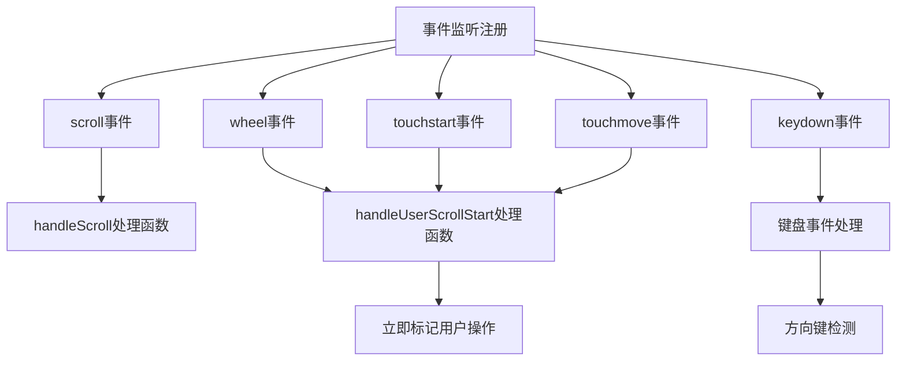
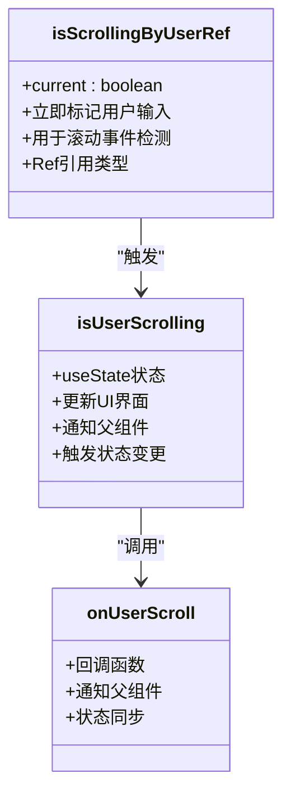
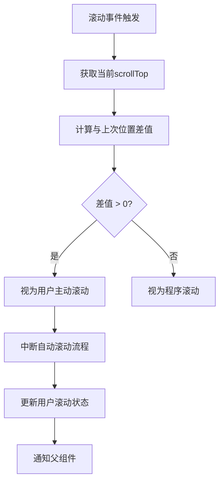

# 滚动检测机制

<cite>
**Referenced Files in This Document**   
- [chat_messages.tsx](file://frontend/src/pages/home/chat/chat_messages.tsx)
- [SCROLL_OPTIMIZATION.md](file://frontend/doc/SCROLL_OPTIMIZATION.md)
</cite>

## 目录
1. [引言](#引言)
2. [核心状态管理](#核心状态管理)
3. [事件监听与用户输入检测](#事件监听与用户输入检测)
4. [双重判断逻辑](#双重判断逻辑)
5. [零容忍滚动策略](#零容忍滚动策略)
6. [滚动方向判断与状态同步](#滚动方向判断与状态同步)
7. [性能优化与被动监听](#性能优化与被动监听)
8. [总结](#总结)

## 引言

本文档详细阐述消息列表的滚动检测机制，重点分析如何通过多种用户输入事件实现即时操作检测。系统采用双重状态判断逻辑和零容忍策略，确保在AI消息生成过程中能够立即响应任何用户滚动行为，提供流畅的用户体验。

**Section sources**
- [chat_messages.tsx](file://frontend/src/pages/home/chat/chat_messages.tsx#L1-L50)

## 核心状态管理

滚动检测机制依赖于多个Ref引用和状态变量来精确跟踪用户交互行为：

- `isScrollingByUserRef`：使用useRef创建的布尔引用，用于立即标记用户输入行为
- `isUserScrolling`：使用useState管理的UI状态，用于更新组件状态并通知父组件
- `lastScrollTopRef`：记录上一次滚动位置，用于判断滚动方向和变化量
- `userScrollDetectionRef`：存储滚动结束检测定时器
- `userInteractionTimeoutRef`：存储用户交互标记重置定时器

这些状态共同构成了滚动检测的基础，确保系统能够准确区分用户主动滚动和程序自动滚动。

**Section sources**
- [chat_messages.tsx](file://frontend/src/pages/home/chat/chat_messages.tsx#L30-L50)

## 事件监听与用户输入检测

### 事件监听注册

系统通过useEffect在消息容器上注册多种用户输入事件监听器：

**Diagram sources**
- [chat_messages.tsx](file://frontend/src/pages/home/chat/chat_messages.tsx#L218-L245)

### 即时用户操作检测

系统采用即时响应策略，通过`handleUserScrollStart`函数处理用户输入事件：

- **wheel事件**：鼠标滚轮操作立即触发
- **touchstart/touchmove事件**：触摸屏操作立即触发
- **keydown事件**：方向键、PageUp/Down、Home/End键触发

键盘事件特别处理了方向键和页面导航键，确保所有可能引起滚动的键盘操作都能被检测到。

**Section sources**
- [chat_messages.tsx](file://frontend/src/pages/home/chat/chat_messages.tsx#L218-L245)

## 双重判断逻辑

### 状态分离设计

系统采用双重判断逻辑来区分不同层面的滚动状态：

**Diagram sources**
- [chat_messages.tsx](file://frontend/src/pages/home/chat/chat_messages.tsx#L30-L50)

### 逻辑分工

- **isScrollingByUserRef**：作为"第一道防线"，在用户任何输入事件发生时立即设置为true，确保滚动事件能够检测到用户行为
- **isUserScrolling**：作为"状态通知"，用于更新组件状态和通知父组件，影响UI显示和自动滚动行为

这种分离设计避免了状态更新的延迟问题，确保即使在React状态更新周期内也能立即响应用户操作。

**Section sources**
- [chat_messages.tsx](file://frontend/src/pages/home/chat/chat_messages.tsx#L187-L216)

## 零容忍滚动策略

### 实现原理

零容忍滚动策略的核心是：任何大于0px的scrollTop变化均视为用户主动干预。

**Diagram sources**
- [chat_messages.tsx](file://frontend/src/pages/home/chat/chat_messages.tsx#L121-L151)

### 技术实现

在`handleScroll`函数中实现零容忍策略：

1. 计算当前滚动位置与上次记录位置的差值
2. 如果差值大于0，且`isScrollingByUserRef`为true，则立即触发用户滚动状态
3. 重置所有相关定时器和状态

这种策略确保了即使是最微小的用户滚动操作也能被立即捕获，提供极致敏感的用户体验。

**Section sources**
- [chat_messages.tsx](file://frontend/src/pages/home/chat/chat_messages.tsx#L121-L151)

## 滚动方向判断与状态同步

### lastScrollTopRef的作用

`lastScrollTopRef`在滚动方向判断中扮演关键角色：

- 记录每次滚动事件发生前的scrollTop值
- 通过比较当前值与记录值的差值判断是否有滚动发生
- 避免因防抖延迟导致的状态不同步问题

### 状态同步机制

系统通过以下机制确保状态同步：

1. **即时标记**：在用户输入事件发生时立即标记`isScrollingByUserRef`
2. **滚动验证**：在scroll事件中验证实际滚动变化
3. **定时器管理**：清除所有相关定时器，避免状态冲突
4. **最终状态重置**：当用户停止滚动并回到底部时，重置所有状态

这种多层验证机制确保了状态的准确性和一致性，避免了因事件顺序或延迟导致的状态错误。

**Section sources**
- [chat_messages.tsx](file://frontend/src/pages/home/chat/chat_messages.tsx#L149-L185)

## 性能优化与被动监听

### Passive模式的影响

所有事件监听器都使用`{ passive: true }`选项：

- 提高滚动性能，避免事件处理阻塞滚动
- 允许浏览器进行滚动优化
- 防止滚动卡顿和延迟

### 性能优化措施

系统采用多项性能优化措施：

- 使用`requestAnimationFrame`优化滚动动画
- 节流不必要的滚动操作
- 精确的依赖数组避免不必要的重新渲染
- 清理定时器防止内存泄漏

这些优化确保了滚动检测机制在提供高敏感度的同时，保持良好的性能表现。

**Section sources**
- [chat_messages.tsx](file://frontend/src/pages/home/chat/chat_messages.tsx#L218-L245)

## 总结

消息列表的滚动检测机制通过多重事件监听、双重状态判断和零容忍策略，实现了极致敏感的用户操作检测。系统能够立即响应任何用户滚动行为，同时保持良好的性能表现。这种设计确保了在AI消息生成过程中，用户可以随时中断自动滚动并进行手动浏览，提供流畅自然的交互体验。

**Section sources**
- [chat_messages.tsx](file://frontend/src/pages/home/chat/chat_messages.tsx#L1-L513)
- [SCROLL_OPTIMIZATION.md](file://frontend/doc/SCROLL_OPTIMIZATION.md#L1-L279)