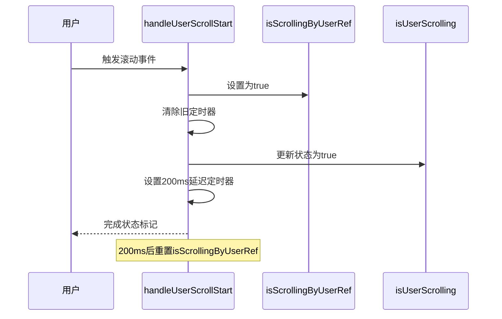

# 用户滚动状态管理

<cite>
**本文档引用的文件**   
- [chat_messages.tsx](file://frontend/src/pages/home/chat/chat_messages.tsx)
- [index.tsx](file://frontend/src/pages/home/chat/index.tsx)
- [SCROLL_OPTIMIZATION.md](file://frontend/doc/SCROLL_OPTIMIZATION.md)
</cite>

## 目录
1. [用户滚动状态管理](#用户滚动状态管理)
2. [双重状态机制解析](#双重状态机制解析)
3. [isScrollingByUserRef与isUserScrolling的协同工作](#isscrollingbyuserref与isuserscrolling的协同工作)
4. [handleUserScrollStart函数的时序控制](#handleuserscrollstart函数的时序控制)
5. [状态分离设计的优势](#状态分离设计的优势)
6. [200ms延迟重置策略](#200ms延迟重置策略)

## 双重状态机制解析

在聊天界面的滚动管理中，采用了`isScrollingByUserRef`与`isUserScrolling`的双重状态机制。`isScrollingByUserRef`作为`useRef`标记，用于即时捕获用户操作意图，而`isUserScrolling`作为`useState`状态，驱动UI更新和通知父组件。这种设计确保了在流式响应生成期间能立即响应用户干预，避免状态更新延迟导致的自动滚动误触发。

**Section sources**
- [chat_messages.tsx](file://frontend/src/pages/home/chat/chat_messages.tsx#L55-L60)

## isScrollingByUserRef与isUserScrolling的协同工作

`isScrollingByUserRef`通过`useRef`创建，其值的改变不会触发组件重新渲染，能够在任何时刻立即标记用户正在滚动的状态。当用户触发滚动事件时，`isScrollingByUserRef.current`被立即设置为`true`，确保了对用户操作的即时响应。与此同时，`isUserScrolling`作为`useState`状态，其更新会触发UI重新渲染，并通过`onUserScroll`回调通知父组件，实现状态的外部同步。

**Section sources**
- [chat_messages.tsx](file://frontend/src/pages/home/chat/chat_messages.tsx#L55-L60)
- [index.tsx](file://frontend/src/pages/home/chat/index.tsx#L77)

## handleUserScrollStart函数的时序控制

`handleUserScrollStart`函数是用户滚动状态管理的核心。当用户开始滚动时，该函数立即执行，首先将`isScrollingByUserRef.current`设置为`true`，标记用户正在滚动。随后，清除之前设置的定时器，避免状态冲突。紧接着，通过`setIsUserScrolling(true)`更新状态，触发UI更新和父组件的回调。最后，设置一个200ms的延迟定时器，在用户停止滚动后重置`isScrollingByUserRef.current`为`false`，完成状态的闭环管理。

**Diagram sources**
- [chat_messages.tsx](file://frontend/src/pages/home/chat/chat_messages.tsx#L188-L208)

**Section sources**
- [chat_messages.tsx](file://frontend/src/pages/home/chat/chat_messages.tsx#L188-L208)

## 状态分离设计的优势

将`isScrollingByUserRef`与`isUserScrolling`分离设计，具有显著优势。首先，`useRef`的即时性确保了用户操作意图的捕获不受React渲染周期的影响，避免了因状态更新延迟而导致的自动滚动误触发。其次，`useState`的状态更新机制保证了UI的及时响应和父组件的状态同步。这种分离设计在流式响应生成期间尤为重要，能够确保系统立即响应用户干预，提升用户体验。

**Section sources**
- [chat_messages.tsx](file://frontend/src/pages/home/chat/chat_messages.tsx#L55-L60)
- [SCROLL_OPTIMIZATION.md](file://frontend/doc/SCROLL_OPTIMIZATION.md#L0-L23)

## 200ms延迟重置策略

200ms延迟重置策略是确保滚动状态准确管理的关键。当用户开始滚动时，`isScrollingByUserRef.current`被立即设置为`true`，并在200ms后自动重置为`false`。这一延迟时间经过精心设计，既能确保捕捉到用户的连续滚动操作，又能在用户停止滚动后及时恢复自动滚动状态。该策略有效平衡了灵敏度与稳定性，避免了因短暂滚动而永久禁用自动滚动的问题。

**Section sources**
- [chat_messages.tsx](file://frontend/src/pages/home/chat/chat_messages.tsx#L206)
- [SCROLL_OPTIMIZATION.md](file://frontend/doc/SCROLL_OPTIMIZATION.md#L119-L157)