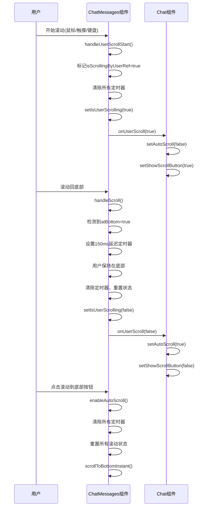

# 自动滚动中断与恢复机制

<cite>
**本文档引用文件**  
- [chat_messages.tsx](file://frontend/src/pages/home/chat/chat_messages.tsx)
- [index.tsx](file://frontend/src/pages/home/chat/index.tsx)
- [SCROLL_OPTIMIZATION.md](file://frontend/doc/SCROLL_OPTIMIZATION.md)
</cite>

## 目录
1. [用户滚动中断自动滚动机制](#用户滚动中断自动滚动机制)
2. [手动回到底部自动恢复机制](#手动回到底部自动恢复机制)
3. [enableAutoScroll方法调用时机与状态重置](#enableautoscroll方法调用时机与状态重置)
4. [整体流程图解](#整体流程图解)

## 用户滚动中断自动滚动机制

当用户开始滚动聊天消息区域时，系统会立即中断自动滚动流程，确保用户能够自由浏览历史消息。该机制通过多重事件监听和即时状态更新实现。

系统通过`handleUserScrollStart`函数监听多种用户输入事件，包括鼠标滚轮(`wheel`)、触摸屏操作(`touchstart`, `touchmove`)以及键盘方向键(`keydown`)。一旦检测到任何用户输入行为，立即执行以下操作链路：

1. **标记用户操作状态**：通过`isScrollingByUserRef.current = true`立即标记用户正在主动滚动
2. **清除相关定时器**：清除`userInteractionTimeoutRef`和`userScrollDetectionRef`中的所有定时器，防止后续干扰
3. **更新UI状态**：调用`setIsUserScrolling(true)`更新React状态，并通过`onUserScroll?.(true)`通知父组件
4. **中断自动滚动**：父组件`index.tsx`接收到滚动状态后，立即设置`autoScroll = false`，停止自动滚动行为

该机制采用"零容忍检测"策略，任何大于0px的滚动位置变化都会被立即捕获，确保在AI消息生成过程中也能即时响应用户操作。

**Section sources**
- [chat_messages.tsx](file://frontend/src/pages/home/chat/chat_messages.tsx#L187-L216)
- [chat_messages.tsx](file://frontend/src/pages/home/chat/chat_messages.tsx#L218-L245)

## 手动回到底部自动恢复机制

当用户手动滚动回聊天区域底部时，系统会通过150ms延迟检测来确认用户意图，并自动恢复自动滚动模式，提供无缝的用户体验。

该机制的核心在于精确判断用户是否真正想要返回到底部并重新启用自动跟踪。具体流程如下：

1. **底部位置检测**：通过计算`scrollHeight - scrollTop - clientHeight <= 20`来判断是否接近底部（允许20px误差）
2. **延迟确认机制**：当检测到用户滚动到底部且处于手动滚动状态时，设置150ms的延迟定时器
3. **状态重置**：在延迟期间若用户保持在底部位置，则执行状态重置：
   - 清除所有相关定时器
   - 重置`isScrollingByUserRef.current = false`
   - 更新`setIsUserScrolling(false)`
   - 通过`onUserScroll?.(false)`通知父组件
4. **恢复自动滚动**：父组件接收到状态更新后，设置`autoScroll = true`，重新启用自动滚动

150ms的延迟设计是为了确认用户不是短暂经过底部，而是真正想要停留在底部继续跟随最新消息，避免了频繁的状态切换。

**Section sources**
- [chat_messages.tsx](file://frontend/src/pages/home/chat/chat_messages.tsx#L121-L151)
- [chat_messages.tsx](file://frontend/src/pages/home/chat/chat_messages.tsx#L149-L185)

## enableAutoScroll方法调用时机与状态重置

`enableAutoScroll`方法在特定用户交互场景下被调用，负责重置所有滚动相关状态并恢复自动滚动模式，确保用户体验的连贯性。

### 调用时机

该方法主要在以下两种场景中被调用：

1. **点击"滚动到底部"按钮时**：当用户点击界面中的滚动到底部按钮，触发`handleScrollToBottom`回调，进而调用`chatMessagesRef.current.enableAutoScroll()`
2. **发送新消息时**：当用户发送新消息后，系统自动调用此方法确保新消息可见并保持自动滚动状态

### 内部状态重置逻辑

`enableAutoScroll`方法执行时会进行完整的状态重置：

1. **清除所有定时器**：
   - 清除`userInteractionTimeoutRef`中的用户交互定时器
   - 清除`userScrollDetectionRef`中的滚动检测定时器
2. **重置滚动状态**：
   - 设置`isScrollingByUserRef.current = false`
   - 调用`setIsUserScrolling(false)`更新React状态
   - 通过`onUserScroll?.(false)`通知父组件滚动状态
3. **立即滚动到底部**：调用`scrollToBottomInstant()`方法立即将视图滚动到底部，无需动画效果以确保即时性

这种全面的状态重置确保了系统从任何滚动状态都能干净地恢复到自动滚动模式，避免了状态混乱导致的异常行为。

**Section sources**
- [chat_messages.tsx](file://frontend/src/pages/home/chat/chat_messages.tsx#L103-L119)
- [index.tsx](file://frontend/src/pages/home/chat/index.tsx#L76-L91)

## 整体流程图解

**Diagram sources**
- [chat_messages.tsx](file://frontend/src/pages/home/chat/chat_messages.tsx)
- [index.tsx](file://frontend/src/pages/home/chat/index.tsx)

**Section sources**
- [chat_messages.tsx](file://frontend/src/pages/home/chat/chat_messages.tsx)
- [index.tsx](file://frontend/src/pages/home/chat/index.tsx)
- [SCROLL_OPTIMIZATION.md](file://frontend/doc/SCROLL_OPTIMIZATION.md)