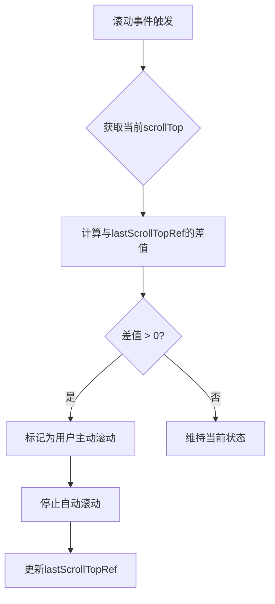
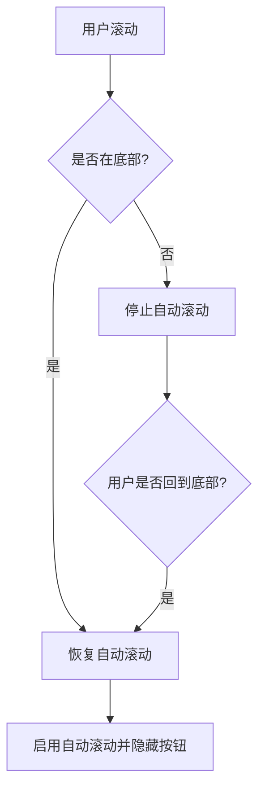

# 零容忍滚动检测策略

<cite>
**本文档引用文件**  
- [chat_messages.tsx](file://frontend/src/pages/home/chat/chat_messages.tsx)
- [SCROLL_OPTIMIZATION.md](file://frontend/doc/SCROLL_OPTIMIZATION.md)
- [index.tsx](file://frontend/src/pages/home/chat/index.tsx)
</cite>

## 目录
1. [引言](#引言)
2. [零容忍滚动策略核心原理](#零容忍滚动策略核心原理)
3. [handleScroll函数实现细节分析](#handlescroll函数实现细节分析)
4. [与v2.1版本的对比：解决大范围滚动中断问题](#与v21版本的对比解决大范围滚动中断问题)
5. [误差范围≤20px的底部判断与零容忍检测的协同机制](#误差范围≤20px的底部判断与零容忍检测的协同机制)
6. [总结](#总结)

## 引言

在现代聊天应用中，自动滚动与用户手动滚动的智能协调是提升用户体验的关键。本项目通过“零容忍滚动检测策略”，实现了极致敏感的滚动行为控制。该策略确保在AI消息生成过程中，任何微小的用户滚动操作都能被立即识别并响应，从而停止自动滚动，真正实现“以用户意图为先”的产品理念。

**Section sources**  
- [SCROLL_OPTIMIZATION.md](file://frontend/doc/SCROLL_OPTIMIZATION.md#L0-L51)

## 零容忍滚动策略核心原理

零容忍滚动策略的核心在于：**任何大于0px的scrollTop变化均被视为用户主动干预**。这意味着即使用户仅滚动1px，系统也会立即判定为用户意图查看历史消息，从而中断自动滚动到底部的行为。

该策略打破了传统滚动检测中依赖“最小阈值”（如5px或10px）的设计，从根本上提升了检测的灵敏度。其设计哲学是：**用户的任何操作都应被尊重，无论其幅度大小**。通过这种“零容忍”机制，系统能够最快速度响应用户意图，避免因延迟响应而导致的界面跳动或操作冲突。

**Section sources**  
- [SCROLL_OPTIMIZATION.md](file://frontend/doc/SCROLL_OPTIMIZATION.md#L119-L157)

## handleScroll函数实现细节分析

`handleScroll` 函数是实现零容忍策略的核心逻辑所在。其通过 `lastScrollTopRef` 引用记录上一次的滚动位置，并通过计算当前滚动位置与上次位置的差值（`scrollDiff`）来判断用户行为。

**Diagram sources**  
- [chat_messages.tsx](file://frontend/src/pages/home/chat/chat_messages.tsx#L121-L151)

关键实现细节如下：

1. **滚动差值计算**：  
   `const scrollDiff = Math.abs(currentScrollTop - lastScrollTopRef.current);`  
   该计算用于检测任何位置变化，无论方向。

2. **用户行为判定**：  
   `if (scrollDiff > 0 && isScrollingByUserRef.current && !isUserScrolling)`  
   只有当存在位置变化、且已被标记为用户操作时，才触发状态变更，避免程序性滚动误判。

3. **状态即时更新**：  
   一旦判定为用户操作，立即通过 `setIsUserScrolling(true)` 更新状态，并通知父组件。

4. **位置记录更新**：  
   每次滚动事件结束时，更新 `lastScrollTopRef.current = currentScrollTop`，为下一次检测提供基准。

**Section sources**  
- [chat_messages.tsx](file://frontend/src/pages/home/chat/chat_messages.tsx#L121-L185)

## 与v2.1版本的对比：解决大范围滚动中断问题

在v2.1版本中，系统采用“高敏感度滚动检测”，其判定阈值为1px。尽管已大幅降低阈值，但用户仍需进行“明显滚动”才能中断自动滚动，导致体验不够流畅。

v2.2版本引入的“零容忍策略”通过以下改进彻底解决了该问题：

| 版本 | 检测机制 | 响应延迟 | 用户体验 |
|------|----------|----------|----------|
| v2.1 | `scrollDiff > 1` | 需累积变化 | 需明显滚动才能中断 |
| v2.2 | `scrollDiff > 0` | 即时响应 | 任何微小移动立即中断 |

此外，v2.2版本引入了双重检测机制：
- **输入事件监听**：通过 `wheel`、`touchstart`、`touchmove`、`keydown` 等事件，在用户操作瞬间标记 `isScrollingByUserRef.current = true`
- **滚动事件验证**：在 `handleScroll` 中结合位置变化进行最终判定

这种“事件+位置”的双重保险机制，确保了检测的即时性与准确性，实现了“极致敏感”的用户体验。

**Section sources**  
- [SCROLL_OPTIMIZATION.md](file://frontend/doc/SCROLL_OPTIMIZATION.md#L74-L121)

## 误差范围≤20px的底部判断与零容忍检测的协同机制

零容忍检测虽保证了灵敏度，但也可能因误判导致自动滚动频繁中断。为此，系统引入了“误差范围≤20px”的底部判断机制，与零容忍检测协同工作。

**Diagram sources**  
- [chat_messages.tsx](file://frontend/src/pages/home/chat/chat_messages.tsx#L121-L151)

具体协同逻辑如下：

1. **底部判断条件**：  
   `const atBottom = scrollHeight - currentScrollTop - clientHeight <= 20;`  
   允许20px的误差，避免因滚动惯性或渲染延迟导致的误判。

2. **智能恢复机制**：  
   当用户手动滚动后又回到底部时，系统会自动恢复自动滚动状态，无需用户点击按钮。

3. **定时器防抖**：  
   使用 `userScrollDetectionRef` 定时器（150ms）延迟恢复状态，确保用户操作已结束。

4. **状态同步**：  
   `isUserScrolling` 状态与UI按钮（`showScrollButton`）完全同步，确保用户始终能清晰感知当前滚动模式。

这种设计在保证极致灵敏的同时，通过合理的误差容忍和智能恢复机制，避免了误判和频繁状态切换，实现了灵敏度与稳定性的完美平衡。

**Section sources**  
- [chat_messages.tsx](file://frontend/src/pages/home/chat/chat_messages.tsx#L121-L185)

## 总结

零容忍滚动检测策略通过“任何>0px的滚动即视为用户干预”的核心原理，结合 `lastScrollTopRef` 的位置差值计算，实现了对用户行为的极致敏感检测。该策略彻底解决了v2.1版本中需大范围滚动才能中断自动滚动的问题，显著提升了用户体验。

同时，通过引入≤20px的底部误差判断和智能恢复机制，系统在保持高灵敏度的同时，避免了误判和状态抖动，实现了“智能跟随，尊重用户”的产品目标。该设计充分体现了以用户为中心的交互理念，为聊天类应用的滚动控制提供了优秀范例。

**Section sources**  
- [SCROLL_OPTIMIZATION.md](file://frontend/doc/SCROLL_OPTIMIZATION.md#L233-L258)
- [README.md](file://frontend/doc/README.md#L114-L124)