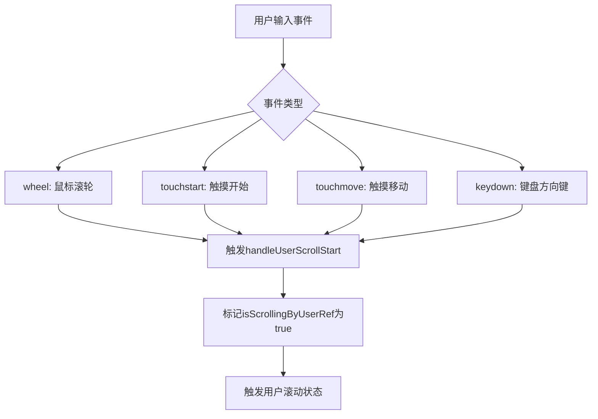
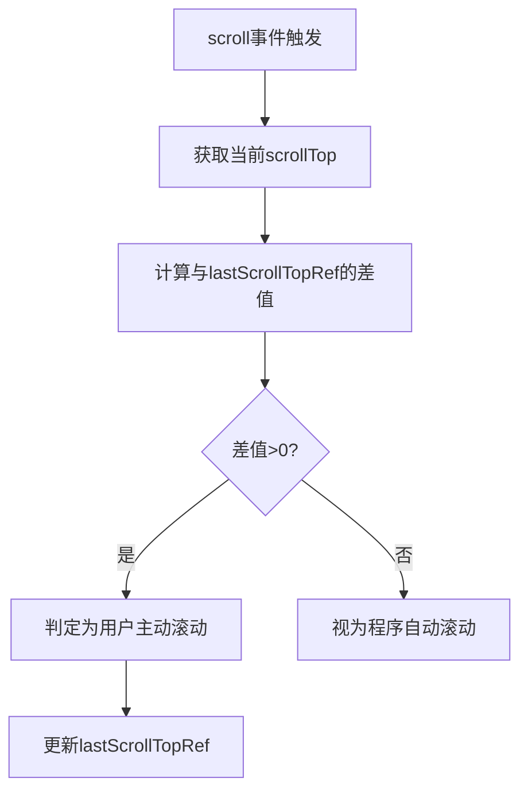
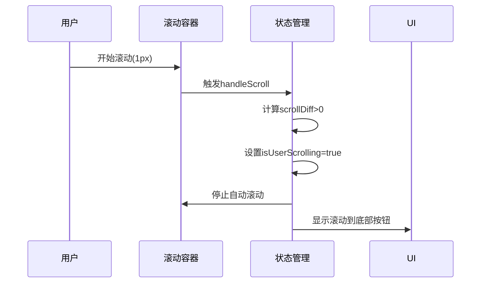
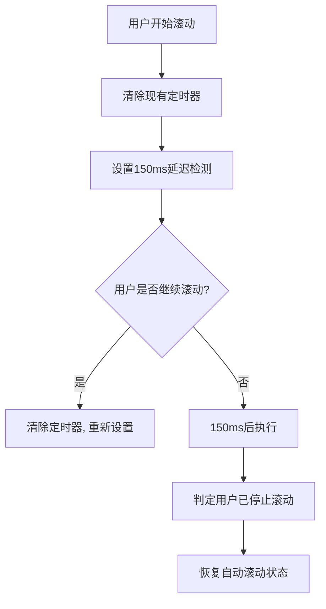
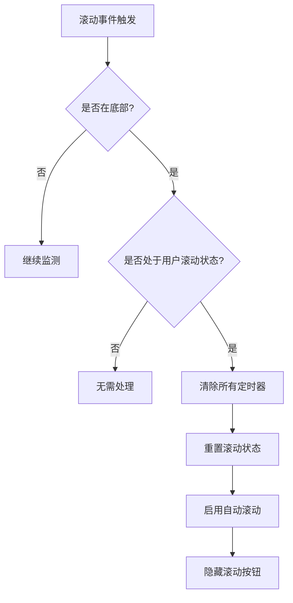
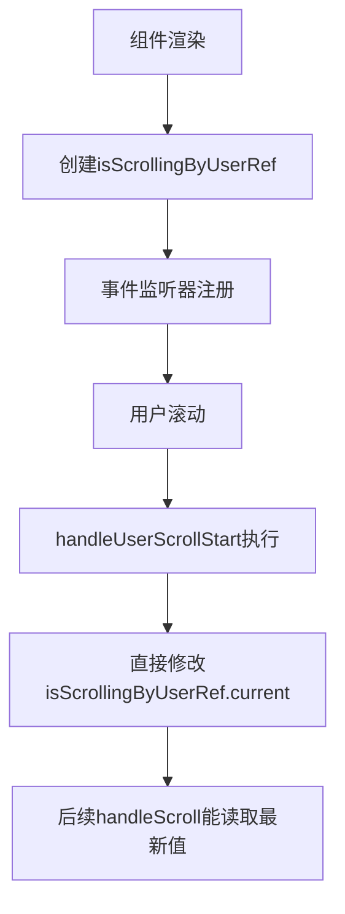
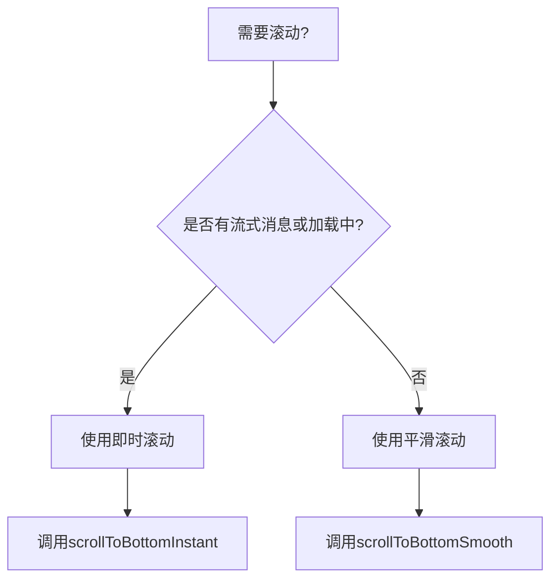

# 滚动行为优化策略

<cite>
**Referenced Files in This Document**  
- [SCROLL_OPTIMIZATION.md](file://frontend/doc/SCROLL_OPTIMIZATION.md)
- [chat_messages.tsx](file://frontend/src/pages/home/chat/chat_messages.tsx)
- [index.tsx](file://frontend/src/pages/home/chat/index.tsx)
</cite>

## 目录
1. [双重检测机制](#双重检测机制)
2. [零容忍滚动检测](#零容忍滚动检测)
3. [滚动结束延迟检测](#滚动结束延迟检测)
4. [智能恢复策略](#智能恢复策略)
5. [useRef状态管理](#useref状态管理)
6. [滚动策略选择](#滚动策略选择)

## 双重检测机制

为实现高敏感度的用户滚动检测，系统采用了事件监听与滚动位置变化相结合的双重检测机制。该机制通过即时事件响应与精确位置判断的协同工作，确保任何用户干预都能被准确捕获。

### 事件监听层检测

系统在滚动容器上注册了多种用户输入事件，实现对用户操作的即时响应：



**Diagram sources**  
- [chat_messages.tsx](file://frontend/src/pages/home/chat/chat_messages.tsx#L218-L245)

**Section sources**  
- [chat_messages.tsx](file://frontend/src/pages/home/chat/chat_messages.tsx#L187-L216)

### 滚动位置变化检测

在scroll事件中，系统通过比较当前滚动位置与上次记录位置的差异来判断用户是否进行了主动滚动操作：



**Diagram sources**  
- [chat_messages.tsx](file://frontend/src/pages/home/chat/chat_messages.tsx#L121-L151)

**Section sources**  
- [chat_messages.tsx](file://frontend/src/pages/home/chat/chat_messages.tsx#L121-L151)

## 零容忍滚动检测

系统实现了极致敏感的滚动检测机制，任何大于0px的滚动位移变化均被判定为用户主动操作，立即停止自动滚动功能。

### 检测阈值设置

与传统滚动检测使用5-10px作为阈值不同，本系统采用"零容忍"策略，将检测阈值设为0px：

```typescript
// 零容忍检测：任何滚动位置变化都视为用户操作
const scrollDiff = Math.abs(currentScrollTop - lastScrollTopRef.current);
const isUserInitiated = scrollDiff > 0; // 任何>0的变化都判定为用户操作
```

**Section sources**  
- [SCROLL_OPTIMIZATION.md](file://frontend/doc/SCROLL_OPTIMIZATION.md#L159-L198)

### 即时响应机制

当检测到用户滚动操作时，系统立即停止自动滚动并更新状态：



**Diagram sources**  
- [chat_messages.tsx](file://frontend/src/pages/home/chat/chat_messages.tsx#L121-L151)

**Section sources**  
- [chat_messages.tsx](file://frontend/src/pages/home/chat/chat_messages.tsx#L121-L151)

## 滚动结束延迟检测

为准确判断用户是否已停止交互并决定是否恢复自动滚动状态，系统采用了150ms的setTimeout延迟检测机制。

### 定时器管理

系统使用`userScrollDetectionRef`引用管理滚动结束检测定时器，确保在用户持续滚动时不会错误地恢复自动滚动：



**Section sources**  
- [chat_messages.tsx](file://frontend/src/pages/home/chat/chat_messages.tsx#L121-L151)

### 延迟时间选择

150ms的延迟时间经过精心选择，平衡了响应速度与误判率：

- **过短延迟**（如50ms）：可能导致在用户快速滚动过程中误判为已停止
- **过长延迟**（如300ms）：用户体验不够流畅，恢复自动滚动不及时
- **150ms**：既能确保用户已停止交互，又不会造成明显的延迟感

**Section sources**  
- [SCROLL_OPTIMIZATION.md](file://frontend/doc/SCROLL_OPTIMIZATION.md#L159-L198)

## 智能恢复策略

系统实现了智能的自动滚动恢复机制，当用户手动滚动回底部时，自动重新启用自动滚动功能，提升用户体验。

### 底部检测逻辑

系统通过比较滚动容器的滚动位置与可滚动范围来判断是否位于底部：

```typescript
// 允许20px误差范围的底部判断
const atBottom = scrollHeight - currentScrollTop - clientHeight <= 20;
```

**Section sources**  
- [chat_messages.tsx](file://frontend/src/pages/home/chat/chat_messages.tsx#L126-L128)

### 恢复条件判断

当满足以下条件时，系统会自动恢复自动滚动：



**Diagram sources**  
- [chat_messages.tsx](file://frontend/src/pages/home/chat/chat_messages.tsx#L138-L151)

**Section sources**  
- [chat_messages.tsx](file://frontend/src/pages/home/chat/chat_messages.tsx#L138-L151)

## useRef状态管理

为避免闭包陷阱并确保滚动状态的实时性，系统使用多个useRef引用存储关键状态。

### 状态引用列表

| 状态引用 | 用途 | 初始值 |
|--------|------|-------|
| `lastScrollTopRef` | 记录上次滚动位置 | 0 |
| `isScrollingByUserRef` | 标记用户是否正在滚动 | false |
| `userScrollDetectionRef` | 存储滚动结束检测定时器 | null |
| `userInteractionTimeoutRef` | 存储用户交互定时器 | null |

**Section sources**  
- [chat_messages.tsx](file://frontend/src/pages/home/chat/chat_messages.tsx#L57-L60)

### 闭包陷阱规避

通过使用useRef，系统确保了在事件回调中能访问到最新的状态值：



**Diagram sources**  
- [chat_messages.tsx](file://frontend/src/pages/home/chat/chat_messages.tsx#L187-L195)

**Section sources**  
- [chat_messages.tsx](file://frontend/src/pages/home/chat/chat_messages.tsx#L187-L195)

## 滚动策略选择

系统根据不同的消息场景选择合适的滚动策略，确保最佳用户体验。

### 滚动策略决策树



**Diagram sources**  
- [chat_messages.tsx](file://frontend/src/pages/home/chat/chat_messages.tsx#L247-L275)

### 即时滚动策略

在流式生成消息或加载状态下，使用无动画的即时滚动：

```typescript
// 立即滚动到底部（无动画）
const scrollToBottomInstant = () => {
    element.scrollTop = targetScrollTop;
    lastScrollTopRef.current = targetScrollTop;
};
```

**Section sources**  
- [chat_messages.tsx](file://frontend/src/pages/home/chat/chat_messages.tsx#L71-L84)

### 平滑滚动策略

在普通消息场景下，使用带有动画效果的平滑滚动：

```typescript
// 平滑滚动到底部
const scrollToBottomSmooth = () => {
    element.scrollTo({
        top: targetScrollTop,
        behavior: 'smooth'
    });
};
```

**Section sources**  
- [chat_messages.tsx](file://frontend/src/pages/home/chat/chat_messages.tsx#L86-L98)