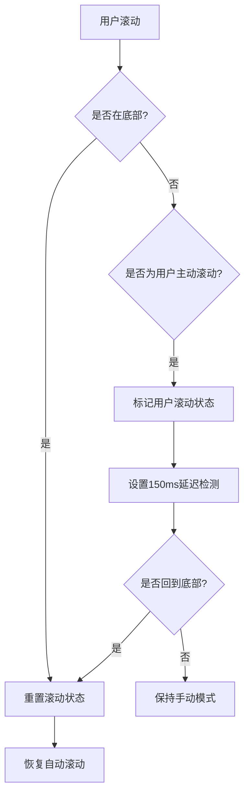
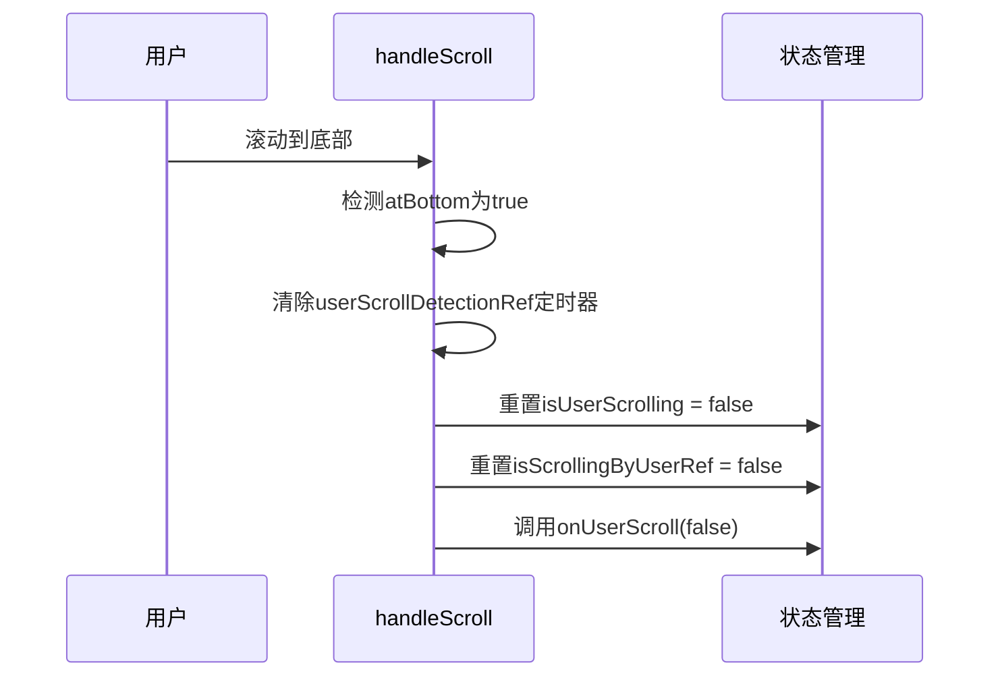

# 用户滚动恢复机制

<cite>
**本文档引用文件**  
- [chat_messages.tsx](file://frontend/src/pages/home/chat/chat_messages.tsx)
- [SCROLL_OPTIMIZATION.md](file://frontend/doc/SCROLL_OPTIMIZATION.md)
</cite>

## 目录
1. [功能概述](#功能概述)
2. [核心实现机制](#核心实现机制)
3. [isAtBottom函数设计考量](#isatbottom函数设计考量)
4. [handleScroll回调逻辑分析](#handlescroll回调逻辑分析)
5. [用户滚动检测定时器机制](#用户滚动检测定时器机制)
6. [用户体验优化效果](#用户体验优化效果)

## 功能概述
本机制实现了当用户手动滚动回聊天界面底部时，自动恢复自动滚动的功能。通过精确的状态检测和延迟确认机制，系统能够智能判断用户意图，在用户主动查看历史消息后暂停自动跟随，而在用户返回底部时无缝恢复实时滚动，从而实现“智能跟随”效果。

**Section sources**
- [SCROLL_OPTIMIZATION.md](file://frontend/doc/SCROLL_OPTIMIZATION.md#L1-L20)

## 核心实现机制
该功能主要由`chat_messages.tsx`中的`handleScroll`、`handleUserScrollStart`和`isAtBottom`等函数协同完成。通过`useRef`引用管理滚动状态，结合事件监听与定时器机制，实现了对用户滚动行为的精准捕捉与响应。

**Diagram sources**
- [chat_messages.tsx](file://frontend/src/pages/home/chat/chat_messages.tsx#L121-L185)
- [chat_messages.tsx](file://frontend/src/pages/home/chat/chat_messages.tsx#L187-L216)

**Section sources**
- [chat_messages.tsx](file://frontend/src/pages/home/chat/chat_messages.tsx#L36-L245)

## isAtBottom函数设计考量
`isAtBottom`函数采用20px误差范围的设计，主要考虑不同设备分辨率和浏览器缩放级别下的兼容性。通过允许一定像素的偏差，避免因滚动条精度问题导致的误判，确保在各种显示环境下都能稳定判断是否接近底部。

该设计解决了以下问题：
- 高DPI屏幕下的亚像素滚动问题
- 浏览器缩放（如125%、150%）导致的计算偏差
- 不同操作系统滚动条宽度差异
- 浏览器渲染精度限制

**Section sources**
- [chat_messages.tsx](file://frontend/src/pages/home/chat/chat_messages.tsx#L64-L70)
- [SCROLL_OPTIMIZATION.md](file://frontend/doc/SCROLL_OPTIMIZATION.md#L159-L165)

## handleScroll回调逻辑分析
`handleScroll`回调函数实时检测`atBottom`状态，其核心逻辑如下：
1. 当检测到用户已回到底部且处于用户滚动状态时，立即清除所有相关定时器
2. 重置`isUserScrolling`和`isScrollingByUserRef`状态标志
3. 触发`onUserScroll(false)`回调通知外部组件恢复自动滚动

此机制确保了用户一旦回到底部，系统能立即响应并恢复自动滚动，无需等待额外延迟，提供即时反馈。

**Diagram sources**
- [chat_messages.tsx](file://frontend/src/pages/home/chat/chat_messages.tsx#L149-L185)
- [chat_messages.tsx](file://frontend/src/pages/home/chat/chat_messages.tsx#L121-L151)

**Section sources**
- [chat_messages.tsx](file://frontend/src/pages/home/chat/chat_messages.tsx#L121-L185)

## 用户滚动检测定时器机制
`userScrollDetectionRef`定时器采用150ms延迟检测机制，用于确认用户已完成滚动操作。该机制的工作流程如下：
1. 当用户开始滚动且不在底部时，设置150ms延迟定时器
2. 在延迟期间若用户持续滚动，则定时器会被不断重置
3. 当用户停止滚动150ms后，执行状态检查
4. 若此时用户已回到底部，则重置滚动状态并恢复自动滚动

此设计有效防止了频繁的状态切换，避免了在用户快速滚动过程中出现自动滚动反复启停的抖动现象。

**Section sources**
- [chat_messages.tsx](file://frontend/src/pages/home/chat/chat_messages.tsx#L166-L175)
- [SCROLL_OPTIMIZATION.md](file://frontend/doc/SCROLL_OPTIMIZATION.md#L260-L279)

## 用户体验优化效果
该机制显著提升了聊天界面的用户体验，实现了真正的“智能跟随”效果：
- **高敏感度响应**：任何微小滚动（>0px）都能立即停止自动滚动
- **全输入方式覆盖**：支持鼠标滚轮、触摸滑动、键盘方向键等多种滚动方式
- **无缝恢复**：用户回到底部时自动恢复，无需手动点击按钮
- **防抖保护**：150ms延迟避免频繁状态切换
- **跨设备兼容**：20px误差范围适应不同分辨率和缩放级别

这些优化共同构建了一个既灵敏又稳定的滚动控制系统，让用户能够自然地与聊天内容互动，同时保持对实时消息的及时关注。

**Section sources**
- [SCROLL_OPTIMIZATION.md](file://frontend/doc/SCROLL_OPTIMIZATION.md#L1-L280)
- [chat_messages.tsx](file://frontend/src/pages/home/chat/chat_messages.tsx#L1-L513)