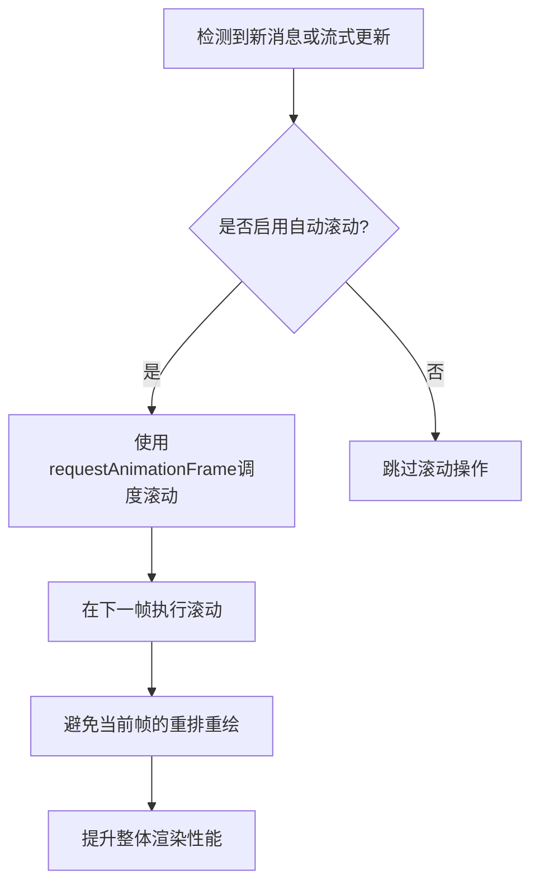
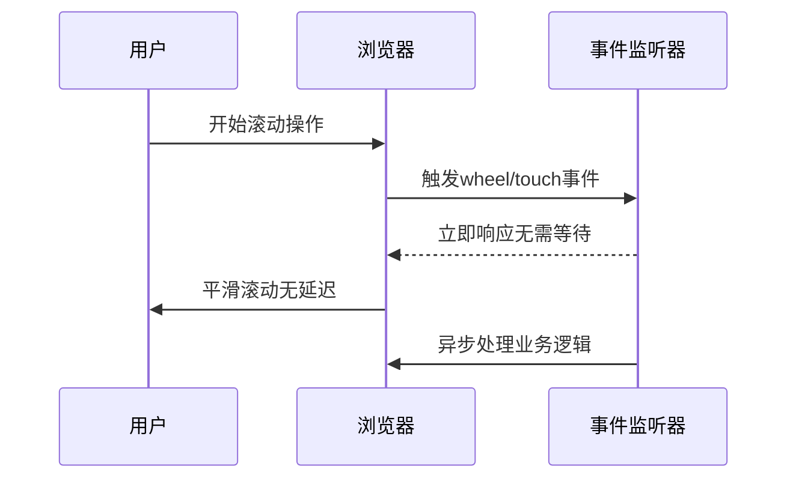
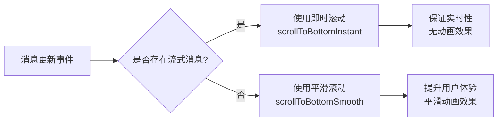
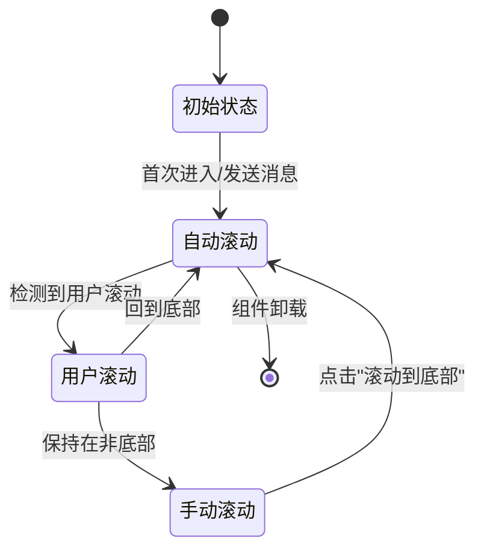

# 性能优化策略

<cite>
**本文档引用文件**  
- [chat_messages.tsx](file://frontend/src/pages/home/chat/chat_messages.tsx)
- [SCROLL_OPTIMIZATION.md](file://frontend/doc/SCROLL_OPTIMIZATION.md)
- [useViewportHeight.ts](file://frontend/src/hooks/useViewportHeight.ts)
</cite>

## 目录
1. [自动滚动性能优化](#自动滚动性能优化)
2. [requestAnimationFrame的应用](#requestanimationframe的应用)
3. [被动事件监听器的作用](#被动事件监听器的作用)
4. [动态滚动模式选择](#动态滚动模式选择)
5. [滚动检测机制](#滚动检测机制)
6. [用户体验优化](#用户体验优化)

## 自动滚动性能优化

在聊天界面中，自动滚动功能需要在保证实时性的同时避免频繁的重排和重绘操作。系统通过精细化的滚动控制策略，在流式消息生成和普通消息更新场景下采用不同的滚动行为，确保性能和用户体验的平衡。

**Section sources**
- [chat_messages.tsx](file://frontend/src/pages/home/chat/chat_messages.tsx#L1-L513)
- [SCROLL_OPTIMIZATION.md](file://frontend/doc/SCROLL_OPTIMIZATION.md#L1-L279)

## requestAnimationFrame的应用

`requestAnimationFrame`被用于将滚动操作推迟到下一动画帧执行，有效减少浏览器的重排和重绘开销。当检测到新消息或流式更新时，系统不会立即执行滚动，而是将其安排在下一个合适的渲染时机。



**Diagram sources**
- [chat_messages.tsx](file://frontend/src/pages/home/chat/chat_messages.tsx#L400-L420)

**Section sources**
- [chat_messages.tsx](file://frontend/src/pages/home/chat/chat_messages.tsx#L400-L420)

## 被动事件监听器的作用

被动事件监听器（passive event listeners）被应用于滚动相关的事件监听，显著提升了滚动事件的响应速度。通过设置`{ passive: true }`选项，系统告知浏览器该事件监听器不会调用`preventDefault()`，从而允许浏览器提前处理滚动操作。



**Diagram sources**
- [chat_messages.tsx](file://frontend/src/pages/home/chat/chat_messages.tsx#L218-L245)

**Section sources**
- [chat_messages.tsx](file://frontend/src/pages/home/chat/chat_messages.tsx#L218-L245)

## 动态滚动模式选择

系统基于`hasStreamingMessage`状态动态选择滚动模式，实现流式生成和普通更新场景的差异化处理。



**Diagram sources**
- [chat_messages.tsx](file://frontend/src/pages/home/chat/chat_messages.tsx#L400-L420)

**Section sources**
- [chat_messages.tsx](file://frontend/src/pages/home/chat/chat_messages.tsx#L400-L420)

## 滚动检测机制

系统实现了高敏感度的滚动检测机制，确保用户任何微小的滚动操作都能被立即捕获。通过多重事件监听和零容忍检测策略，提升了用户体验。

```mermaid
classDiagram
class ChatMessages {
+isUserScrolling : boolean
+isScrollingByUserRef : Ref<boolean>
+lastScrollTopRef : Ref<number>
+userScrollDetectionRef : Ref<Timer>
+handleScroll(e : Event)
+handleUserScrollStart()
+isAtBottom()
+scrollToBottomInstant()
+scrollToBottomSmooth()
}
ChatMessages --> "1" "0..1" window : 监听
ChatMessages --> "1" "1" scrollContainer : 控制
ChatMessages ..> useImperativeHandle : 暴露接口
```

**Diagram sources**
- [chat_messages.tsx](file://frontend/src/pages/home/chat/chat_messages.tsx#L121-L245)

**Section sources**
- [chat_messages.tsx](file://frontend/src/pages/home/chat/chat_messages.tsx#L121-L245)
- [SCROLL_OPTIMIZATION.md](file://frontend/doc/SCROLL_OPTIMIZATION.md#L119-L157)

## 用户体验优化

通过智能的滚动策略和状态管理，系统在各种使用场景下都能提供流畅的用户体验。首次进入、消息发送、AI生成等场景都经过专门优化。



**Diagram sources**
- [chat_messages.tsx](file://frontend/src/pages/home/chat/chat_messages.tsx#L149-L185)
- [SCROLL_OPTIMIZATION.md](file://frontend/doc/SCROLL_OPTIMIZATION.md#L233-L258)

**Section sources**
- [chat_messages.tsx](file://frontend/src/pages/home/chat/chat_messages.tsx#L149-L185)
- [SCROLL_OPTIMIZATION.md](file://frontend/doc/SCROLL_OPTIMIZATION.md#L233-L258)