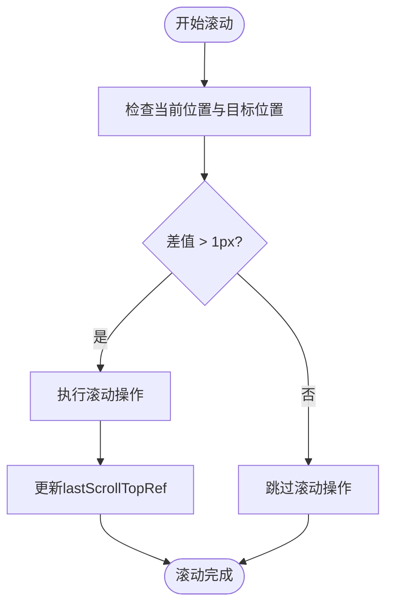
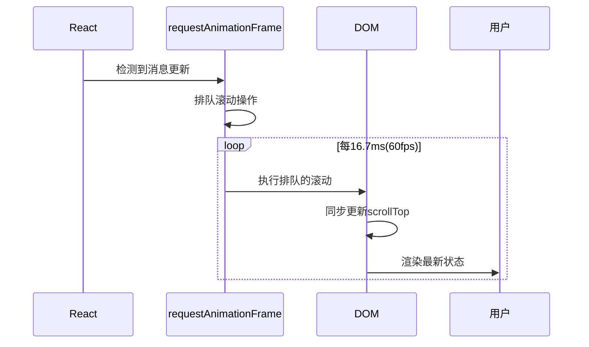
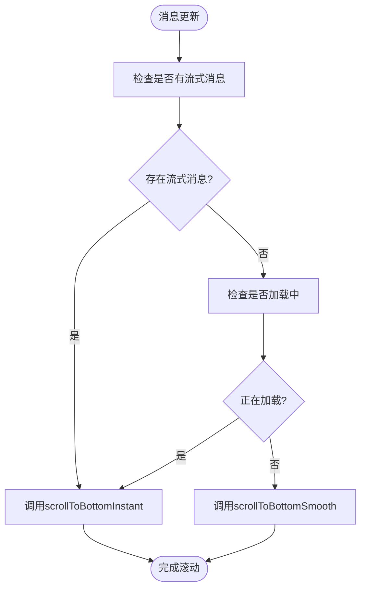
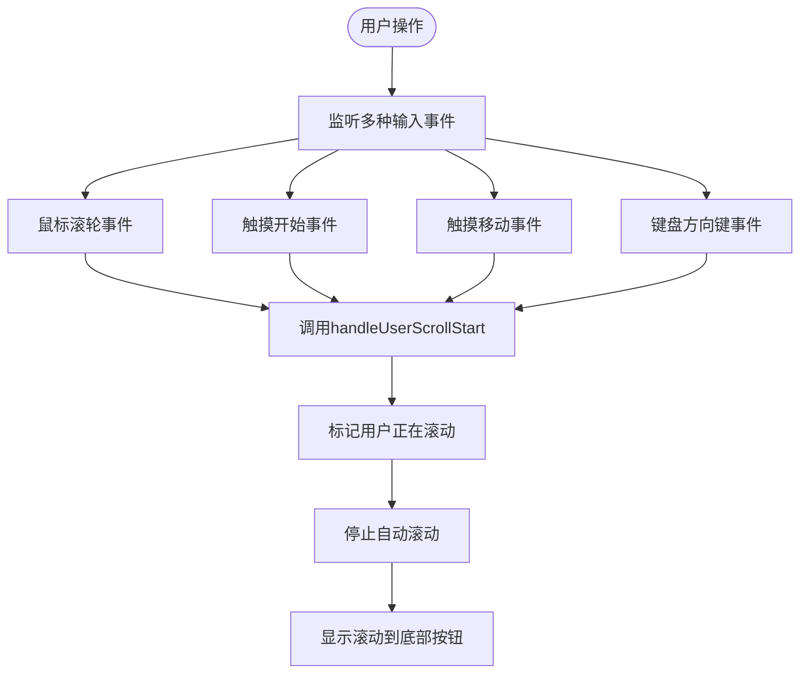

# 滚动执行方式

<cite>
**Referenced Files in This Document**  
- [chat_messages.tsx](file://frontend/src/pages/home/chat/chat_messages.tsx)
- [SCROLL_OPTIMIZATION.md](file://frontend/doc/SCROLL_OPTIMIZATION.md)
</cite>

## 目录
1. [核心方法实现差异](#核心方法实现差异)
2. [节流优化机制](#节流优化机制)
3. [requestAnimationFrame应用策略](#requestanimationframe应用策略)
4. [智能滚动策略决策](#智能滚动策略决策)
5. [用户交互检测机制](#用户交互检测机制)

## 核心方法实现差异

`scrollToBottomInstant`与`scrollToBottomSmooth`两个核心方法在实现上存在显著差异，分别针对不同的使用场景进行优化。

`scrollToBottomInstant`方法通过直接设置元素的`scrollTop`属性实现无动画的即时滚动。该方法适用于流式响应场景，当AI正在生成消息时，需要确保用户界面能够实时跟进最新内容，避免因平滑动画造成的延迟感。这种即时滚动方式能够提供最快速的视觉反馈，保证用户体验的连贯性。

`scrollToBottomSmooth`方法则调用原生`scrollTo`方法并设置`behavior`参数为`smooth`，实现具有CSS过渡效果的平滑视觉滚动。该方法用于普通消息更新场景，在非流式、常规的消息添加情况下提供更自然的视觉过渡效果，提升整体界面的流畅感和专业度。

**Section sources**
- [chat_messages.tsx](file://frontend/src/pages/home/chat/chat_messages.tsx#L71-L119)

## 节流优化机制

为避免重复滚动操作带来的性能损耗和视觉干扰，系统采用了基于`lastScrollTopRef`的节流优化机制。该机制通过记录上一次滚动的目标位置，判断是否需要执行新的滚动操作。

在两个滚动方法的实现中，都包含了相同的节流判断逻辑：只有当当前滚动位置与目标位置的差值大于1像素时，才执行实际的滚动操作。这种设计有效防止了在已经处于底部时的无效重复滚动，减少了DOM操作次数，提升了性能表现。

`lastScrollTopRef`作为`useRef`引用，在组件生命周期内持续记录最新的滚动位置，为后续的滚动决策提供准确的参考依据。这种基于引用的状态管理方式避免了闭包陷阱，确保了滚动位置信息的实时性和准确性。

**Diagram sources**
- [chat_messages.tsx](file://frontend/src/pages/home/chat/chat_messages.tsx#L71-L119)

**Section sources**
- [chat_messages.tsx](file://frontend/src/pages/home/chat/chat_messages.tsx#L71-L119)

## requestAnimationFrame应用策略

系统在自动滚动逻辑中采用了`requestAnimationFrame`进行性能优化，确保滚动操作与浏览器的渲染周期同步，提供最流畅的用户体验。

在消息更新的`useEffect`钩子中，当检测到需要自动滚动时，系统将滚动操作包裹在`requestAnimationFrame`回调中执行。这种策略确保滚动操作发生在浏览器下一次重绘之前，避免了布局抖动和不必要的重排，最大限度地利用了浏览器的渲染优化机制。

通过将滚动操作推迟到下一个动画帧执行，系统能够批量处理可能同时发生的多个状态更新，减少DOM操作的频率。这对于处理快速连续的消息更新尤为重要，能够有效防止滚动操作的堆积和性能下降。

**Diagram sources**
- [chat_messages.tsx](file://frontend/src/pages/home/chat/chat_messages.tsx#L247-L275)

**Section sources**
- [chat_messages.tsx](file://frontend/src/pages/home/chat/chat_messages.tsx#L247-L275)

## 智能滚动策略决策

系统实现了智能的滚动策略决策机制，根据不同的消息状态自动选择最合适的滚动方式，平衡了性能与用户体验。

在自动滚动逻辑中，系统会检查是否存在流式消息（`isStreaming`）或处于加载状态（`isLoading`）。如果满足任一条件，则调用`scrollToBottomInstant`进行即时滚动；否则，采用`scrollToBottomSmooth`进行平滑滚动。

这种智能决策机制确保了在AI消息流式生成的关键时刻，用户界面能够立即响应最新内容，提供实时的交互体验。而在普通消息更新场景下，则通过平滑动画提供更优雅的视觉过渡，体现了对不同使用场景的细致考量。

**Diagram sources**
- [chat_messages.tsx](file://frontend/src/pages/home/chat/chat_messages.tsx#L273-L290)
- [SCROLL_OPTIMIZATION.md](file://frontend/doc/SCROLL_OPTIMIZATION.md#L199-L231)

**Section sources**
- [chat_messages.tsx](file://frontend/src/pages/home/chat/chat_messages.tsx#L273-L290)

## 用户交互检测机制

系统实现了全面的用户交互检测机制，通过监听多种输入事件确保能够立即响应用户的滚动意图，提供高敏感度的交互体验。

系统同时监听`wheel`（鼠标滚轮）、`touchstart`和`touchmove`（触摸操作）事件，确保在各种设备上都能及时捕获用户的滚动行为。当检测到这些事件时，立即调用`handleUserScrollStart`函数，标记用户正在滚动的状态，并停止自动滚动。

这种多事件监听策略实现了"零容忍"的滚动检测，任何微小的用户操作（即使只有1-2像素的移动）都会被立即捕获，确保自动滚动不会干扰用户的主动浏览行为。这种设计特别适用于AI消息生成过程中，允许用户随时中断自动滚动查看历史内容。

**Diagram sources**
- [chat_messages.tsx](file://frontend/src/pages/home/chat/chat_messages.tsx#L218-L245)

**Section sources**
- [chat_messages.tsx](file://frontend/src/pages/home/chat/chat_messages.tsx#L187-L216)
- [chat_messages.tsx](file://frontend/src/pages/home/chat/chat_messages.tsx#L218-L245)