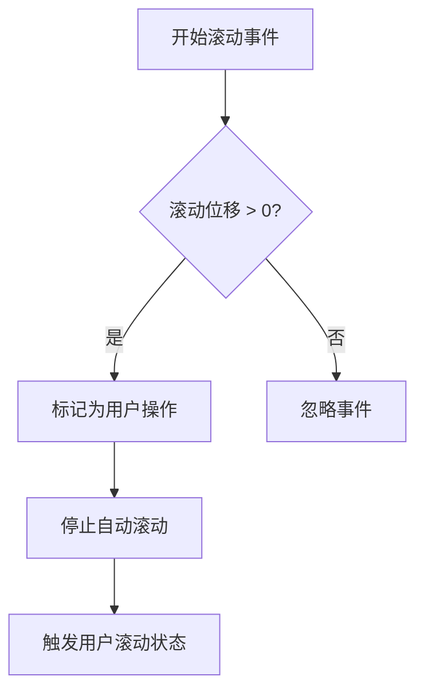
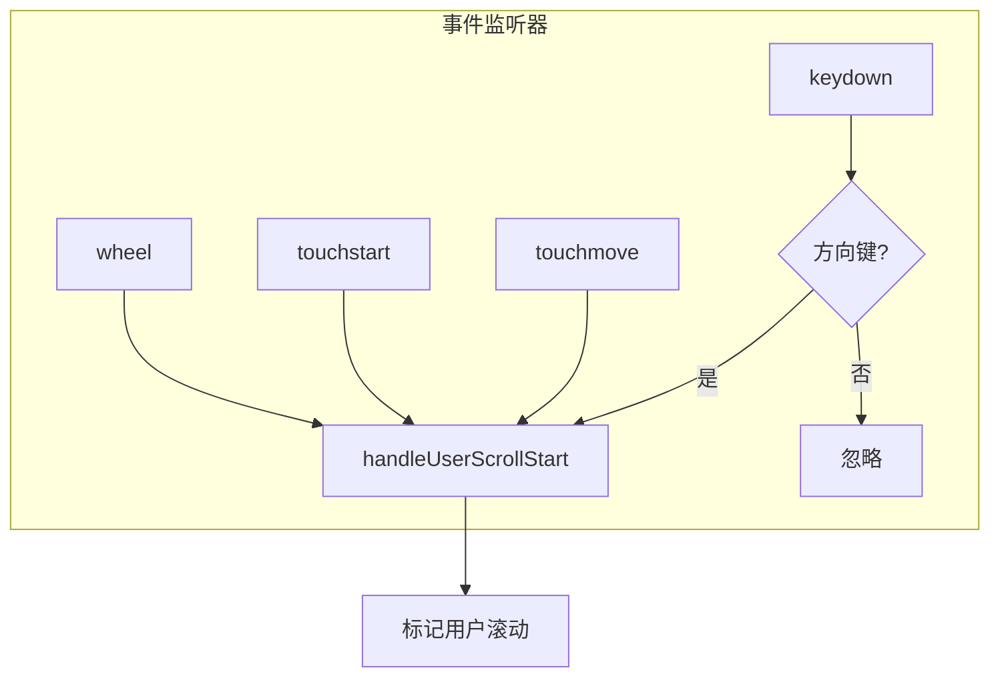
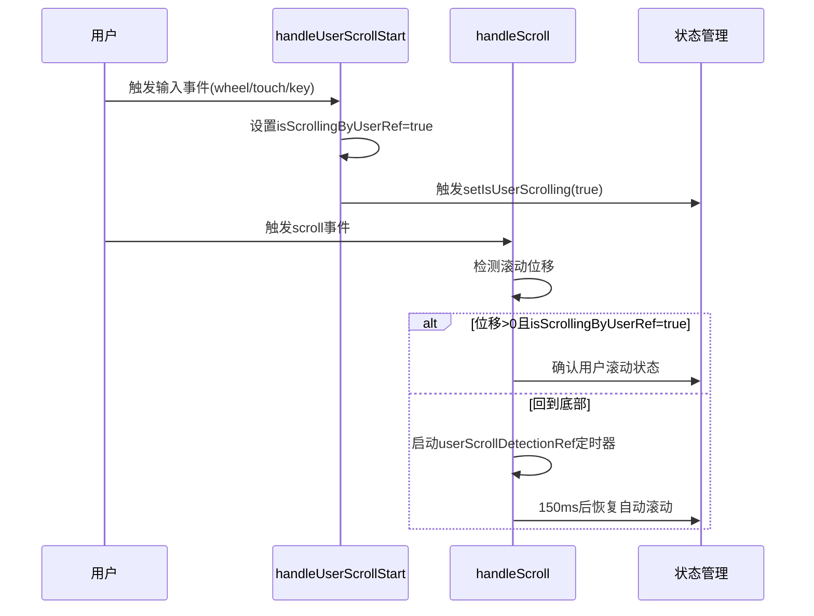
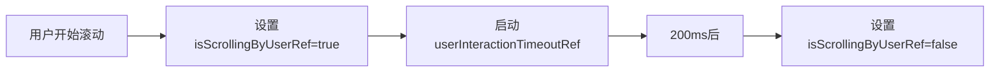
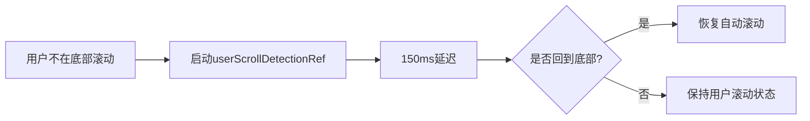

# 用户滚动检测机制

<cite>
**本文档引用文件**  
- [chat_messages.tsx](file://frontend/src/pages/home/chat/chat_messages.tsx)
- [SCROLL_OPTIMIZATION.md](file://frontend/doc/SCROLL_OPTIMIZATION.md)
- [index.tsx](file://frontend/src/pages/home/chat/index.tsx)
</cite>

## 目录
1. [高敏感度用户滚动检测实现方案](#高敏感度用户滚动检测实现方案)
2. [零容忍检测策略](#零容忍检测策略)
3. [多事件监听与全输入覆盖](#多事件监听与全输入覆盖)
4. [isScrollingByUserRef即时响应机制](#isscrollingbyuserref即时响应机制)
5. [handleUserScrollStart与handleScroll协同流程](#handleuserscrollstart与handlescroll协同流程)
6. [状态恢复中的延迟控制机制](#状态恢复中的延迟控制机制)

## 高敏感度用户滚动检测实现方案

本系统实现了高敏感度的用户滚动检测机制，确保在AI消息生成过程中，任何微小的用户滚动操作都能被即时捕获并响应。该机制通过零容忍检测策略、多事件监听、即时响应标记和智能状态恢复等技术手段，实现了对用户滚动行为的精准识别与处理。

**Section sources**
- [chat_messages.tsx](file://frontend/src/pages/home/chat/chat_messages.tsx#L58-L61)
- [SCROLL_OPTIMIZATION.md](file://frontend/doc/SCROLL_OPTIMIZATION.md#L119-L157)

## 零容忍检测策略

系统采用零容忍检测策略，即任何大于0px的滚动位移均被视为用户操作。该策略通过比较当前滚动位置与上次记录位置的差值来实现：



此策略确保了即使是最微小的滚动（如1-2px）也能立即被检测到，从而在AI生成过程中及时停止自动滚动，提升用户体验。

**Diagram sources**
- [chat_messages.tsx](file://frontend/src/pages/home/chat/chat_messages.tsx#L137)
- [SCROLL_OPTIMIZATION.md](file://frontend/doc/SCROLL_OPTIMIZATION.md#L119-L157)

**Section sources**
- [chat_messages.tsx](file://frontend/src/pages/home/chat/chat_messages.tsx#L121-L151)
- [SCROLL_OPTIMIZATION.md](file://frontend/doc/SCROLL_OPTIMIZATION.md#L159-L198)

## 多事件监听与全输入覆盖

为实现全输入方式的覆盖，系统同时监听多种用户输入事件，确保鼠标、触摸和键盘等所有滚动方式都能被检测：



具体实现包括：
- **鼠标滚轮**：监听`wheel`事件
- **触摸操作**：监听`touchstart`和`touchmove`事件
- **键盘控制**：监听`keydown`事件，检测方向键、PageUp/Down、Home/End等滚动相关按键

这种多事件监听机制确保了在各种设备和输入方式下都能实现一致的滚动检测体验。

**Diagram sources**
- [chat_messages.tsx](file://frontend/src/pages/home/chat/chat_messages.tsx#L218-L245)
- [SCROLL_OPTIMIZATION.md](file://frontend/doc/SCROLL_OPTIMIZATION.md#L119-L157)

**Section sources**
- [chat_messages.tsx](file://frontend/src/pages/home/chat/chat_messages.tsx#L218-L245)
- [SCROLL_OPTIMIZATION.md](file://frontend/doc/SCROLL_OPTIMIZATION.md#L74-L121)

## isScrollingByUserRef即时响应机制

系统使用`isScrollingByUserRef`引用对象来实现用户滚动的即时响应。该引用对象作为用户操作的即时标记，具有以下特点：

- **立即标记**：在用户输入事件触发时立即设置为`true`
- **独立状态**：与`isUserScrolling`状态分离，避免状态同步延迟
- **精确控制**：确保滚动检测的敏感性和准确性

```typescript
// 立即标记用户正在滚动
isScrollingByUserRef.current = true;
```

当`handleScroll`事件检测到滚动位移且`isScrollingByUserRef.current`为`true`时，立即触发用户滚动状态，实现零延迟响应。

**Section sources**
- [chat_messages.tsx](file://frontend/src/pages/home/chat/chat_messages.tsx#L187-L216)
- [chat_messages.tsx](file://frontend/src/pages/home/chat/chat_messages.tsx#L137)

## handleUserScrollStart与handleScroll协同流程

`handleUserScrollStart`与`handleScroll`函数协同工作，形成完整的用户滚动检测流程：



协同工作流程：
1. **即时响应**：`handleUserScrollStart`在用户输入事件触发时立即响应
2. **状态标记**：设置`isScrollingByUserRef.current = true`并触发用户滚动状态
3. **滚动验证**：`handleScroll`在scroll事件中验证实际滚动位移
4. **状态确认**：结合两个函数的状态判断，确保检测的准确性

**Diagram sources**
- [chat_messages.tsx](file://frontend/src/pages/home/chat/chat_messages.tsx#L121-L185)
- [chat_messages.tsx](file://frontend/src/pages/home/chat/chat_messages.tsx#L187-L216)

**Section sources**
- [chat_messages.tsx](file://frontend/src/pages/home/chat/chat_messages.tsx#L121-L216)

## 状态恢复中的延迟控制机制

系统使用`userInteractionTimeoutRef`和`userScrollDetectionRef`两个定时器引用对象来实现状态恢复的延迟控制：

### userInteractionTimeoutRef - 用户交互标记恢复



- **作用**：在用户交互后200ms恢复`isScrollingByUserRef`标记
- **目的**：避免连续输入事件导致的重复标记

### userScrollDetectionRef - 滚动状态恢复



- **作用**：在用户停止滚动后150ms检测是否回到底部
- **目的**：智能恢复自动滚动状态，提升用户体验

这两个定时器共同作用，实现了精确的状态管理和智能的自动滚动恢复机制。

**Section sources**
- [chat_messages.tsx](file://frontend/src/pages/home/chat/chat_messages.tsx#L149-L185)
- [chat_messages.tsx](file://frontend/src/pages/home/chat/chat_messages.tsx#L187-L216)
- [chat_messages.tsx](file://frontend/src/pages/home/chat/chat_messages.tsx#L71-L119)