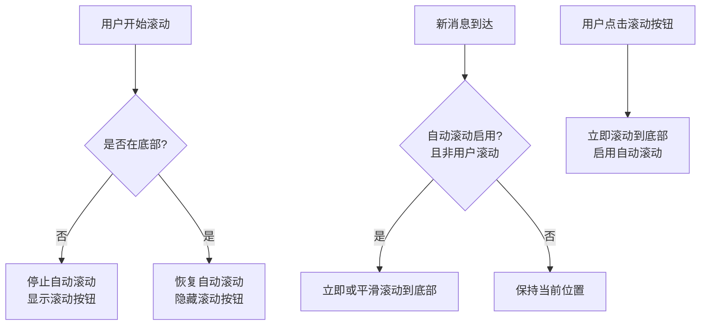
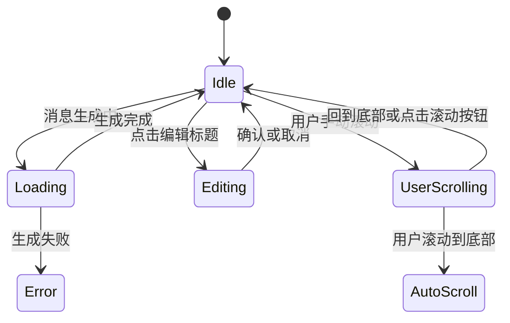

# 聊天界面功能

<cite>
**本文档中引用的文件**   
- [chat_input.tsx](file://frontend/src/pages/home/chat/chat_input.tsx)
- [chat_messages.tsx](file://frontend/src/pages/home/chat/chat_messages.tsx)
- [chat_title.tsx](file://frontend/src/pages/home/chat/chat_title.tsx)
- [SCROLL_OPTIMIZATION.md](file://frontend/doc/SCROLL_OPTIMIZATION.md)
- [index.tsx](file://frontend/src/pages/home/chat/index.tsx)
</cite>

## 目录
1. [输入框组件功能实现](#输入框组件功能实现)
2. [消息列表渲染与流式响应](#消息列表渲染与流式响应)
3. [标题栏编辑交互逻辑](#标题栏编辑交互逻辑)
4. [滚动行为优化策略](#滚动行为优化策略)
5. [UI状态管理示例](#ui状态管理示例)

## 输入框组件功能实现

`chat_input.tsx` 组件实现了用户输入处理与消息发送的核心逻辑。该组件通过 `textarea` 元素接收用户输入，支持 Markdown 格式输入，并提供了模型选择、文件上传等扩展功能。

组件通过 `handleInputChange` 回调函数监听输入变化，结合 `requestAnimationFrame` 优化性能，确保输入响应流畅。为支持中文输入法，组件实现了 `handleCompositionStart` 和 `handleCompositionEnd` 方法，避免在中文输入过程中误触发回车发送。

发送逻辑由 `handleSend` 方法实现，当用户按下回车键（非 Shift+Enter）时触发。发送前会调用 `onMessageListScrollToBottom` 确保消息列表处于底部状态，并通过 `onSendMessage` 回调将输入内容传递给父组件。发送后自动清空输入框。

**Section sources**
- [chat_input.tsx](file://frontend/src/pages/home/chat/chat_input.tsx#L1-L373)

## 消息列表渲染与流式响应

`chat_messages.tsx` 组件负责渲染聊天消息列表，支持流式响应和 Markdown 解析。组件使用 `ReactMarkdown` 和 `remarkGfm` 插件实现完整的 Markdown 语法支持，包括表格、代码块、引用等元素。

对于代码块，组件集成 `react-syntax-highlighter` 实现语法高亮，使用 `tomorrow` 主题提供良好的视觉体验。通过自定义 `components` 属性，为不同 Markdown 元素（如代码、链接、引用块）应用特定样式。

组件通过 `renderMessageContent` 方法区分用户消息和 AI 消息：用户消息直接显示文本，AI 消息则通过 Markdown 渲染器处理。同时支持渲染思考过程内容（`reasoning_content`），为 AI 的推理过程提供可视化展示。

**Section sources**
- [chat_messages.tsx](file://frontend/src/pages/home/chat/chat_messages.tsx#L1-L513)

## 标题栏编辑交互逻辑

`chat_title.tsx` 组件实现了聊天标题的编辑与保存功能。组件通过 `isEditing` 状态管理编辑模式，点击编辑按钮时进入编辑状态，显示输入框和确认/取消操作按钮。

编辑功能受 `chatUuid` 约束，只有当对话已保存（`chatUuid` 存在）时才允许编辑，新对话需先保存才能修改标题。输入框宽度通过 `calculateInputWidth` 方法动态计算，基于隐藏的 `measureSpan` 元素测量文本实际宽度，确保输入框大小与内容匹配。

保存逻辑由 `handleConfirm` 方法实现，包含 200ms 的模拟延迟以模拟网络请求。成功后通过 `onTitleChange` 回调通知父组件更新标题，并显示成功提示。取消编辑时恢复原始标题内容。

**Section sources**
- [chat_title.tsx](file://frontend/src/pages/home/chat/chat_title.tsx#L1-L237)

## 滚动行为优化策略

聊天界面实现了精细化的滚动行为优化策略，确保在各种场景下提供流畅的用户体验。核心优化基于 `SCROLL_OPTIMIZATION.md` 文档中的设计思路，通过多重机制检测用户滚动意图。

组件通过 `handleUserScrollStart` 方法实现极致敏感的滚动检测，监听 `wheel`、`touchstart`、`touchmove` 和方向键事件，任何用户操作都会立即标记 `isScrollingByUserRef.current` 为 `true`，停止自动滚动。检测阈值为 0px（零容忍检测），确保任何微小滚动都能被捕获。

自动滚动逻辑在 `useEffect` 中实现，仅在满足以下条件时触发：启用自动滚动、非用户滚动状态、且存在新消息或流式生成中。对于流式消息，使用 `scrollToBottomInstant` 立即滚动；对于普通消息，使用 `scrollToBottomSmooth` 平滑滚动。

智能恢复机制允许用户滚动回底部时自动重新启用自动滚动。当检测到用户滚动到底部（误差范围 20px）且处于用户滚动状态时，立即重置所有滚动状态，恢复自动跟随。

**Diagram sources**
- [chat_messages.tsx](file://frontend/src/pages/home/chat/chat_messages.tsx#L121-L216)
- [index.tsx](file://frontend/src/pages/home/chat/index.tsx#L100-L150)
- [SCROLL_OPTIMIZATION.md](file://frontend/doc/SCROLL_OPTIMIZATION.md#L1-L280)

**Section sources**
- [chat_messages.tsx](file://frontend/src/pages/home/chat/chat_messages.tsx#L121-L290)
- [index.tsx](file://frontend/src/pages/home/chat/index.tsx#L100-L180)
- [SCROLL_OPTIMIZATION.md](file://frontend/doc/SCROLL_OPTIMIZATION.md#L1-L280)

## UI状态管理示例

聊天界面实现了多种UI状态的管理，包括加载中、错误提示等场景。加载状态通过 `isLoading` 和 `showLoadingMessage` 属性控制，在消息列表底部显示包含动态省略号的加载指示器。

错误处理通过 `isErrorMessage` 方法识别包含"错误"关键词的AI消息，为其应用特殊的错误样式类。消息操作组件（`MessageAction`）支持复制、删除、重新生成等功能，通过悬停或点击触发。

组件间通过回调函数传递状态变化，如 `onCopyMessage`、`onDeleteMessage`、`onRegenerateMessage` 等，由父组件统一处理业务逻辑。使用 `useRef` 引用避免闭包陷阱，确保状态更新的准确性。

**Diagram sources**
- [chat_messages.tsx](file://frontend/src/pages/home/chat/chat_messages.tsx#L300-L350)
- [chat_title.tsx](file://frontend/src/pages/home/chat/chat_title.tsx#L100-L150)

**Section sources**
- [chat_messages.tsx](file://frontend/src/pages/home/chat/chat_messages.tsx#L300-L350)
- [chat_title.tsx](file://frontend/src/pages/home/chat/chat_title.tsx#L100-L150)