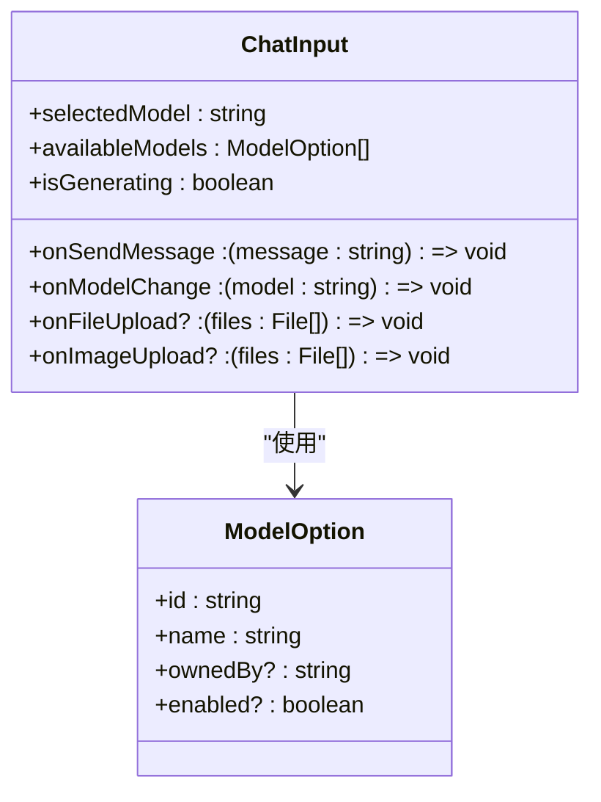
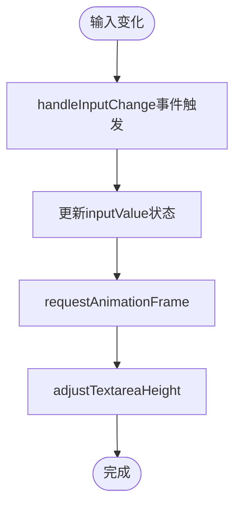
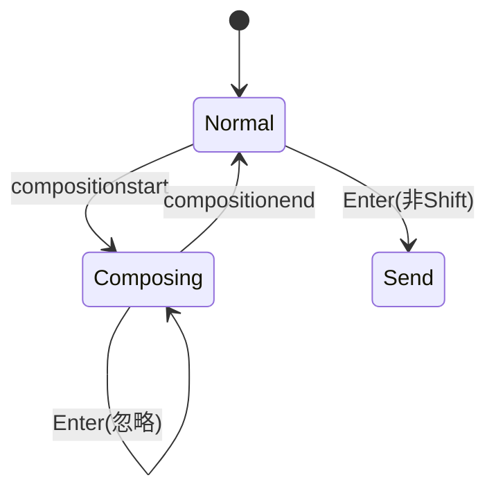
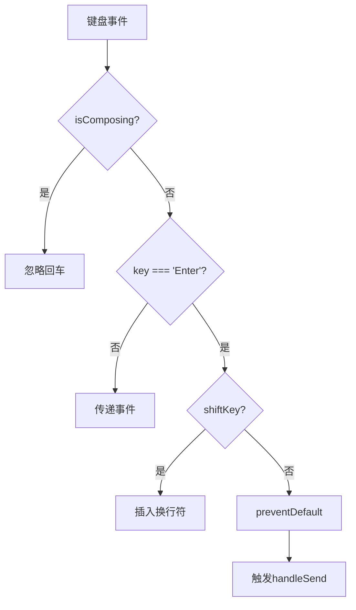
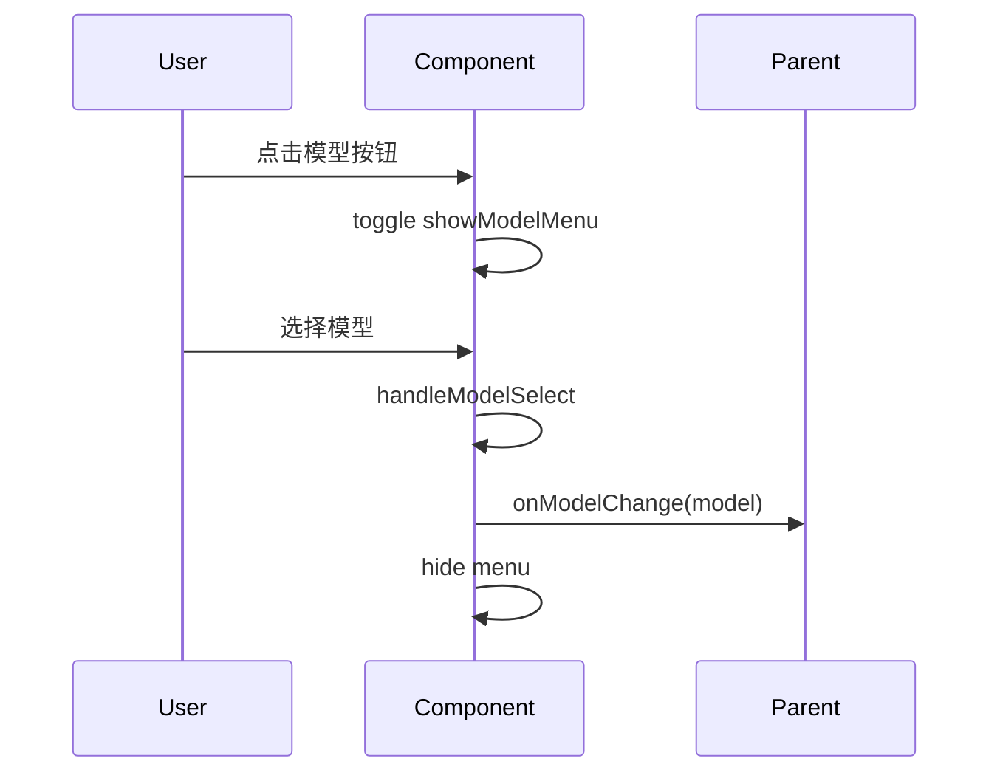
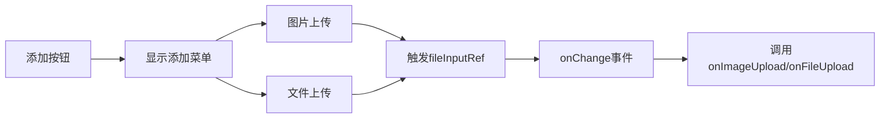
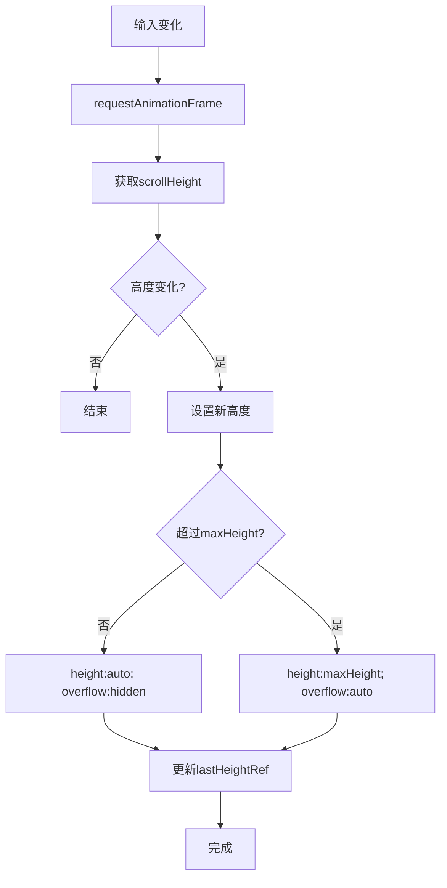
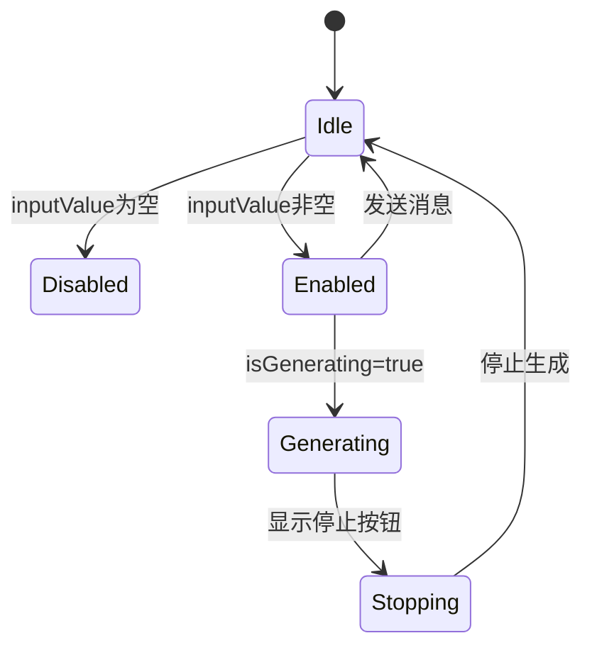
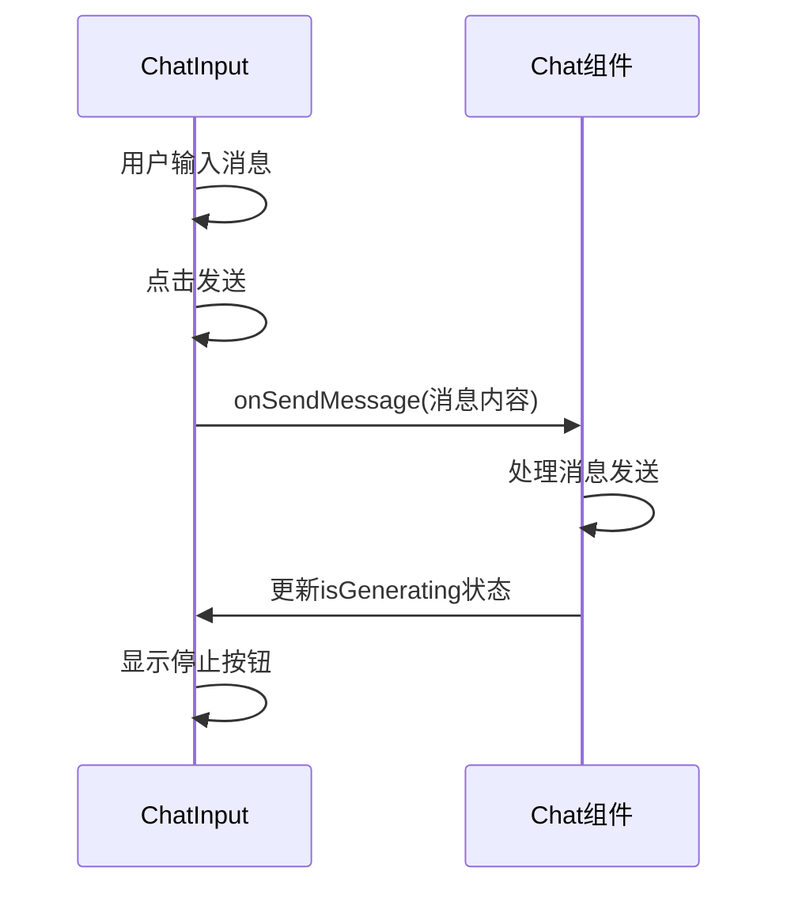
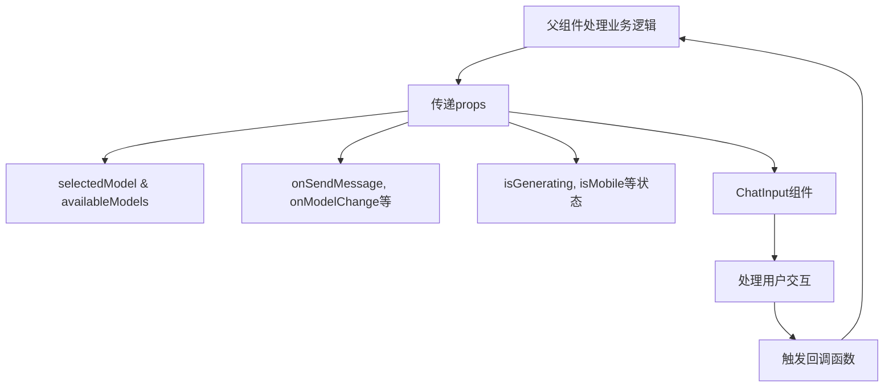

# 输入框组件

<cite>
**本文档中引用的文件**  
- [chat_input.tsx](file://frontend/src/pages/home/chat/chat_input.tsx)
- [chat_input.module.scss](file://frontend/src/pages/home/chat/chat_input.module.scss)
- [index.tsx](file://frontend/src/pages/home/chat/index.tsx)
- [useModels.ts](file://frontend/src/hooks/useModels.ts)
</cite>

## 目录
1. [简介](#简介)
2. [核心功能分析](#核心功能分析)
3. [用户输入处理机制](#用户输入处理机制)
4. [中文输入法兼容性处理](#中文输入法兼容性处理)
5. [回车与换行逻辑分离](#回车与换行逻辑分离)
6. [模型选择下拉菜单实现](#模型选择下拉菜单实现)
7. [文件上传功能交互](#文件上传功能交互)
8. [响应式高度调整机制](#响应式高度调整机制)
9. [发送按钮状态管理](#发送按钮状态管理)
10. [与父组件通信机制](#与父组件通信机制)
11. [集成使用示例](#集成使用示例)

## 简介
输入框组件（ChatInput）是聊天界面的核心交互元素，负责处理用户消息输入、模型切换、文件上传等关键功能。该组件采用React函数式组件设计，结合TypeScript类型系统，实现了高度可复用和可维护的UI组件。组件通过props接收外部状态和回调函数，实现了与父组件的松耦合通信。

**Section sources**
- [chat_input.tsx](file://frontend/src/pages/home/chat/chat_input.tsx#L1-L30)

## 核心功能分析
该组件提供了完整的聊天输入解决方案，包含文本输入、模型选择、文件上传、高度自适应等核心功能。通过`ChatInputProps`接口定义了清晰的API契约，确保了组件的可配置性和可扩展性。

**Diagram sources**
- [chat_input.tsx](file://frontend/src/pages/home/chat/chat_input.tsx#L32-L68)
- [useModels.ts](file://frontend/src/hooks/useModels.ts#L5-L10)

## 用户输入处理机制
组件通过受控组件模式管理文本输入状态，使用`useState`钩子维护`inputValue`状态。`handleInputChange`回调函数在每次输入变化时更新状态，并触发高度调整。

**Section sources**
- [chat_input.tsx](file://frontend/src/pages/home/chat/chat_input.tsx#L178-L185)

## 中文输入法兼容性处理
为解决中文输入法在Composition状态下的回车冲突问题，组件实现了完整的composition事件处理机制。通过`isComposing`状态标记中文输入过程，在此期间禁用回车发送功能。

**Section sources**
- [chat_input.tsx](file://frontend/src/pages/home/chat/chat_input.tsx#L123-L132)

## 回车与换行逻辑分离
组件精确区分了回车发送和换行操作，通过检测`Shift`键状态实现逻辑分离。普通回车触发消息发送，`Shift+Enter`则插入换行符，满足不同输入场景需求。

**Section sources**
- [chat_input.tsx](file://frontend/src/pages/home/chat/chat_input.tsx#L165-L172)

## 模型选择下拉菜单实现
模型选择功能通过`showModelMenu`状态控制下拉菜单的显示隐藏。菜单项动态渲染`availableModels`数组，每个选项点击后通过`onModelChange`回调通知父组件模型变更。

**Section sources**
- [chat_input.tsx](file://frontend/src/pages/home/chat/chat_input.tsx#L141-L145)

## 文件上传功能交互
文件上传功能采用隐藏的`<input type="file">`元素实现，通过`ref`引用进行程序化点击触发。组件提供了图片上传和普通文件上传两个独立通道，分别处理不同类型的文件选择。

**Section sources**
- [chat_input.tsx](file://frontend/src/pages/home/chat/chat_input.tsx#L147-L163)

## 响应式高度调整机制
组件实现了智能的文本域高度自适应功能，通过`adjustTextareaHeight`函数动态调整`textarea`高度。使用`requestAnimationFrame`优化性能，避免频繁的DOM重排。

**Section sources**
- [chat_input.tsx](file://frontend/src/pages/home/chat/chat_input.tsx#L70-L100)

## 发送按钮状态管理
发送按钮的状态由`inputValue`内容和`isGenerating`状态共同决定。当输入为空时按钮禁用，正在生成消息时显示停止按钮，实现了清晰的用户反馈。

**Section sources**
- [chat_input.tsx](file://frontend/src/pages/home/chat/chat_input.tsx#L270-L290)

## 与父组件通信机制
组件通过一系列回调函数与父组件通信，形成了清晰的单向数据流。`onSendMessage`回调传递用户输入内容，`onModelChange`同步模型选择状态，实现了父子组件间的有效协作。

**Section sources**
- [chat_input.tsx](file://frontend/src/pages/home/chat/chat_input.tsx#L146-L153)
- [index.tsx](file://frontend/src/pages/home/chat/index.tsx#L220-L240)

## 集成使用示例
以下是如何在父组件中集成使用输入框组件的典型示例，展示了必要的props传递和事件处理。

**Section sources**
- [index.tsx](file://frontend/src/pages/home/chat/index.tsx#L220-L240)