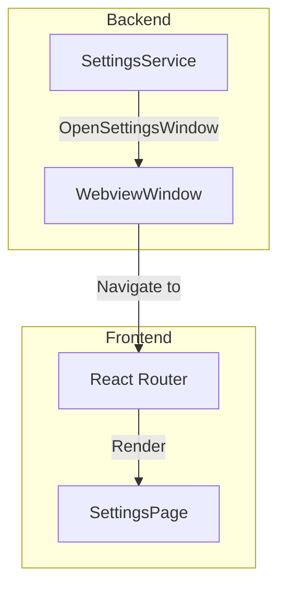
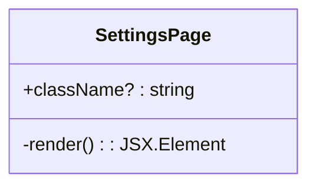
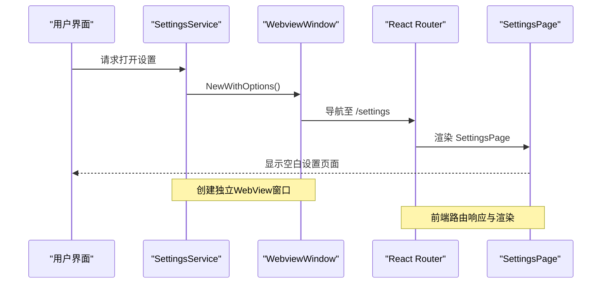
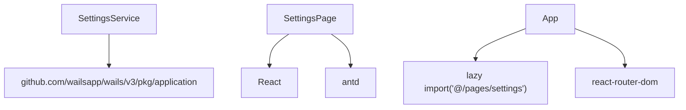

# 设置窗口功能

<cite>
**本文档引用的文件**  
- [index.tsx](file://frontend/src/pages/settings/index.tsx)
- [settings.go](file://backend/service/settings.go)
- [App.tsx](file://frontend/src/App.tsx)
</cite>

## 目录
1. [简介](#简介)
2. [项目结构](#项目结构)
3. [核心组件](#核心组件)
4. [架构概览](#架构概览)
5. [详细组件分析](#详细组件分析)
6. [依赖分析](#依赖分析)
7. [性能考虑](#性能考虑)
8. [故障排除指南](#故障排除指南)
9. [结论](#结论)

## 简介
本文档详细介绍了桌面应用中设置窗口的功能设计与实现方式。该功能通过独立路由 `/settings` 打开，当前实现了窗口创建机制与基本布局结构，为未来扩展模型偏好、API密钥、界面主题等配置项预留了接口。文档将解析前端页面的布局组织与状态绑定方式，并说明后端 `SettingsService` 的设计如何支持后续功能接入。同时，提出建议采用 Zustand store 进行全局配置管理并实现持久化存储。

## 项目结构
设置功能分布在前后端两个主要模块中：
- **前端**：位于 `frontend/src/pages/settings/` 目录下，包含 React 组件实现
- **后端**：位于 `backend/service/` 目录下，负责窗口生命周期管理与系统集成

前端采用 React + Ant Design 技术栈，通过 Vite 构建，路由由 React Router 管理；后端使用 Wails 框架创建桌面级 WebView 窗口，实现原生应用体验。

## 核心组件
设置功能的核心组件包括：
- **SettingsPage**：前端 React 函数式组件，定义设置页面的 UI 结构
- **SettingsService**：后端服务类，提供 `OpenSettingsWindow` 方法用于创建和显示设置窗口
- **路由系统**：基于 React Router 的前端路由配置，将 `/settings` 路径映射到 Settings 组件

当前实现展示了完整的窗口创建-路由绑定-页面渲染流程，为后续功能扩展奠定了基础架构。

**Section sources**
- [index.tsx](file://frontend/src/pages/settings/index.tsx#L1-L18)
- [settings.go](file://backend/service/settings.go#L1-L23)

## 架构概览
设置窗口采用前后端分离架构，通过 Wails 提供的桥接机制实现通信。后端负责创建独立的 WebView 窗口并指定其 URL 为 `/settings`，前端则通过路由系统响应此 URL 并渲染对应的 React 组件。

**Diagram sources**
- [settings.go](file://backend/service/settings.go#L4-L22)
- [App.tsx](file://frontend/src/App.tsx#L48-L85)

## 详细组件分析

### 前端页面分析
`SettingsPage` 组件当前为空白容器，仅包含基础的 React 函数式组件结构和类型定义。它接受可选的 `className` 属性，符合 Ant Design 的组件设计规范。组件通过懒加载方式被主应用引入，有助于优化初始加载性能。

尽管当前内容为空，但其存在表明了功能扩展的预留位置。未来可通过在此组件中添加表单、选项卡、开关等 UI 元素来实现具体配置功能。

**Diagram sources**
- [index.tsx](file://frontend/src/pages/settings/index.tsx#L6-L18)

### 后端服务分析
`SettingsService` 的 `OpenSettingsWindow` 方法是打开设置窗口的核心实现。该方法使用 Wails 框架的 `application.WebviewWindowOptions` 创建一个新的 WebView 窗口，配置了以下关键属性：
- **名称与标题**：均为 "Settings"
- **尺寸**：默认宽度 800px，高度 700px，最小尺寸限制确保可用性
- **URL**：指向 `/settings` 路由，触发前端路由匹配
- **置顶显示**：`AlwaysOnTop: true` 确保窗口不会被其他窗口遮挡
- **视觉效果**：Mac 平台特有配置，包括透明背景和默认标题栏

此设计体现了桌面应用的特性，提供了独立于主窗口的配置界面。

**Diagram sources**
- [settings.go](file://backend/service/settings.go#L4-L22)
- [App.tsx](file://frontend/src/App.tsx#L48-L85)

## 依赖分析
设置功能的依赖关系清晰分离：
- **前端依赖**：`SettingsPage` 依赖 React 和 Ant Design 的 `Layout` 组件，通过懒加载机制与主应用集成
- **后端依赖**：`SettingsService` 依赖 Wails 框架的 `application` 模块来创建窗口
- **跨端依赖**：通过 `/settings` 路由作为契约，连接前后端功能

**Diagram sources**
- [settings.go](file://backend/service/settings.go#L3-L4)
- [index.tsx](file://frontend/src/pages/settings/index.tsx#L1-L2)
- [App.tsx](file://frontend/src/App.tsx#L2-L3)

## 性能考虑
当前实现已考虑以下性能因素：
- **懒加载**：`Settings` 组件通过 `React.lazy()` 动态导入，避免在主页面加载时消耗额外资源
- **独立窗口**：设置窗口作为独立进程运行，不会影响主应用的性能表现
- **资源预估**：窗口尺寸和最小限制经过合理配置，平衡了用户体验与系统资源占用

未来扩展时需注意表单验证、状态同步等操作的性能影响，建议采用防抖、节流等技术优化交互响应。

## 故障排除指南
### 窗口无法打开
- **检查后端服务**：确认 `SettingsService` 已正确初始化且 `app` 实例可用
- **验证路由配置**：检查前端 `App.tsx` 中 `/settings` 路由是否正确指向 `Settings` 组件
- **查看控制台日志**：检查是否有模块导入错误或网络请求失败

### 页面空白问题
- **确认组件导出**：确保 `index.tsx` 正确导出 `SettingsPage` 组件
- **检查懒加载路径**：验证 `import('@/pages/settings')` 的路径是否正确解析

### 样式加载异常
- **验证 CSS 模块**：若使用 SCSS 模块，确保类名正确绑定
- **检查 Ant Design 版本**：确认 `antd` 版本兼容性

**Section sources**
- [index.tsx](file://frontend/src/pages/settings/index.tsx#L1-L18)
- [App.tsx](file://frontend/src/App.tsx#L10-L11)
- [settings.go](file://backend/service/settings.go#L4-L22)

## 结论
当前设置窗口功能实现了基础架构搭建，通过独立路由和窗口机制为后续配置功能扩展提供了稳定平台。建议下一步：
1. 引入 Zustand 或类似状态管理库，创建全局 `settingsStore` 统一管理配置状态
2. 实现配置持久化，将用户设置保存至本地存储或配置文件
3. 逐步添加模型偏好、API密钥、界面主题等具体配置模块
4. 增加状态同步机制，确保配置变更实时反映到应用行为中

此架构设计合理，具备良好的可扩展性，能够支持未来复杂的配置管理需求。