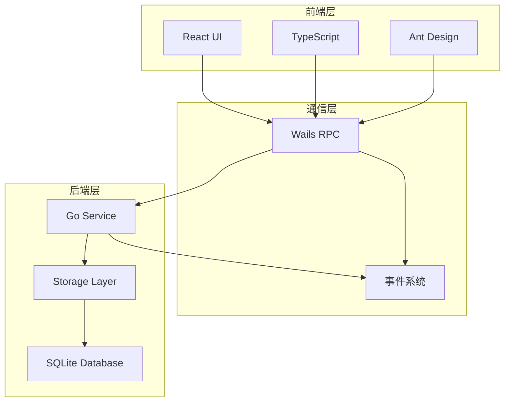
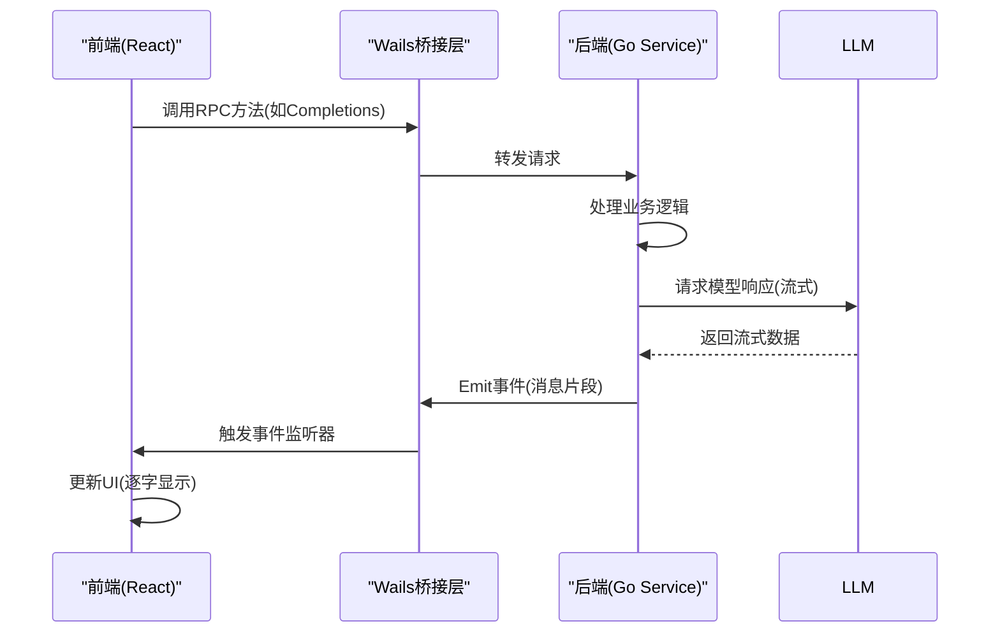
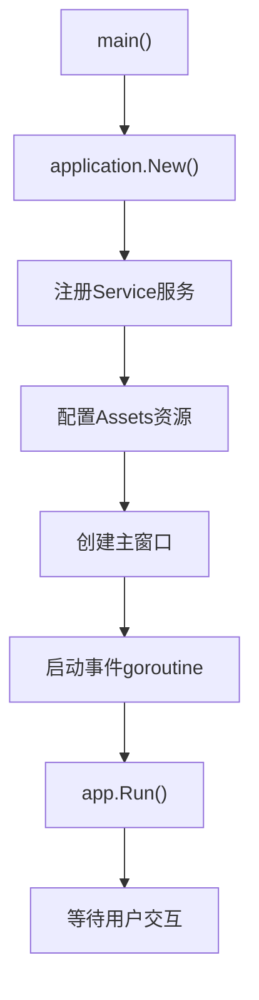
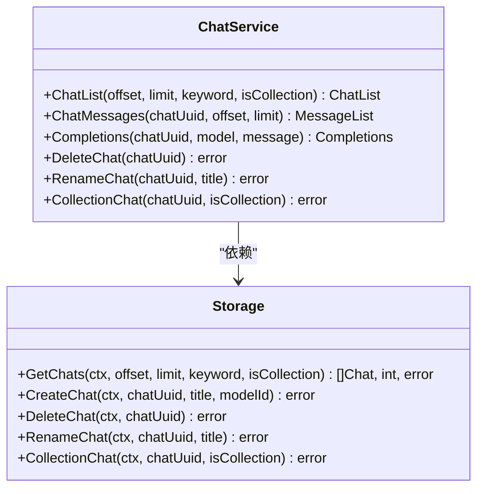
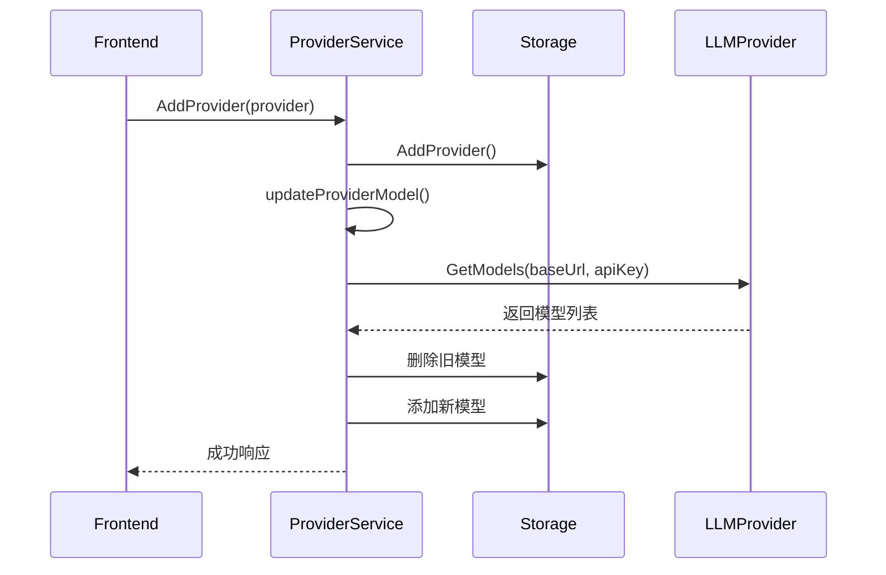
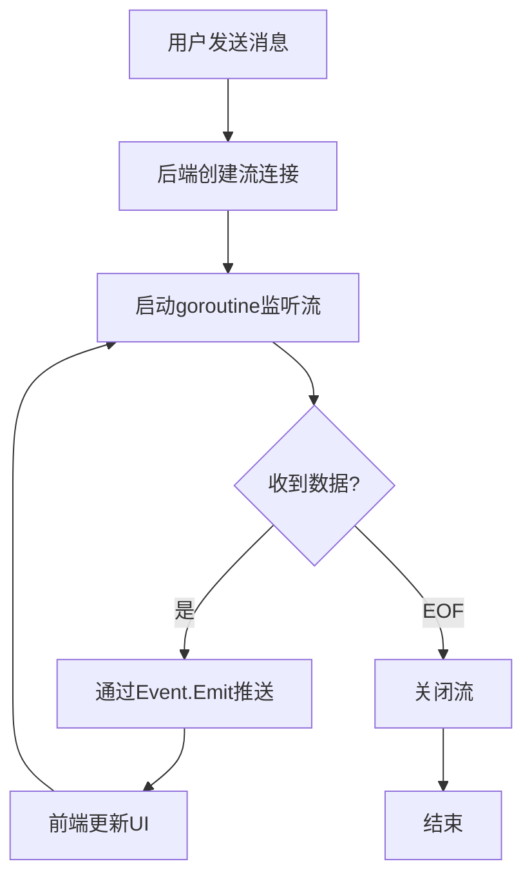

# 项目概述

<cite>
**本文档引用文件**  
- [main.go](file://main.go)
- [README.md](file://README.md)
- [backend/service/service.go](file://backend/service/service.go)
- [backend/storage/storage.go](file://backend/storage/storage.go)
- [backend/models/data_models/chat.go](file://backend/models/data_models/chat.go)
- [backend/service/chat.go](file://backend/service/chat.go)
- [backend/service/models.go](file://backend/service/models.go)
- [backend/service/provider.go](file://backend/service/provider.go)
- [backend/storage/chat.go](file://backend/storage/chat.go)
- [backend/storage/chat_message.go](file://backend/storage/chat_message.go)
- [backend/utils/llm/models.go](file://backend/utils/llm/models.go)
- [frontend/src/main.tsx](file://frontend/src/main.tsx)
</cite>

## 目录
1. [项目简介](#项目简介)
2. [核心特性](#核心特性)
3. [技术架构](#技术架构)
4. [前后端通信机制](#前后端通信机制)
5. [应用初始化流程](#应用初始化流程)
6. [数据持久化设计](#数据持久化设计)
7. [会话管理实现](#会话管理实现)
8. [模型与供应商管理](#模型与供应商管理)
9. [流式响应处理](#流式响应处理)
10. [系统集成与扩展性](#系统集成与扩展性)

## 项目简介

柠檬茶桌面客户端是一款基于Wails框架开发的跨平台AI聊天代理应用，旨在为用户提供本地运行、隐私安全的智能对话体验。该应用支持macOS、Windows和Linux三大操作系统，采用前后端分离架构，前端使用React构建用户界面，后端使用Go语言处理核心逻辑。项目设计强调数据本地化存储与用户隐私保护，所有聊天记录均通过SQLite数据库在本地持久化，避免敏感信息上传至云端。

**Section sources**  
- [main.go](file://main.go#L1-L59)
- [README.md](file://README.md#L1-L59)

## 核心特性

柠檬茶桌面客户端具备以下核心功能特性：
- **实时流式响应**：支持从LLM模型接收流式数据并实时渲染到界面
- **本地数据持久化**：使用SQLite存储聊天记录、模型配置等信息
- **会话管理**：支持创建、重命名、删除和收藏对话
- **多模型支持**：可配置多个AI模型提供商及其模型
- **RPC通信**：前后端通过Wails提供的RPC机制进行高效通信
- **跨平台兼容**：一次开发，可在三大主流桌面系统运行

**Section sources**  
- [backend/service/chat.go](file://backend/service/chat.go#L1-L207)
- [backend/storage/storage.go](file://backend/storage/storage.go#L1-L83)

## 技术架构

本项目采用分层架构设计，整体分为前端展示层、RPC通信层和后端服务层。前端基于React框架构建现代化UI界面，后端使用Go语言实现业务逻辑与数据访问。Wails框架作为桥梁，将Go后端编译为原生桌面应用，并嵌入前端资源。

**Diagram sources**  
- [main.go](file://main.go#L1-L59)
- [frontend/src/main.tsx](file://frontend/src/main.tsx#L1-L26)

**Section sources**  
- [main.go](file://main.go#L1-L59)
- [frontend/src/main.tsx](file://frontend/src/main.tsx#L1-L26)

## 前后端通信机制

前后端通过Wails框架提供的RPC机制进行通信。Go后端将服务注册为Wails服务，前端通过生成的TypeScript绑定调用这些服务方法。同时，系统使用事件驱动模式实现异步通信，后端可通过`app.Event.Emit`发送事件，前端监听相应事件接收实时更新。

**Diagram sources**  
- [main.go](file://main.go#L50-L57)
- [backend/service/chat.go](file://backend/service/chat.go#L50-L207)

**Section sources**  
- [main.go](file://main.go#L50-L57)
- [backend/service/chat.go](file://backend/service/chat.go#L50-L207)

## 应用初始化流程

应用启动从`main.go`文件开始，执行以下初始化步骤：
1. 创建Wails应用实例并配置基本属性
2. 注册后端服务（Service）
3. 配置前端资源路径（嵌入dist目录）
4. 创建主窗口并设置尺寸、标题等属性
5. 启动后台goroutine用于事件广播
6. 运行应用主循环

**Diagram sources**  
- [main.go](file://main.go#L1-L59)

**Section sources**  
- [main.go](file://main.go#L1-L59)

## 数据持久化设计

系统使用GORM作为ORM框架，SQLite作为本地数据库，实现数据的持久化存储。主要数据模型包括聊天会话（Chat）、消息记录（Message）、模型配置（Model）和供应商信息（Provider）。所有实体均继承`OrmModel`基础模型，包含创建时间、更新时间等通用字段。

```mermaid
erDiagram
CHAT {
string uuid PK
uint model_id FK
string title
string prompt
bool is_collection
datetime created_at
datetime updated_at
}
MESSAGE {
string uuid PK
string chat_uuid FK
text message_json
text search_content
text search_reasoning_content
datetime created_at
datetime updated_at
}
MODEL {
uint id PK
uint provider_id FK
string model
string owned_by
string object
bool enable
string alias
}
PROVIDER {
uint id PK
string provider_name
string base_url
string api_key
bool enable
string alias
}
CHAT ||--o{ MESSAGE : contains
MODEL }o--|| PROVIDER : belongs_to
```

**Diagram sources**  
- [backend/models/data_models/chat.go](file://backend/models/data_models/chat.go#L1-L63)
- [backend/storage/storage.go](file://backend/storage/storage.go#L1-L83)

**Section sources**  
- [backend/models/data_models/chat.go](file://backend/models/data_models/chat.go#L1-L63)
- [backend/storage/storage.go](file://backend/storage/storage.go#L1-L83)

## 会话管理实现

会话管理功能由`ChatService`提供，支持完整的CRUD操作。用户可创建新对话、重命名现有对话、删除对话以及收藏重要对话。每次用户发送消息时，系统会自动创建新的聊天会话（若未指定会话ID），并将用户消息和AI响应分别存储为独立的消息记录。

**Diagram sources**  
- [backend/service/chat.go](file://backend/service/chat.go#L1-L207)
- [backend/storage/chat.go](file://backend/storage/chat.go#L1-L110)

**Section sources**  
- [backend/service/chat.go](file://backend/service/chat.go#L1-L207)
- [backend/storage/chat.go](file://backend/storage/chat.go#L1-L110)

## 模型与供应商管理

系统支持多模型提供商管理，用户可添加不同的LLM服务提供商（如OpenAI、Anthropic等），并同步其可用模型列表。每个提供商包含基础URL、API密钥、别名等配置信息。当添加或更新提供商时，系统会自动调用其`/models`接口获取最新模型列表并存储到本地数据库。

**Diagram sources**  
- [backend/service/provider.go](file://backend/service/provider.go#L1-L145)
- [backend/utils/llm/models.go](file://backend/utils/llm/models.go#L1-L58)

**Section sources**  
- [backend/service/provider.go](file://backend/service/provider.go#L1-L145)
- [backend/utils/llm/models.go](file://backend/utils/llm/models.go#L1-L58)

## 流式响应处理

流式响应是本应用的核心交互体验。当用户发送消息后，后端创建gRPC流连接到LLM服务，接收分块响应数据。系统使用goroutine监听流数据，并通过Wails事件系统将每个消息片段实时推送到前端，实现类似打字机效果的逐字显示。

**Diagram sources**  
- [backend/service/chat.go](file://backend/service/chat.go#L50-L207)

**Section sources**  
- [backend/service/chat.go](file://backend/service/chat.go#L50-L207)

## 系统集成与扩展性

柠檬茶桌面客户端具有良好的扩展性，主要体现在：
1. **模块化设计**：服务层、存储层、模型层职责分离
2. **可插拔存储**：通过GORM支持多种数据库
3. **多提供商支持**：易于集成新的LLM服务
4. **事件驱动架构**：便于添加新功能而不影响现有逻辑
5. **类型安全通信**：前后端通过生成的TypeScript类型保证接口一致性

该架构为未来功能扩展（如插件系统、多用户支持、同步服务等）提供了坚实基础。

**Section sources**  
- [backend/service/service.go](file://backend/service/service.go#L1-L30)
- [backend/storage/storage.go](file://backend/storage/storage.go#L1-L83)