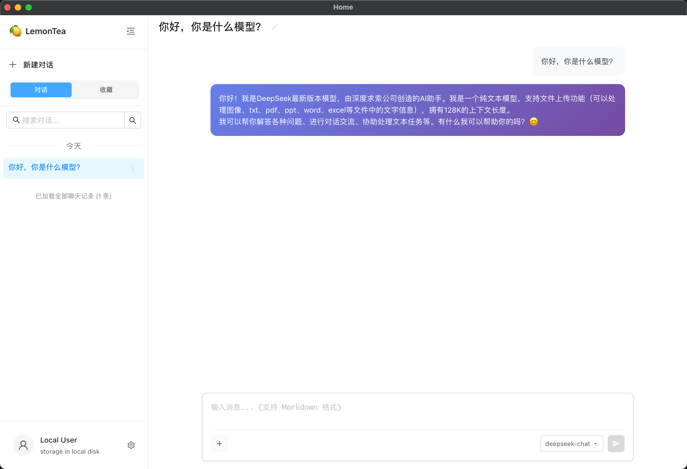

# Lemon Tea Desktop

[English](./README.md) | 简体中文

Lemon Tea Desktop 是一个基于 Wails v3、Go、React 和 TypeScript 构建的跨平台 AI 桌面客户端，当前重点覆盖聊天、工具调用、工作流式任务执行，以及桌面端本地能力集成。

<p align="center"></p>

## 当前功能

- 支持多轮对话、流式输出与手动停止生成。
- 支持会话创建、重命名、删除、收藏。
- 支持自动生成会话标题。
- 支持在聊天输入区附加本地文件，并对图片生成预览。
- 支持多种模型供应商：
  - DeepSeek
  - 阿里云百炼 / 通义千问兼容接口
  - OpenRouter
  - Ollama
  - 任意 OpenAI 兼容接口
- 支持模型管理：
  - 从供应商接口拉取模型列表
  - 设置供应商默认模型
  - 为供应商添加或删除自定义模型
  - 在本地记忆默认聊天模型
- 基于 CloudWeGo Eino / ADK 的工具调用能力。
- 当前内置工具包括：
  - 获取当前日期
  - 获取当前时间
  - 阻塞/等待工具
- 支持自定义 MCP 工具接入：
  - 从本地目录导入 MCP Server
  - 启用/禁用 MCP 工具
  - 删除已导入的 MCP 工具
- 支持面向复杂请求的工作流执行：
  - 任务规划
  - Worker 执行
  - 结果汇总
  - 审核与重试
- 支持执行轨迹展示，可查看阶段流转、子步骤、工具调用和耗时。
- 支持程序重启后的运行中任务恢复。
- 支持提示词管理：
  - 浏览内置提示词文件
  - 在线编辑并保存提示词
  - 一键恢复默认提示词
- 支持通用设置中的字体大小调整。
- 聊天页和设置页已适配桌面窗口与移动尺寸窗口。
- 支持的目标平台包括：
  - macOS
  - Windows
  - Linux
  - 实验性的 iOS / Android 构建脚手架

## 技术栈

- 后端：Go
- 桌面框架：Wails v3
- 前端：React 19 + TypeScript + Vite
- UI：Ant Design
- Agent / Tool 编排：CloudWeGo Eino
- 本地存储：SQLite + GORM

## 快速开始

### 1. 克隆项目

```bash
git clone <repo>
cd lemon_tea_desktop
```

### 2. 安装依赖

先安装 Wails v3：

```bash
go install github.com/wailsapp/wails/v3/cmd/wails3@latest
wails3 doctor
```

再安装前端依赖：

```bash
cd frontend
npm install
cd ..
```

### 3. 启动开发模式

直接使用 Wails：

```bash
wails3 dev -config ./build/config.yml
```

或使用 Task：

```bash
task dev
```

## 项目结构

```text
.
├── backend/     Go 服务、存储层、模型供应商适配、Agent 工作流逻辑
├── frontend/    React 界面、聊天页、设置页、通用组件
├── build/       Wails 构建与打包配置
├── docs/        README 资源文件
└── main.go      桌面应用入口
```

## Roadmap

- 更完整的多 Agent 协作能力
- 持久化记忆的可视化与编辑
- 后台任务自动化
- 国际化支持

## 许可证

MIT
