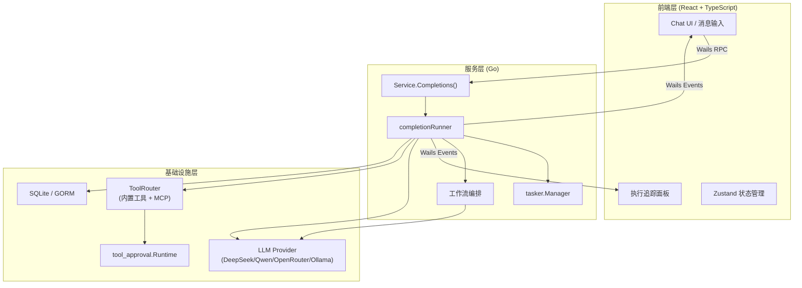
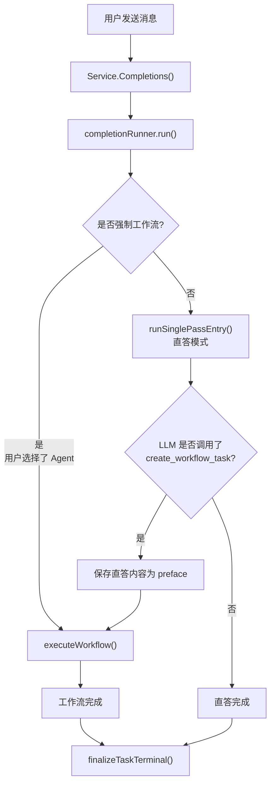
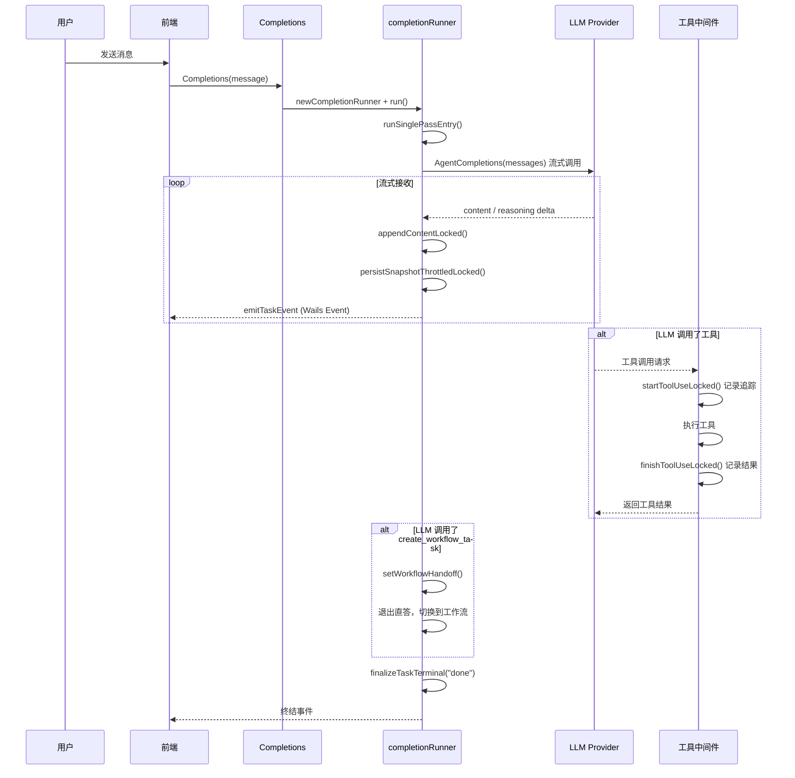
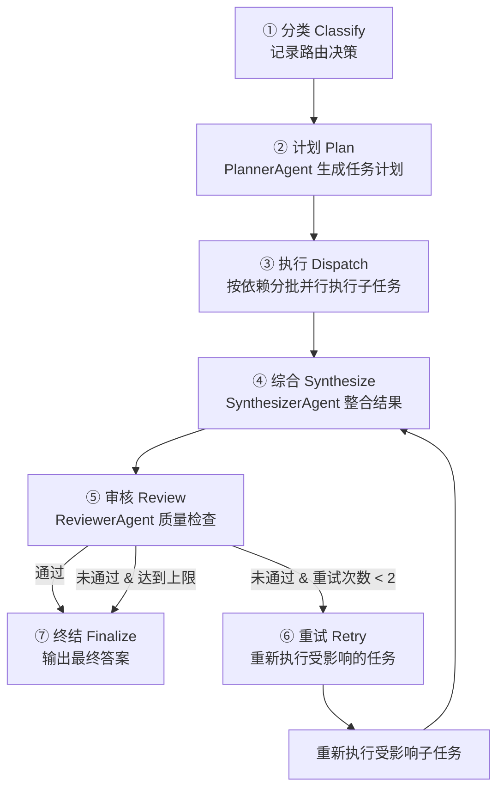
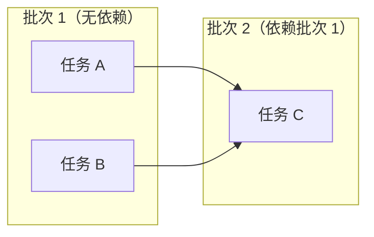
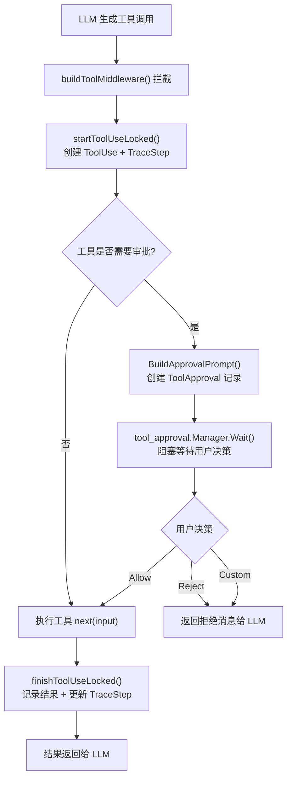
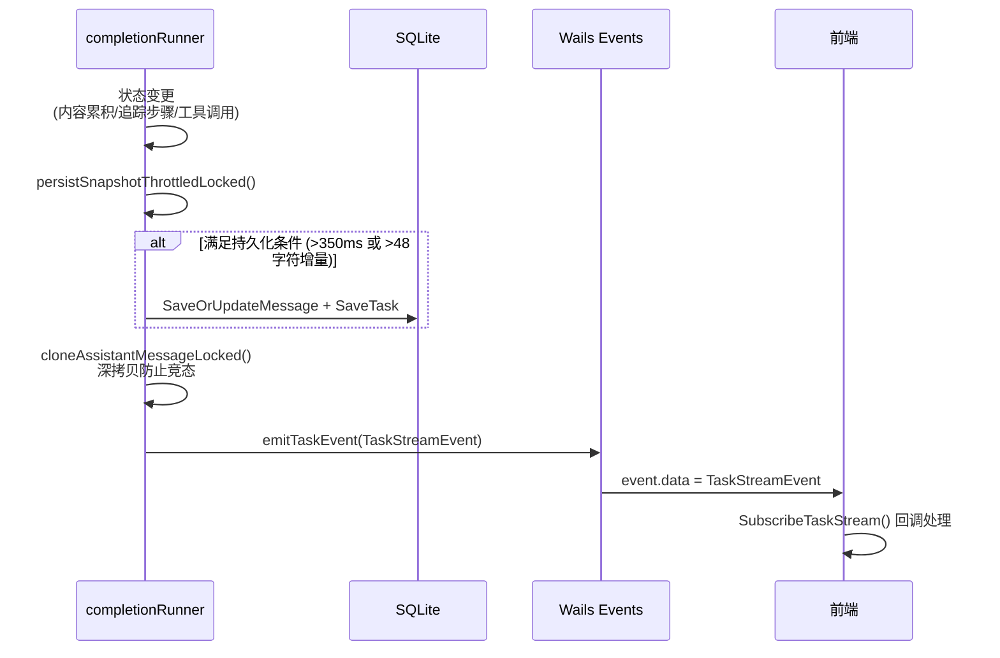
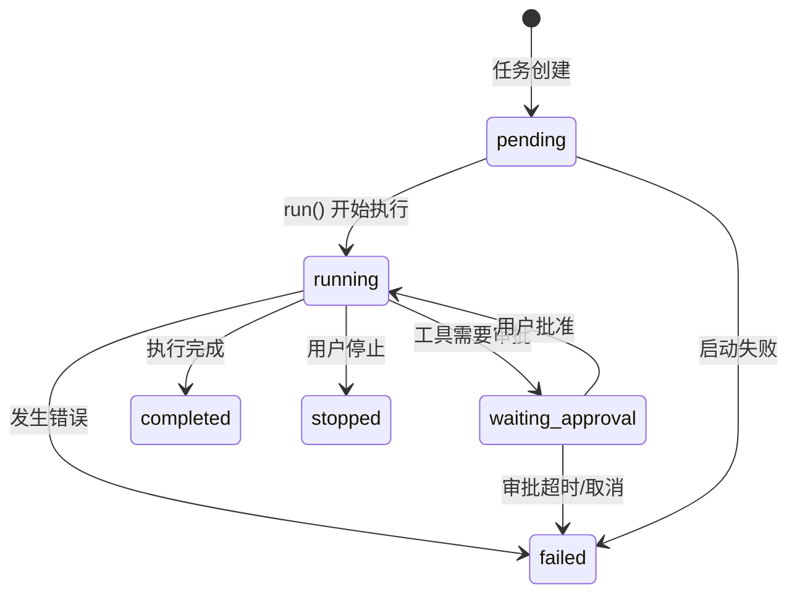

# Lemon Tea Desktop — Agent 流程文档

## 1. 项目概述

Lemon Tea Desktop 是一个跨平台 AI 桌面客户端，支持多轮对话、工具调用、MCP 工具集成和工作流编排。

**技术栈：**

| 层级 | 技术 |
|------|------|
| 后端 | Go 1.25 + CloudWeGo Eino (Agent 编排框架) |
| 前端 | React 19 + TypeScript + Vite + Ant Design |
| 桌面框架 | Wails v3 |
| 存储 | SQLite + GORM |
| LLM 适配 | DeepSeek、通义千问、OpenRouter、Ollama、OpenAI 兼容接口 |

---

## 2. 架构概览

### 2.1 三层架构



### 2.2 双路径决策

系统支持两种执行路径：**直答**（Direct Answer）和**工作流**（Workflow）。



**路由决策规则：**
- 用户选择了 Agent → 强制进入工作流（`shouldForceWorkflow`）
- 否则先尝试直答，LLM 可在直答过程中主动调用 `create_workflow_task` 工具切换到工作流

---

## 3. 核心组件

### 3.1 Service.Completions

> `backend/service/chat.go:111`

入口函数，负责：

1. **参数校验** — 验证 `UserMessageExtra` 存在
2. **生成标识符** — `chatUuid`、`taskUuid`、`assistantMessageUuid`、`eventKey`
3. **获取模型配置** — 通过 `storage.GetProviderModel()` 查找模型
4. **解析工具集** — `resolveSelectedTools()` 加载内置工具 + MCP 工具
5. **准备消息** — 合并历史消息 + 当前用户消息，转换为 `schema.Message` 格式
6. **创建 DB 记录** — 用户消息、助手消息（空占位）、任务记录
7. **创建 Runner** — `newCompletionRunner()` 封装所有运行时状态
8. **构建工具中间件** — `buildToolMiddleware()` 用于拦截工具调用
9. **创建 LLM Provider** — `llm_provider.NewLlmProvider()` 绑定模型 + 工具 + 中间件
10. **启动异步任务** — `tasker.Manager.StartTask(runner.run)`

返回值包含 `chatUuid`、`taskUuid`、`messageUuid`、`eventKey`，前端据此订阅事件流。

### 3.2 completionRunner

> `backend/service/chat_completion_runner.go:37`

封装一次 Completions 调用的全部运行时状态，是系统的核心执行引擎。

```go
type completionRunner struct {
    // 外部依赖（创建后只读）
    svc              *Service
    provider         *llm_provider.Provider
    localizedPrompts prompts.PromptSet
    agentTools       []tool.BaseTool
    schemaMessages   []schema.Message

    // 标识符（不可变）
    chatUuid, assistantMessageUuid, taskUuid, eventKey string

    // 受 mu 保护的可变状态
    mu                sync.Mutex
    assistantMessage  data_models.Message     // 持续更新的助手消息
    task              data_models.Task        // 当前任务状态
    pendingTraceDelta []data_models.TraceStep // 待发送的追踪步骤增量

    // 工作流切换状态（受 handoffMu 保护）
    handoffMu               sync.Mutex
    workflowHandoffDecision *workflowHandoff

    // 原子状态
    userStopped          atomic.Bool // 用户是否主动停止
    terminalEventEmitted atomic.Bool // 终结事件是否已发射
}
```

### 3.3 tasker.Manager

> `backend/pkg/tasker/manager.go`

全局单例，管理异步任务的生命周期：

- `StartTask(runtime, fn)` — 启动 goroutine 执行任务
- `StopTask(taskUUID)` — 通过 `stopCh` 通道发送停止信号
- `GetTaskRuntime(taskUUID)` — 查询任务运行状态
- `ListRunningTasks()` — 获取所有活跃任务

每个任务拥有独立的 `stopCh chan struct{}`，Runner 通过 goroutine 监听该通道实现优雅停止。

### 3.4 llm_provider.Provider

> `backend/pkg/llm_provider/provider.go`

LLM 供应商抽象层，封装了：

- `chatModel` — 基础聊天模型
- `toolChatModel` — 支持工具调用的模型
- `mainAgent` — 基于 Eino ADK 的主 Agent

关键方法：
- `AgentCompletions()` — 创建 ADK Runner，返回 `AsyncIterator[*AgentEvent]` 用于流式接收
- `Generate()` — 非流式生成（用于 Planner、Synthesizer 等内部 Agent）

### 3.5 ToolRouter

> `backend/pkg/llm_provider/tools/common.go`

全局工具注册表，管理内置工具和动态 MCP 工具：

| 工具 ID | 描述 |
|---------|------|
| `get_current_date` | 获取当前日期 |
| `get_current_time` | 获取当前时间 |
| `block` | 延迟执行（测试用） |
| `file_tool` | 文件操作（需审批） |
| `shell_tool` | Shell 命令执行（需审批） |

动态工具方法：`UpsertDynamicTool()`、`RemoveDynamicTool()`、`ResetDynamicTools()`

### 3.6 tool_approval.Runtime

> `backend/pkg/tool_approval/runtime.go`

基于 Channel 的工具审批管理器：

```
Register(approvalID) → Wait(ctx, approvalID) [阻塞] → Resolve(result) [唤醒]
```

- 决策类型：`allow`（执行）、`reject`（拒绝）、`custom`（自定义响应）
- 前端通过 `Service.RespondToolApproval()` 提交审批结果

---

## 4. 直答路径

> `backend/service/chat_completion_runner.go:967` — `runSinglePassEntry()`



**关键流程：**

1. 注入 `EntrySystem` 系统提示词 + 历史消息
2. 调用 `provider.AgentCompletions()` 获取流式迭代器
3. 逐块接收响应，通过 `appendContentLocked()` 累积内容
4. 每次累积后尝试 `persistSnapshotThrottledLocked()` 节流持久化
5. 持续检查 `getWorkflowHandoff()` — 如果 LLM 调用了 `create_workflow_task` 工具，立即退出直答循环
6. 正常结束后调用 `finalizeTaskTerminal("done")` 发射终结事件

---

## 5. 工作流路径

> `backend/service/chat_completion_runner.go:1065` — `executeWorkflow()`

### 5.1 七阶段总览



### 5.2 阶段详解

#### ① 分类（Classify）

记录路由决策来源：
- `guard_rule` — 由守卫规则强制触发（如用户选择了 Agent）
- `main_model` — LLM 在直答过程中主动触发

如果从直答切换过来，会保存已生成的直答内容为 `PrefaceContent`。

#### ② 计划（Plan）

> `backend/service/chat_orchestration.go:91` — `generateWorkflowPlan()`

PlannerAgent 接收用户请求、可用工具列表和近期对话上下文，生成结构化执行计划：

```go
type workflowPlan struct {
    Goal               string             // 总体目标
    CompletionCriteria []string           // 完成标准
    Tasks              []workflowPlanTask // 子任务列表
}

type workflowPlanTask struct {
    ID             string   // 任务 ID
    Title          string   // 任务标题
    Description    string   // 任务描述
    Dependencies   []string // 依赖的任务 ID
    SuggestedAgent string   // 建议的 Agent 角色
    RequiredTools  []string // 需要的工具
    ExpectedOutput string   // 预期产出
}
```

#### ③ 执行（Dispatch）

> `backend/service/chat_completion_runner.go:1295` — `executeBatches()`

任务按依赖关系拓扑排序，分批并行执行：



- `batchTasksByDependencies()` 计算入度，生成 DAG 拓扑排序
- 每批内通过 `sync.WaitGroup` + goroutine 并行执行
- 每个子任务创建独立的 `RoleAgent`（通用 Worker 或工具专家）
- 子任务执行通过 `adk.NewRunner` + `runner.Run()` 流式处理

#### ④ 综合（Synthesize）

> `backend/service/chat_orchestration.go` — `synthesizeWorkflowAnswer()`

SynthesizerAgent 接收所有子任务输出 + 审核反馈（如有），生成统一的候选答案。

#### ⑤ 审核（Review）

> `backend/service/chat_orchestration.go` — `reviewWorkflowAnswer()`

ReviewerAgent 检查候选答案是否满足目标，返回结构化决策：

```go
type reviewDecision struct {
    Approved          bool     // 是否通过
    Issues            []string // 存在的问题
    RetryInstructions string   // 重试指令
    AffectedTaskIDs   []string // 需要重新执行的任务
}
```

#### ⑥ 重试（Retry）

若审核不通过且未达到最大重试次数（2 次），系统会：
1. 仅重新执行 `AffectedTaskIDs` 指定的子任务
2. 将 `RetryInstructions` 追加到任务描述中
3. 回到综合阶段重新整合

#### ⑦ 终结（Finalize）

将最终答案写入 `assistantMessage.Content`，持久化到数据库。

---

## 6. 工具系统

### 6.1 工具调用流程



### 6.2 工具中间件

> `backend/service/chat_completion_runner.go:721` — `buildToolMiddleware()`

每次工具调用都经过中间件拦截，用于：

1. **追踪记录** — 创建 `TraceStep`（类型 `tool_call`），记录开始/结束时间、输入/输出
2. **审批检查** — 如果工具实现了 `ApprovalAwareTool` 接口，触发审批流程
3. **上下文传递** — 通过 `context.Value` 传递 `traceParentStepID` 和 `traceAgentName`

### 6.3 MCP 工具集成

> `backend/service/mcp.go`

外部工具通过 MCP (Model Context Protocol) 接入：

1. 用户通过文件对话框选择 MCP 服务器目录
2. 系统读取 `mcp.json` 配置文件
3. 注册 `CustomMCPServer` 到数据库
4. 运行时通过 `loadMCPServerTools()` 连接 MCP 服务器：
   - 启动 stdio 客户端（`mcp-go/client`）
   - 枚举可用工具
   - 包装为 `AliasedTool`（ID 格式：`mcp_<hash>_<name>`）
5. 请求结束后调用 `cleanupTools()` 关闭连接

### 6.4 工作流切换工具

> `backend/service/workflow_handoff_tool.go`

`create_workflow_task` 是一个特殊的内置工具，仅在直答模式下注入。当 LLM 判断当前任务需要多步编排时，会调用此工具，触发工作流切换。

---

## 7. 事件流机制

### 7.1 事件架构



### 7.2 TaskStreamEvent

> `backend/service/chat.go:312` — `emitTaskEvent()`

```go
type TaskStreamEvent struct {
    TaskUuid         string
    ChatUuid         string
    Status           TaskStatus        // pending / running / waiting_approval / completed / failed / stopped
    FinishReason     string            // done / error / user stop
    FinishError      string
    ExecutionTrace   ExecutionTrace    // 完整追踪数据
    TraceDelta       []TraceStep       // 增量追踪步骤
    CurrentStage     string            // 当前阶段标识
    CurrentAgent     string            // 当前执行的 Agent
    RetryCount       int               // 重试计数
    AssistantMessage Message           // 完整助手消息快照
}
```

### 7.3 事件订阅（前端）

> `frontend/src/utils/completions.ts`

```typescript
function SubscribeTaskStream(
    task: Task,
    onEvent: (event: TaskStreamEvent) => void,
    onError?: (error: string) => void,
    onComplete?: (event: TaskStreamEvent) => void,
): (() => void) | null
```

- 通过 `Events.On(task.event_key, ...)` 监听 Wails 事件
- 每次事件触发 `onEvent` 回调更新 UI
- 任务终结时（状态不为 pending/running/waiting_approval）触发 `onComplete`

### 7.4 节流策略

`persistSnapshotThrottledLocked()` 实现双条件节流：

- **时间条件** — 距上次持久化 ≥ 350ms
- **内容条件** — 内容增量 ≥ 48 字符

满足任一条件才执行 DB 写入，但事件始终发射以保持前端响应性。

---

## 8. 状态管理与恢复

### 8.1 任务状态机



### 8.2 执行追踪

> `backend/models/data_models/execution_trace.go`

每个追踪步骤（`TraceStep`）记录：

| 字段 | 说明 |
|------|------|
| `StepID` | 唯一标识 |
| `ParentStepID` | 父步骤（支持嵌套） |
| `Type` | classify / plan / dispatch / agent_run / tool_call / synthesize / review / retry / finalize |
| `Status` | pending / running / awaiting_approval / done / rejected / error / skipped |
| `AgentName` | 执行该步骤的 Agent |
| `ToolName` | 调用的工具（仅 tool_call 类型） |
| `ElapsedMs` | 执行耗时 |
| `DetailBlocks` | 结构化详情（输入/输出/审核结果） |

### 8.3 并发控制

- `completionRunner.mu` — 保护所有可变状态（`assistantMessage`、`task`、`pendingTraceDelta`）
- `completionRunner.handoffMu` — 独立保护工作流切换决策
- `atomic.Bool` — `userStopped`、`terminalEventEmitted` 用于跨 goroutine 信号
- `cloneAssistantMessageLocked()` — 事件发射前深拷贝，避免并发修改

### 8.4 任务恢复

> `backend/service/task_recovery.go`

**应用启动恢复：** `recoverStaleRunningTasks()`

- 查找状态为 `running` / `pending` / `waiting_approval` 但无活跃 goroutine 的任务
- 补全未关闭的 ToolUse 和 TraceStep
- 处理过期的审批请求
- 标记为 `failed`，错误信息：`"任务因程序退出而中断，请重新发起"`

**运行时修复：** `repairStaleActiveTask()`

- 查询活跃任务时如果发现状态异常（有活跃状态但无 Runtime），自动修复

**优雅停止：** `ServiceShutdown()`

- 遍历所有活跃 Runtime，逐个调和中断的任务

### 8.5 错误处理

`failWithError()` 区分两种错误场景：

- **用户主动停止** — `context.Canceled` 或 `userStopped` 标记 → `finishReason: "user stop"`
- **真实错误** — `finishReason: "error"` + 错误信息

---

## 9. 关键文件索引

| 文件路径 | 职责 |
|---------|------|
| `backend/service/chat.go` | 入口 `Completions()`、事件发射、任务查询 |
| `backend/service/chat_completion_runner.go` | 核心 Runner：双路径执行、工具中间件、状态管理 |
| `backend/service/chat_orchestration.go` | 工作流编排：计划生成、批量执行、综合、审核 |
| `backend/service/workflow_handoff_tool.go` | 工作流切换工具定义 |
| `backend/service/mcp.go` | MCP 工具集成与管理 |
| `backend/service/tool_approval.go` | 审批响应处理 |
| `backend/service/task_recovery.go` | 任务恢复与优雅停止 |
| `backend/pkg/tasker/manager.go` | 异步任务生命周期管理 |
| `backend/pkg/llm_provider/provider.go` | LLM Provider 工厂 |
| `backend/pkg/llm_provider/agents/main_agent.go` | 主 Agent 创建 |
| `backend/pkg/llm_provider/agents/role_agent.go` | 角色 Agent 创建（Worker） |
| `backend/pkg/llm_provider/tools/common.go` | 工具注册表 |
| `backend/pkg/tool_approval/runtime.go` | 审批运行时（Channel 同步） |
| `backend/models/data_models/execution_trace.go` | 追踪步骤类型与状态定义 |
| `backend/models/data_models/message.go` | 消息模型（含 AssistantMessageExtra） |
| `backend/models/data_models/task.go` | 任务模型与状态枚举 |
| `backend/pkg/prompts/prompts.go` | 本地化提示词集合 |
| `frontend/src/utils/completions.ts` | 前端事件订阅与 API 调用 |
