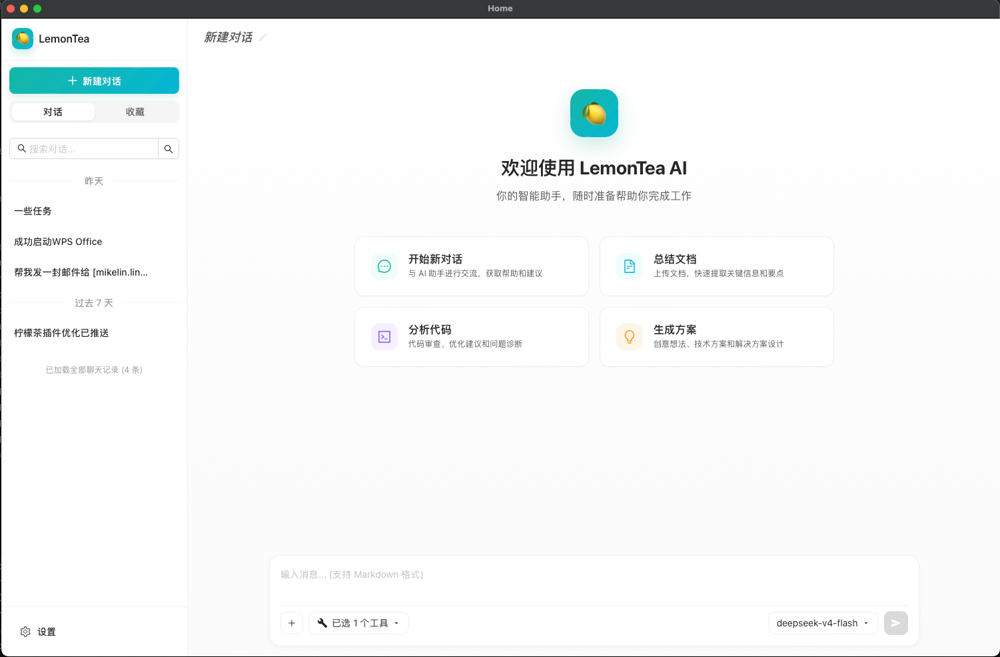
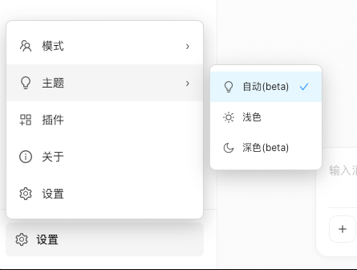

# 项目基础建设

我现在正在基于 wails3 开发一个 ai chatbox，现在我需要为这个项目打下一个基础。

## 前端界面

现在我需要先写死前端页面，快速做一个可操作的界面，能让产品可以先被看到。

#### 主界面

主界面左侧是一个侧边栏，右侧是一个聊天界面，侧边栏和聊天界面可以通过拖动改变其左右的宽度，如图:

##### 侧边栏

最上方是我们的 icon 和程序名称“lemontea”，然后下面是新建对话按钮，然后是一个开关式的 tab 切换，下方是搜索框，然后就是对话列表，最下方是设置按钮。

侧边栏分为3个部分，分别是头部、对话列表、设置。头部在最上方，设置在最下方，中间剩余的空间为对话列表

###### 头部

头部是一个 icon + “lemontea”，鼠标放到 icon 上会有一个跳动的小动画

###### 对话列表

**布局**

1. 新建对话按钮，点击可以新建一个对话
2. 开关式的 tab 切换，点击可以在”对话”和”收藏“中切换
3. 搜索输入框，可以搜索当前列表的对话
4. 对话列表

**功能**

1. 点击新建对话后可以新建一个对话，此时对话列表中新增一个新建对话项
2. 对话列表默认按照时间倒序排序，使用时间跨度进行划分，分别是今天、昨天、过去7天、更久以前
3. 当滚动到对话列表底部的时候，底部需要显示“已加载全部聊天记录 (x 条)”
4. 鼠标移到对话列表中某个对话的时候，右侧显示更多按钮，点击展开菜单，分别是收藏/取消收藏、重命名、删除
5. 当某个对话进行中（大模型正在输出内容）的时候，对话列表对于的项，最左侧显示一个 loading 动画
6. 当用户在其他聊天对话中，此时某个处于 loading 的对话完成后，在对话列表的对话项左侧标记一个**绿色**点标记，用户查看后标记消失
7. 当用户在其他聊天对话中，此时某个处于 loading 的对话因为错误中止后，在对话列表的对话项左侧标记一个**红色**点标记，用户查看后标记消失
8. 当用户在其他聊天对话中，此时某个处于 loading 的对话因为需要用户确认信息而中止后，在对话列表的对话项左侧标记一个**蓝色**点标记，用户查看后标记消失
9. 用户点击某个对话，在右侧聊天界面中先显示 loading 动画，加载完后显示对话界面

###### 设置

点击设置按钮弹出一个菜单，分别为“主题”、“关于”、“设置”。

当鼠标放在主题的时候，展开菜单：自动、浅色、深色，如图：

点击关于，新建窗口，显示关于页面

点击设置，新建窗口，显示设置界面

##### 对话界面

###### 头部

头部是对话标题栏

1. 新建对话的时候标题默认为“新对话”
2. 当在已经发生对话的对话中，标题为 ai 生成的标题，标题右侧显示一个编辑 icon ，点击在原标题的位置出现一个输入框，可以输入标题，右侧是保存和取消按钮

###### 对话

**新对话**

用户处于一个新的对话时，主界面显示欢迎界面，布局如下

1. 应用icon
2. 欢迎问候语：“欢迎使用 lemontea”
3. 应用简介：“你的智能助手，随时准备帮助你完成工作“
4. 快捷开始按钮，快捷开始按钮左侧是icon，右侧是标题和简介

当用户在一个已对话的聊天时，显示聊天记录，布局如下

1. ai 消息靠左，user 消息靠右，都不显示图像
2. 消息时间显示在消息上方，相对于聊天界面居中，仅在必要位置显示时间戳，避免冗余，突出消息流的时间节奏。

| 场景                                     | 是否显示时间         | 显示位置/形式                                                                                                                                                                               | 说明                                                                                                                   |
| ---------------------------------------- | -------------------- | ------------------------------------------------------------------------------------------------------------------------------------------------------------------------------------------- | ---------------------------------------------------------------------------------------------------------------------- |
| **首条消息（会话顶部）**           | ✅ 显示              | 消息气泡上方居中，灰色小字（如 `今天 09:23`）                                                                                                                                             | 标志该消息块的起始时间；若为当天首条，则显示“今天”；否则显示具体日期（如 `4月5日 14:18`）。                        |
| **同一自然日内连续发送的消息**     | ❌ 不显示            | —                                                                                                                                                                                          | 后续消息**不重复显示时间**，即使间隔数小时（只要未跨天），依赖用户对“今天”的上下文理解。                       |
| **跨天后的首条消息**               | ✅ 显示              | 气泡上方居中，格式：` `• 当天 → `今天 10:05 `• 昨天 → `昨天 22:30 `• 更早 → `4月3日 08:12`（不显示年份，除非跨年）                                                   | 微信**默认不显示年份**，仅当消息发生在**去年或更早**时，才显示完整日期（如 `2023年12月25日`）。          |
| **同一天内，长时间静默后的新消息** | ⚠️ 可能显示        | 若距离上一条消息 ≥**2小时**（实测阈值），且仍属同一天 → **仍不显示时间**（保持“今天”连续性）；但若用户手动滚动并停留，状态栏/窗口标题可能短暂提示最后活跃时间（非气泡内）。 | ✅ 关键点：**微信桌面版不按“间隔时长”触发时间戳，只按“日期变更”触发。**                                      |
| **系统通知/红包/转账等特殊消息**   | ✅ 显示              | 同样遵循日期规则，独立打时间戳（因类型不同，自动分组隔离）。                                                                                                                                | 特殊消息类型自带分隔线，时间戳为其所在消息块的起始标识。                                                               |
| **消息气泡内部（右下角）**         | ❌**从不显示** | —                                                                                                                                                                                          | 区别于手机端长按可查看详情，**桌面版气泡右下角无时间（如 iOS 的“10:23”）**，所有时间均以“块头”形式统一展示。 |

3. ai 输出消息下方，显示模型名称，输出和输入使用的token数量，输出和输入使用 icon 表示
4. 消息支持 markdown 渲染
5. user 消息需要使用圆角矩形框住，ai 消息不需要
6. 用户滚动消息后，消息没在最底部，在消息显示区域最下方显示一个滑动到底部的按钮，点击可以滑动到底部
7. 用户在聊天列表点击进入聊天页面后，默认从最下方展示（展示最新消息）

###### 输入

1. 输入支持 markdown 的实时渲染
2. 输入区域最下方为功能栏，功能如下：
   1. 添加按钮：点击可以选择上传文件，
   2. 工具选择栏：点击展开工具列表，可以禁用/启用工具
   3. 模型选择栏目：点击展开模型列表，可以选择模型，模型以供应商为 group，同一个模型供应商的模型显示在一起，点击模型供应商 title，可以在选择框中看到所有模型供应商，点击对应的供应商跳到对应供应商模型
3. 发送按钮

## 功能要求

### 对话过程

#### 自动滚动

1. 当 ai 在输出的时候，自动滚动到最新输出的位置（底部）
2. 如果在输出过程中用户滚动了界面，则暂停自动滚动，并显示滚动到底部的按钮
3. 如果暂停自动滚动后，用户点击滚动到底部，则滚动到底部且启用自动滚动
4. 每次用户输入并发送后，默认启用自动滚动

#### 内容显示

1. 对话过程中需要在最底部显示 loading 动画
2. 思维链接在正文未输出的时候默认展开显示，正文输出后自动折叠思维链，用户可以手动点击展开/折叠

### 输入

1. 用户输入框可以支持实时 markdown 渲染
2. 按下回车发送消息，shift + 回车 换行

技术要求参考：[技术要求](./01.init.tech.md)
