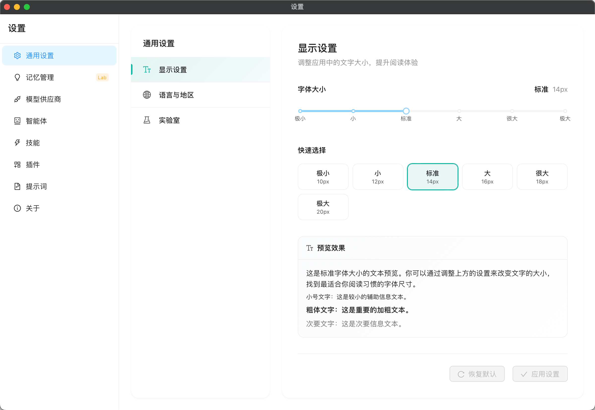

# 基础窗口

## 前端界面

设置界面样式如图

当用户在侧边栏最下方设置菜单中点击设置的时候，打开设置窗口。

### 样式

设置分为左侧菜单栏区域（setting_menu）和右侧内容区域（setting_content）,左侧菜单栏区域是一个选择列表，当选择到对应的设置项的时候，右侧内容区域就会显示对应的设置内容。现在设置菜单需要包含：通用、模型供应商、关于。

右侧区域内容有两种显示样式，一种是设置子菜单（setting_content_child_menu）加上设置内容（setting_content_child_content）,另外一种则是直接设置内容（setting_content_direct）

#### 设置子菜单

在设置界面右侧内容区域中，内容区域采用左右分栏布局：左侧为设置子菜单，右侧为详细设置内容。点击左侧的子菜单项，右侧将显示对应的设置内容。

* **子菜单结构** ：顶部显示设置类别的标题，下方列出子菜单项列表。
* **内容区结构** ：顶部显示子设置项的标题和备注信息，其余部分用于设置内容。

#### 直接设置内容

在设置界面的右侧内容区域中，整个区域专注于当前设置项的内容：顶部显示设置标题，其余部分用于呈现具体的设置选项和控件。

### 设置项

#### 通用

通用设置采用**设置子菜单**形式，包含以下子菜单项：显示设置、语言与地区、文件。

**显示设置**

* 支持调节文字大小，并提供实时预览。
* 调节后需点击“应用”按钮生效。
* 提供“恢复默认”和“应用”两个按钮；有变更时，“应用”按钮变为可点击状态。

**语言与地区**

* 提供两个下拉选择框：地区和语言。
* 提供“应用”按钮；有变更时按钮变为可点击。
* 语言修改后，应用显示语言可立即更新。

**文件**

* 支持设置数据文件存储路径。
* 提供“应用”按钮；有变更时按钮变为可点击。
* 应用后，系统将迁移用户数据并重启应用。

#### 模型供应商

模型供应商设置采用**设置子菜单**形式，子菜单项是模型供应商列表，子菜单头部标题区域最右侧是一个添加按钮，点击可以添加模型供应商。

**供应商列表**

供应商列表中的每个供应商项应显示以下元素：

* 供应商图标（icon）
* 供应商名称
* 基础 URL 地址

右侧包含：

* 启用/禁用开关
* 更多按钮（点击展开菜单，选项包括：设为默认、删除）

如果某个供应商被设置为默认，则在供应商名称右侧显示“默认”标签

**供应商详情**

供应商详情页面从上到下依次包含以下元素：

* **供应商名称标题** ：显示“配置 {供应商名称}”。
* **提示文本** ：显示“API 密钥将加密保存在本地，不会上传到任何服务器。”
* **启用状态开关** ：一个开关控件。点击开关时，状态需与供应商列表中的开关同步（双向同步）。
* **相关表单** ：
  * 供应商名称输入框（必填 *）
  * API 密钥输入框
  * API 基础 URL 输入框（必填 *）
* **模型列表** ：
  * 标题右侧显示模型数量，格式：“{n} 个模型”。
  * 标题右侧提供刷新按钮（点击刷新模型列表）和添加按钮（点击添加自定义模型）。
* **操作按钮** ：包括保存、测试连接、删除按钮。

#### 关于

* **左侧侧边栏** ：窄侧边栏导航，当前选中“关于”，下方选项包括“功能特性”和“联系我们”。
* **主区域** ：
* 顶部：应用图标、标题“Lemontea”、版本标签“v0.0.1-dev”。
* 下方：应用描述：“一款跨平台 AI 桌面客户端，支持多模型对话、工具调用、工作流编排和 MCP 扩展。”
