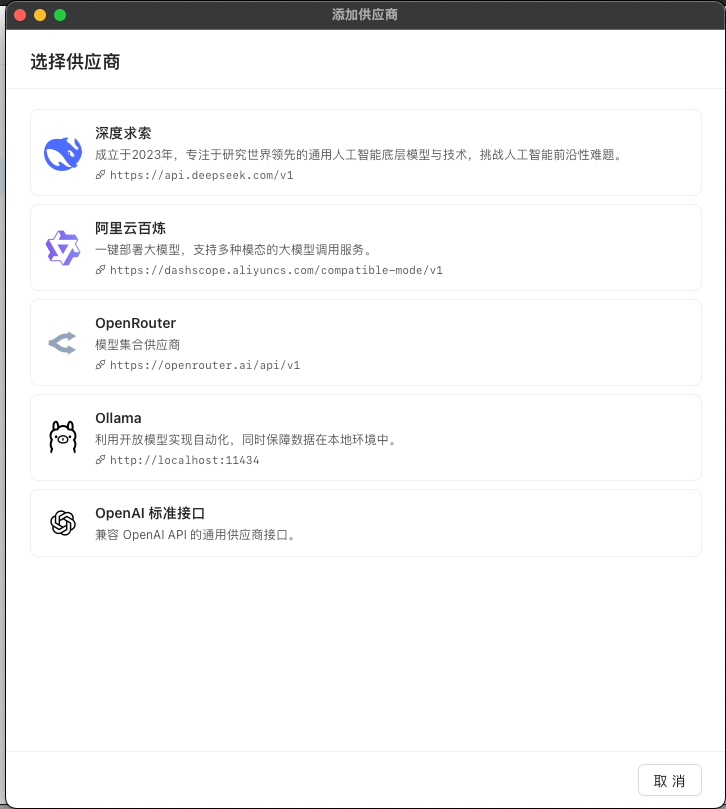

# 供应商设置

## 1.添加供应商

在供应商页面，点击添加供应商后，新建添加供应商窗口，

添加供应商窗口，样式结构如图

### 前端界面

添加供应商分为两个步骤：选择供应商和填写供应商信息。

* **步骤1：选择供应商** ：窗口打开时，先显示供应商列表。用户选择供应商后，点击“下一步”按钮。
* **步骤2：填写供应商信息** ：进入填写页面，用户输入相关信息。

两个步骤页面的布局固定，从上到下依次为：

* 添加供应商标题
* 步骤条（显示当前步骤进度，固定在上方）
* 步骤内容（具体表单或列表，当内容超高时此区域可以滚动）
* 操作区域（按钮，如“上一步”、“下一步”、“完成”等，固定在最下方）

#### 页面布局

##### **添加供应商标题**

* 位于页面顶部。
* 在 macOS 系统下，向左留白一些空间（以适应窗口样式）。

##### **步骤条**

* 显示三个步骤：选择供应商、填写信息、完成。
* 状态指示：
  * 在选择供应商页面时，高亮“选择供应商”。
  * 在填写信息页面时，高亮“填写信息”。
  * 添加完成后，显示“完成”欢迎页面，高亮“完成”。

##### **内容区域**

- 内容区域占页面剩余的全部高度
- 当内容区域内容超高时，内容区域显示滚动条

##### 操作区域

- 操作区域固定在页面最底部

#### 页面功能

##### 选择供应商

选择供应商是一个列表，每个供应商信息内容如下：

- 供应商icon（如有则显示）
- 供应商名称
- 供应商简介
- 供应商baseURL（如有则显示）

选择供应商页面的操作：

- 取消：点击取消后关闭窗口
- 下一步：点击下一步后进入填写供应商信息页面

##### 填写供应商信息

在选择完供应商后，需要将供应商基础信息带入信息表单中，供应商信息表单如下：

- 启用状态：一个开关，默认启用
- 供应商名称*
- API密钥
- 基础Url*
- 默认模型：下拉选择，右侧有一个刷新icon按钮，点击可以获取模型列表，也可以自己输入默认模型

填写供应商页面的操作：

- 上一步：返回供应商选择页面
- 取消：点击取消后关闭窗口
- 添加：点击添加后进入完成页面

##### 完成欢迎

进入完成欢迎页面后，是一个欢迎语句，然后显示完成按钮，此时设置中供应商页面列表需要刷新

### 后端逻辑

#### 添加供应商配置

* 从 [config](vscode-file://vscode-app/Applications/Visual%20Studio%20Code.app/Contents/Resources/app/out/vs/code/electron-browser/workbench/workbench.html) 的 [SupportedProviderList](vscode-file://vscode-app/Applications/Visual%20Studio%20Code.app/Contents/Resources/app/out/vs/code/electron-browser/workbench/workbench.html) 接口获取供应商列表配置。
* 其中 `icon` 字段为绝对路径。

#### 创建供应商

* 使用 `backend/service/provider/provider` 的 [CreateProvider](vscode-file://vscode-app/Applications/Visual%20Studio%20Code.app/Contents/Resources/app/out/vs/code/electron-browser/workbench/workbench.html) 接口创建供应商。
* 刷新模型列表时调用 [RequestProviderModelList](vscode-file://vscode-app/Applications/Visual%20Studio%20Code.app/Contents/Resources/app/out/vs/code/electron-browser/workbench/workbench.html) 接口。
* 如果用户点击保存前尚未获取过模型列表，保存时需自动获取一次；如果已获取，则复用已有模型列表。
* 模型列表下方有“添加自定义模型”按钮，用户只需输入模型名称即可新增。

#### 供应商列表

* 使用 `backend/service/provider/provider` 的 [ListProviders](vscode-file://vscode-app/Applications/Visual%20Studio%20Code.app/Contents/Resources/app/out/vs/code/electron-browser/workbench/workbench.html) 接口获取供应商列表。

## 2.供应商列表

### 前端界面

供应商列表前端界面基本已经实现了，但是还有一些调整。

1. 供应商列表宽度需要再宽一点（仅调整供应商列表，设置中其他二级菜单宽度不变）
2. 供应商列表中，右侧需要显示一个启用禁用开关，该开关状态需要同步供应商信息区域的开关。开关右侧需要显示一个更多按钮，点击展开菜单，菜单项分别为：设为默认、删除。默认供应商标题右侧需要显示默认标签
3. 模型列表刷新界面左侧添加一个搜索icon按钮，点击按钮从右到左展开搜索框，输入可以搜索模型，搜索框中右侧显示关闭按钮，点击关闭取消搜索，如果搜索无结果，模型列表中需要提示（添加供应商中的模型列表也要同步这个功能）
4. 供应商信息页面中的应用按钮默认禁用，只有在有修改的时候启用
5. API 密钥输入框最右侧显示一个显示按钮，点击可以显示密钥
6. 供应商信息中，模型列表右侧显示一个标签，标签内容为 n 个模型

### 后端逻辑

**接口**

1. 编辑供应商应用需要调用 backend/service/provider/provider.go 的 EditProvider 接口
2. 删除使用需要调用 backend/service/provider/provider.go 的 DeleteProvider接口

#### 逻辑

1. 当在供应商列表设置默认模型的时候，需要调用 backend/service/provider/provider.go 的 SetDefault 接口，此时没有模型id，后端则获取该供应商的第一个模型作为默认模型（安装模型名称顺序）
2. 当在供应商信息的模型列表中设置默认模型的时候，需要调用 backend/service/provider/provider.go 的 SetDefault 接口，传入 providerId 和 modelId
