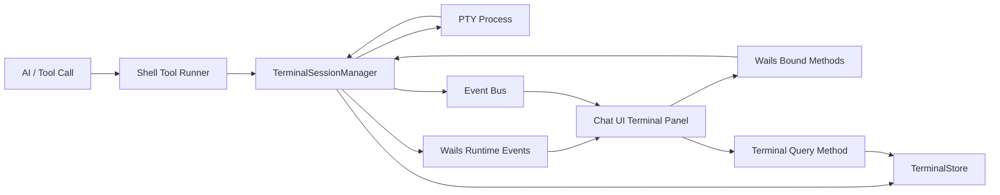

# Shell 可交互终端优化设计

本文定义 Shell / CLI 命令执行能力的下一阶段优化方向。目标是将当前“命令输出被动展示”的模型升级为“后端持久管理 PTY 会话，前端作为可恢复终端视图，AI 控制是否展示”的统一终端能力。

本文参考 `anomalyco/opencode` 的 PTY 设计，但不照搬其 AI Bash 工具模型和 WebSocket 传输方式。`opencode` 将“人类用户终端”和“AI Bash 工具”分开：用户终端使用持久 PTY + WebSocket，AI Bash 工具仍是一次性非交互进程。本项目是 Wails3 桌面应用，前后端通信应使用 Wails runtime events 和绑定方法；同时目标更进一步：所有 shell 命令，包括普通 shell 工具和 CLI 工具，都应运行在可交互终端中，并支持用户输入、刷新恢复和 AI 控制展示。

> 实施时同时遵循 `docs/dev/00.rules.md`。

---

## 1. 背景

当前 shell / CLI 执行链路在处理扫码登录、浏览器授权、文本输入等交互式场景时存在体验断点。

典型问题：

* CLI 输出二维码后，底层命令可能仍在等待用户扫码，但前端可交互终端已经结束展示。
* 用户扫码完成后，后续命令输出无法继续呈现，AI 也难以续上同一条初始化流程。
* 普通 shell 工具和 CLI 工具的执行模型不统一，有些命令具备 PTY，有些命令只是 stdout/stderr pipe。
* 当前“终端展示”更接近 tool result 的临时 UI，而不是一个可恢复、可输入、可订阅的终端会话。

这类问题在 CLI 初始化场景中尤其明显，例如：

* 设备码登录：输出二维码或授权链接，等待用户扫码 / 授权。
* 浏览器登录：输出 URL，等待浏览器侧授权完成。
* 交互式配置：命令提示用户输入 token、确认选项或选择环境。
* 长时间任务：命令持续输出进度，用户需要看到实时日志。

---

## 2. opencode 调研结论

`opencode` 的终端能力主要分为两套机制。

### 2.1 用户终端：持久 PTY Session

`opencode` 在 `packages/opencode/src/pty/index.ts` 中实现了独立的 `Pty` 服务。每个 PTY session 包含：

* `info`
  * `id`
  * `title`
  * `command`
  * `args`
  * `cwd`
  * `status`
  * `pid`
* `process`
  * 由 PTY 库 spawn 出来的真实终端进程。
* `buffer`
  * 内存输出缓存，默认上限约 2MB。
* `cursor`
  * 输出游标，用于客户端断线重连后补发缓存内容。
* `subscribers`
  * WebSocket 订阅者集合，一个 PTY 可以被多个客户端观察。

它提供的核心能力包括：

* `create`
  * 创建 PTY 会话。
* `list/get`
  * 查询当前活跃 PTY。
* `update`
  * 更新标题或终端尺寸。
* `resize`
  * 调整 PTY 窗口大小。
* `write`
  * 将用户输入写入 PTY。
* `connect`
  * 通过 WebSocket 连接 PTY，接收输出并发送输入。
* `remove`
  * 删除并清理 PTY 会话。

### 2.2 实时输出：WebSocket 双向流

`opencode` 的 PTY 输出不走普通事件流，而是通过 `/pty/:ptyID/connect` 这样的 WebSocket 连接传输。

WebSocket 的职责：

* PTY 输出实时广播给所有订阅者。
* 客户端输入直接写入 PTY。
* 客户端可带 cursor 重连，服务端从 buffer 中补发缺失内容。
* 服务端在连接后发送 meta frame，告知当前 cursor。

同时，系统事件流只承载生命周期事件：

* `pty.created`
* `pty.updated`
* `pty.exited`
* `pty.deleted`

### 2.3 输出恢复：内存 buffer，不是强持久化

`opencode` 支持客户端临时断开后恢复部分输出，但它的 buffer 是进程内内存缓存。

这意味着：

* 浏览器刷新后，只要 server 进程还在、PTY session 还在，可以通过 cursor 补发输出。
* server 重启、PTY 被 remove、进程退出后，buffer 不保证继续存在。
* 这不满足本项目“刷新后不能丢失”的完整需求。

### 2.4 AI Bash 工具：非 PTY，一次性执行

`opencode` 的 AI `bash` tool 并不使用上述持久 PTY。它使用普通 child process 执行命令：

* stdin 为 `ignore`。
* 等待进程结束。
* 收集 stdout/stderr。
* 做截断和 metadata 更新。
* 由 tool result 返回最终输出。

因此，`opencode` 的设计是：

* 人类终端 tab：持久 PTY + WebSocket。
* AI Bash tool：一次性非交互进程。

本项目不能照搬这一点，因为我们的明确目标是：AI 调用的所有 shell 命令也要具备可交互、可恢复、可输入能力。

---

## 3. 本项目目标

### 3.1 总目标

将 shell / CLI 命令执行升级为统一的 Terminal Session 模型：

* 后端创建和持有真实 PTY 进程。
* 前端通过终端视图连接、展示、输入。
* AI 决定终端是否展示、何时隐藏、如何提示用户。
* 终端状态和输出可恢复，页面刷新后不丢失。

### 3.2 必须满足的需求

* 所有 shell 命令都运行在可交互终端中。
  * 包括普通 shell 工具。
  * 包括 CLI 插件工具。
  * 包括未来新增的 shell-like 执行工具。
* 前端临时终端面板刷新后不能丢失。
* 用户不需要手动关闭终端面板，由 AI 决定是否关闭。
* 前端终端面板必须支持用户输入文本到后端 PTY。
* AI 可以控制终端面板是否显示，但不影响后端命令是否继续运行。
* 命令结束后，终端状态应正确变为 `done` 或 `error`，历史输出仍可查看，直到 AI 隐藏或清理策略执行。

### 3.3 非目标

* 不要求第一期实现完整 xterm 级别体验。
* 不要求首期支持所有复杂快捷键、鼠标模式、全屏 TUI 应用。
* 不要求终端输出作为普通聊天消息逐条保存。
* 不要求用户手动关闭终端面板。
* 不要求完全复制 `opencode` 的 API 或 SDK 结构。

---

## 4. 推荐架构

推荐采用“持久 Terminal Session + Wails 事件推送 + Wails 方法输入 + 生命周期事件 + 存储恢复”的模型。



### 4.1 TerminalSessionManager

后端核心服务，负责管理终端会话生命周期。

职责：

* 创建 PTY 进程。
* 记录 terminal metadata。
* 读取 PTY 输出。
* 将输出写入存储。
* 通过 Wails runtime events 向前端推送输出。
* 接收用户输入并写入 PTY。
* 支持 resize。
* 处理命令退出、超时、取消和异常。
* 支持 AI 控制 visible 状态。

建议接口：

* `Create(ctx, params) (TerminalInfo, error)`
* `Get(ctx, terminalID) (TerminalInfo, error)`
* `ListByConversation(ctx, conversationID) ([]TerminalInfo, error)`
* `Write(ctx, terminalID, data) error`
* `Resize(ctx, terminalID, rows, cols) error`
* `SetVisible(ctx, terminalID, visible, title) error`
* `Close(ctx, terminalID) error`
* `ReadOutput(ctx, terminalID, cursor) ([]TerminalOutputChunk, error)`
* `EmitOutput(ctx, terminalID, chunk) error`

### 4.2 TerminalStore

持久化终端元信息和输出历史。

需要保存：

* `terminal_id`
* `conversation_id`
* `message_id`
* `tool_call_id`
* `command`
* `args`
* `cwd`
* `env` 的安全摘要
* `title`
* `visible`
* `status`
* `pid`
* `exit_code`
* `started_at`
* `ended_at`
* 输出 chunk
* 当前 cursor

输出历史建议使用 append-only chunk 模型，而不是不断覆盖一个大字符串。

### 4.3 Terminal Wails 通信

本项目是 Wails3 桌面应用，不需要也不应该引入 WebSocket。终端通信应拆成两类：

* 后端到前端：Wails runtime events 推送输出和状态。
* 前端到后端：Wails 绑定方法写入用户输入、调整窗口尺寸、查询历史输出。

职责：

* 后端读取 PTY 输出后，写入 TerminalStore，并通过事件发送 output chunk。
* 前端通过事件监听当前会话相关 terminal 的输出和状态变化。
* 前端通过绑定方法发送用户输入。
* 前端通过绑定方法发送 resize 信息。
* 前端刷新或切换会话后，通过查询方法按 cursor 拉取缺失输出。
* 同一个 terminal 可以被多个前端组件观察，但它们都通过同一套 Wails 事件和本地状态分发完成。

建议事件：

```json
{ "event": "terminal.output", "terminal_id": "term_123", "cursor": 1024, "data": "..." }
{ "event": "terminal.meta", "terminal_id": "term_123", "cursor": 2048, "status": "active" }
{ "event": "terminal.exited", "terminal_id": "term_123", "exit_code": 0 }
```

建议绑定方法：

* `ListTerminals(conversationID) ([]TerminalInfo, error)`
* `ReadTerminalOutput(terminalID, cursor) ([]TerminalOutputChunk, error)`
* `WriteTerminalInput(terminalID, data) error`
* `ResizeTerminal(terminalID, rows, cols) error`
* `SetTerminalVisible(terminalID, visible, title) error`

### 4.4 Terminal Lifecycle Event

用于通知前端某个终端是否应展示，以及生命周期变化。输出 chunk 可以通过专门的 `terminal.output` 事件传输；生命周期和显示状态仍使用独立事件，避免前端从原始输出中推断 UI 状态。

建议事件：

* `terminal.created`
* `terminal.updated`
* `terminal.exited`
* `terminal.deleted`
* `terminal.visibility_changed`

其中 `terminal.visibility_changed` 是 AI 控制 UI 的关键事件。

---

## 5. 数据模型

### 5.1 TerminalInfo

```json
{
  "id": "term_123",
  "conversation_id": 1,
  "message_id": 20,
  "tool_call_id": "call_abc",
  "title": "等待扫码或交互",
  "command": "lark-cli",
  "args": ["auth", "login"],
  "cwd": "/path/to/project",
  "status": "active",
  "visible": true,
  "pid": 12345,
  "exit_code": null,
  "cursor": 4096,
  "started_at": "2026-05-29T00:00:00+08:00",
  "ended_at": null
}
```

### 5.2 TerminalOutputChunk

```json
{
  "terminal_id": "term_123",
  "seq": 42,
  "cursor_start": 4096,
  "cursor_end": 8192,
  "data": "terminal output...",
  "created_at": "2026-05-29T00:00:01+08:00"
}
```

### 5.3 TerminalStatus

建议状态：

* `active`
  * 进程运行中，可输入，可继续输出。
* `waiting`
  * 仍是运行中，但 UI 可展示为等待扫码 / 授权 / 输入。
* `done`
  * 进程正常结束，不可输入。
* `error`
  * 进程异常结束，不可输入。
* `closed`
  * AI 已关闭展示。是否保留历史由清理策略决定。

注意：`waiting` 可以作为 status，也可以作为 UI hint。若后端无法准确判断命令是否真的在等待，建议先作为 `display_hint`，由 AI 控制文案。

---

## 6. Shell 工具执行模型

### 6.1 普通 shell 工具

普通 shell 工具不再直接返回 stdout/stderr pipe 的结果，而是：

1. 创建 terminal session。
2. 使用 PTY 启动 shell。
3. 持续采集输出并写入 TerminalStore。
4. 将 terminal id 写入 tool metadata。
5. 命令结束后返回摘要输出和 terminal id。

工具返回结果需要同时兼顾 AI 可读性和 UI 可恢复性。

建议返回：

```json
{
  "terminal_id": "term_123",
  "status": "done",
  "exit_code": 0,
  "output_tail": "...",
  "output_truncated": true
}
```

其中完整输出由 TerminalStore 管理，tool result 只保留 tail 或摘要，避免污染模型上下文。

### 6.2 CLI 插件工具

CLI 插件工具也使用同一套 TerminalSessionManager。

差异只在于：

* executable 来自 CLI manifest。
* env 来自 CLI 隔离环境。
* cwd 默认是 CLI install dir 或当前项目目录。
* output mode 仍可保留给最终摘要解析，但实时执行统一走 PTY。

### 6.3 AI 控制展示

AI 不直接管理 PTY 进程，但可以控制前端展示状态。

建议提供独立工具：

* `ShowTerminal`
  * 输入：`terminal_id`、`title`、`hint`
  * 效果：设置 visible=true，并发布 `terminal.visibility_changed`。
* `HideTerminal`
  * 输入：`terminal_id`
  * 效果：设置 visible=false 或 status=closed，并发布事件。

这样可以避免把“展示 UI”混在 shell 执行结果里。

---

## 7. 前端体验

### 7.1 面板挂载位置

终端面板应挂在对应聊天消息或 tool group 附近，而不是全局浮层。

推荐规则：

* 优先挂在 `message_id` 对应消息下。
* 若只有 `tool_call_id`，挂在对应 tool call 卡片附近。
* 若一个消息有多个 visible terminal，按创建时间展示多个面板。

### 7.2 刷新恢复

页面加载或切换会话时：

1. 调用 `ListByConversation`。
2. 找到 `visible=true` 或 `status in active/waiting/done/error` 且未清理的终端。
3. 拉取历史输出 chunks。
4. 注册 Wails runtime event 监听。
5. 从最新 cursor 继续接收 `terminal.output` 增量事件；若发现 cursor 不连续，则调用 `ReadTerminalOutput` 补齐缺口。

刷新后不可丢失的内容包括：

* 终端是否展示。
* 当前状态。
* 已有输出。
* 已结束终端的最终输出。

### 7.3 用户输入

前端输入发送到对应 `terminal_id`。

基础能力：

* 文本输入。
* Enter 发送换行。
* 粘贴文本。
* active/waiting 状态允许输入。
* done/error/closed 状态禁用输入。

可后续增强：

* Ctrl+C。
* Tab。
* 方向键。
* 密码输入隐藏。
* xterm.js 完整键盘事件。

---

## 8. 生命周期

### 8.1 创建与运行

1. AI 调用 shell / CLI 工具。
2. 后端创建 `terminal_id`。
3. 后端以 PTY 启动命令。
4. TerminalStore 记录 metadata。
5. 后端持续读取 PTY 输出。
6. 输出写入 chunks，并通过 Wails runtime events 推给前端监听者。

### 8.2 展示与交互

1. AI 判断需要用户看到终端，例如出现二维码、URL、授权提示或输入提示。
2. AI 调用 `ShowTerminal`。
3. 后端设置 visible=true。
4. 前端收到事件后展示终端面板。
5. 用户输入通过 Wails 绑定方法写回 PTY。
6. 命令继续执行。

### 8.3 结束与关闭

1. PTY 进程退出。
2. 后端记录 exit_code 和 ended_at。
3. status 变为 done/error。
4. 前端终端转为只读。
5. AI 根据上下文决定是否调用 `HideTerminal`。
6. 清理策略在合适时机回收进程和历史输出。

---

## 9. 与 opencode 的差异化取舍

### 9.1 借鉴点

* 独立 PTY Session Manager。
* 输出流和输入通道分离。
* 生命周期事件和输出流分离。
* cursor + buffer 支持刷新恢复和事件缺口补发。
* 一个 PTY 支持多个前端组件观察。
* resize/write/list/get/remove 这些基础能力。

### 9.2 不照搬点

* 不区分“用户终端”和“AI Bash 工具”的底层执行模型。
* 不引入 WebSocket；Wails3 项目使用 runtime events 和绑定方法完成前后端通信。
* 不只做内存 buffer，必须落库支持刷新恢复。
* 不让 AI Bash 工具简单等待进程结束，而是返回 terminal_id 和摘要输出。
* 不把终端面板关闭权交给用户，保持 AI 控制展示策略。

### 9.3 需要谨慎的点

* 全部 shell 命令默认 PTY 后，stdout/stderr 分离会弱化，PTY 输出通常是合并流。
* 命令输出可能包含 ANSI 控制序列，存储和回放时要保留原始输出，同时支持纯文本摘要。
* 长时间命令会产生大量输出，需要 chunk、截断和清理策略。
* 交互式命令可能永不退出，需要 timeout、AI 提醒、用户中断和资源回收策略。
* Windows PTY 能力需要单独验证，不能只按 Unix PTY 设计。

---

## 10. 安全与权限

终端输入输出能力会放大执行风险，需要明确安全边界。

要求：

* shell 命令仍遵循现有确认 / 权限机制。
* 用户向终端输入内容不应绕过命令本身的授权边界。
* terminal_id 必须绑定 conversation/session 权限。
* 前端只能访问和监听当前用户有权访问的 terminal。
* 敏感 env 不落库，只保存安全摘要。
* 输出历史可能包含 token 或授权信息，需要遵循会话数据的同级保护策略。

---

## 11. 清理策略

终端会话不能无限保留。

建议策略：

* active/waiting：保留进程，直到退出、超时、用户/AI 中断或应用关闭。
* done/error 且 visible=true：保留历史输出，直到 AI 隐藏或超过会话保留策略。
* closed：不展示，但可短期保留 metadata 和输出用于调试。
* 输出 chunk 超过上限时：
  * 保留 tail。
  * 可将完整输出落到文件或压缩存储。
  * tool result 只返回摘要和路径引用。

---

## 12. 分阶段落地

### P0：统一 PTY 执行骨架

* 抽象 TerminalSessionManager。
* 普通 shell 工具和 CLI 工具都能创建 terminal session。
* 支持 PTY 输出采集、状态记录、退出码记录。
* tool result 返回 terminal_id + output_tail。

### P1：前端展示与刷新恢复

* 新增 TerminalStore。
* 前端会话加载时恢复 visible terminals。
* 支持历史输出回放。
* 支持生命周期事件驱动显示 / 隐藏。

### P2：Wails 双向交互

* 通过 Wails runtime events 推送 output chunk。
* 通过 Wails 绑定方法支持用户输入写入 PTY。
* 通过 Wails 绑定方法支持 resize。
* 支持 cursor 检查和缺口补发。

### P3：AI 展示控制

* 新增 ShowTerminal / HideTerminal 工具。
* AI 根据输出内容决定是否展示。
* 支持 title / hint 更新。
* 适配扫码、授权、文本输入三类主场景。

### P4：体验增强与资源治理

* 完善 xterm.js 级终端输入。
* 支持 Ctrl+C、Tab、方向键等控制输入。
* 优化输出截断、搜索和下载。
* 增加长时间闲置终端的提醒和回收。
* 补齐 Windows PTY 兼容。

---

## 13. 验收标准

### 13.1 基础执行

* 普通 shell 命令默认运行在 PTY 中。
* CLI 插件命令默认运行在 PTY 中。
* 命令结束后能记录 exit_code、status、输出 tail。
* tool result 能返回 terminal_id。

### 13.2 展示恢复

* AI 调用 ShowTerminal 后，前端在对应聊天 UI 中展示终端面板。
* 页面刷新后，visible terminal 面板和历史输出能恢复。
* active terminal 刷新后能继续接收新输出。
* done/error terminal 刷新后仍能看到最终输出。

### 13.3 用户输入

* 用户能在 active terminal 输入文本。
* 输入能写入后端 PTY。
* 命令能收到 stdin 并继续执行。
* done/error/closed 状态下输入被禁用。

### 13.4 交互场景

* 扫码登录 CLI 输出二维码后，进程持续等待。
* 用户扫码完成后，后续 CLI 输出继续出现。
* 浏览器授权登录输出 URL 后，终端面板保持 active/waiting。
* 需要文本输入的命令能通过前端输入完成。

---

## 14. 测试建议

### 14.1 后端单元测试

* 创建 PTY session。
* 输出 chunk 写入 store。
* cursor 重连补发。
* Write 写入 PTY stdin。
* Resize 调整 PTY。
* 进程退出状态记录。
* visible 状态变更事件。

### 14.2 集成测试

使用 fake CLI 覆盖：

* 打印二维码后等待 stdin。
* 打印 URL 后 sleep，再输出成功。
* read 用户输入后输出确认。
* 长输出触发 chunk 和截断。
* 命令异常退出。

### 14.3 前端测试

* 根据 `terminal.visibility_changed` 显示面板。
* 刷新后恢复历史输出。
* active 状态允许输入。
* done 状态禁用输入。
* 多个 terminal 独立更新。

---

## 15. 结论

`opencode` 给出的最佳参考不是它的 AI Bash 工具，也不是 WebSocket 传输方式，而是它的独立 PTY Session subsystem：后端持有 PTY、输出游标、断线补发、生命周期事件分离。

本项目应在此基础上做两项增强：

1. 将 AI shell / CLI 工具也统一迁移到 PTY-backed Terminal Session。
2. 将终端 metadata 和输出历史持久化，保证聊天 UI 刷新后不丢失。

最终目标是形成一个统一抽象：所有命令都在真实终端中运行，AI 负责决定何时让用户看到终端，用户可以在需要时输入，前端只是这个后端终端会话的可恢复视图。
